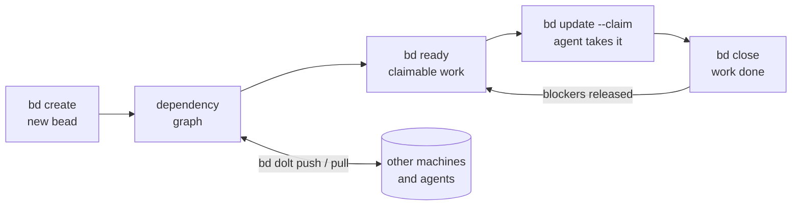
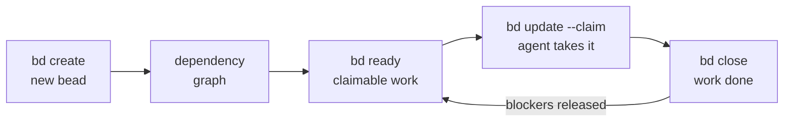
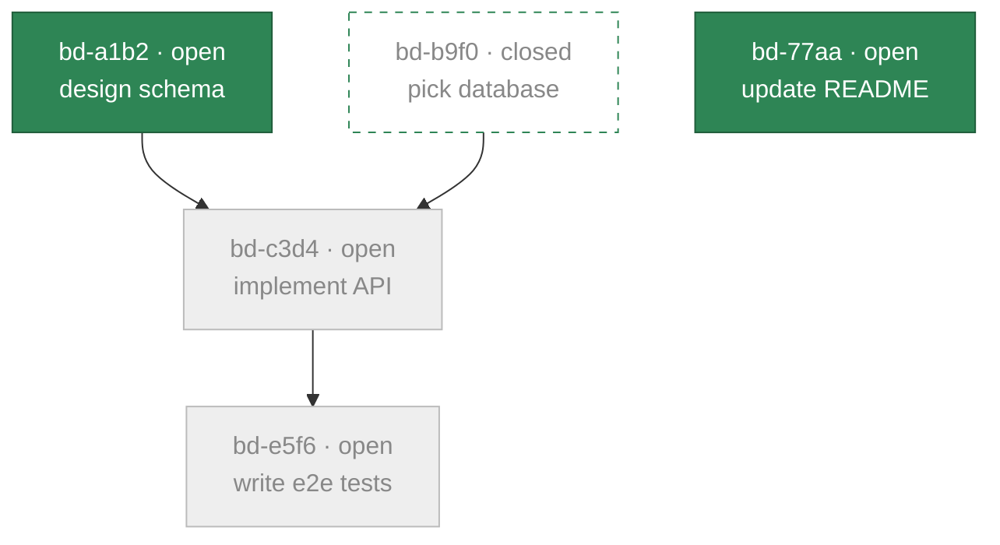
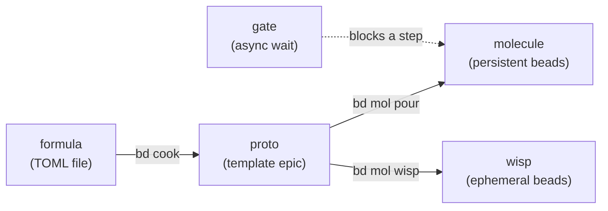
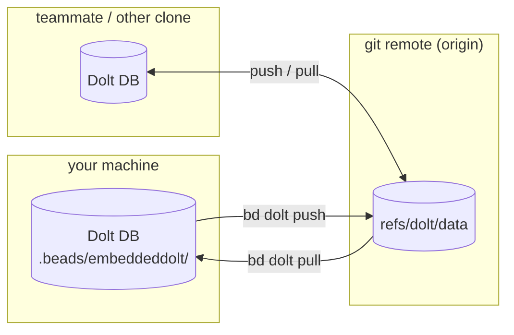
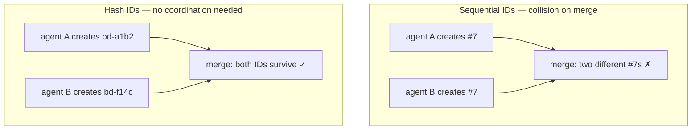
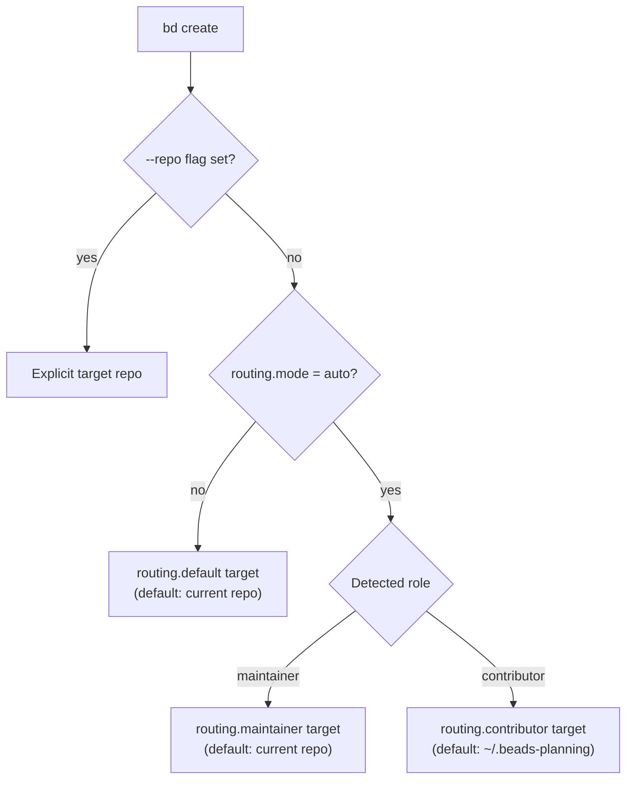
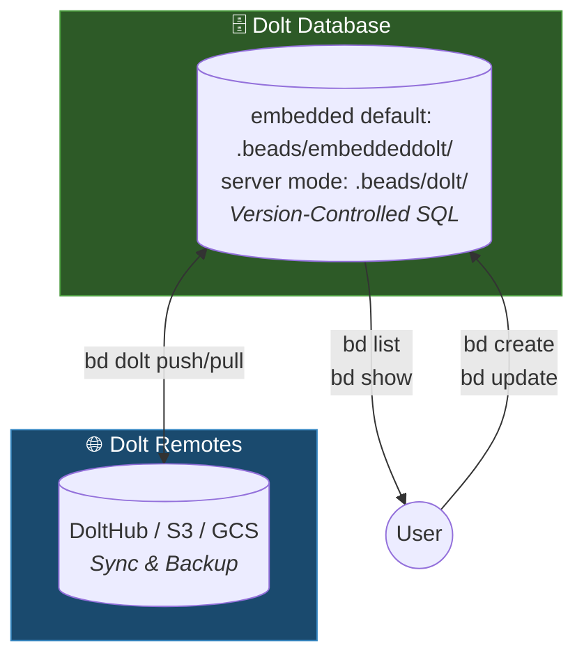
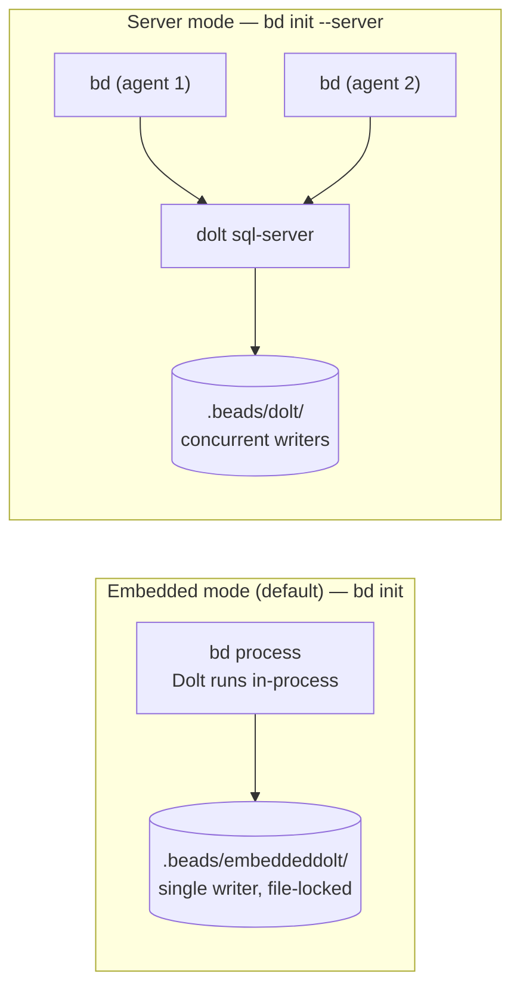

# Beads (`bd`) — repository capture (gastownhall/beads)

> Immutable source capture. *"Distributed graph issue tracker for AI agents, powered by Dolt."* Origin author Steve Yegge (`steveyegge/beads`, still the Go module path); now published under the `gastownhall` org. License: MIT. Distribution: Homebrew, npm `@beads/bd`, PyPI `beads-mcp` (MCP server), install script, Arch AUR, winget. Go 1.26+, Cobra CLI, Dolt storage. Clone at commit `d530cdd`.
>
> Beads is the tracker that [[seeds]] was written to replace, so the two disagree on storage by design — capture both and read them against each other.
>
> Files reproduced verbatim below, in reading order: `README.md`, `docs/index.md`, `docs/core-concepts/*` (the conceptual orientation), `docs/workflows/*` (formulas · molecules · gates · wisps · todo), `docs/multi-agent/*` (routing · coordination · federation), `docs/architecture/*`, `engdocs/PROJECT_CHARTER.md` (the product-boundary document — the layer argument), and the complete `docs/CLI_REFERENCE.md` (all ~109 top-level commands). Repo-development instructions (`AGENT_INSTRUCTIONS.md`, `engdocs/TESTING.md`, release/PR policy) are omitted as internal to maintaining beads rather than to using it.

---

## README.md


**Distributed graph issue tracker for AI agents, powered by [Dolt](https://github.com/dolthub/dolt).**

**Platforms:** macOS, Linux, Windows, FreeBSD


**Docs:** https://beads.gascity.com/

Beads provides a persistent, structured memory for coding agents. It replaces messy markdown plans with a dependency-aware graph, allowing agents to handle long-horizon tasks without losing context.



## ⚡ Quick Start

```bash
# Install beads CLI (system-wide - don't clone this repo into your project)
curl -fsSL https://raw.githubusercontent.com/gastownhall/beads/main/scripts/install.sh | bash

# Initialize in YOUR project
cd your-project
bd init

# Optional: refresh or install richer instructions for your agent
bd setup codex    # Codex CLI - installs skill, AGENTS.md guidance, and hooks
bd setup claude   # Claude Code - installs hooks/settings
bd setup factory  # Factory.ai Droid - creates/updates AGENTS.md
```

**Note:** Beads is a CLI tool you install once and use everywhere. You don't need to clone this repository into your project.

`bd init` creates or updates `AGENTS.md` by default so agents can discover the beads workflow, and also installs project Claude/Codex integrations unless you pass `--skip-agents` or `--stealth`. Use `bd setup --list` to see supported integrations, including `bd setup codex`, `bd setup factory`, `bd setup claude`, `bd setup mux`, `bd setup cursor`, and more. See [Agent and IDE setup](docs/getting-started/ide-setup.md).

Manual copy-paste is only for unsupported agents, existing projects where you cannot rerun `bd init`/`bd setup`, or custom instruction files. In those cases, run `bd onboard` and paste the printed snippet into the file your agent reads.

If your agent is not covered by `bd setup`, add this minimal `AGENTS.md` section:

```markdown
This project uses bd (beads) for issue tracking.

- Run `bd prime` for workflow context and command guidance.
- Use `bd ready`, `bd show <id>`, `bd update <id> --claim`, and `bd close <id>`.
- Use `bd remember "insight"` for persistent project memory; do not create MEMORY.md files.
- Do not use markdown TODO lists for task tracking.
```

## 🛠 Features

* **[Dolt](https://github.com/dolthub/dolt)-Powered:** Version-controlled SQL database with cell-level merge, native branching, and built-in sync via Dolt remotes.
* **Agent-Optimized:** JSON output, dependency tracking, and auto-ready task detection.
* **Zero Conflict:** Hash-based IDs (`bd-a1b2`) prevent merge collisions in multi-agent/multi-branch workflows.
* **Compaction:** Semantic "memory decay" summarizes old closed tasks to save context window.
* **Messaging:** Message issue type with threading (`--thread`), ephemeral lifecycle, and mail delegation.
* **Graph Links:** `relates-to`, `duplicates`, `supersedes`, and `replies-to` for knowledge graphs.

## 📖 Essential Commands

| Command | Action |
| --- | --- |
| `bd ready` | List tasks with no open blockers. |
| `bd create "Title" -p 0` | Create a P0 task. |
| `bd update <id> --claim` | Atomically claim a task (sets assignee + in_progress). |
| `bd dep add <child> <parent>` | Link tasks (blocks, related, parent-child). |
| `bd show <id>` | View task details and audit trail. |
| `bd prime` | Print agent workflow context and persistent memories. |
| `bd remember "insight"` | Store project memory that `bd prime` injects later. |

## 🔗 Hierarchy & Workflow

Beads supports hierarchical IDs for epics:

* `bd-a3f8` (Epic)
* `bd-a3f8.1` (Task)
* `bd-a3f8.1.1` (Sub-task)

**Stealth Mode:** Run `bd init --stealth` to use Beads locally without committing files to the main repo. Perfect for personal use on shared projects. See [Git-Free Usage](#-git-free-usage) below.

**Contributor vs Maintainer:** When working on open-source projects:

* **Contributors** (forked repos): Run `bd init --contributor` to route planning issues to a separate repo (e.g., `~/.beads-planning`). Keeps experimental work out of PRs.
* **Maintainers** (write access): Beads auto-detects maintainer role via SSH URLs or HTTPS with credentials. Only need `git config beads.role maintainer` if using GitHub HTTPS without credentials but you have write access.

## 📦 Installation

```bash
brew install beads           # macOS / Linux (recommended)
npm install -g @beads/bd     # Node.js users
```

**Other methods:** [install script](docs/getting-started/installation.md#quick-install-script-all-platforms) | [go install](docs/getting-started/installation.md#a-note-on-go-install-capability) | [from source](docs/getting-started/installation.md#build-dependencies-contributors-only) | [Windows](docs/getting-started/installation.md#windows-11) | [Arch AUR](docs/getting-started/installation.md#linux)

**Requirements:** macOS, Linux, Windows, or FreeBSD. See [docs/getting-started/installation.md](docs/getting-started/installation.md) for complete installation guide.

**Upgrading?** Replacing the binary is not always the whole story. Short
version: sync remote-backed databases with your current `bd`, back up with
`bd export --all`, upgrade the binary, then run `bd info --whats-new`,
`bd hooks install`, and `bd version`. If the upgrade crosses a schema
migration on a remote-backed database, exactly one designated clone runs
`bd migrate` and `bd dolt push`; other clones install the new binary
and run `bd bootstrap`. See the full
[upgrade guide](https://beads.gascity.com/getting-started/upgrading)
or [docs/getting-started/installation.md](docs/getting-started/installation.md#updating-bd).

### Security And Verification

Before trusting any downloaded binary, verify its checksum against the release `checksums.txt`.

The install scripts verify release checksums before install. For manual installs, do this verification yourself before first run.

On macOS, `scripts/install.sh` preserves the downloaded signature by default. Local ad-hoc re-signing is explicit opt-in via `BEADS_INSTALL_RESIGN_MACOS=1`.

See [docs/reference/antivirus.md](docs/reference/antivirus.md) for Windows AV false-positive guidance and verification workflow.

## 💾 Storage Modes

Beads uses [Dolt](https://github.com/dolthub/dolt) as its database. Two modes:

- **Embedded (default)** — `bd init`. Dolt runs in-process, data lives in
  `.beads/embeddeddolt/`, single writer. Recommended for most users.
- **Server** — `bd init --server`. Connects to an external `dolt sql-server`
  for multiple concurrent writers; data lives in `.beads/dolt/`.

Cross-machine sync uses `bd dolt push` / `bd dolt pull` against
`refs/dolt/data` on your git remote; `.beads/issues.jsonl` is an export for
viewers and interchange, not the source of truth or a backup. Back up and
migrate between modes with `bd backup`; reclaim space with `bd prune` /
`bd purge`.

Full detail — connection flags, sockets, maintenance, backup, and migration —
in the [Dolt backend guide](docs/architecture/dolt.md).

### Schema Version Guard

`bd` checks the database schema version at open time. If the database has been
migrated by a newer binary and an older binary tries to open it, `bd` exits
with an actionable error rather than issuing queries that fail with cryptic SQL
errors:

````
schema version mismatch: database is at v45, binary knows up to v42 (3 migrations ahead)

  Your bd binary is stale. Queries for dropped or renamed columns will fail
  with cryptic SQL errors (e.g. "column X could not be found in any table in scope").

  Rebuild from main:
    CGO_ENABLED=0 go build -tags gms_pure_go ./cmd/bd

  Or install the latest release:
    CGO_ENABLED=0 go install -tags gms_pure_go github.com/steveyegge/beads/cmd/bd@latest

  To proceed despite the risk (some read commands may still work):
    BD_IGNORE_SCHEMA_SKEW=1 bd <command>
    bd --ignore-schema-skew <command>
````

**When this fires:** only when the database schema is *ahead* of the binary
(a newer binary migrated the database; this binary doesn't know those
migrations). Normal upgrades, where the binary migrates the database forward,
are unaffected.

**Escape hatch:** `BD_IGNORE_SCHEMA_SKEW=1` (or `--ignore-schema-skew`) bypasses
the guard with a warning on stderr. Use this only if you know the forward
migrations are additive and safe for your specific workload.

## 🌐 Community Tools

See [docs/community-tools.md](docs/community-tools.md) for a curated list of community-built UIs, extensions, and integrations—including terminal interfaces, web UIs, editor extensions, and native apps.

See [docs/related-projects.md](docs/related-projects.md) for adjacent or complementary projects that solve different problems in the same neighborhood.

## 🚀 Git-Free Usage

Beads works without git. The Dolt database is the storage backend — git
integration (hooks, repo discovery, identity) is optional.

```bash
# Initialize without git
export BEADS_DIR=/path/to/your/project/.beads
bd init --quiet --stealth

# All core commands work with zero git calls
bd create "Fix auth bug" -p 1 -t bug
bd ready --json
bd update bd-a1b2 --claim
bd prime
bd close bd-a1b2 "Fixed"
```

`BEADS_DIR` tells bd where to put the `.beads/` database directory,
bypassing git repo discovery. `--stealth` sets `no-git-ops: true` in
config, disabling all git hook installation and git operations.

This is useful for:
- **Non-git VCS** (Sapling, Jujutsu, Piper) — no `.git/` directory needed
- **Monorepos** — point `BEADS_DIR` at a specific subdirectory
- **CI/CD** — isolated task tracking without repo-level side effects
- **Evaluation/testing** — ephemeral databases in `/tmp`

## 📝 Documentation

* [Documentation site](https://beads.gascity.com/) | [Installing](docs/getting-started/installation.md) | [Sync Concepts](docs/core-concepts/sync-concepts.md) | [Agent Workflow](AGENT_INSTRUCTIONS.md) | [Copilot CLI Setup](docs/integrations/copilot-cli.md) | [Copilot VS Code MCP](docs/integrations/github-copilot.md) | [Articles](ARTICLES.md) | [Sync Branch Mode](docs/reference/protected-branches.md) | [Troubleshooting](docs/reference/troubleshooting.md) | [FAQ](docs/reference/faq.md)
* [](https://deepwiki.com/gastownhall/beads)


---

## docs/index.md

---
title: Introduction
description: Dependency-aware, Dolt-backed issue tracker built for AI coding agents that survive context loss
---

**Beads** (`bd`) is a Dolt-powered issue tracker designed for AI-supervised coding workflows.

These docs are for the 1.1.0 release of beads — see the [v1.1.0 release notes](https://github.com/gastownhall/beads/releases/tag/v1.1.0).

## Why Beads?

Traditional issue trackers (Jira, GitHub Issues) weren't designed for AI agents. Beads was built from the ground up for:

- **AI-native workflows** - Hash-based IDs prevent collisions when multiple agents work concurrently
- **Dolt-backed storage** - Issues stored in a version-controlled SQL database, enabling collaboration via Dolt-native replication
- **Dependency-aware execution** - `bd ready` shows only unblocked work
- **Formula system** - Declarative templates for repeatable workflows
- **Multi-agent coordination** - Routing, gates, and molecules for complex workflows

## Quick Start

```bash
# Install via Homebrew (macOS/Linux)
brew install beads

# Or quick install (macOS/Linux/FreeBSD)
curl -fsSL https://raw.githubusercontent.com/gastownhall/beads/main/scripts/install.sh | bash

# Initialize in your project
cd your-project
bd init --quiet

# Create your first issue
bd create "Set up database" -p 1 -t task

# See ready work
bd ready
```

## Core Concepts

The whole model on one page: [How Beads Works](/core-concepts/index).

| Concept | Description |
|---------|-------------|
| [**Beads (issues)**](/core-concepts/issues) | Work items with priorities, types, labels, and dependencies |
| [**Dependencies**](/core-concepts/dependencies) | `blocks`, `parent-child`, `discovered-from`, `related` |
| [**Sync**](/core-concepts/sync-concepts) | Dolt push/pull over your git remote — no server to run |
| [**Formulas**](/workflows/formulas) | Declarative workflow templates (TOML or JSON) |
| [**Molecules**](/workflows/molecules) | Work graphs instantiated from formulas |
| [**Gates**](/workflows/gates) | Async coordination primitives (human, timer, GitHub) |

## For AI Agents

Beads is optimized for AI coding agents:

```bash
# Always use --json for programmatic access
bd list --json
bd show bd-42 --json

# Track discovered work during implementation
bd create "Found bug in auth" --description="Details..." \
  --deps discovered-from:bd-100 --json

# Push changes at end of session
bd dolt push
```

See the [Claude Code integration](/integrations/claude-code) for detailed agent instructions.

## Architecture

```
Dolt DB (.beads/embeddeddolt/ in embedded mode,
         .beads/dolt/ in server mode; gitignored)
    ↕ dolt commit
Local Dolt history
    ↕ dolt push/pull
Remote Dolt repository (shared across machines)
```

The magic is automatic synchronization via Dolt's version-controlled database with built-in replication.

## Next Steps

- [Installation](/getting-started/installation) - Get bd installed
- [Quick Start](/getting-started/quickstart) - Create your first issues
- [How Beads Works](/core-concepts/index) - The concept model on one page
- [CLI Reference](/cli-reference/index) - All available commands
- [Workflows](/workflows/index) - Formulas, molecules, and gates


---

## docs/core-concepts/index.md — How Beads Works

---
title: How Beads Works
description: The orientation for beads — the dependency-aware issue graph, what bd ready computes, the formula-to-molecule workflow pipeline, and how Dolt sync moves it all between machines.
---

Coding agents lose their memory every time a session ends. Markdown plans rot,
TODO comments scatter, and a crashed agent takes its context with it. Beads
replaces that with a **persistent, structured work graph**: every unit of work
is a **bead** (an issue) in a version-controlled database, connected by
dependencies, and `bd ready` computes exactly what can be worked on right now.
Work survives the agent; the next session picks up where the last one died.



The loop above is the whole product in miniature: creating and closing beads
reshapes the graph, and the graph — not a human dispatcher — decides what is
workable next.

## Beads and dependencies

A **bead** is one tracked unit of work: a hash ID (`bd-a1b2`), a title, a
type (`bug`, `task`, `feature`, `epic`, `chore`, and friends — see
[`bd types`](/cli-reference/types)), a priority (`0` critical → `4` backlog),
and a status moving `open` → `in_progress` → `closed`. "Bead" and "issue"
name the same thing; the CLI says issue, the product says bead.

**Dependencies** connect beads into a graph. Two edge types shape what
agents may work on:

| Type | Meaning | Affects ready work |
|------|---------|--------------------|
| `blocks` | hard ordering — the blocker must close first | **yes** |
| `parent-child` | epic/subtask structure | **indirectly** — a blocked parent blocks its children |
| `discovered-from` | provenance — found while working on the parent | no |
| `related` | soft association | no |

Workflow steps add two more blocking types (`conditional-blocks`,
`waits-for`) — see [Molecules](/workflows/molecules). Richer knowledge-graph
edges (`relates-to`, `duplicates`, `supersedes`, `replies-to`) are covered in
[Graph Links](/core-concepts/graph-links).

## Ready work — what `bd ready` computes

**Ready work** is the claimable frontier of the graph: open beads with no
open blockers, excluding anything in progress, blocked, deferred, or held by
a gate. Agents never scan the whole tracker; they ask for the frontier and
claim atomically.



Here `bd ready` returns `bd-a1b2` and `bd-77aa` — everything else is either
closed or waiting on an open blocker. Closing `bd-a1b2` makes `bd-c3d4`
ready; nothing needs re-planning.

```bash
bd ready --json            # the claimable frontier, machine-readable
bd ready --claim --json    # atomically claim the first match
```

## Hash IDs — why agents never collide

IDs like `bd-a1b2` are content-derived hashes (of title, description,
creator, and creation time, plus a collision nonce), not sequence numbers. Two agents (or two
branches) creating beads at the same time cannot mint the same ID, so merges
never renumber work. The hash length extends automatically on collision and
scales with database size — see
[Hash IDs](/core-concepts/hash-ids) and
[Adaptive ID Length](/core-concepts/adaptive-ids).

## Workflows — formula → proto → molecule

Repeatable multi-step work is declared once and stamped out on demand:



- A **formula** is the source: a TOML/JSON file defining a DAG of steps —
  see [Formulas](/workflows/formulas).
- Cooking compiles it into a **proto**: a template epic with
  `{{variables}}`, not yet live work.
- Pouring instantiates a **molecule**: real beads whose steps flow through
  `bd ready` like any other work — see [Molecules](/workflows/molecules).
- A **wisp** is the same instantiation with an ephemeral lifecycle — gone at
  the next `bd purge` — see [Wisps](/workflows/wisps).
- A **gate** parks a step until something external happens: a human sign-off,
  a timer, or a GitHub run or PR — see [Gates](/workflows/gates).

## Sync — how work moves between machines

Beads stores everything in [Dolt](https://github.com/dolthub/dolt), a
version-controlled SQL database. Every write auto-commits to Dolt history;
sync is native push/pull, piggybacking on your existing git remote under a
separate ref — no server to run.



`.beads/issues.jsonl` is a passive export for viewers and interchange — it
is not the database, not the sync protocol, and not a backup. The full model
(and its anti-patterns) is in [Sync Concepts](/core-concepts/sync-concepts);
**federation** — peer-to-peer sharing across repos and organizations — is in
[Federation](/multi-agent/federation).

## Storage modes

| Mode | Command | Data lives at | Writers |
|------|---------|---------------|---------|
| **Embedded** (default) | `bd init` | `.beads/embeddeddolt/` | one (file-locked) |
| **Server** | `bd init --server` | `.beads/dolt/` | many concurrent |

Embedded runs Dolt in-process and is right for almost everyone; server mode
connects to an external `dolt sql-server` for multi-writer setups — see the
[Dolt backend](/architecture/dolt) and the
[architecture overview](/architecture/index).

## Where to go next

- [Quick Start](/getting-started/quickstart) — install, create, claim, and
  close your first beads.
- [Issues & Dependencies](/core-concepts/issues) — field-level detail on
  beads and their relationships.
- [Workflows](/workflows/index) — molecules, formulas, gates, and wisps in
  depth.
- [Multi-Agent](/multi-agent/index) — routing, coordination, and federation
  for fleets of agents.


---

## docs/core-concepts/issues.md

---
title: "Issues & Dependencies"
description: "The issue model: fields, types, priorities, and the dependencies that decide what work is ready"
---

Understanding the issue model in beads.

## Issue Structure

Every issue has:

```bash
bd show bd-42 --json
```

```json
{
  "id": "bd-42",
  "title": "Implement authentication",
  "description": "Add JWT-based auth",
  "type": "feature",
  "status": "open",
  "priority": 1,
  "labels": ["backend", "security"],
  "created_at": "2024-01-15T10:30:00Z",
  "updated_at": "2024-01-15T10:30:00Z"
}
```

## Issue Types

| Type | Use Case |
|------|----------|
| `bug` | Something broken that needs fixing |
| `feature` | New functionality |
| `task` | Work item (tests, docs, refactoring) |
| `epic` | Large feature with subtasks |
| `chore` | Maintenance (dependencies, tooling) |

## Priorities

| Priority | Level | Examples |
|----------|-------|----------|
| 0 | Critical | Security, data loss, broken builds |
| 1 | High | Major features, important bugs |
| 2 | Medium | Nice-to-have features, minor bugs |
| 3 | Low | Polish, optimization |
| 4 | Backlog | Future ideas |

## Creating Issues

```bash
# Basic issue
bd create "Fix login bug" -t bug -p 1

# With description
bd create "Add password reset" \
  --description="Users need to reset forgotten passwords via email" \
  -t feature -p 2

# With labels
bd create "Update dependencies" -t chore -l "maintenance,security"

# JSON output for agents
bd create "Task" -t task --json
```

## Dependencies

### Blocking Dependencies

The `blocks` relationship affects the ready queue:

```bash
# Add dependency: bd-2 depends on bd-1
bd dep add bd-2 bd-1

# View dependencies
bd dep tree bd-2

# See blocked issues
bd blocked

# See ready work (not blocked)
bd ready
```

### Structural Relationships

These don't affect the ready queue:

```bash
# Parent-child (epic subtasks)
bd create "Epic" -t epic
bd create "Subtask" --parent bd-42

# Discovered-from (found during work)
bd create "Found bug" --deps discovered-from:bd-42

# Related (soft link)
bd dep relate bd-1 bd-2
```

### Dependency Types

| Type | Description | Ready Queue Impact |
|------|-------------|-------------------|
| `blocks` | Hard dependency | Yes - blocked items not ready |
| `parent-child` | Epic/subtask hierarchy | No |
| `discovered-from` | Tracks origin of discovery | No |
| `related` | Soft relationship | No |

## Hierarchical Issues

For large features, use hierarchical IDs:

```bash
# Create epic
bd create "Auth System" -t epic -p 1
# Returns: bd-a3f8e9

# Child tasks auto-number
bd create "Design login UI" --parent bd-a3f8e9     # bd-a3f8e9.1
bd create "Backend validation" --parent bd-a3f8e9  # bd-a3f8e9.2

# View hierarchy
bd dep tree bd-a3f8e9
```

## Updating Issues

```bash
# Change status
bd update bd-42 --claim

# Change priority
bd update bd-42 --priority 0

# Add labels
bd update bd-42 --add-label urgent

# Multiple changes
bd update bd-42 --claim --priority 1 --add-label "in-review"
```

## Closing Issues

```bash
# Simple close
bd close bd-42

# With reason
bd close bd-42 --reason "Implemented in PR #123"

# JSON output
bd close bd-42 --json
```

## Searching and Filtering

```bash
# By status
bd list --status open
bd list --status in_progress

# By priority
bd list --priority 1
bd list --priority 0,1  # Multiple

# By type
bd list --type bug
bd list --type feature,task

# By label
bd list --label-any urgent,critical
bd list --label-all backend,security

# Combined filters
bd list --status open --priority 1 --type bug --json
```


---

## docs/core-concepts/dependencies.md

---
title: Dependencies and Gates
description: Ordering work with blocking and non-blocking dependencies, and gates that wait on PRs, CI, or timers
---

Beads includes a full dependency system for ordering work and a gate system
for bridging external conditions (PR merges, CI runs, timers) into the
dependency graph.

## Adding Dependencies

```bash
# issue-2 depends on issue-1 (issue-1 blocks issue-2)
bd dep add issue-2 issue-1

# Shorthand: issue-1 blocks issue-2
bd dep issue-1 --blocks issue-2

# Alternative flags (equivalent)
bd dep add issue-2 --blocked-by issue-1
bd dep add issue-2 --depends-on issue-1
```

When issue-1 is open, issue-2 won't appear in `bd ready`. Once issue-1
is closed, issue-2 unblocks automatically.

## Removing Dependencies

```bash
bd dep remove issue-2 issue-1
bd dep rm issue-2 issue-1        # alias
```

## Dependency Types

Dependencies have a type that determines whether they block work.

**Blocking types** (affect `bd ready`):

| Type | Meaning | Example |
|------|---------|---------|
| `blocks` (default) | B cannot start until A closes | Task ordering |
| `parent-child` | Children blocked when parent blocked | Epic hierarchies |
| `conditional-blocks` | B runs only if A fails | Error handling paths |
| `waits-for` | B waits for all of A's children | Fanout aggregation |

**Non-blocking types** (graph annotations only):

| Type | Meaning |
|------|---------|
| `related` | Informational link |
| `tracks` | Tracks progress of another issue |
| `discovered-from` | Found during work on another issue |
| `caused-by` | Root cause link |
| `validates` | Test or verification link |
| `supersedes` | Replaced by a newer issue (`bd supersede old --with new`) |

Specify with `--type`:

```bash
bd dep add issue-2 issue-1 --type tracks
bd dep add issue-2 issue-1 --type caused-by
```

## Finding Ready Work

`bd ready` shows issues with no open blocking dependencies:

```bash
bd ready
```

Output:
```
📋 Ready work (1 issues with no blockers):

1. [P1] bd-a1b2: Set up database
```

An issue is ready when ALL of its blocking dependencies are closed.

```bash
# Filter ready work
bd ready --priority 1              # By priority
bd ready --label backend           # By label
bd ready --assignee alice          # By assignee
bd ready --unassigned              # Unassigned only
bd ready --type task               # By issue type
bd ready --sort oldest             # Oldest first
```

## Viewing Blocked Issues

```bash
bd blocked
```

Shows every blocked issue and what blocks it. Use after closing an issue
to see what just unblocked.

## Visualizing Dependencies

### Dependency Tree

```bash
bd dep tree issue-id                    # What does this issue depend on?
bd dep tree issue-id --direction=up     # What depends on this issue?
bd dep tree issue-id --direction=both   # Both directions
bd dep tree issue-id --status=open      # Only open issues
bd dep tree issue-id --max-depth=3      # Limit depth
bd dep tree issue-id --format=mermaid   # Mermaid.js output
```

### Dependency Graph

```bash
bd graph issue-id                       # Single issue DAG
bd graph --all                          # All open issues

# Output formats
bd graph --compact issue-id             # One line per issue
bd graph --box issue-id                 # ASCII boxes with layers
bd graph --dot issue-id | dot -Tsvg > graph.svg   # Graphviz
bd graph --html issue-id > graph.html   # Interactive D3.js
```

The graph organizes issues into layers:
- **Layer 0**: No dependencies (can start immediately)
- **Layer 1**: Depends on layer 0
- **Higher layers**: Depend on lower layers
- **Same layer**: Can run in parallel

### Dependency List

```bash
bd dep list issue-id                    # What does this depend on?
bd dep list issue-id --direction=up     # What depends on this?
bd dep list issue-id --type=tracks      # Filter by type
```

### Cycle Detection

```bash
bd dep cycles
```

Beads also rejects cycles at write time — `bd dep add` checks for
cycles before committing.

## Cross-Repo Dependencies

Dependencies can reference issues in other beads rigs:

```bash
bd dep add local-issue external:other-project:remote-issue
```

External dependencies always block. When the remote issue closes,
`bd ready` reflects the change (checked at query time).

## Gates

Gates are special issues that block dependent work until an external
condition is met. They bridge the gap between beads (which tracks work)
and external systems (which track code, CI, or time).

### The Problem Gates Solve

When you use Dolt (server or embedded), issue state is decoupled from
code state. Closing a beads issue means "work is done" but the code
may still be on a feature branch, waiting for PR review:

```
issue-1: closed in beads     (work done)
PR #42:  open on GitHub      (code not yet on main)
issue-2: blocked by issue-1  (should it start?)
```

With file-based storage (JSONL), issue updates land atomically with
code in the same commit. With Dolt, they don't. Gates solve this by
making the dependency wait for the external condition — not just the
beads issue status.

### Gate Types

| Type | Condition | Auto-Resolution |
|------|-----------|-----------------|
| `gh:pr` | PR merged | `gh pr view` returns MERGED |
| `gh:run` | CI passes | `gh run view` returns completed + success |
| `timer` | Time elapsed | Current time exceeds timeout |
| `bead` | Cross-rig issue closed | Remote bead status checked |
| `human` | Manual approval | `bd gate resolve <id>` |

### Creating Gates

```bash
# Wait for PR #42 to merge
bd create --type=gate --title="Wait for PR #42" \
  --await-type=gh:pr --await-id=42

# Wait for CI run
bd create --type=gate --title="Wait for CI" \
  --await-type=gh:run --await-id=12345

# Wait 30 minutes
bd create --type=gate --title="Cooldown" \
  --await-type=timer --await-id=30m

# Wait for a cross-rig bead to close
bd create --type=gate --title="Wait for upstream fix" \
  --await-type=bead --await-id=other-rig:issue-id

# Manual approval gate
bd create --type=gate --title="Deploy approval"
```

### Wiring Gates into Dependencies

A gate is an issue. Wire it into the dependency graph like any other:

```bash
# issue-2 waits for the gate (which waits for PR #42)
bd dep add issue-2 <gate-id>
```

### Checking Gates

`bd gate check` evaluates all open gates and closes resolved ones:

```bash
bd gate check                    # Check all gates
bd gate check --type=gh:pr       # Only PR gates
bd gate check --type=gh:run      # Only CI gates
bd gate check --type=timer       # Only timers
bd gate check --dry-run          # Preview without changes
bd gate check --escalate         # Escalate failed gates
```

Escalation marks gates whose conditions failed (e.g., PR closed without
merge, CI run failed) so they surface for attention.

### Listing and Inspecting Gates

```bash
bd gate list                     # Open gates
bd gate list --all               # Including closed
bd gate show <gate-id>           # Full details
```

### Manual Resolution

For `human` gates or overrides:

```bash
bd gate resolve <gate-id> --reason "Approved by team lead"
```

### Discovering CI Run IDs

When you create a `gh:run` gate before the run starts, `bd gate discover`
matches gates to GitHub Actions runs using heuristics (commit SHA, branch,
timing):

```bash
bd gate discover                 # Auto-match gates to runs
bd gate discover --dry-run       # Preview matches
bd gate discover --branch main   # Filter by branch
```

### Automating Gate Checks

Run `bd gate check` periodically to auto-close resolved gates:

- **CI step**: Add to your GitHub Actions workflow
- **Cron**: `*/5 * * * * cd /path/to/repo && bd gate check`
- **Agent hook**: Run at session start or after PR operations

## Recipes

### PR Merge Gate (Common)

Agent A finishes work, opens PR, creates a gate so Agent B waits for merge:

```bash
# Agent A
bd update issue-1 --status=in_progress
# ... write code, open PR #42 ...
bd create --type=gate --title="Wait for PR #42" \
  --await-type=gh:pr --await-id=42
bd dep add issue-2 <gate-id>
bd close issue-1

# Agent B
bd ready                         # issue-2 not shown (gate open)
# ... PR #42 merges ...
bd gate check                    # gate closes
bd ready                         # issue-2 appears
```

### CI Gate Before Deploy

```bash
bd create --type=gate --title="CI green on main" \
  --await-type=gh:run --await-id=<run-id>
bd dep add deploy-task <gate-id>
```

### Epic with Ordered Phases

```bash
bd create "Auth System" -t epic
bd create "Design" --parent <epic>
bd create "Implement" --parent <epic>
bd create "Test" --parent <epic>

bd dep add <implement> <design>
bd dep add <test> <implement>

bd dep tree <epic>
bd ready                         # Only "Design" is ready
```

## See Also

- [Quick Start](/getting-started/quickstart) — First steps with dependencies
- [Molecules](/workflows/molecules) — Molecule workflows using gates and dependencies
- [Agent Coordination](/multi-agent/coordination) — Cross-repo dependency patterns
- [Dolt Backend for Beads](/architecture/dolt) — Dolt backend configuration
- [CLI Reference](/cli-reference/index) — Full command reference


---

## docs/core-concepts/graph-links.md

---
title: Graph Links in Beads
description: "Non-blocking links between issues: replies-to threads, relates-to, duplicates, and supersedes chains"
---

Beads supports several types of links between issues to create a knowledge graph. These links enable rich querying and traversal beyond simple blocking dependencies.

## Link Types

### replies-to - Conversation Threading

Creates message threads, similar to email or chat conversations.

**Created by:**
- Orchestrator mail reply commands (orchestrator handles messaging)
- `bd dep add <new-id> <original-id> --type replies-to` (manual linking)

**Use cases:**
- Agent-to-agent message threads
- Discussion chains on issues
- Follow-up communications

**Example:**

```bash
# Original message (via orchestrator mail)
# orchestrator mail send worker/ -s "Review needed" -m "Please review issue-xyz"
# Creates: msg-a1b2

# Reply (automatically sets replies-to)
# orchestrator mail reply msg-a1b2 -m "Done! Approved with minor comments."
# Creates: msg-c3d4 with replies-to: msg-a1b2
```

**Viewing threads:**

```bash
bd show gt-a1b2 --thread
```

### relates-to - Loose Associations

Bidirectional "see also" links between related issues. Not blocking, not hierarchical - just related.

**Created by:**
- `bd dep relate <id1> <id2>` - Links both issues to each other

**Removed by:**
- `bd dep unrelate <id1> <id2>` - Removes link in both directions

**Use cases:**
- Cross-referencing related features
- Linking bugs to associated tasks
- Building knowledge graphs
- "See also" connections

**Example:**

```bash
# Link two related issues
bd dep relate bd-auth bd-security
# Result: bd-auth.relates-to includes bd-security
#         bd-security.relates-to includes bd-auth

# View related issues
bd show bd-auth
# Shows: Related: bd-security

# Remove the link
bd dep unrelate bd-auth bd-security
```

**Multiple links:**
An issue can have multiple relates-to links:

```bash
bd dep relate bd-api bd-auth
bd dep relate bd-api bd-docs
bd dep relate bd-api bd-tests
# bd-api now relates to 3 issues
```

### duplicates - Deduplication

Marks an issue as a duplicate of a canonical issue. The duplicate is automatically closed.

**Created by:**
- `bd duplicate <id> --of <canonical>`

**Use cases:**
- Consolidating duplicate bug reports
- Merging similar feature requests
- Database deduplication at scale

**Example:**

```bash
# Two similar bug reports exist
bd show bd-bug1  # "Login fails on Safari"
bd show bd-bug2  # "Safari login broken"

# Mark bug2 as duplicate of bug1
bd duplicate bd-bug2 --of bd-bug1
# Result: bd-bug2 is closed with duplicate_of: bd-bug1

# View shows the relationship
bd show bd-bug2
# Status: closed
# Duplicate of: bd-bug1
```

**Behavior:**
- Duplicate issue is automatically closed
- Original (canonical) issue remains open
- `duplicate_of` field stores the canonical ID

### supersedes - Version Chains

Marks an issue as superseded by a newer version. The old issue is automatically closed.

**Created by:**
- `bd supersede <old-id> --with <new-id>`

**Use cases:**
- Design document versions
- Spec evolution
- Artifact versioning
- RFC chains

**Example:**

```bash
# Original design doc
bd create --title "Design Doc v1" --type task
# Creates: bd-doc1

# Later, create updated version
bd create --title "Design Doc v2" --type task
# Creates: bd-doc2

# Mark v1 as superseded
bd supersede bd-doc1 --with bd-doc2
# Result: bd-doc1 closed with superseded_by: bd-doc2

# View shows the chain
bd show bd-doc1
# Status: closed
# Superseded by: bd-doc2
```

**Behavior:**
- Old issue is automatically closed
- New issue remains in its current state
- `superseded_by` field stores the replacement ID

## Schema Fields

These fields are added to issues:

| Field | Type | Description |
|-------|------|-------------|
| `replies-to` | string | ID of parent message (threading) |
| `relates-to` | []string | IDs of related issues (bidirectional) |
| `duplicate_of` | string | ID of canonical issue |
| `superseded_by` | string | ID of replacement issue |

## Querying Links

### View Issue Details

```bash
bd show <id>
```

Shows all link types for an issue:

```
bd-auth: Implement authentication
Status: open
Priority: P1

Related to (3):
  bd-security: Security audit
  bd-users: User management
  bd-sessions: Session handling
```

### View Threads

```bash
bd show <id> --thread
```

Follows `replies-to` chain to show conversation history.

### JSON Output

```bash
bd show <id> --json
```

Returns all fields including graph links:

```json
{
  "id": "bd-auth",
  "title": "Implement authentication",
  "relates-to": ["bd-security", "bd-users", "bd-sessions"],
  "duplicate_of": "",
  "superseded_by": ""
}
```

## Comparison with Dependencies

| Link Type | Blocking? | Hierarchical? | Direction |
|-----------|-----------|---------------|-----------|
| `blocks` | Yes | No | One-way |
| `parent_id` | No | Yes | One-way |
| `relates-to` | No | No | Bidirectional |
| `replies-to` | No | No | One-way |
| `duplicate_of` | No | No | One-way |
| `superseded_by` | No | No | One-way |

## Use Cases

### Knowledge Base

Link related documentation:

```bash
bd dep relate bd-api-ref bd-quickstart
bd dep relate bd-api-ref bd-examples
bd dep relate bd-quickstart bd-install
```

### Bug Triage

Consolidate duplicate reports:

```bash
# Find potential duplicates
bd duplicates

# Merge duplicates
bd duplicate bd-bug42 --of bd-bug17
bd duplicate bd-bug58 --of bd-bug17
```

### Version History

Track document evolution:

```bash
bd supersede bd-rfc1 --with bd-rfc2
bd supersede bd-rfc2 --with bd-rfc3
# bd-rfc3 is now the current version
```

### Message Threading

Build conversation chains (via orchestrator mail):

```bash
# orchestrator mail send dev/ -s "Question" -m "How does X work?"
# orchestrator mail reply msg-q1 -m "X works by..."
# orchestrator mail reply msg-q1.reply -m "Thanks!"
```

## Best Practices

1. **Use relates-to sparingly** - Too many links become noise
2. **Prefer specific link types** - `duplicates` is clearer than generic relates-to
3. **Keep threads shallow** - Deep reply chains are hard to follow
4. **Document supersedes chains** - Note why version changed
5. **Query before creating duplicates** - `bd search` first

## See Also

- [Messaging](https://github.com/gastownhall/beads/blob/main/engdocs/messaging.md) - Mail commands and threading
- [Dependencies](/getting-started/quickstart#add-dependencies) - Blocking dependencies
- [CLI Reference](/cli-reference/index) - All commands


---

## docs/core-concepts/hash-ids.md

---
title: Hash-based IDs
description: Why beads uses collision-resistant hash IDs like bd-a1b2 so agents and branches never clash
---

Understanding beads' collision-resistant ID system.

## The Problem

Traditional sequential IDs (`#1`, `#2`, `#3`) break when:
- Multiple agents create issues simultaneously
- Different branches have independent numbering
- Forks diverge and later merge



## The Solution

Beads uses hash-based IDs:

```
bd-a1b2c3    # Short hash
bd-f14c      # Even shorter
bd-a3f8e9.1  # Hierarchical (child of bd-a3f8e9)
```

**Properties:**
- Globally unique (content-based hash)
- No coordination needed between creators
- Merge-friendly across branches
- Predictable length (configurable)

## How Hashes Work

IDs are generated from:
- Issue title
- Creation timestamp
- Random salt

```bash
# Create issue - ID assigned automatically
bd create "Fix authentication bug"
# Returns: bd-7x2f

# The ID is deterministic for same content+timestamp
```

## Hierarchical IDs

For epics and subtasks:

```bash
# Parent epic
bd create "Auth System" -t epic
# Returns: bd-a3f8e9

# Children auto-increment
bd create "Design UI" --parent bd-a3f8e9    # bd-a3f8e9.1
bd create "Backend" --parent bd-a3f8e9      # bd-a3f8e9.2
bd create "Tests" --parent bd-a3f8e9        # bd-a3f8e9.3
```

Benefits:
- Clear parent-child relationship
- No namespace collision (parent hash is unique)
- Up to 3 levels of nesting

## ID Configuration

Configure ID prefix and length:

```bash
# Set prefix (default: bd)
bd config set id.prefix myproject

# Set hash length (default: 4)
bd config set id.hash_length 6

# New issues use new format
bd create "Test"
# Returns: myproject-a1b2c3
```

## Collision Handling

While rare, collisions are handled automatically:

1. On import, if hash collision detected
2. Beads appends disambiguator
3. Both issues preserved

```bash
# Check for collisions
bd info --schema --json | jq '.collision_count'
```

## Working with IDs

```bash
# Partial ID matching
bd show a1b2     # Finds bd-a1b2...
bd show auth     # Fuzzy match by title

# Full ID required for ambiguous cases
bd show bd-a1b2c3d4

# List with full IDs
bd list --full-ids
```

## Migration from Sequential IDs

If migrating from a system with sequential IDs:

```bash
# Bootstrap from a JSONL export (preserves original IDs in metadata)
bd init --from-jsonl old-issues.jsonl

# View original ID
bd show bd-new --json | jq '.original_id'
```

## Best Practices

1. **Use short references** - `bd-a1b2` is usually unique enough
2. **Use `--json` for scripts** - Parse full ID programmatically
3. **Reference by hash in commits** - `Fixed bd-a1b2` in commit messages
4. **Let hierarchies form naturally** - Create epics, add children as needed


---

## docs/core-concepts/adaptive-ids.md

---
title: Adaptive ID Length
description: How hash ID length scales with database size to stay short while avoiding collisions
---

Beads uses adaptive hash ID lengths that automatically scale based on database size, optimizing for readability in small databases while preventing collisions as databases grow.

## Motivation

- **Small databases** (0-500 issues): Very short, readable IDs like `bd-a3f2` (4 chars)
- **Medium databases** (500-1500 issues): Slightly longer IDs like `bd-7f3a8` (5 chars)
- **Large databases** (1500+ issues): Standard IDs like `bd-7f3a86` (6 chars)

Users who actively archive old issues can keep their IDs shorter over time.

## How It Works

### Birthday Paradox Math

The collision probability is calculated using:

```
P(collision) ≈ 1 - e^(-n²/2N)
```

Where:
- `n` = number of issues in database
- `N` = total possible IDs (36^length for lowercase alphanumeric)

### Default Thresholds (25% max collision)

| Database Size | ID Length | Collision Probability |
|--------------|-----------|----------------------|
| 0-500        | 4 chars   | ~7% at 500           |
| 501-1500     | 5 chars   | ~2% at 1500          |
| 1501+        | 6 chars   | continues scaling    |

### Collision Resolution

If a collision occurs (rare), the algorithm automatically tries:
1. Base length (e.g., 4 chars)
2. Base + 1 (e.g., 5 chars)
3. Base + 2 (e.g., 6 chars)

With 10 nonces per length, giving 30 attempts total.

## Configuration

Adaptive ID length is automatically enabled when using `id_mode=hash`. You can customize the behavior:

### Max Collision Probability

Default: 25% (0.25)

```bash
# More lenient (allow up to 50% collision probability)
bd config set max_collision_prob "0.50"

# Stricter (only allow 1% collision probability)
bd config set max_collision_prob "0.01"
```

### Minimum Hash Length

Default: 4 chars

```bash
# Start with 5-char IDs minimum
bd config set min_hash_length "5"

# Very short IDs (use with caution)
bd config set min_hash_length "3"
```

### Maximum Hash Length

Default: 8 chars

```bash
# Allow even longer IDs for huge databases
bd config set max_hash_length "10"
```

## Examples

### Default Configuration

```bash
# Initialize with hash IDs
bd init --id-mode hash --prefix myproject

# First 500 issues get 4-char IDs
bd create "Fix bug" -p 1
# → myproject-a3f2

# After 1000 issues, switches to 5-char IDs
bd create "Add feature" -p 1
# → myproject-7f3a8c

# At 10,000 issues, uses 6-char IDs
bd create "Refactor" -p 1
# → myproject-b9d1e4
```

### Custom Configuration

```bash
# Very strict collision tolerance
bd config set max_collision_prob "0.01"

# With 1% threshold and 100 issues, uses 4-char IDs
# (collision probability is ~0.3% with 4 chars)

# Force minimum 5-char IDs for consistency
bd config set min_hash_length "5"

# All IDs will be at least 5 chars now
bd create "Task" -p 1
# → myproject-7f3a8
```

## Collision Probability Table

Use `scripts/collision-calculator.go` to explore collision probabilities:

```bash
go run scripts/collision-calculator.go
```

Output shows:
- Collision probabilities for different database sizes and ID lengths
- Recommended ID lengths for different thresholds
- Expected number of collisions
- Adaptive scaling strategy

## Implementation Details

### Location

- Algorithm: `internal/storage/dolt/adaptive_length.go`
- ID generation: `internal/storage/dolt/dolt.go` (`generateHashID`)
- Tests: `internal/storage/dolt/adaptive_length_test.go`
- E2E tests: `internal/storage/dolt/adaptive_e2e_test.go`

### Database Schema

Configuration is stored in the `config` table:

```sql
INSERT INTO config (key, value) VALUES ('max_collision_prob', '0.25');
INSERT INTO config (key, value) VALUES ('min_hash_length', '4');
INSERT INTO config (key, value) VALUES ('max_hash_length', '8');
```

### Performance

- Collision probability calculation: ~10ns per call
- ID generation with adaptive length: ~300ns (same as before)
- Database query to count issues: ~100μs

## Migration

### Existing Databases

Existing databases with 6-char IDs will:
1. Continue using 6-char IDs by default
2. Can opt into adaptive mode by setting config (new IDs will use adaptive length)
3. Old IDs remain unchanged

### Sequential to Hash Migration

When migrating from sequential IDs to hash IDs with `bd migrate --to-hash-ids`:
- Uses adaptive length algorithm for new IDs
- Preserves existing sequential IDs
- References are automatically updated

## Best Practices

1. **Default is good**: The 25% threshold works well for most use cases
2. **Active archival**: Delete closed issues to keep database small and IDs short
3. **Consistency**: Set `min_hash_length` if you want all IDs to be same length
4. **Monitoring**: Run collision calculator periodically to check health

## Future Enhancements

Potential improvements (not yet implemented):

- **Automatic scaling notifications**: Warn when approaching threshold
- **Per-workspace thresholds**: Different configs for different projects
- **Dynamic adjustment**: Auto-adjust threshold based on observed collision rate
- **Compaction-aware**: Don't count compacted issues in collision calculation

## Alternative: Sequential Counter IDs

Adaptive hash IDs are the default, but beads also supports sequential integer IDs
(`bd-1`, `bd-2`, ...) for projects that prefer human-readable numbering.

Counter mode is controlled by the `issue_id_mode` config key:

```bash
# Switch to sequential IDs
bd config set issue_id_mode counter

# Revert to hash IDs (default)
bd config set issue_id_mode hash
```

**Tradeoff:**

- **Hash IDs** (this document): Collision-free across parallel branches and agents; IDs are less predictable but always unique.
- **Counter IDs**: Human-friendly and sequential; require care in multi-branch workflows where counters can diverge.

See [Configuration](/reference/configuration) for full documentation on `issue_id_mode=counter`, including migration
guidance and per-prefix counter isolation.

## Related

- [Migration Guide](https://github.com/gastownhall/beads/blob/main/README.md#migration) - Converting from sequential to hash IDs
- [Configuration](/reference/configuration) - All configuration options


---

## docs/core-concepts/labels.md

---
title: Labels
description: Flexible tagging for cross-cutting concerns, filtering, and caching operational state on issues
---

Labels provide flexible, multi-dimensional categorization for issues beyond the structured fields (status, priority, type). Use labels for cross-cutting concerns, technical metadata, and contextual tagging without schema changes.

## Design Philosophy

**When to use labels vs. structured fields:**

- **Structured fields** (status, priority, type) → Core workflow state
  - Status: Where the issue is in the workflow (`open`, `in_progress`, `blocked`, `closed`)
  - Priority: How urgent (0-4)
  - Type: What kind of work (`bug`, `feature`, `task`, `epic`, `chore`)

- **Labels** → Everything else
  - Technical metadata (`backend`, `frontend`, `api`, `database`)
  - Domain/scope (`auth`, `payments`, `search`, `analytics`)
  - Effort estimates (`small`, `medium`, `large`)
  - Quality gates (`needs-review`, `needs-tests`, `breaking-change`)
  - Team/ownership (`team-infra`, `team-product`)
  - Release tracking (`v1.0`, `v2.0`, `backport-candidate`)

## Quick Start

```bash
# Add labels when creating issues (comma-separated)
bd create "Fix auth bug" -t bug -p 1 -l auth,backend,urgent

# Add labels to existing issues
bd label add bd-42 security
bd label add bd-42 breaking-change

# Add multiple labels at once (comma-separated, no spaces around commas)
bd label add bd-42 security,breaking-change

# List issue labels
bd label list bd-42

# Remove a label
bd label remove bd-42 urgent

# Remove multiple labels at once
bd label remove bd-42 urgent,needs-review

# List all labels in use
bd label list-all

# Filter by labels (AND - must have ALL)
bd list --label backend,auth

# Filter by labels (OR - must have AT LEAST ONE)
bd list --label-any frontend,backend

# Combine filters
bd list --status open --priority 1 --label security
```

## Separating labels, and labels with spaces

Labels are separated by **commas**, or by repeating the flag:

```bash
bd create "Fix auth bug" -l auth,backend
bd create "Fix auth bug" -l auth -l backend
```

A space does **not** separate labels. bd honours the word boundaries your shell
already decided, exactly as it does for a filename containing a space — so all
three of these create the single label `good first issue`:

```bash
bd create "Starter task" -l 'good first issue'
bd create "Starter task" -l "good first issue"
bd create "Starter task" -l good\ first\ issue
```

Because that is also what a missed comma looks like, bd warns when it stores a
label containing a space:

```
⚠ Stored "auth backend" as ONE label — it contains a space.
  If you meant several labels, separate them with commas (a,b) or repeat the flag.
```

The warning is advice, not an error — the label is stored as asked. Silence it
with `--quiet`.

To find labels already stored this way in an existing database, run `bd doctor`
and look at the `Label Whitespace` check. It reports and never fails the run, so
a database with legacy damage still exits 0. Note that `bd doctor` is not yet
supported in embedded mode (GH#3794 enables embedded checks one at a time), so
this check currently reaches classic and server-mode databases only.

**Import and batch ingest are deliberately left alone.** They do not normalize,
do not warn, and this is intended rather than an oversight: an import must round
trip — what was exported is what is restored — and quietly rewriting a label on
the way in would make a JSONL file and the database it came from disagree.
Repair is a separate, deliberate act, which is what the `bd doctor` check above
is for.

Note that an *unquoted* space is not a label separator either — it ends the
flag's value, so `-l auth backend` leaves `backend` as a stray positional
argument and the command fails.

## Common Label Patterns

### 1. Technical Component Labels

Identify which part of the system:
```bash
backend
frontend
api
database
infrastructure
cli
ui
mobile
```

**Example:**
```bash
bd create "Add GraphQL endpoint" -t feature -p 2 -l backend,api
bd create "Update login form" -t task -p 2 -l frontend,auth,ui
```

### 2. Domain/Feature Area

Group by business domain:
```bash
auth
payments
search
analytics
billing
notifications
reporting
admin
```

**Example:**
```bash
bd list --label payments --status open  # All open payment issues
bd list --label-any auth,security       # Security-related work
```

### 3. Size/Effort Estimates

Quick effort indicators:
```bash
small     # < 1 day
medium    # 1-3 days
large     # > 3 days
```

**Interaction with label inheritance:** `bd create --parent` copies the parent's
labels onto the child by default (see GH#2100). If the epic carries a size marker
(e.g. `large` or `sp:13`) and children have their own estimates, every child
will also inherit the epic's size label — so `bd list -l large` returns the
whole tree, not just epic-scale work. For per-child size labels, pass
`--no-inherit-labels` when creating children (team/domain labels you *do* want
shared can still be added explicitly).

**Example:**
```bash
# Find small quick wins
bd ready --json | jq '.[] | select(.labels[] == "small")'

# Child keeps its own size label without inheriting the epic's
bd create "Implement auth endpoints" -p 1 --parent bd-a3f8e9 --no-inherit-labels -l small
```

### 4. Quality Gates

Track what's needed before closing:
```bash
needs-review
needs-tests
needs-docs
breaking-change
```

**Example:**
```bash
bd label add bd-42 needs-review
bd list --label needs-review --status in_progress
```

### 5. Release Management

Track release targeting:
```bash
v1.0
v2.0
backport-candidate
release-blocker
```

**Example:**
```bash
bd list --label v1.0 --status open    # What's left for v1.0?
bd label add bd-42 release-blocker
```

### 6. Team/Ownership

Indicate ownership or interest:
```bash
team-infra
team-product
team-mobile
needs-triage
help-wanted
```

**Example:**
```bash
bd list --assignee alice --label team-infra
bd create "Memory leak in cache" -t bug -p 1 -l team-infra,help-wanted
```

### 7. Special Markers

Process or workflow flags:
```bash
auto-generated     # Created by automation
discovered-from    # Found during other work (also a dep type)
technical-debt
good-first-issue
duplicate
wontfix
```

**Example:**
```bash
bd create "TODO: Refactor parser" -t chore -p 3 -l technical-debt,auto-generated
```

## Filtering by Labels

### AND Filtering (--label)
All specified labels must be present:

```bash
# Issues that are BOTH backend AND urgent
bd list --label backend,urgent

# Open bugs that need review AND tests
bd list --status open --type bug --label needs-review,needs-tests
```

### OR Filtering (--label-any)
At least one specified label must be present:

```bash
# Issues in frontend OR backend
bd list --label-any frontend,backend

# Security or auth related
bd list --label-any security,auth
```

### Combining AND/OR
Mix both filters for complex queries:

```bash
# Backend issues that are EITHER urgent OR a blocker
bd list --label backend --label-any urgent,release-blocker

# Frontend work that needs BOTH review and tests, but in any component
bd list --label needs-review,needs-tests --label-any frontend,ui,mobile
```

## Workflow Examples

### Triage Workflow
```bash
# Create untriaged issue
bd create "Crash on login" -t bug -p 1 -l needs-triage

# During triage, add context
bd label add bd-42 auth
bd label add bd-42 backend
bd label add bd-42 urgent
bd label remove bd-42 needs-triage

# Find untriaged issues
bd list --label needs-triage
```

### Quality Gate Workflow
```bash
# Start work
bd update bd-42 --claim

# Mark quality requirements
bd label add bd-42 needs-tests
bd label add bd-42 needs-docs

# Before closing, verify
bd label list bd-42
# ... write tests and docs ...
bd label remove bd-42 needs-tests
bd label remove bd-42 needs-docs

# Close when gates satisfied
bd close bd-42
```

### Release Planning
```bash
# Tag issues for v1.0
bd label add bd-42 v1.0
bd label add bd-43 v1.0
bd label add bd-44 v1.0

# Track v1.0 progress
bd list --label v1.0 --status closed    # Done
bd list --label v1.0 --status open      # Remaining
bd stats  # Overall progress

# Mark critical items
bd label add bd-45 v1.0
bd label add bd-45 release-blocker
```

### Component-Based Work Distribution
```bash
# Backend team picks up work
bd ready --json | jq '.[] | select(.labels[]? == "backend")'

# Frontend team finds small tasks
bd list --status open --label frontend,small

# Find help-wanted items for new contributors
bd list --label help-wanted,good-first-issue
```

## Label Management

### Listing Labels
```bash
# Labels on a specific issue
bd label list bd-42

# All labels in database with usage counts
bd label list-all

# JSON output for scripting
bd label list-all --json
```

Output:
```json
[
  {"label": "auth", "count": 5},
  {"label": "backend", "count": 12},
  {"label": "frontend", "count": 8}
]
```

### Bulk Operations

Add labels in batch during creation:
```bash
bd create "Issue" -l label1,label2,label3
```

Script to add label to multiple issues:
```bash
# Add "needs-review" to all in_progress issues
bd list --status in_progress --json | jq -r '.[].id' | while read id; do
  bd label add "$id" needs-review
done
```

Remove label from multiple issues:
```bash
# Remove "urgent" from closed issues
bd list --status closed --label urgent --json | jq -r '.[].id' | while read id; do
  bd label remove "$id" urgent
done
```

## Integration with Git Workflow

Labels are stored in the Dolt database and synced automatically with all issue data:

```bash
# Make changes
bd create "Fix bug" -l backend,urgent
bd label add bd-42 needs-review

# Changes are committed to Dolt history automatically
# Sync with remotes when ready:
bd dolt push

# After pulling changes:
bd dolt pull
bd list --label backend  # Fresh data including labels
```

## Markdown Import/Export

Labels are preserved when importing from markdown:

```markdown
# Fix Authentication Bug

### Type
bug

### Priority
1

### Labels
auth, backend, urgent, needs-review

### Description
Users can't log in after recent deployment.
```

```bash
bd create -f issue.md
# Creates issue with all four labels
```

## Best Practices

### 1. Establish Conventions Early
Document your team's label taxonomy:
```bash
# Add to project README or CONTRIBUTING.md
- Use lowercase, hyphen-separated (e.g., `good-first-issue`)
- Prefix team labels (e.g., `team-infra`, `team-product`)
- Use consistent size labels (`small`, `medium`, `large`)
```

### 2. Don't Overuse Labels
Labels are flexible, but too many can cause confusion. Prefer:
- 5-10 core technical labels (`backend`, `frontend`, `api`, etc.)
- 3-5 domain labels per project
- Standard process labels (`needs-review`, `needs-tests`)
- Release labels as needed

### 3. Clean Up Unused Labels
Periodically review:
```bash
bd label list-all
# Remove obsolete labels from issues
```

### 4. Use Labels for Filtering, Not Search
Labels are for categorization, not free-text search:
- ✅ Good: `backend`, `auth`, `urgent`
- ❌ Bad: `fix-the-login-bug`, `john-asked-for-this`

### 5. Combine with Dependencies
Labels + dependencies = powerful organization:
```bash
# Epic with labeled subtasks
bd create "Auth system rewrite" -t epic -p 1 -l auth,v2.0
bd create "Implement JWT" -t task -p 1 -l auth,backend --deps parent-child:bd-42
bd create "Update login UI" -t task -p 1 -l auth,frontend --deps parent-child:bd-42

# Find all v2.0 auth work
bd list --label auth,v2.0
```

## AI Agent Usage

Labels are especially useful for AI agents managing complex workflows:

```bash
# Auto-label discovered work
bd create "Found TODO in auth.go" -t task -p 2 -l auto-generated,technical-debt

# Filter for agent review
bd list --label needs-review --status in_progress --json

# Track automation metadata
bd label add bd-42 ai-generated
bd label add bd-42 needs-human-review
```

Example agent workflow:
```bash
# Agent discovers issues during refactor
bd create "Extract validateToken function" -t chore -p 2 \
  -l technical-debt,backend,auth,small \
  --deps discovered-from:bd-10

# Agent marks work for review
bd update bd-42 --claim
# ... agent does work ...
bd label add bd-42 needs-review
bd label add bd-42 ai-generated

# Human reviews and approves
bd label remove bd-42 needs-review
bd label add bd-42 approved
bd close bd-42
```

## Labels as State Cache

Labels can cache operational state for fast queries, enabling patterns where beads track both immutable history (events) and current state (labels).

### The Pattern

**Convention:** `<dimension>:<value>`

Examples:
- `patrol:muted` / `patrol:active` - patrol suppression state
- `mode:degraded` / `mode:normal` - operational mode
- `status:idle` / `status:working` - worker status
- `health:healthy` / `health:failing` - component health

**Implementation:**
1. Create an event bead (full context, immutable history)
2. Update the role bead's labels (current state cache)

```bash
# Event: Full record of what happened and why
bd create "Muted patrol: user requested during debugging" -t event \
  -l event-type:patrol-muted,actor:observer,reason:user-request

# State: Update the role bead's label to reflect current state
bd label remove beads/observer patrol:active
bd label add beads/observer patrol:muted
```

**Key principle:** Events are the source of truth. Labels are a cache for fast queries.

### Why This Pattern?

**Fast queries without event scanning:**
```bash
# Without labels-as-state: scan all events to find current patrol state
bd list --type event | grep "patrol" | tail -1  # Slow, fragile

# With labels-as-state: direct query
bd show beads/observer | grep "patrol:"  # Instant
```

**History preserved:**
```bash
# When was patrol muted? Why? Who did it?
bd list --label event-type:patrol-muted --type event
```

**State recovery:**
```bash
# If labels get corrupted, rebuild from events
bd list --type event --label event-type:patrol-muted | tail -1
# Then re-apply the label
```

### Common State Dimensions

| Dimension | Values | Use Case |
|-----------|--------|----------|
| `patrol:` | `active`, `muted` | Patrol cycle suppression |
| `mode:` | `normal`, `degraded`, `maintenance` | Operational mode |
| `status:` | `idle`, `working`, `blocked` | Worker activity |
| `health:` | `healthy`, `warning`, `failing` | Component health |
| `lock:` | `unlocked`, `locked` | Exclusive access control |

### State Transitions

Always create an event before changing state labels:

```bash
# Function to transition state with audit trail
transition_state() {
  local role="$1"
  local dimension="$2"
  local old_value="$3"
  local new_value="$4"
  local reason="$5"

  # Record the transition
  bd create "State change: $dimension $old_value → $new_value" -t event \
    -l "event-type:state-change,dimension:$dimension,from:$old_value,to:$new_value"

  # Update the cache
  bd label remove "$role" "$dimension:$old_value"
  bd label add "$role" "$dimension:$new_value"
}

# Usage
transition_state beads/observer patrol active muted "User debugging session"
```

### Querying State

```bash
# Current state of a role
bd label list beads/observer | grep ":"

# All roles in a specific state
bd list --label patrol:muted

# Roles NOT in expected state
bd list --label-any mode:degraded,health:failing

# History of state changes
bd list --type event --label event-type:state-change
```

### Best Practices

1. **Use namespaced dimensions** - Prefix with role type if ambiguous
2. **Keep value sets small** - 2-4 values per dimension
3. **Document valid values** - List allowed values in role docs
4. **Always create events first** - Never update labels without history
5. **Treat labels as ephemeral** - Rebuild from events if corrupted

### Future Helpers

The pattern suggests helper commands (see bd-7l67):
```bash
# Query current state
bd state beads/observer patrol     # → "muted"

# Transition with automatic event creation
bd set-state beads/observer patrol=active --reason "Debugging complete"
```

Until helpers exist, use the manual pattern above.

## Advanced Patterns

### Component Matrix
Track issues across multiple dimensions:
```bash
# Backend + auth + high priority
bd list --label backend,auth --priority 1

# Any frontend work that's small
bd list --label-any frontend,ui --label small

# Critical issues across all components
bd list --priority 0 --label-any backend,frontend,infrastructure
```

### Sprint Planning
```bash
# Label issues for sprint
for id in bd-42 bd-43 bd-44 bd-45; do
  bd label add "$id" sprint-12
done

# Track sprint progress
bd list --label sprint-12 --status closed    # Velocity
bd list --label sprint-12 --status open      # Remaining
bd stats | grep "In Progress"                # Current WIP
```

### Technical Debt Tracking
```bash
# Mark debt
bd create "Refactor legacy parser" -t chore -p 3 -l technical-debt,large

# Find debt to tackle
bd list --label technical-debt --label small
bd list --label technical-debt --priority 1  # High-priority debt
```

### Breaking Change Coordination
```bash
# Identify breaking changes
bd label add bd-42 breaking-change
bd label add bd-42 v2.0

# Find all breaking changes for next major release
bd list --label breaking-change,v2.0

# Ensure they're documented
bd list --label breaking-change --label needs-docs
```

## Operational State Pattern (Labels as Cache)

For orchestration systems, labels can cache the current operational state of "role beads" (issues representing agents or system components). This enables fast state queries without scanning event history.

### Convention: `<dimension>:<value>`

Use colon-separated labels with a dimension prefix and value suffix:

```
patrol:muted      patrol:active
mode:degraded     mode:normal
status:idle       status:working
health:healthy    health:failing
```

### The Pattern

1. **Create an event bead** with full context (immutable, audit trail)
2. **Update the role bead's labels** to reflect current state (fast lookup)

```bash
# 1. Record the event (source of truth)
bd create "Muted patrol for agent-abc" -t event \
  --parent agent-abc \
  -d "Reason: investigating stuck worker. Expected duration: 30m"

# 2. Update the cached state label
bd label remove agent-abc patrol:active
bd label add agent-abc patrol:muted
```

### Why This Pattern?

**Events are source of truth. Labels are cache.**

| Approach | Events Only | Labels as Cache |
|----------|-------------|-----------------|
| Query current state | Scan all events, find latest | `bd list --label patrol:muted` |
| Query state history | Natural (all events exist) | Query events |
| Audit trail | Complete | Complete (events still exist) |
| Performance | O(n) events | O(1) label lookup |

The pattern gives you both: complete history via events, fast queries via labels.

### Example: Agent Role States

```bash
# Create a role bead for an agent
bd create "witness-alpha" -t role -l patrol:active,mode:normal,health:healthy

# Agent enters degraded mode
bd create "Degraded: high error rate" -t event --parent witness-alpha \
  -d "Error rate exceeded 5%. Reducing poll frequency."
bd label remove witness-alpha mode:normal
bd label add witness-alpha mode:degraded

# Query current state
bd list --label mode:degraded --type role  # All degraded roles

# Agent recovers
bd create "Recovered: error rate normal" -t event --parent witness-alpha
bd label remove witness-alpha mode:degraded
bd label add witness-alpha mode:normal
```

### Common Dimensions

| Dimension | Values | Use Case |
|-----------|--------|----------|
| `patrol` | `active`, `muted`, `suspended` | Agent patrol cycles |
| `mode` | `normal`, `degraded`, `maintenance` | Operational modes |
| `status` | `idle`, `working`, `blocked` | Work state |
| `health` | `healthy`, `warning`, `failing` | Health checks |
| `sync` | `current`, `stale`, `syncing` | Sync state |

### Best Practices

1. **Always create the event first** - Labels are cache; events are truth
2. **Remove old value before adding new** - Prevents dimension:value1 + dimension:value2 conflicts
3. **Use consistent dimension names** - Establish team conventions early
4. **Keep dimensions orthogonal** - patrol and mode are independent concerns

### Querying State

```bash
# Find all muted patrols
bd list --label patrol:muted

# Find healthy agents in normal mode
bd list --label health:healthy,mode:normal

# Find any non-healthy agents
bd list --label-any health:warning,health:failing

# Get state for a specific role
bd label list witness-alpha
# Output: patrol:active, mode:normal, health:healthy
```

### Helper Commands

For convenience, use these helpers:

```bash
# Query a specific dimension
bd state witness-alpha patrol
# Output: active

# List all state dimensions
bd state list witness-alpha
# Output:
#   patrol: active
#   mode: normal
#   health: healthy

# Set state (creates event + updates label atomically)
bd set-state witness-alpha patrol=muted --reason "Investigating issue"
```

The `set-state` command atomically:
1. Creates an event bead with the reason (source of truth)
2. Removes the old dimension label if present
3. Adds the new dimension:value label (cache)

See [bd set-state](/cli-reference/set-state) for full command reference.

## Troubleshooting

### Labels Not Showing in List
Labels require explicit fetching. The `bd list` command shows issues but not labels in human output (only in JSON).

```bash
# See labels in JSON
bd list --json | jq '.[] | {id, labels}'

# See labels for specific issue
bd show bd-42 --json | jq '.labels'
bd label list bd-42
```

### Label Filtering Not Working
Check label names for exact matches (case-sensitive):
```bash
# These are different labels:
bd label add bd-42 Backend    # Capital B
bd list --label backend       # Won't match

# List all labels to see exact names
bd label list-all
```

### Syncing Labels
Labels are stored in the Dolt database. If labels seem out of sync:
```bash
# Pull from Dolt remote
bd dolt pull

# Or run doctor to diagnose
bd doctor
```

## See Also

- [README.md](https://github.com/gastownhall/beads/blob/main/README.md) - Main documentation
- [AGENTS.md](https://github.com/gastownhall/beads/blob/main/AGENTS.md) - AI agent integration guide
- [Advanced Features](/reference/advanced) - Advanced features and configuration


---

## docs/core-concepts/metadata.md

---
title: Issue Metadata
description: Storing arbitrary JSON on issues as the extension point for integrations and execution hints
---

The `metadata` field on issues accepts arbitrary JSON. Any valid JSON value is stored as-is.

Metadata is the preferred extension point for data that is specific to an
integration, orchestrator, team workflow, or experimental automation. Before
adding first-class fields, commands, or schema changes, check the
[Project Charter](https://github.com/gastownhall/beads/blob/main/engdocs/PROJECT_CHARTER.md#schema-boundary).

## Example: Agent Execution Metadata

Agent execution hints are one example of using metadata to extend beads without
adding new native database fields. Automation may store these hints so agents
can make routing decisions without parsing prose. Agents enacting an issue
should read metadata first, then use description and notes for scope and
rationale:

```bash
bd show <id> --json | jq '.[0] | {id,title,metadata,description,notes}'
```

The current convention for execution hint keys is:

| Key | Meaning |
|-----|---------|
| `execution_agent_type` | Suggested worker class, such as `explorer`, `worker`, or `mixed`. |
| `execution_suggested_model` | Suggested model for the parent agent or spawned subagent. |
| `execution_reasoning_effort` | Suggested reasoning effort, such as `low`, `medium`, `high`, or `xhigh`. |
| `execution_mode` | Whether work should be local, delegated, or staged between delegated and local execution. |
| `execution_parallel_group` | Grouping hint for work that can run alongside related tasks. |

These keys are advisory metadata, not core issue fields. When a workflow uses
them, they take precedence over free-form notes for execution routing. Notes
remain useful for rationale, ownership, and exact prompts.

Model and effort values are portable hints, not runtime bindings. The
`execution_reasoning_effort` values above are a canonical advisory scale:
writers should store canonical values rather than runtime-local ones, and a
consumer whose runtime uses a different scale should map the stored value to
its nearest native level instead of dropping the hint. Likewise,
`execution_suggested_model` is a capability-tier suggestion: a consumer on a
different provider should substitute a model of the same tier rather than
ignore the hint.

Parent/orchestrator agents must consume these keys before spawning subagents.
Model and reasoning effort are normally fixed at launch, so reading metadata
after delegation is too late.

Do not add a first-class helper such as `bd show <id> --execution` or
`bd plan <id> --json`. Issue gh-3541 resolved to keep execution hints as
metadata only; the JSON/JQ snippet remains the supported access path.

## Example: Tracker Round-Trip Metadata

Tracker integrations map external issues into beads fields such as title,
status, priority, type, labels, dependencies, and `external_ref`. When an
integration needs to preserve tracker-specific fields that do not belong in the
native beads schema, it can store those fields in issue metadata:

```json
{
  "example_tracker": {
    "board_id": "ENG",
    "sprint_id": 42,
    "remote_type": "story"
  }
}
```

This keeps beads' core issue model stable while allowing the integration to
round-trip fields it understands. Prefer namespaced keys and keep
tracker-specific policy in the integration. If a value becomes broadly useful
to beads itself, revisit whether it deserves a native field.

## Reserved Key Prefixes

| Prefix | Reserved For |
|--------|------------|
| `bd:` | Beads internal use |
| `_` | Internal/private keys |

Avoid these prefixes in user-defined keys to prevent conflicts with future Beads features.

## Related

- [Project Charter](https://github.com/gastownhall/beads/blob/main/engdocs/PROJECT_CHARTER.md) - Product scope and schema boundary
- [#1416](https://github.com/gastownhall/beads/issues/1416) - Optional schema enforcement (future)


---

## docs/core-concepts/sync-concepts.md

---
title: Sync Concepts
description: Why Dolt is the source of truth for sync and how the JSONL export differs from bd dolt push and pull
---

Beads issue data lives in Dolt. The local Dolt database is the source of truth
for `bd list`, `bd show`, `bd ready`, and every write command.

## The Wire Format

Cross-machine sync uses Dolt remotes:

```bash
bd dolt push
bd dolt pull
```

For normal git-hosted projects, the Dolt remote can be the same `origin` URL
used for source code. Dolt stores issue history under `refs/dolt/data`, separate
from source branches such as `refs/heads/main`.

On new projects, `bd init` auto-detects `git remote get-url origin` and
configures a Dolt remote named `origin`. The first `bd dolt push` publishes
`refs/dolt/data`. Fresh clones should run `bd bootstrap` to clone that Dolt
history. When bootstrap finds `refs/dolt/data` on git origin, it also wires
that origin as the Dolt remote for future `bd dolt push` and `bd dolt pull`.

## What JSONL Is For

`.beads/issues.jsonl` is an export. It exists for viewers, interchange,
migration, and backup. It is not the canonical cross-machine sync channel.

Do not use routine `bd import .beads/issues.jsonl` as a replacement for
`bd dolt pull`. JSONL import is upsert-only; it cannot infer that records absent
from an export were deleted, pruned, or simply never exported.

## Hooks

The pre-commit hook refreshes `.beads/issues.jsonl` when `export.auto=true`.
That keeps the export current for tools, but it does not push Dolt history.

The post-merge and post-checkout hooks skip JSONL import when `sync.remote` is
configured. For old projects with no Dolt remote, they may import JSONL as a
compatibility fallback and print a warning that this is not durable sync.

## Repair

For projects initialized before automatic git-origin remote wiring, pick the
machine with the authoritative local Dolt database first. Then run:

```bash
bd dolt remote list
bd export -o .beads/issues.pre-remote.jsonl   # optional issue audit export
bd dolt remote add origin <git-origin-url>
bd dolt push
```

Use the Dolt-compatible git URL form when needed. For example,
`git+ssh://git@github.com/org/repo.git` or
`git+https://github.com/org/repo.git`. `bd dolt remote add origin ...`
persists `sync.remote` into `.beads/config.yaml`; commit and push that config
change so fresh clones can run `bd bootstrap`.

Other machines should then run:

```bash
bd dolt pull
# or, if the local database is stale or missing:
bd bootstrap
```


---

## docs/workflows/index.md

---
title: Workflows
description: Declare multi-step work once as a formula, then stamp it out as molecules of real, dependency-ordered beads.
---

Repeatable multi-step work — a release checklist, a feature pipeline, a
review process — shouldn't be re-planned by hand every time. Beads lets you
declare the shape once and instantiate it on demand: a **formula** (TOML
source) is cooked into a **proto** (template), and the proto is poured into a
**molecule** — real beads whose steps flow through `bd ready` like any other
work. The full pipeline is diagrammed in
[How Beads Works](/core-concepts/index).

```bash
bd formula list                    # formulas visible on the search paths
bd cook release.formula.toml       # compile the formula into a proto
bd mol pour release --var version=1.2.0   # instantiate real work
bd ready --mol <mol-id>            # which steps can run right now
```

The three phases, in the chemistry metaphor the CLI uses:

| Phase | What it is | Lifecycle |
|-------|------------|-----------|
| **Proto** (solid) | template epic with `{{variables}}`, carries the `template` label | reusable, not live work |
| **Molecule** (liquid) | persistent beads poured from a proto (`bd mol pour`) | synced like any bead |
| **Wisp** (vapor) | ephemeral instantiation (`bd mol wisp`) | excluded from federation push by default; deleted by `bd purge` |

## Pages in this section

- [Molecules](/workflows/molecules) — instantiated work graphs: pouring,
  inspecting, bonding, and squashing molecules.
- [Formulas](/workflows/formulas) — the TOML/JSON source format: steps,
  `needs` dependencies, variables, and composition rules.
- [Gates](/workflows/gates) — async wait conditions (human, timer, GitHub
  run/PR, cross-rig bead) that park a step until the world catches up.
- [Wisps](/workflows/wisps) — ephemeral molecules for transient operational
  work that shouldn't clutter history.
- [TODO Command](/workflows/todo) — `bd todo`, the lightweight interface for
  managing TODO items as task beads.


---

## docs/workflows/formulas.md

---
title: Formulas
description: Writing declarative TOML or JSON workflow templates with steps, variables, dependencies, gates, and aspects, then cooking them into protos.
---

Formulas are declarative workflow templates.

## Formula Format

Formulas can be written in TOML (preferred) or JSON:

### TOML Format

```toml
formula = "feature-workflow"
description = "Standard feature development workflow"
version = 1
type = "workflow"

[vars.feature_name]
description = "Name of the feature"
required = true

[[steps]]
id = "design"
title = "Design {{feature_name}}"
type = "human"
description = "Create design document"

[[steps]]
id = "implement"
title = "Implement {{feature_name}}"
needs = ["design"]

[[steps]]
id = "review"
title = "Code review"
needs = ["implement"]
type = "human"

[[steps]]
id = "merge"
title = "Merge to main"
needs = ["review"]
```

### JSON Format

```json
{
  "formula": "feature-workflow",
  "description": "Standard feature development workflow",
  "version": 1,
  "type": "workflow",
  "vars": {
    "feature_name": {
      "description": "Name of the feature",
      "required": true
    }
  },
  "steps": [
    {
      "id": "design",
      "title": "Design {{feature_name}}",
      "type": "human"
    },
    {
      "id": "implement",
      "title": "Implement {{feature_name}}",
      "needs": ["design"]
    }
  ]
}
```

## Formula Types

| Type | Description |
|------|-------------|
| `workflow` | Standard step sequence |
| `expansion` | Template for expansion operator |
| `aspect` | Cross-cutting concerns |

## Variables

Define variables with defaults and constraints:

```toml
[vars.version]
description = "Release version"
required = true
pattern = "^\\d+\\.\\d+\\.\\d+$"

[vars.environment]
description = "Target environment"
default = "staging"
enum = ["staging", "production"]
```

Use variables in steps:

```toml
[[steps]]
title = "Deploy {{version}} to {{environment}}"
```

## Step Types

A step's `type` sets the issue type of the bead it creates: `task`
(default), `bug`, `feature`, `epic`, or `chore`. Any other value falls back
to `task`. Human sign-offs and async waits are expressed with a
`[steps.gate]` block, not a step type — see [Gates](/workflows/gates).

## Dependencies

### Sequential

```toml
[[steps]]
id = "step1"
title = "First step"

[[steps]]
id = "step2"
title = "Second step"
needs = ["step1"]
```

### Parallel then Join

```toml
[[steps]]
id = "test-unit"
title = "Unit tests"

[[steps]]
id = "test-integration"
title = "Integration tests"

[[steps]]
id = "deploy"
title = "Deploy"
needs = ["test-unit", "test-integration"]  # Waits for both
```

## Gates

Add gates for async coordination:

```toml
[[steps]]
id = "approval"
title = "Manager approval"
type = "human"

[steps.gate]
type = "human"
approvers = ["manager"]

[[steps]]
id = "deploy"
title = "Deploy to production"
needs = ["approval"]
```

## Aspects (Cross-cutting)

Apply transformations to matching steps:

```toml
formula = "security-scan"
type = "aspect"

[[advice]]
target = "*.deploy"  # Match all deploy steps

[advice.before]
id = "security-scan-{step.id}"
title = "Security scan before {step.title}"
```

## Formula Locations

Formulas are searched in order:
1. `.beads/formulas/` (project-level)
2. `~/.beads/formulas/` (user-level)

`bd formula list` shows everything visible on the search paths.

## Using Formulas

```bash
# List available formulas
bd formula list

# Cook the formula into a proto, then pour it into a molecule
bd cook <formula-file>
bd mol pour <proto-id> --var key=value

# Preview what would be created
bd mol pour <proto-id> --dry-run
```

## Creating Custom Formulas

1. Create file: `.beads/formulas/my-workflow.formula.toml`
2. Define structure (see examples above)
3. Use with: `bd cook my-workflow` then `bd mol pour <proto-id>`

## Example: Release Formula

```toml
formula = "release"
description = "Standard release workflow"
version = 1

[vars.version]
required = true
pattern = "^\\d+\\.\\d+\\.\\d+$"

[[steps]]
id = "bump-version"
title = "Bump version to {{version}}"

[[steps]]
id = "changelog"
title = "Update CHANGELOG"
needs = ["bump-version"]

[[steps]]
id = "test"
title = "Run full test suite"
needs = ["changelog"]

[[steps]]
id = "build"
title = "Build release artifacts"
needs = ["test"]

[[steps]]
id = "tag"
title = "Create git tag v{{version}}"
needs = ["build"]

[[steps]]
id = "publish"
title = "Publish release"
needs = ["tag"]
type = "human"
```


---

## docs/workflows/molecules.md

---
title: Molecules
description: Molecules are epics whose children flow through bd ready as ordered steps; covers creating, executing, bonding, and the molecule lifecycle.
---

Molecules are work graphs: epics whose children flow through `bd ready` as
dependency-ordered steps. They are usually instantiated from formulas, but a
formula is optional — any epic with children is a molecule.

## What is a Molecule?

A molecule is a persistent instance of a proto (a cooked formula):
- Contains steps with dependencies
- Persistent beads in the issue database, synced like any other bead
- Steps map to issues with parent-child relationships

Under the hood, **a molecule is just an epic** — a parent bead with children —
plus workflow semantics:

| Term | Meaning | When to use |
|------|---------|-------------|
| **Epic** | Parent issue with children | General term for hierarchical work |
| **Molecule** | Epic with execution intent | When discussing workflow traversal |
| **Proto** | Epic with the `template` label | Reusable pattern (optional) |

Protos and formulas are optional layers for reusable patterns and complex
composition — most work needs only epics and dependencies.

## Creating Molecules

### From a Formula

```bash
# Cook the formula into a proto, then pour the proto into a molecule
bd cook release.formula.toml
bd mol pour release --var version=1.0.0
```

This creates:
- Parent issue: `bd-xyz` (the molecule root)
- Child issues: `bd-xyz.1`, `bd-xyz.2`, etc. (the steps)

### Without a Formula

Create the epic and wire the dependencies directly:

```bash
bd create "Feature X" -t epic
bd create "Design" -t task --parent <epic-id>
bd create "Implement" -t task --parent <epic-id>
bd create "Test" -t task --parent <epic-id>
bd dep add <implement-id> <design-id>   # implement needs design
bd dep add <test-id> <implement-id>     # test needs implement
```

If the epic carries a size/effort label, see [Labels](/core-concepts/labels) for keeping it off the steps.

If an ad-hoc epic turns out to be worth repeating, extract a reusable formula
from it with `bd mol distill <epic-id> <formula-name>`.

### Finding Molecules

```bash
bd mol current           # Where you are in the molecule you're working
bd mol stale             # Complete-but-still-open molecules
bd mol wisp list         # Ephemeral molecules (wisps)
```

### Viewing a Molecule

```bash
bd mol show <molecule-id>             # Structure and variables
bd mol show <molecule-id> --parallel  # Highlight steps that can run concurrently
bd dep tree <molecule-id>             # Shows full hierarchy
```

## Working with Molecules

### The Execution Model

An agent picks up a molecule and executes ready children in parallel until
everything closes:

```
epic-root (assigned to agent)
├── child.1 (no deps → ready)      ← execute in parallel
├── child.2 (no deps → ready)      ← execute in parallel
├── child.3 (needs child.1) → blocked until child.1 closes
└── child.4 (needs child.2, child.3) → blocked until both close
```

**Children are parallel by default.** Only explicit dependencies create
sequence. The multi-session loop:

1. Get ready work: `bd ready --mol <molecule-id>`
2. Claim it: `bd update <id> --claim`
3. Do the work
4. Close it: `bd close <id>`
5. Repeat until the molecule is done

### Dependency Types

Only some dependency types block execution:

| Type | Semantics | Use case |
|------|-----------|----------|
| `blocks` | B can't start until A closes | Sequencing work |
| `parent-child` | If the parent is blocked, children are blocked | Hierarchy (children parallel by default) |
| `conditional-blocks` | B runs only if A fails | Error-handling paths |
| `waits-for` | B waits for all of A's dynamic children | Fan-in gates — see [Gates](/workflows/gates) |

Non-blocking types (`related`, `discovered-from`, `replies-to`) link issues
without affecting execution.

### Step Dependencies

In a formula, steps declare `needs`:

```toml
[[steps]]
id = "implement"
title = "Implement feature"
needs = ["design"]  # Must complete design first
```

On live issues, add the edge directly — the dependent comes first:

```bash
bd dep add <B-id> <A-id>   # B depends on A (B needs A)
```

The `bd ready` command respects these:

```bash
bd ready --mol <molecule-id>  # Only shows steps with completed dependencies
```

### Progressing Through Steps

```bash
# Start a step
bd update bd-xyz.1 --claim

# Complete a step
bd close bd-xyz.1 --reason "Done"

# Check what's ready next
bd ready --mol bd-xyz
```

### Viewing Progress

```bash
# See blocked steps
bd blocked

# Step-by-step status: [done] / [current] / [ready] / [blocked] / [pending]
bd mol current <molecule-id>

# Progress summary: completed/total, rate, ETA
bd mol progress <molecule-id>
```

## Molecule Lifecycle

```
Formula (template source)
    ↓ bd cook
Proto (template epic)
    ↓ bd mol pour
Molecule (instance)
    ↓ work steps
Completed Molecule
    ↓ optional cleanup
Closed / Squashed / Burned
```

Closing the last child does not close the molecule root — epics stay open as
close-eligible work until closed explicitly (`bd epic close-eligible` sweeps
them). For cleanup of the beads themselves:

- `bd mol squash <id>` condenses a molecule's ephemeral children into a
  permanent digest issue.
- `bd mol burn <id>` deletes a molecule outright, no digest — for abandoned
  or test runs.

See [Wisps](/workflows/wisps) for the ephemeral lifecycle these commands
usually serve.

## Bonding: Connecting Work Graphs

**Bond** means creating a dependency between two work graphs. When molecule A
blocks molecule B, completing A unblocks B and an agent can continue from A
into B — one compound workflow that can span days.

```bash
bd mol bond A B                    # B depends on A (sequential by default)
bd mol bond A B --type parallel    # B runs alongside A
bd mol bond A B --type conditional # B runs only if A fails
```

The command is polymorphic over its operands:

| Operands | What happens |
|----------|--------------|
| proto + proto | Compound proto (reusable template) |
| proto + molecule | Spawns the proto as new issues, attached to the molecule |
| molecule + molecule | Joins them into a compound molecule |
| formula + anything | The formula is cooked inline first |

Spawned issues follow the target's phase (persistent or ephemeral) by
default. Override with `--pour` (force persistent) or `--ephemeral` (force
ephemeral) — see [Wisps](/workflows/wisps).

### Dynamic Bonding

When the number of children isn't known until runtime, bond in a loop with
`--ref` to get readable child IDs instead of random hashes:

```bash
# One arm per discovered worker
bd mol bond mol-worker-arm bd-patrol --ref arm-{{name}} --var name=ace
# Creates: bd-patrol.arm-ace (and children like bd-patrol.arm-ace.capture)
```

## Advanced Features

### Bond Points

Formulas can define bond points — named attachment sites for composition.
Each names a step to attach `before_step` or `after_step` (with optional
`parallel = true`):

```toml
[[compose.bond_points]]
id = "entry"
description = "Attach setup work here"
before_step = "design"
```

### Hooks

Step-completion hooks are not currently exposed as runnable formula
actions. The historical `on_complete.run` example was invalid: `run` is
not a formula field, and `on_complete` runtime expansion is tracked
separately until it is wired end to end.

### Assigning Molecules

Assign the molecule root to an agent at pour time, then track where each
agent is:

```bash
bd mol pour mol-feature --assignee <agent>   # Assign on creation
bd mol current --for <agent>                 # Where that agent is
```

## Agent Pitfalls

1. **Temporal language inverts dependencies.** "Phase 1 comes before Phase 2"
   tempts `bd dep add phase1 phase2` — backwards. Use requirement language:
   "Phase 2 needs Phase 1" is `bd dep add phase2 phase1`. Verify with
   `bd blocked`.
2. **Numbered steps don't create sequence.** Steps named "Step 1/2/3" still
   run in parallel until you add dependencies between them.
3. **Forgetting to close work.** Blocked issues stay blocked forever if their
   blockers aren't closed: `bd close <id> --reason "Done"`.

## Example Workflow

```bash
# 1. Create molecule from formula
bd cook feature-workflow.formula.toml
bd mol pour feature-workflow --var name="dark-mode"

# 2. View structure
bd dep tree bd-xyz

# 3. Start first step
bd update bd-xyz.1 --claim

# 4. Complete and progress
bd close bd-xyz.1
bd ready --mol bd-xyz  # Shows next steps

# 5. Continue until complete
```

## See Also

- [Formulas](/workflows/formulas) - Creating templates
- [Gates](/workflows/gates) - Async coordination
- [Wisps](/workflows/wisps) - Ephemeral workflows


---

## docs/workflows/gates.md

---
title: Gates
description: Async wait conditions that park a workflow step until the world catches up — a human decision, a timer, or a GitHub run or PR.
---

Some workflow steps can't proceed on code alone: a release needs CI to go
green, a deploy needs a human sign-off, a cleanup should wait 24 hours. A
**gate** is an issue that represents that wait. It blocks a step the same way
any blocker does — the step leaves the ready frontier until the gate closes —
so agents never need to poll or spin.

## How a gate works

A gate is a bead like any other: created open, it blocks its waiters through
a normal dependency edge, and the step becomes ready the moment the gate
closes. Gates close in one of two ways:

- **Manually** — `bd gate resolve <gate-id>` (human gates always close this
  way).
- **Via `bd gate check`** — evaluates open timer and GitHub gates against
  the real world and closes the ones whose condition is met.

```bash
bd gate list                 # open gates
bd gate list --all           # include closed
bd gate show <gate-id>       # details and waiters
bd gate check                # evaluate open gates, close satisfied ones
bd gate check --dry-run      # report without closing
bd gate resolve <gate-id>    # close a gate manually
```

## Gate types

| Type | Waits for | Closed by |
|------|-----------|-----------|
| `human` | a person's decision | `bd gate resolve` only |
| `timer` | a duration after gate creation | `bd gate check` once the timeout elapses |
| `gh:run` | a GitHub Actions workflow to complete successfully | `bd gate check` (uses `gh run view`) |
| `gh:pr` | a pull request to merge | `bd gate check` (uses `gh pr view`) |
| `bead` | a bead in another rig to close | cannot be checked because multi-rig routing was removed; resolve these gates manually |

Timeouts use Go duration syntax: `30m`, `1h`, `24h` (there is no `d` unit —
write `24h`, not `1d`).

GitHub gates use the current Git repository by default. To evaluate a PR or
workflow run in another repository, set the gate's string `metadata.repo` value
to `OWNER/REPO` or `HOST/OWNER/REPO`. An ad-hoc `gh:run`/`gh:pr` gate created
with `bd gate create` inherits a valid `metadata.repo` value from the issue it
blocks; `human`/`timer`/`bead` gates do not, since `metadata.repo` is
unrelated, ordinary metadata for those types. `bd gate check` rejects
malformed repository values instead of falling back to the current
repository.

## Gates in formulas

A formula step declares a gate with a `[steps.gate]` block. When the formula
is instantiated, bd creates the gate issue and wires it as a blocker of that
step. The schema has five fields: `type`, `id`, `await_id`, `timeout`, and
`repo`.

This is the release gate from beads' own release formula — the step that
waits for the GitHub release workflow:

```toml
[[steps]]
id = "wait-for-ci"
title = "Wait for release workflow"

[steps.gate]
type = "gh:run"
id = "release.yml"       # which workflow to watch
timeout = "30m"          # escalate if it takes longer
```

For a `gh:run` or `gh:pr` gate that watches another repository, set `repo`
the same way a `metadata.repo` value works for an ad-hoc gate — `OWNER/REPO`
or `HOST/OWNER/REPO`. Malformed values are rejected when the gate is checked:

```toml
[[steps]]
id = "wait-for-downstream"
title = "Wait for downstream release"

[steps.gate]
type = "gh:run"
id = "release.yml"
repo = "org/downstream-repo"   # check gh:run against this repo, not the current one
```

`repo` accepts a `{{var}}` placeholder (e.g. `repo = "{{gate_repo}}"`); for a
formula persisted with `bd cook --persist`, the placeholder is substituted
when the proto is later poured with `bd mol pour --var gate_repo=...`, the
same as `title`, `description`, and `await_id`.

`bd gate discover` (auto-discovery of a `gh:run` gate's run ID) requires a
workflow name hint (`await_id`/`id`, not left blank) for a gate targeting
another repository — without one, the local commit/branch heuristics that
narrow a same-repo match don't apply across repos, so nothing but the
workflow name can identify the right run. A cross-repo gate discovery also
ignores the local checkout's branch unless `--branch` is passed explicitly;
an auto-detected local branch has no relationship to the target repo's
branches.

A human sign-off gate:

```toml
[[steps]]
id = "approve-deploy"
title = "Human approves the deploy"

[steps.gate]
type = "human"
```

And a cooling-off timer:

```toml
[[steps]]
id = "wait-24h"
title = "Let the release bake"

[steps.gate]
type = "timer"
timeout = "24h"
```

Verify what the parser actually understood before pouring — unknown keys in
TOML are dropped silently:

```bash
bd formula show <formula> --json   # inspect the parsed gate blocks
```

## Creating gates outside formulas

`bd gate create` attaches a gate to existing work:

```bash
# Block bd-abc until a PR merges
bd gate create --type=gh:pr --blocks bd-abc --await-id=42

# Block bd-abc until a human resolves the gate
bd gate create --type=human --blocks bd-abc --reason "Design sign-off"

# Add another waiter to an existing gate
bd gate add-waiter <gate-id> <issue-id>
```

## Fan-in: waiting on other steps

Waiting on *other steps* is not a gate — it's a dependency. Use `needs` to
fan in on named steps, and `waits_for` when a step must wait for
dynamically-created children:

```toml
[[steps]]
id = "merge-results"
title = "Merge results"
needs = ["test-a", "test-b"]     # fan-in on named steps

[[steps]]
id = "summarize"
title = "Summarize all spawned work"
waits_for = "all-children"       # or "any-children", or "children-of(step-id)"
```

## Working with gated molecules

```bash
bd ready --gated        # molecules where a gate just closed (ready to resume)
bd blocked              # what's waiting, and on which gates
```

Automation patterns: run `bd gate check` on a schedule (cron, CI, or an
orchestrator loop) so timer and GitHub gates close without a human in the
loop; keep `human` gates for the decisions that should never auto-close.


---

## docs/workflows/wisps.md

---
title: Wisps
description: Ephemeral molecules for operational work that has no audit value once it's done.
---

Operational workflows — release checklists, health patrols, diagnostics —
create beads that are worthless the moment they close. **Wisps** are
molecules instantiated in the *vapor phase*: real beads you work through
normally, flagged `Ephemeral=true` so they stay out of sync and can be
deleted wholesale later.

## What are Wisps?

- Issues in the main database with the ephemeral flag set — worked on with
  normal `bd` commands.
- Local by design: excluded from federation push by default
  (`federation.exclude_types` defaults to `[wisp]`) and not part of the
  shared audit trail.
- Deleted in bulk by `bd purge` or `bd mol wisp gc` once closed.

## Wisp vs Pour

| Aspect | Molecule (`bd mol pour`) | Wisp (`bd mol wisp`) |
|--------|--------------------------|----------------------|
| Persistence | permanent, part of history | ephemeral, purged when done |
| Sync | synced like any bead | excluded from federation push |
| Use case | feature work, anything worth referencing later | release runs, operational loops, health checks |

Formulas can declare `phase = "vapor"` to recommend wisp instantiation —
pouring a vapor-phase formula warns.

## The Wisp Lifecycle

```bash
# 1. Create — from a proto, or ad-hoc
bd mol wisp <proto-id> [--var key=value]
bd create "One-off check" --ephemeral

# 2. Execute — normal bd operations work on wisp issues
bd ready --mol <wisp-id>
bd update <id> --claim
bd close <id>

# 3a. Keep it after all: squash promotes to persistent (clears the flag)
bd mol squash <wisp-id>

# 3b. Or burn: delete without creating a digest
bd mol burn <wisp-id>
```

## Managing Wisps

```bash
bd mol wisp list      # list all wisps in the current context
bd mol wisp gc        # garbage collect old/abandoned wisps
bd purge --force      # delete all closed ephemeral beads
```

## Forcing a Phase

`bd mol bond` accepts phase overrides when combining work:

```bash
bd mol bond mol-critical-bug wisp-patrol --pour   # persist a bug found during a patrol
```

## Best Practices

1. **Wisps for operational loops** — patrols, release runs, diagnostics.
2. **Molecules for tracked work** — anything with audit value gets poured,
   not wisped.
3. **Squash before you delete** — if a wisp surfaced something durable,
   `bd mol squash` promotes it; burning is irreversible.
4. **Garbage collect regularly** — `bd mol wisp gc` or `bd purge --force`.


---

## docs/workflows/todo.md

---
title: TODO Command
description: The bd todo command for managing lightweight TODO items as ordinary task-type issues, with add, list, and done shortcuts.
---

The `bd todo` command provides a lightweight interface for managing TODO items as task-type issues.

## Philosophy

TODOs in bd are not a separate tracking system - they are regular task-type issues with convenient shortcuts. This means:

- **No parallel systems**: TODOs use the same storage and sync as all other issues
- **Promotable**: Easy to convert a TODO to a bug/feature when needed
- **Full featured**: TODOs support all bd features (dependencies, labels, routing)
- **Simple interface**: Quick commands for common TODO workflows

## Quick Start

```bash
# Add a TODO
bd todo add "Fix the login bug" -p 1

# List TODOs
bd todo

# Mark TODO as done
bd todo done <id>
```

## Commands

### `bd todo` (or `bd todo list`)

List all open task-type issues.

```bash
bd todo                  # List open TODOs
bd todo list            # Same as above
bd todo list --all      # Show completed TODOs too
bd todo list --json     # JSON output
```

**Output:**
```
  ○ test-yxg  Fix the login bug                         P1  open
  ○ test-ryl  Update documentation                      P3  open

Total: 2 TODOs
```

### `bd todo add <title>`

Create a new TODO item (task-type issue).

```bash
bd todo add "Fix the login bug"                                # Default P2
bd todo add "Update docs" -p 3 -d "Add examples"              # With priority and description
bd todo add "Critical fix" --priority 0 --description "ASAP"  # P0 task
```

**Flags:**
- `-p, --priority <0-4>`: Priority (default: 2)
- `-d, --description <text>`: Description

### `bd todo done <id> [<id>...]`

Mark one or more TODOs as complete.

```bash
bd todo done test-abc              # Close one TODO
bd todo done test-abc test-def     # Close multiple
bd todo done test-abc --reason "Fixed in PR #42"  # With reason
```

**Flags:**
- `--reason <text>`: Reason for closing (default: "Completed")

## Converting TODOs

TODOs are regular task issues, so you can convert them:

```bash
# Promote TODO to bug
bd update test-abc --type bug --priority 0

# Add dependencies
bd dep add test-abc test-def

# Add labels
bd update test-abc --set-labels "urgent,frontend"
```

## Viewing TODO Details

Use regular bd commands:

```bash
bd show test-abc        # View TODO details
bd list --type task     # List all tasks (including TODOs)
bd ready               # See ready TODOs in work queue
```

## Examples

### Daily TODO workflow

```bash
# Morning: add your tasks
bd todo add "Review PRs"
bd todo add "Fix CI pipeline" -p 1
bd todo add "Update changelog" -p 3

# Check what's on your plate
bd todo

# Complete work
bd todo done <id>
bd todo done <id>

# End of day: see what's left
bd todo
```

### Converting TODO to full issue

```bash
# Start with a quick TODO
bd todo add "Login is broken"

# Later, realize it's more serious
bd update <id> --type bug --priority 0 --description "Users can't login, multiple reports"
bd update <id> --acceptance "Login works for all user types"

# Now it's a full-fledged bug with proper tracking
bd show <id>
```

## FAQ

**Q: Are TODOs different from tasks?**
A: No, TODOs are just task-type issues. The `bd todo` command provides shortcuts for common task operations.

**Q: Can TODOs have dependencies?**
A: Yes! Use `bd dep add <todo-id> <blocks-id>` like any other issue.

**Q: Do TODOs sync across machines?**
A: Yes, they're stored in the Dolt database and synced via Dolt remotes like all other issues.

**Q: Can I use TODOs with bd ready?**
A: Yes! `bd ready` shows all unblocked issues, including task-type TODOs.

**Q: Should I use TODOs or regular tasks?**
A: Use `bd todo` for quick, informal tasks. Use `bd create -t task` for tasks that need more context or are part of larger planning.

## Design Rationale

The TODO command follows beads' philosophy of **minimal surface area**:

1. **No new types**: TODOs are task-type issues
2. **No special storage**: Same Dolt database as everything else
3. **Convenience layer**: Just shortcuts for common operations
4. **Fully compatible**: Works with all bd features and commands

This ensures:
- No duplicate tracking systems
- No migration needed between TODOs and tasks
- Works with all existing bd tooling (federation, compaction, routing)
- Simple to understand and maintain


---

## docs/multi-agent/index.md

---
title: Multi-Agent
description: Coordinate beads across multiple agents and repositories with routing, cross-repo dependencies, and work handoff
---

Beads supports coordination between multiple AI agents and repositories.

## Overview

Multi-agent features enable:
- **Routing** - Automatic issue routing to correct repositories
- **Cross-repo dependencies** - Dependencies across repository boundaries
- **Agent coordination** - Work assignment and handoff between agents

## Key Concepts

### Routing

Routing decides which repository a new bead lands in, based on your role
(contributor vs maintainer) and the `routing.*` config keys — an explicit
`--repo` flag always wins. See [Multi-Repo Routing](/multi-agent/routing)
for the decision flow and configuration reference.

### Work Assignment

Assign or atomically claim work:

```bash
bd assign bd-42 agent-1        # shorthand for bd update bd-42 --assignee agent-1
bd update bd-42 --claim        # atomically set assignee + in_progress
bd ready --claim --json        # claim the first ready match
```

### Cross-repo Dependencies

Track dependencies across repositories:

```bash
bd dep add bd-42 external:other-repo:api-ready
```

## Architecture

```
┌─────────────────┐
│   Main Repo     │
│   (coordinator) │
└────────┬────────┘
         │ routes
    ┌────┴────┐
    │         │
┌───▼───┐ ┌───▼───┐
│Frontend│ │Backend│
│ Repo   │ │ Repo  │
└────────┘ └────────┘
```

## Getting Started

1. **Single repo**: Standard beads workflow
2. **Multi-repo**: Configure routes and cross-repo deps
3. **Multi-agent**: Add work assignment and handoff

## Pages in this section

- [Routing](/multi-agent/routing) — automatic issue routing across
  repositories and `BEADS_DIR` resolution.
- [Coordination](/multi-agent/coordination) — work assignment and handoff
  patterns between agents.
- [Federation](/multi-agent/federation) — peer-to-peer sharing of beads
  across repos and organizations.
- [Bucket Federation Quickstart](/multi-agent/bucket-federation) — federate
  two machines through a GCS or S3 bucket, with no server to run.
- [Multi-Repo Migration](/multi-agent/multi-repo-migration) — moving an
  existing single-repo setup to multi-repo routing.


---

## docs/multi-agent/routing.md

---
title: Multi-Repo Routing
description: How bd create decides which repository each new bead lands in, with role detection and multi-repo hydration
---

One agent often works across more than one repository: an OSS fork plus a
private planning repo, a planning repo feeding an implementation repo, several
project checkouts on one machine. **Routing** decides which repository's
database receives each new bead, so a contributor's planning never pollutes
upstream PRs while a maintainer's beads land straight in the project.

Routing is opt-in. With no routing configuration, every bead lands in the
current repository — nothing on this page changes single-repo workflows.

## The contributor problem

You fork an OSS project that uses beads. Every planning bead you create writes
to the fork's `.beads/` data, and your fork's issue database now diverges from
upstream in every PR you open. What you want is to plan freely *about* the
project without planning *in* the project.

Routing solves this by detecting your role and redirecting `bd create` to a
separate planning repository (`~/.beads-planning` by default) that is never
pushed upstream.

## How routing decides

When you run `bd create`, the target repository is chosen in strict
precedence order:

1. `--repo <path>` — explicit override, always wins
2. `routing.mode: auto` — route by detected role (maintainer or contributor)
3. `routing.default` — everything else (defaults to `.`, the current repo)



Reads follow the same routing: with routing active, `bd list` and `bd ready`
read from the routed repository, and ID lookups like `bd show` fall back to
the routed repository when a bead isn't found locally.

## Role detection

The role that drives auto mode comes from git config — `beads.role` is the
source of truth:

```bash
bd config set beads.role contributor   # stored in git config, not the database
bd config get beads.role
```

When `beads.role` is unset, `bd` prints a warning and falls back to a
deprecated remote-URL heuristic:

| Git remote situation | Detected role |
|---|---|
| `origin` and `upstream` point at different repos (fork workflow) | contributor |
| SSH `origin` (`git@...`, `ssh://`) or credentialed HTTPS | maintainer |
| Plain HTTPS `origin` without credentials | contributor |
| No remote configured (local project) | maintainer |

<Note>
SSH does not reliably indicate push access — fork contributors often clone
over SSH. Set `beads.role` explicitly and the heuristic (and its warning)
never runs.
</Note>

## Setup

### Contributors

```bash
cd ~/projects/my-fork
bd init --contributor
```

The interactive wizard:

1. Creates the planning repository (`~/.beads-planning` by default) as its
   own git repo with a `.beads/` directory
2. Sets `routing.mode: auto` and `routing.contributor` to the planning repo
3. Adds the planning repo to `repos.additional` so routed beads stay visible
   (see [hydration](#multi-repo-hydration))
4. On forks, points sync at the `upstream` remote so `bd dolt pull` fetches
   issue data from the source repo rather than your fork

Plain `bd init` also detects the fork pattern (an `upstream` remote that
differs from `origin`) and applies the same contributor configuration
automatically; pass `--role maintainer` to opt out.

### Teams

```bash
bd init --team
```

Teams sharing one repository usually need no routing: with routing unset,
every bead lands in the shared repo. The team wizard configures the rest of
the shared workflow — team mode and, for protected-main setups, a separate
sync branch for issue commits. Team members who want a private scratch space
route experiments explicitly:

```bash
bd create "Try alternative approach" --repo ~/.beads-planning-personal
```

Full step-by-step walkthroughs for both scenarios (plus multi-phase and
multi-persona setups) live in
[Multi-Repo Migration](/multi-agent/multi-repo-migration).

## Configuration reference

Set these with `bd config set <key> <value>`; see the
[configuration reference](/reference/configuration) for storage locations.

| Key | Default | Meaning |
|---|---|---|
| `routing.mode` | (unset) | `auto` routes by role; `explicit` (or unset) sends everything to `routing.default` |
| `routing.default` | `.` | Target when auto mode is off |
| `routing.maintainer` | `.` | Target for maintainers in auto mode |
| `routing.contributor` | `~/.beads-planning` | Target for contributors in auto mode |
| `repos.primary` | (unset) | Primary repo for multi-repo hydration |
| `repos.additional` | (unset) | Repos to hydrate beads from |
| `beads.role` | (unset) | Explicit role: `maintainer` or `contributor` (stored in git config) |

Verify the effective configuration and where each value comes from:

```bash
bd config show            # all sources: config.yaml, database, git, env
bd config validate        # checks routing.mode value and related settings
bd where                  # which database this directory actually uses
```

## Overriding per bead

`--repo` bypasses routing entirely for one bead:

```bash
bd create "Fix upstream bug" --repo .              # force current repo
bd create "Private experiment" --repo ~/scratch    # force another repo
```

## Discovered work stays with its parent

A bead created with a `discovered-from` dependency inherits its parent's
`source_repo`, so work discovered while executing a task stays attributed to
the same repository as that task — regardless of your role:

```bash
bd create "Found race in auth" --deps discovered-from:bd-abc
# inherits bd-abc's source_repo
```

Add `--repo` to override the inheritance.

## Multi-repo hydration

Routing writes beads to another repository — which means your current
database doesn't contain them. **Hydration** imports beads from other repos
into your database, each tagged with its `source_repo`, so `bd list` and
`bd ready` show one unified view.

Configure it by listing the other repos in `repos.additional`:

```bash
bd repo add ~/.beads-planning    # add a repo to hydrate from
bd repo list                     # show primary + additional repos
bd repo sync                     # import beads from all additional repos
bd repo remove ~/.beads-planning # remove, deleting its hydrated beads
```

`bd repo sync` reads each additional repo's `.beads/issues.jsonl` export and
imports the beads with their original prefixes and `source_repo` set,
skipping repos whose export hasn't changed. `bd init --contributor` wires
hydration up automatically; `bd doctor` warns when routing targets are
missing from `repos.additional`.

Once hydrated, beads from other repos are ordinary rows in your database —
filter by provenance or link them with normal dependencies:

```bash
bd list --json | jq '.[] | select(.source_repo == "~/.beads-planning")'
bd dep add impl-42 plan-10 --type blocks
```

For dependencies on *capabilities* of another project rather than specific
beads, `bd dep add` also accepts `external:<project>:<capability>` targets —
see [`bd dep`](/cli-reference/dep).

## One agent, many projects

An AI agent working across several repositories should run a *single* beads
MCP server instance:

```json
{
  "beads": {
    "command": "beads-mcp",
    "args": []
  }
}
```

The server resolves the beads workspace from each request's working
directory, so one configuration serves every project while each project keeps
its own isolated database (embedded Dolt at `.beads/embeddeddolt/` by
default; server mode uses `.beads/dolt/`). Running one MCP instance per
project invites operations landing in the wrong database.

To share one Dolt server across all projects instead of embedded per-project
storage, initialize with `bd init --shared-server` (or set
`BEADS_DOLT_SHARED_SERVER=1`): projects share a server at
`~/.beads/shared-server/` while staying isolated in per-project databases
named after their issue prefixes. See [MCP Server](/integrations/mcp-server)
for installation and client configuration.

## Troubleshooting

### Beads land in the wrong repository

```bash
bd config get routing.mode         # auto?
bd config get beads.role           # explicit role set?
bd config show --source git        # what git config contributes
```

Fix by setting the role explicitly (`bd config set beads.role maintainer`),
forcing the target for one bead (`--repo .`), or disabling role detection
entirely (`bd config set routing.mode explicit`).

### Routed beads don't appear in bd list

The routing target isn't being hydrated. Add it and sync:

```bash
bd repo add ~/.beads-planning
bd repo sync
```

`bd doctor` catches this misconfiguration.

### Discovered beads appear in the "wrong" repo

Intentional — beads with a `discovered-from` dependency inherit the parent's
`source_repo`. Override with `--repo` at creation time.

### Planning beads show up in upstream PRs

The planning repo must be a separate git repository, never committed to the
fork:

```bash
ls ~/.beads-planning/.git              # should exist
bd config get routing.contributor      # should point at the planning repo
```

### Role warning on every bd create

`bd` warns when it falls back to the URL heuristic. Silence it permanently:

```bash
bd config set beads.role maintainer    # or contributor
```

## Related pages

- [Multi-Repo Migration](/multi-agent/multi-repo-migration) — full setup
  walkthroughs for contributor, team, and multi-phase workflows
- [Agent Coordination](/multi-agent/coordination) — assigning and claiming
  work between agents
- [Federation](/multi-agent/federation) — peer-to-peer sharing of beads
  across repos and organizations
- [`bd init`](/cli-reference/init), [`bd config`](/cli-reference/config),
  [`bd repo`](/cli-reference/repo), [`bd create`](/cli-reference/create) —
  command reference


---

## docs/multi-agent/coordination.md

---
title: Agent Coordination
description: Assign and claim beads, hand off work, and serialize conflict-prone work with merge slots across multiple agents
---

Patterns for coordinating work between multiple AI agents.

## Work Assignment

### Assigning and Claiming Work

Assign work to a specific agent, or claim it atomically for yourself:

```bash
# Assign issue to an agent
bd assign bd-42 agent-1

# Atomically claim an issue (sets assignee to you, status to in_progress)
bd update bd-42 --claim

# Claim the first ready issue matching your filters
bd ready --claim --json

# Release a claimed issue
bd assign bd-42 ""              # clear the assignee
bd update bd-42 --status open   # make it claimable again
```

### Checking Assigned Work

```bash
# What is agent-1 working on?
bd list --assignee agent-1 --status in_progress

# What is ready for agent-1?
bd ready --assignee agent-1

# JSON output
bd list --assignee agent-1 --json
```

## Handoff Patterns

### Sequential Handoff

Agent A completes work, hands off to Agent B:

```bash
# Agent A
bd comment bd-42 "API complete, ready for review"
bd assign bd-42 agent-b

# Agent B picks up
bd list --assignee agent-b  # Sees bd-42
bd update bd-42 --claim
```

### Parallel Work

Multiple agents work on different issues:

```bash
# Coordinator
bd assign bd-42 agent-a
bd assign bd-43 agent-b
bd assign bd-44 agent-c

# Each agent claims its issue and works independently
bd update bd-42 --claim

# Coordinator monitors progress
bd list --status in_progress --json
```

### Fan-Out / Fan-In

Split work, then merge:

```bash
# Fan-out
bd create "Part A" --parent bd-epic
bd create "Part B" --parent bd-epic
bd create "Part C" --parent bd-epic

bd assign bd-epic.1 agent-a
bd assign bd-epic.2 agent-b
bd assign bd-epic.3 agent-c

# Fan-in: wait for all parts (one dependency per call)
bd dep add bd-merge bd-epic.1
bd dep add bd-merge bd-epic.2
bd dep add bd-merge bd-epic.3
```

If `bd-epic` carries a size/effort label, see [Labels](/core-concepts/labels) for keeping it off the parts.

<Tip>
For structured epic fan-out, `bd swarm` creates and tracks a swarm molecule
from an epic (`bd swarm create`, `bd swarm status`).
</Tip>

## Agent Discovery

Beads has no agent registry — assignees are plain strings. To see which
agents are active, group in-progress work by assignee:

```bash
bd list --status in_progress --json
```

## Conflict Prevention

### Atomic Claims

`--claim` is atomic: when multiple agents pull from the same ready queue,
the first claim wins, and repeating a claim you already hold is idempotent.
Prefer claiming over assigning when agents self-select work:

```bash
bd ready --claim --json
```

### Merge Slots

Serialize conflict-prone work (such as merge-queue conflict resolution) with
a merge slot — an exclusive-access primitive only one agent can hold at a
time. Each project has one merge slot bead, named from the issue prefix
(e.g. `bd-merge-slot`):

```bash
# Create the merge slot for this project
bd merge-slot create

# Check availability
bd merge-slot check

# Acquire before starting; release when done
bd merge-slot acquire
bd merge-slot release
```

## Communication Patterns

### Via Comments

```bash
# Agent A leaves note
bd comment bd-42 "Completed API, needs frontend integration"

# Agent B reads
bd comments bd-42
```

### Via Labels

```bash
# Mark for review
bd update bd-42 --add-label "needs-review"

# Agent B filters
bd list --label-any needs-review
```

## Coordinating Across Repositories

Agents can coordinate work that spans repositories:

```bash
# Depend on a capability delivered by another project
bd dep add bd-42 external:backend:api-ready
```

Multi-repo routing, aggregated views, and contributor/team workflows are
covered in [Routing](/multi-agent/routing) and
[Multi-Repo Migration](/multi-agent/multi-repo-migration).

## Best Practices

1. **Clear ownership** - Assign or claim work so every issue has one owner
2. **Document handoffs** - Use comments to explain context
3. **Use labels for status** - `needs-review`, `blocked`, `ready`
4. **Avoid conflicts** - Claim atomically; use merge slots to serialize
   conflict-prone work
5. **Monitor progress** - Regular status checks
6. **Sync at session end** - Run `bd dolt push` so other agents see your
   updates


---

## docs/multi-agent/federation.md

---
title: Federation Setup Guide
description: Configure peer-to-peer sync of beads databases across workspaces with Dolt remotes, sovereignty tiers, and topologies
---

Federation enables peer-to-peer synchronization of beads databases between
multiple workspaces using Dolt remotes. Each workspace maintains its own database
while sharing work items with configured peers.

## Overview

Federation uses Dolt's distributed version control capabilities to sync issue
data between independent teams or locations. Key benefits:

- **Peer-to-peer**: No central server required; each town is autonomous
- **Database-native versioning**: Built on Dolt's version control, not file exports
- **Flexible infrastructure**: Works with DoltHub, S3, GCS, local paths, or SSH
- **Data sovereignty**: Configurable tiers for compliance (GDPR, regional laws)

<Note>
Just want two machines sharing one database through a bucket you own? The
[Bucket Federation Quickstart](/multi-agent/bucket-federation) walks that path
end to end — bucket, seed push, second replica, sync cadence — with measured
timings and the failure modes.
</Note>

## Prerequisites

1. **Dolt backend**: Federation requires the Dolt storage backend (the only supported backend)

## Configuration

### Enable Federation-Compatible Sync

Edit `.beads/config.yaml` or `~/.config/bd/config.yaml`:

```yaml
federation:
  remote: dolthub://myorg/beads          # Primary remote (optional)
  sovereignty: T2                        # Data sovereignty tier
```

Or via environment variables:

```bash
export BD_FEDERATION_REMOTE="dolthub://myorg/beads"
export BD_FEDERATION_SOVEREIGNTY="T2"
```

### Data Sovereignty Tiers

| Tier | Description | Use Case |
|------|-------------|----------|
| T1 | No restrictions | Public data |
| T2 | Organization-level | Regional/company compliance |
| T3 | Pseudonymous | Identifiers removed |
| T4 | Anonymous | Maximum privacy |

## Adding Federation Peers

Use `bd federation add-peer` to register remote peers:

```bash
bd federation add-peer <name> <endpoint>
```

### Peer Name Rules

- Must start with a letter
- Alphanumeric, dash, and underscore only
- Maximum 64 characters

### Supported Endpoint Formats

| Format | Example | Description |
|--------|---------|-------------|
| DoltHub | `dolthub://org/repo` | DoltHub hosted repository |
| Google Cloud | `gs://bucket/path` | Google Cloud Storage |
| Amazon S3 | `s3://bucket/path` | Amazon S3 |
| Local | `file:///path/to/backup` | Local filesystem |
| HTTPS | `https://host/path` | HTTPS remote |
| SSH | `ssh://host/path` | SSH remote |
| Git SSH | `git@host:path` | Git SSH shorthand |

### Examples

```bash
# Add a staging environment on DoltHub
bd federation add-peer staging dolthub://myorg/staging-beads

# Add a cloud backup
bd federation add-peer backup gs://mybucket/beads-backup
bd federation add-peer backup-s3 s3://mybucket/beads-backup

# Add a local backup
bd federation add-peer local file:///home/user/beads-backup

# Add a partner organization
bd federation add-peer partner-town dolthub://partner-org/beads
```

### Credentials

Peers configured with `--user` (and optionally `--password`, otherwise
prompted interactively) store SQL credentials AES-256 encrypted, locally.
Stored credentials are used automatically during sync:

```bash
bd federation add-peer town-gamma 192.168.1.100:3306/beads --user sync-bot
```

### JSON Output

For scripting, use the `--json` flag:

```bash
bd --json federation add-peer staging dolthub://myorg/staging-beads
# {"added":"staging","url":"dolthub://myorg/staging-beads","has_auth":false,"sovereignty":""}
```

### Verify Configuration

List configured peers:

```bash
bd federation list-peers
```

## Syncing with Peers

Use `bd federation sync` to pull from and push to peer towns, and
`bd federation status` to check sync state without transferring data.

```bash
# Sync with all peers
bd federation sync

# Sync with a specific peer
bd federation sync --peer town-beta

# Handle conflicts
bd federation sync --strategy theirs  # or 'ours'

# Check status (ahead/behind, reachability, conflicts)
bd federation status
bd federation status --peer town-beta
```

Without `--strategy`, a sync that hits merge conflicts pauses and reports the
conflicting tables for manual resolution instead of auto-resolving.

### Topologies

| Pattern | Description | Use Case |
|---------|-------------|----------|
| Hub-spoke | Central hub, satellites sync to hub | Team with central coordination |
| Mesh | All peers sync with each other | Decentralized collaboration |
| Hierarchical | Tree of hubs | Multi-team organizations |

## Architecture Notes

### How It Works

1. Each workspace has its own Dolt database
2. `add-peer` registers a Dolt remote (similar to `git remote add`)
3. `bd federation sync` pushes and pulls commits between peers
4. Conflict resolution follows the configured strategy

When run against a Dolt SQL server, federation uses two ports: MySQL (3306)
for multi-writer SQL access, and remotesapi (8080) for peer-to-peer
push/pull:

```
┌─────────────────┐         ┌─────────────────┐
│  Workspace A    │◄───────►│  Workspace B    │
│  dolt sql-server│  sync   │  dolt sql-server│
│  :3306 (sql)    │         │  :3306 (sql)    │
│  :8080 (remote) │         │  :8080 (remote) │
└─────────────────┘         └─────────────────┘
```

### Multi-Repo Support

Issues track their `SourceSystem` to identify which federated system created
them. This enables proper attribution and trust chains across organizations.

### Connectivity

Remote connectivity is validated on first push/pull operation, not when adding
the peer. This allows configuring remotes before infrastructure is ready.

### Leases are per-replica

A claim lease (`bd ready --claim` + `bd heartbeat`, reaped by `bd reclaim`) is
only meaningful on the replica that granted it. The `leases` table is
clone-local and never replicates; what crosses the bridge is the claim's
*visibility* — `status`/`assignee` on the issue row — and that is stale on
every other replica by up to one sync interval.

Two rules follow, and a federated deployment owes both:

1. **Grace window > sync interval, and lease TTL > sync interval.** A TTL or
   `bd reclaim --older-than` grace shorter than the cadence at which replicas
   exchange state is meaningless across the bridge: the remote view is a full
   interval old by construction, so a reaper over there would be judging
   liveness from data older than the lease itself. `bd reclaim` defaults its
   grace to 2× the lease TTL; raise the TTL (or the grace) above your sync
   interval, never shrink the interval to fit them.
2. **Reclaim belongs to the granting replica.** Each lease records the replica
   that granted it, and `bd reclaim` skips a lease granted elsewhere, naming
   it on stderr. Reap dead workers on the machine that hired them.

The guard is **opt-in**: it arms only where you name this replica.

```bash
export BEADS_NODE_ID=mini          # per-machine; or `bd config set node_id mini`
```

Two rules about what to name, both load-bearing:

- **`node_id` names the STORE, not the host.** One value per beads *database*.
  Hosts that are clients of the *same* dolt sql-server (`BEADS_DOLT_SERVER_HOST`,
  a systemd/Docker server, Hosted Dolt, a VPS) are **one replica** no matter how
  many machines they are — give them all the same value, or leave it unset. Give
  them distinct ids and you rebuild the very fail-closed regression described
  below: a supervisor would match no worker's lease and reclaim 0 forever. Name a
  replica only where there is a real sync interval between it and the others.
- **`node_id` is per-machine, so it must never be committed.** The project
  `.beads/config.yaml` is a git-**tracked** file. A `node_id` committed there
  propagates one machine's identity to every clone that pulls it, and then every
  comparison matches: the guard is fully *armed* and fully *inert*, and `laptop`
  reaps `mini`'s leases exactly as if they were local — the precise hazard this
  feature exists to close, now happening while you believe you are protected.
  That is worse than not setting it at all. `bd config set node_id` therefore
  writes the **user-global** `~/.config/bd/config.yaml`, alongside the other
  per-machine state (`sync-state.json`, `push-state.json`, `redirect`). Use the
  env var or that command; never hand-add `node_id` to `.beads/config.yaml`.

There is deliberately no hostname fallback. The hostname answers the wrong
question — it names the client *process's* machine, not the store — and
guessing gets it wrong in the topologies that most need automated reclaim:
with a shared or remote dolt sql-server (`BEADS_DOLT_SERVER_HOST`, Hosted
Dolt, a VPS) many hosts are clients of ONE store with no sync interval
between them, so a per-hostname identity would stop a supervisor reaping any
worker's lease at all; in a container the hostname is a per-run container ID;
on macOS the transient hostname follows the network. Each of those would
strand work on a deployment with no federation at all — a worse failure than
the one this guard prevents.

So an unset identity degrades to the old behavior (every lease treated as
local) rather than failing closed: an upgrade, and any single-store
deployment, can never strand a lease the reaper could previously recover.
Leases granted before this feature landed likewise carry no replica and stay
reclaimable until a heartbeat re-stamps them with a configured node.

`bd reclaim --any-replica` disarms the guard. It is for a replica that is
permanently gone (or a node that was renamed and now sees its own old leases
as foreign) — not a normal setting, since only the granting machine has a
first-hand view of whether the holder is alive.

**A heartbeat proves the holder is alive; it does not move the lease.** An
ordinary heartbeat only *backfills* the granting replica when it is still empty
— it does not overwrite a row that positively names one. So a lease normally
keeps its granting replica for life, and states like these strand one where a
local heartbeat is keeping it alive:

- a replica that was **renamed** (`mini` → `mini2`) heartbeats its own leases,
  which now read foreign forever;
- a foreign lease that arrived through the JSONL interchange, whose holder name
  also exists locally, gets heartbeated here but stays labelled with the remote
  node;
- an import that lands on an already-**expired** local lease row takes the whole
  row from the snapshot, granting replica included — so this node's own stale
  lease can come back labelled with a remote one.

(The one path that moves a lease the other way is a heartbeat whose holder is a
different *spelling* of the lease row's holder: it re-arms through the upsert,
which stamps this node.)

Recover a stranded lease with `bd reclaim --any-replica`, once you have
confirmed the granting replica is not still reaping — that confirmation is the
whole point of the guard, so prefer the narrow forms:
`bd reclaim --any-replica --id <id>` for one issue, or `bd unclaim --force
<id>`; the bare global form reverts *every* foreign stale lease, live peers
included. `bd reclaim` names what it declined on stderr — one summary line per
run, with `bd -v` expanding it to the first 20 leases individually.

## Planned Features

The following operation has infrastructure support but is not yet exposed as
a command:

- `bd federation push <peer>` / `bd federation pull <peer>` - single-direction
  sync with one peer. `bd federation sync` already covers the bidirectional
  case.

## Troubleshooting

### "requires direct database access"

Federation commands require the Dolt backend with direct database access. Ensure
you have the Dolt backend configured for federation operations.

### "peer already exists"

A peer with that name is already configured. Use a different name or check
existing peers with `bd federation list-peers`.

### Invalid endpoint format

Ensure your endpoint matches one of the supported formats above. The scheme
must be one of: `dolthub://`, `gs://`, `s3://`, `file://`, `https://`, `ssh://`,
or git SSH format (`git@host:path`).

### General health check

```bash
bd doctor --deep
```

## Reference

- Configuration: See [Configuration](/reference/configuration) for all federation settings
- Source: `cmd/bd/federation.go`
- Storage interfaces: `internal/storage/versioned.go`
- Dolt implementation: `internal/storage/dolt/store.go`


---

## docs/multi-agent/bucket-federation.md

---
title: Bucket Federation Quickstart
description: Federate a beads database across machines through a GCS or S3 bucket — remote add, seed push, birth the second replica, and pick a sync cadence
---

Point two machines at one object-storage bucket and you have a beads
federation: no server to run, no hosted account, no ports to open. Dolt speaks
GCS and S3 natively, so the bucket *is* the remote — the same role a git
remote plays for a repo.

This is the BYO-cloud path. [DoltHub](/multi-agent/federation) remains the
zero-config default; reach for a bucket when the data must stay in your own
cloud account, or when you already have one.

## What you end up with

```
   machine one                  gs://my-bucket/beads/myproject                machine two
  ┌─────────────┐                    ┌──────────────┐                      ┌─────────────┐
  │ .beads/dolt │ ──── bd sync ────► │    bucket    │ ◄──── bd sync ────── │ .beads/dolt │
  │  (replica)  │ ◄──────────────────│  (no server) │ ─────────────────────►│  (replica)  │
  └─────────────┘                    └──────────────┘                      └─────────────┘
```

Each machine keeps a full local replica and works offline against it; a timer
runs `bd sync` on both ends. Nothing arbitrates between them but the bucket.

## Prerequisites

1. **The Dolt backend** (the only supported backend).
2. **A bucket you can write to**, and credentials on both machines:
   - GCS: Application Default Credentials —
     `gcloud auth application-default login` (or a service account via
     `GOOGLE_APPLICATION_CREDENTIALS`).
   - S3: the standard AWS chain — `AWS_PROFILE`, `AWS_ACCESS_KEY_ID`/
     `AWS_SECRET_ACCESS_KEY`, or an instance role.
3. **A Dolt commit identity on every machine** — see
   [Failure modes](#failure-modes); a fresh machine usually has none, and the
   first merge is what discovers it.

## 1. Create the bucket path

One bucket path per beads database. Two databases sharing a path will fight
over the same Dolt history.

```bash
# GCS
gcloud storage buckets create gs://my-bucket --location=us-central1

# S3
aws s3 mb s3://my-bucket
```

No layout to prepare inside it — the first push creates everything.

## 2. Machine one: register the remote and seed it

Run this in the workspace that already holds the database you want to share:

```bash
bd dolt remote add origin gs://my-bucket/beads/myproject
bd dolt push
```

Supported schemes are `gs://`, `s3://` (or Dolt's `aws://`), `az://`,
`dolthub://`, `https://`, `file://`, and git SSH.

Two details worth knowing:

- **Use `bd dolt remote add`, not raw `dolt remote add`.** bd registers the
  remote through the store API so a running Dolt SQL server sees it
  immediately. A remote added with the `dolt` CLI lands in filesystem config
  only, and push/pull then fail with *remote not found* until the server
  restarts.
- **Naming it `origin` also persists `sync.remote`** into `.beads/config.yaml`,
  which is what lets `bd sync` find the remote with no flags. Any other name
  works, but every sync then needs `bd sync --remote <name>`.

Verify:

```bash
bd dolt remote list
```

## 3. Machine two: birth the replica from the bucket

```bash
bd init --remote gs://my-bucket/beads/myproject
```

`bd init --remote` clones the Dolt database from the bucket and persists
`sync.remote`, so machine two is ready to sync immediately. This is a *clone*,
not an import: no JSONL round-trip, no re-keying, and the full commit history
comes with it.

Verify the birth before you trust it:

```bash
bd dolt remote list          # points at the bucket
bd list --status all --json | jq length   # issue-count parity with machine one
```

An issue that machine one closed *after* the last push will still look open
here. That is federation lag, not a bad clone — it arrives on the next sync.

<Note>
Already have a `.beads/` directory on machine two that you want to replace with
the bucket's copy? Don't clone over it. Move it aside first, then run
`bd init --remote`; see [Init Safety](/recovery/init-safety) for the guard
rails.
</Note>

## 4. Pick a sync cadence

`bd sync` is the whole loop — pull, positively check for conflicts, repair
`is_blocked`, push with bounded retry:

```bash
bd sync                  # default remote
bd sync --remote mini    # a specific named remote
bd sync --json           # machine-parseable outcome
```

Run it from a timer on both machines. A 60-second cadence is comfortable at
the scale measured below; the loop is a no-op when nothing changed.

```bash
# cron, every minute
* * * * * cd /path/to/workspace && /usr/local/bin/bd sync --json >> /tmp/bd-sync.log 2>&1
```

A timer branches on the exit code without parsing output:

| Exit | Meaning | What the timer should do |
|------|---------|--------------------------|
| 0 | Synced, or nothing to do | Nothing |
| 1 | Error (transport, auth, storage) | Alert if it repeats |
| 2 | Merge conflict — halted, nothing pushed | **Alert a human**; never auto-resolve |
| 3 | Retries exhausted (push race, or another writer's dirty working set) | Nothing; the next tick retries |
| 4 | Dirty working set is stuck, not busy | **Alert a human**; no later tick will publish |

Three rules for choosing the interval:

- **Staleness is the interval.** Every replica's view of the others is up to
  one full interval old, by construction.
- **Lease TTL and reclaim grace must both exceed the interval.** A lease is
  only meaningful on the replica that granted it, and a reaper on the other
  machine would be judging liveness from data older than the lease. See
  [Leases are per-replica](/multi-agent/federation#leases-are-per-replica),
  and name each replica with `bd config set node_id <name>` so the
  cross-replica reclaim guard arms.
- **A longer interval means more conflicts, not just staler data.**
  `updated_at` is touched by *every* bd mutation, so two replicas editing the
  same issue between syncs conflict even when the fields they changed are
  disjoint. Disjoint edits to *different* issues merge cleanly at any cadence.

## Measured cost

From a production two-machine deployment (laptop + Mac Mini, ~1.3k issues,
~115k chunks, Dolt 2.1.10, GCS remote):

| Operation | Time |
|-----------|------|
| Full cold push (seeding an empty bucket) | 28s |
| Full clone (birthing a replica) | 5s |
| Incremental push | ~4s |
| Pull + merge | ~1s |

A 60-second cadence therefore spends a few seconds per tick, and the steady
state is dominated by no-ops.

## Failure modes

### `bd dolt push` says the remote does not exist

The remote was added with raw `dolt remote add`, so it exists in filesystem
config but not in the SQL server's `dolt_remotes` table. Re-register it:

```bash
bd dolt remote add origin gs://my-bucket/beads/myproject
```

### Pull fails on a fresh machine with no conflicts reported

A machine with no Dolt commit identity cannot author the merge commit a pull
creates, so even a no-op pull fails. It is the most common first-sync failure
on a newly provisioned box:

```bash
dolt config --global --add user.name  "Your Name"
dolt config --global --add user.email "you@example.com"
```

### Auth works in the shell but sync fails in server mode

With an external Dolt SQL server, `CALL DOLT_PUSH/PULL` runs *inside the
server process*, which only has the environment it inherited at startup.
Credentials exported afterwards never reach it. bd detects cloud credentials
matching the remote's scheme (`GOOGLE_*`/`GCS_*` for `gs://`, `AWS_*` for
`s3://`/`aws://`, `AZURE_STORAGE_*` for `az://`) and routes push/pull through
a `dolt` CLI subprocess, which inherits the current environment. If sync still
cannot authenticate, restart the server with the credentials in its
environment.

### The remote is named something other than `origin`

A replica born with `bd init --remote` (or `dolt clone`) names its remote
`origin`; a machine where someone added the remote by hand may have named it
anything. Timers must pass the right `--remote` on each machine — or rename
the remote so both ends match.

### A sync exits 2 (conflict)

`bd sync` halts before recomputing or pushing and never auto-resolves what it
cannot settle safely. Repeated runs keep halting the same way until an
operator resolves the divergence. Inside `.beads/dolt/<db>`:

```bash
dolt sql -q 'select * from dolt_conflicts'   # positive check — do NOT trust pull exit codes
dolt conflicts cat issues                    # base / ours / theirs rows
dolt conflicts resolve --theirs issues       # or --ours
dolt add -A && dolt commit -m 'resolve conflict' && dolt push origin main
```

Then let the timer resume.

### One bucket path, two databases

A bucket path is a single Dolt history. Pointing a second, unrelated beads
database at the same path produces a divergence no merge can reconcile. Give
each database its own path.

## Relationship to `bd federation`

Both paths write Dolt remotes; they differ in what they are for.

| | `bd sync` (this page) | `bd federation sync` |
|---|---|---|
| Target | The workspace's configured remote | Named peer towns |
| Conflicts | Halts (exit 2); no override switch | `--strategy ours\|theirs` available |
| Use for | Replicas of *one* database across machines | Sharing across independent teams/orgs |

Registering the bucket as a named peer instead is one command, and the peer
surface adds sovereignty tiers and topologies:

```bash
bd federation add-peer backup gs://my-bucket/beads-backup
```

See [Federation Setup](/multi-agent/federation) for peers, sovereignty tiers,
and topologies.

## Reference

- [Federation Setup](/multi-agent/federation) — peers, sovereignty, topologies
- [Dolt Architecture](/architecture/dolt) — remotes, push/pull, storage layout
- [`bd dolt`](/cli-reference/dolt) · [`bd init`](/cli-reference/init) ·
  `bd sync --help` for the full sync surface
- [Sync Failures](/recovery/sync-failures) — recovering a wedged sync


---

## docs/architecture/index.md

---
title: Architecture Overview
description: "How Beads stores, queries, and syncs issue data with Dolt"
---

This document explains how Beads' architecture works with Dolt as its storage backend: the storage layout, the data model, and the sync paths. For the concept model — beads, dependencies, ready work, molecules — see [How Beads Works](/core-concepts/index).

## Architecture

Beads uses **Dolt** as its sole storage backend -- a version-controlled SQL database that provides git-like semantics (branch, merge, diff, push, pull) natively at the database level.

By default, Dolt runs in **embedded mode** (in-process, no separate server). For multi-writer
setups (multiple agents, orchestrator), switch to **server mode** which connects to a
running `dolt sql-server`. See the [Dolt Server Mode](#dolt-server-mode) section below for details.



<Info>
**Source of Truth**
**Dolt** is the source of truth. Every write auto-commits to Dolt history, providing full version control, branching, and merge capabilities at the database level.

Recovery is straightforward: pull from a Dolt remote with `bd dolt pull`, or restore from a Dolt-native backup with `bd backup restore`.
</Info>

### Why Dolt?

- **Version-controlled SQL**: Full SQL queries with native version control
- **Cell-level merge**: Concurrent changes merge automatically at the field level
- **Multi-writer**: Server mode supports concurrent agents
- **Native branching**: Dolt branches independent of git branches
- **Works offline**: All queries run against local database
- **Portable**: `bd export` produces JSONL for migration and interoperability

## Data Model

The database stores five kinds of records: issues (the beads themselves), dependencies (typed edges such as `blocks`, `parent-child`, `related`, and `discovered-from`), labels, comments, and events (the audit trail). What each means — and how `bd ready` computes the claimable frontier from them — is covered in [How Beads Works](/core-concepts/index).

Issue IDs are content-derived hashes (`bd-a1b2`) so that concurrent writers never collide and no central ID coordination is needed. See [Hash-based IDs](/core-concepts/hash-ids) for the design and [COLLISION_MATH](https://github.com/gastownhall/beads/blob/main/engdocs/COLLISION_MATH.md) for the birthday-paradox analysis of hash length vs collision probability.

### Issue Schema

Core fields on every issue, as stored in Dolt and emitted in `bd export` JSONL. Optional fields are omitted when empty.

| Field | Type | Description |
|-------|------|-------------|
| `id` | string | Unique hash ID (e.g., `bd-a1b2`) |
| `title` | string | Issue title (required) |
| `description` | string | Detailed description (optional) |
| `design` | string | Design notes (optional) |
| `acceptance_criteria` | string | Acceptance criteria (optional) |
| `notes` | string | Additional notes (optional) |
| `status` | string | `open`, `in_progress`, `blocked`, `deferred`, `closed`, `pinned`, `hooked` (defaults to `open`; extendable via the `status.custom` config key) |
| `priority` | int | 0–4, where 0 = critical and 4 = backlog |
| `issue_type` | string | `bug`, `feature`, `task`, `epic`, `chore`, `decision`, `message`, `molecule`, `gate`, `spike`, `story`, `milestone` (defaults to `task`) |
| `assignee` | string | Assigned user/agent (optional) |
| `estimated_minutes` | int | Time estimate in minutes (optional) |
| `created_at` / `updated_at` | RFC3339 | Creation and last-modification times |
| `created_by` | string | Who created the issue (optional) |
| `closed_at` / `close_reason` | RFC3339 / string | Set when the issue is closed (optional) |
| `external_ref` | string | External reference such as `gh-9` or `jira-ABC` (optional) |
| `metadata` | JSON | Arbitrary extension data — see [Issue Metadata](/core-concepts/metadata) |
| `labels` | []string | Tags attached to the issue (optional) |
| `dependencies` | []Dependency | Typed edges to other issues (optional) |
| `comments` | []Comment | Discussion thread (optional) |

Issues also carry workflow-layer field groups, among others: scheduling (`due_at`, `defer_until`), claim leasing (`lease_expires_at`, `heartbeat_at`), gates (`await_type`, `await_id`, `timeout`), and molecule/wisp fields (`ephemeral`, `mol_type`, `bonded_from`).

Internal fields — `content_hash` (a SHA-256 of the issue's canonical content, used for change detection), `source_repo`, and `id_prefix` — never appear in exports.

The schema is stable by default: prefer the `metadata` field for integration-, orchestrator-, or team-specific data before proposing new first-class fields. See the [Project Charter's schema boundary](https://github.com/gastownhall/beads/blob/main/engdocs/PROJECT_CHARTER.md#schema-boundary).

## Data Flow

### Write Path
```text
User runs bd create
    → Dolt database updated
    → Auto-committed to Dolt history
```

### Read Path
```text
User runs bd list
    → Dolt SQL query
    → Results returned immediately
```

### Sync Path
```text
User runs bd dolt push
    → Commits pushed to Dolt remote

User runs bd dolt pull
    → Remote commits fetched and merged
```

Dolt remotes can live on DoltHub, S3, GCS, a filesystem path, or your existing git remote — issue history rides under `refs/dolt/data`, separate from code branches. See [Sync Concepts](/core-concepts/sync-concepts) for the wire format and setup.

Cross-repo setups can also exchange beads peer-to-peer via [federation](/multi-agent/federation). Ephemeral [wisps](/workflows/wisps) are excluded from federation push by default, so execution traces never enter shared history.

### Multi-Machine Sync Considerations

When working across multiple machines or clones:

1. **Always sync before switching machines**
   ```bash
   bd dolt push  # Push changes before leaving
   ```

2. **Pull before creating new issues**
   ```bash
   bd dolt pull  # Pull changes first on new machine
   bd create "New issue"
   ```

3. **Avoid parallel edits** - If two machines create issues simultaneously without syncing, Dolt's cell-level merge handles most conflicts automatically

See [Sync Failures Recovery](/recovery/sync-failures) for data loss prevention in multi-machine workflows (Pattern A5/C3).

## Dolt Server Mode

The Dolt server handles background synchronization and database operations:

- Manages the Dolt database backend
- Handles auto-commit for change tracking
- Provides concurrent access for multiple agents
- Runtime files live directly in `.beads/`: `dolt-server.pid`, `dolt-server.log`, and `dolt-server.port`

An opt-in *shared server* mode runs a single Dolt server at `~/.beads/shared-server/` for all projects, enabled with `dolt.shared-server: true` in `config.yaml` or `BEADS_DOLT_SHARED_SERVER=1` — see [Dolt Backend](/architecture/dolt#shared-server-mode).

<Tip>
Start the Dolt server with `bd dolt start`. Check health with `bd doctor`.
</Tip>

### Embedded Mode (No Server)

Embedded mode is the default (`bd init` with no flags): Dolt runs in-process, single-writer, with data at `.beads/embeddeddolt/` — no server process and no separate Dolt install. Server mode is opt-in via `bd init --server`; the choice is persisted in `.beads/metadata.json`.

```bash
bd create "CI-generated issue"
bd dolt push
```

**Beyond solo use, embedded mode is a natural fit for:**
- CI/CD pipelines (Jenkins, GitHub Actions)
- Docker containers
- Ephemeral environments
- Scripts that should not leave background processes

### Multi-Clone Scenarios

<Warning>
**Race Conditions in Multi-Clone Workflows**
When multiple git clones of the same repository run sync operations simultaneously, race conditions can occur during push/pull operations. This is particularly common in:
- Multi-agent AI workflows (multiple Claude/GPT instances)
- Developer workstations with multiple checkouts
- Worktree-based development workflows

**Prevention:**
1. Stop the Dolt server (`bd dolt stop`) before switching between clones
2. Dolt handles worktrees natively in server mode
3. Use embedded mode for automated workflows
</Warning>

See [Sync Failures Recovery](/recovery/sync-failures) for sync race condition troubleshooting (Pattern B2).

## Directory Layout

```text
.beads/
├── embeddeddolt/     # Dolt database (embedded mode, default) — gitignored
├── dolt/             # Dolt database (server mode) — gitignored
├── dolt-server.pid   # Server-mode runtime files (.pid, .log, .port) — gitignored
├── issues.jsonl      # Passive JSONL export for viewers and interchange
├── metadata.json     # Backend config — tracked in git
└── config.yaml       # Project config (optional) — tracked in git
```

The database directory for your mode is the only thing holding issue data; everything else is configuration, runtime state, or a derived export. `bd init` writes a `.beads/.gitignore` that keeps the database and runtime files out of git.

## Recovery Model

Dolt's version control makes recovery straightforward:

1. **Lost database?** → Pull from Dolt remote: `bd dolt pull`
2. **Have a backup?** → Restore it: `bd backup restore [path] --force`
3. **Merge conflicts?** → Dolt handles cell-level merge natively

Create backups with `bd backup init` (a filesystem path or DoltHub destination) and push them with `bd backup sync`. Dolt-native backups preserve full commit history; a JSONL export does not.

### Universal Recovery Sequence

The following sequence resolves the majority of reported issues. For detailed procedures, see [Recovery Runbooks](/recovery/index).

```bash
bd dolt stop                 # Stop Dolt server (prevents race conditions)
git worktree prune           # Clean orphaned worktrees
bd dolt pull                 # Pull from Dolt remote
bd dolt start                # Restart server
```

<Warning>
**Use `bd doctor --fix` With Care**
Always back up and preview before running `bd doctor --fix`:

1. **Back up first:** `cp -r .beads .beads.backup`
2. **Preview changes:** `bd doctor --dry-run` — shows what would be fixed without making changes
3. **Review diagnostics:** `bd doctor` (no flags) — diagnostic only, no changes made
4. **Then fix:** `bd doctor --fix` — or `bd doctor --fix -i` to confirm each fix individually

**Why caution?** The `--fix` flag may remove dependencies it flags as circular, including valid parent-child relationships. Use `--fix-child-parent` only if you're certain the flagged deps are invalid.

**Other diagnostic tools:**
- `bd blocked` — check which issues are blocked and why
- `bd show <issue-id>` — inspect a specific issue's state
</Warning>

See [Recovery](/recovery/index) for specific procedures and [Database Corruption Recovery](/recovery/database-corruption) for Dolt recovery steps.

## Design Decisions

### Why Dolt?

Dolt is a version-controlled SQL database that provides git-like semantics natively. Unlike plain SQLite (binary merge conflicts) or JSONL (slow queries), Dolt gives you both fast SQL queries and proper merge semantics.

### Why not a cloud server?

Beads is designed for offline-first, local-first development. The Dolt server runs locally -- no cloud dependency, no downtime, no vendor lock-in, and full functionality on airplanes or in restricted networks.

### Trade-offs

| Benefit | Trade-off |
|---------|-----------|
| Works offline | No real-time collaboration |
| Version-controlled database | Server mode needed for concurrent writers |
| Cell-level merge | Requires initial setup |
| Local-first speed | Manual sync to remotes |
| SQL queries | Dolt storage engine dependency |

### When NOT to use Beads

Beads is not suitable for:

- **Large teams (10+)** — Git-based sync doesn't scale well for high-frequency concurrent edits
- **Non-developers** — Requires Git and command-line familiarity
- **Real-time collaboration** — No live updates; requires explicit sync
- **Rich media attachments** — Designed for text-based issue tracking

For these use cases, consider GitHub Issues, Linear, or Jira.

## Related Documentation

- [How Beads Works](/core-concepts/index) — The concept model: beads, dependencies, ready work, molecules
- [Sync Concepts](/core-concepts/sync-concepts) — Cross-machine sync, wire format, and anti-patterns
- [Dolt Backend](/architecture/dolt) — Embedded vs server mode in depth, shared server, migration
- [Recovery Runbooks](/recovery/index) — Step-by-step procedures for common issues
- [CLI Reference](/cli-reference/index) — Complete command documentation
- [Getting Started](/index) — Installation and first steps
- [Project Charter](https://github.com/gastownhall/beads/blob/main/engdocs/PROJECT_CHARTER.md) — Product scope and boundaries (contributor doc)
- [Internals](https://github.com/gastownhall/beads/blob/main/engdocs/INTERNALS.md) — Implementation details (contributor doc)


---

## docs/architecture/dolt.md

---
title: Dolt Backend for Beads
description: "How beads uses Dolt for versioned issue storage: embedded vs server mode, remotes, sync, and backups"
---

Beads uses Dolt as its storage backend. Dolt provides a version-controlled SQL database with cell-level merge, native branching, and two deployment modes.

## Why Dolt?

- **Native version control** — cell-level diffs and merges, not line-based
- **Multi-writer support** — server mode enables concurrent agents
- **Built-in history** — every write creates a Dolt commit
- **Native branching** — Dolt branches independent of git branches
- **Single-binary option** — embedded mode for solo users (no server needed)

## Getting Started

### Install Dolt (Server Mode Only)

Embedded mode includes everything in the `bd` binary; no separate Dolt install
is needed. Install the standalone `dolt` CLI only when you want to run server
mode or work directly with the database via `dolt sql`.

Install a specific version. Do not install `releases/latest` — see
[Which Dolt version to install](#which-dolt-version-to-install) for the
version to use and why the pin exists.

```bash
DOLT_VERSION=2.2.0   # see "Which Dolt version to install" below

os=$(uname -s | tr '[:upper:]' '[:lower:]')
arch=$(uname -m | sed -e 's/^x86_64$/amd64/' -e 's/^aarch64$/arm64/')
curl -fsSL "https://github.com/dolthub/dolt/releases/download/v${DOLT_VERSION}/dolt-${os}-${arch}.tar.gz" \
  | tar -xz -C /tmp
sudo install -m 0755 "/tmp/dolt-${os}-${arch}/bin/dolt" /usr/local/bin/dolt

# Verify you got the version you asked for
dolt version
```

`brew install dolt` installs whatever version the Homebrew formula currently
points at, which is not pinned. If you install that way, check `dolt version`
against the pin below.

### Which Dolt version to install

Beads pins Dolt to **2.2.0**. CI installs that same pin with
`scripts/ci/install-dolt.sh`, which records the per-version measurements and
the criterion for raising it; raise the pin here and in that script together.

This pin is about the standalone `dolt` CLI, which only server and
proxied-server mode use. Embedded mode is unaffected either way: it links the
Dolt engine into `bd` at the version in `go.mod`, currently the commit tagged
v2.2.0 upstream, no matter which `dolt` CLI is on your PATH.

Dolt 2.3.0 (released 2026-08-13) regressed `CALL DOLT_RESET('--hard')`. A few
percent of freshly created databases come up with that procedure unusable —
every call answers `Error 1105 (HY000): context canceled`, from any session
and any new connection, for the life of that server process. Nothing else
about the database looks wrong: `SELECT 1`, `CALL DOLT_CLEAN()`,
`CALL DOLT_CHECKOUT('.')`, `CALL DOLT_COMMIT()` and soft resets all work
normally, so the damage is invisible until something needs a hard reset.

Measured by creating fresh databases and immediately calling the procedure:

| Dolt version | Fresh databases with `DOLT_RESET('--hard')` broken |
|--------------|----------------------------------------------------|
| 2.1.8        | 0 / 40                                             |
| 2.2.0        | 0 / 60                                             |
| 2.3.0        | 3 / 60                                             |
| 2.3.1        | 3 / 100                                            |

Versions after 2.3.1 have not been measured. Raise the pin only once a newer
release is confirmed clean by that same measurement — not because it is
newer.

Pin rather than track `latest` for a second, independent reason: the upstream
`releases/latest` URL resolves to the most recently *created* release, not the
highest version, so it can move backwards — v1.88.2 was created on
2026-08-17, after both v2.2.4 and v2.3.0.

#### If you are already running 2.3.x

Whether a database is affected is decided per database, when it is created —
two databases on the same server can differ — so check each one you care
about, against the server that is actually serving it:

```bash
# 1. The working set must be clean first: on a dirty working set a hard
#    reset discards uncommitted changes. If this returns any rows, commit
#    or clean up before step 3.
dolt sql -q "SELECT * FROM dolt_status"

# 2. Control — this must succeed. If it does not, you have a different
#    problem and step 3 proves nothing.
dolt sql -q "SELECT 1"

# 3. On a clean working set this is a no-op on a healthy database.
dolt sql -q "CALL DOLT_RESET('--hard')"
```

Step 2 succeeding while step 3 answers `Error 1105 (HY000): context canceled`
is the discriminating result — that database is affected. Both succeeding
means it is not.

The breakage lives in the running server process, not on disk, so restarting
`dolt sql-server` clears it — verified by re-running the check on an affected
database after a restart, with a healthy database on the same server as the
control. A restart re-rolls the dice for every database, though, so the
durable fix is to move to the pinned version.

This matters because `bd flatten` and the Dolt-history compaction in
`bd admin compact` both finish by hard-resetting `main` onto a temporary
branch, and the merge-settle path behind `bd dolt pull` / `bd sync` falls
back to a hard reset when it has to abandon a merge. See
[Maintenance](#maintenance--bd-prune-and-bd-purge).

### New Project

```bash
# Embedded mode (single writer, no server — default for standalone)
bd init

# Server mode (multi-writer, e.g. orchestrator)
gt dolt start           # Start the Dolt server
bd init --server        # Initialize with server mode
```

### Migrate from SQLite (Legacy)

If upgrading from an older version that used SQLite:

> **Note:** The `bd migrate --to-dolt` command was removed in v0.58.0.
> For pre-0.50 installations with JSONL data, use the migration script:
>
> ```bash
> scripts/migrate-jsonl-to-dolt.sh
> ```
>
> See [Troubleshooting](/reference/troubleshooting#circuit-breaker-server-appears-down-failing-fast) if you encounter connection errors after migration.

Migration creates backups automatically. Your original SQLite database is preserved as `beads.backup-pre-dolt-*.db`.

## Modes of Operation



### Embedded Mode (Solo / Standalone)

In-process Dolt engine — no separate server needed. This is the default for
standalone Beads users. The `bd` binary includes everything; just `bd init` and go.

- Single-writer (one process at a time)
- Data lives in `.beads/embeddeddolt/` alongside your code
- Push to GitHub with `bd dolt push` — code and issues in one repo
- Zero ops: no server, no ports, no PID files

### Server Mode (Multi-Writer / Orchestrator)

Connects to a running `dolt sql-server` for multi-client access.

```bash
# Start the server (orchestrator)
gt dolt start

# Or manually
cd ~/.dolt-data/beads && dolt sql-server --port 3307
```

```bash
# Initialize in server mode
bd init --server

# Or switch via environment variable
export BEADS_DOLT_SERVER_MODE=1
```

```yaml
# .beads/config.yaml (server mode settings)
dolt:
  mode: server
  host: 127.0.0.1
  port: 3307
  user: root
```

Configure the connection with flags or environment variables:

| Flag | Env Var | Default |
|------|---------|---------|
| `--server-host` | `BEADS_DOLT_SERVER_HOST` | `127.0.0.1` |
| `--server-port` | `BEADS_DOLT_SERVER_PORT` | `3307` |
| `--server-socket` | `BEADS_DOLT_SERVER_SOCKET` | (none; uses TCP) |
| `--server-user` | `BEADS_DOLT_SERVER_USER` | `root` |
| | `BEADS_DOLT_PASSWORD` | (none) |

**Unix domain sockets:** Use `--server-socket` to connect via a Unix socket
instead of TCP. This avoids port conflicts between concurrent projects and is
useful in sandboxed environments (e.g., Claude Code) where file-level access
control is simpler than network allowlists. The Dolt server must be started
with `dolt sql-server --socket <path>`. Auto-start is not supported in socket
mode.

Switch to server mode when you need:
- Multiple agents writing simultaneously
- Orchestrator multi-rig setups
- Federation with remote peers

## Maintenance — `bd prune` and `bd purge`

`bd prune` permanently deletes closed non-ephemeral beads to reclaim storage
and shrink auto-exports. `bd purge` does the same for ephemeral beads (wisps,
transient molecules). Both require `--force` to execute.

```bash
bd prune --older-than 30d              # Preview closed beads >30d old
bd prune --older-than 30d --force      # Delete them
bd prune --older-than 90d --dry-run    # Detailed preview with stats
bd purge --force                       # Delete all closed ephemeral beads
```

**Reference-aware protection:** `bd prune` automatically skips closed beads
whose ID appears in the description, notes, or comments of any open or
in-progress bead. This prevents accidental deletion of ADR, decision, and
verification beads that downstream work still cites. Use
`--ignore-references` to override when cleaning up known-stale references:

```bash
bd prune --older-than 90d --ignore-references --force
```

`bd purge` is unaffected — ephemeral beads' references are themselves
transient. For full Dolt storage reclaim after deleting many rows, follow
with `bd flatten`.

**On Dolt 2.3.x, storage-reclaim operations can fail partway.** `bd flatten`
and the Dolt-history compaction in `bd admin compact` both build a temporary
branch and then hard-reset `main` onto it, and the merge-settle path behind
`bd dolt pull` / `bd sync` falls back to a hard reset when it abandons a
merge. On an affected database that hard reset returns
`Error 1105 (HY000): context canceled`: `bd flatten` and `bd admin compact`
stop at that step, and an abandoned merge is left without its rollback. See
[Which Dolt version to install](#which-dolt-version-to-install) for the check
and the fix.

## Migrating Between Backends

You can migrate data between embedded mode and server mode using `bd backup`.
Both directions preserve full Dolt commit history.

`bd export` is not a substitute for this flow. JSONL exports contain issue
records from the issues table for migration and interoperability; they do not
capture Dolt branches, full commit history, working-set state, or non-issue
tables. Use `bd backup` or a manual Dolt backup when you need a restorable
database backup.

### Server → Embedded

1. **Create a backup from the server-mode project:**

   ```bash
   # In the server-mode project directory
   bd backup init /path/to/backup-dir
   bd backup sync
   ```

2. **Create a new embedded-mode project and restore:**

   ```bash
   mkdir new-project && cd new-project
   bd init                  # creates an embedded-mode project by default
   bd backup restore --force /path/to/backup-dir
   ```

   `--force` overwrites the freshly-initialized database with the backup
   contents. The restore automatically:
   - Updates `metadata.json` to match the restored project identity
   - Registers the backup directory for future `bd backup sync`
   - Backfills the embedded migration tracker (`schema_migrations`)

3. **Verify:**

   ```bash
   bd list
   bd backup status
   ```

### Embedded → Server

1. **Create a backup from the embedded-mode project:**

   ```bash
   # In the embedded-mode project directory
   bd backup init /path/to/backup-dir
   bd backup sync
   ```

2. **Create a new server-mode project and restore:**

   ```bash
   mkdir new-project && cd new-project
   bd init --server         # creates a server-mode project
   bd backup restore --force /path/to/backup-dir
   ```

3. **Verify:**

   ```bash
   bd list
   bd backup status
   ```

### Backup Commands Reference

| Command | Description |
|---------|-------------|
| `bd backup init <path>` | Register a backup destination (filesystem or DoltHub URL) |
| `bd backup sync` | Push database to the configured backup destination |
| `bd backup restore [path]` | Restore from a backup directory (`--force` to overwrite) |
| `bd backup remove` | Unregister the backup destination |
| `bd backup status` | Show backup configuration and last sync time |

### Notes

- Data locations differ between modes: `.beads/embeddeddolt/` (embedded) vs `.beads/dolt/` (server)
- The backup directory is a full Dolt backup, not an `issues.jsonl` export — it can be on a local drive, NAS, or DoltHub
- You can also migrate via Dolt remotes (`bd dolt push` / `bd dolt pull`) if both projects share a remote

The sections below are the canonical backend migration reference.

## Federation (Peer-to-Peer Sync)

Federation lets independent Dolt-backed workspaces ("towns") sync issues
directly with each other via `bd federation add-peer`/`sync`/`status`,
without a central hub. Credentials are AES-256 encrypted and stored locally.

See [Federation Setup Guide](/multi-agent/federation) for the full setup guide, including
peer configuration, sovereignty tiers, sync/status/topology details, and
troubleshooting.

## Dolt Remotes

Use `bd dolt remote add` to configure remotes. This ensures the running Dolt SQL
server sees the remote immediately. Remotes added directly with the `dolt` CLI
are written to filesystem config and may not be visible to the server until
restart.

```bash
# DoltHub (public or private)
bd dolt remote add origin https://doltremoteapi.dolthub.com/org/beads

# S3
bd dolt remote add origin aws://[bucket]/path/to/repo

# GCS
bd dolt remote add origin gs://[bucket]/path/to/repo

# Git SSH (GitHub, GitLab, etc.)
bd dolt remote add origin git+ssh://git@github.com/org/repo.git

# Local file system
bd dolt remote add origin file:///path/to/remote
```

### Push/Pull

```bash
bd dolt push
bd dolt pull
```

`bd dolt remote add` registers the remote through the Dolt store API. SQL
remotes are the source of truth for `bd dolt remote list`, `bd dolt push`, and
`bd dolt pull`.

For git-protocol remotes, credentialed external-server remotes, and cloud
remotes whose credentials are only present in the current shell, `bd dolt push`
and `bd dolt pull` automatically materialize a matching local CLI remote before
using the `dolt` CLI transport. The CLI remote is a local transport mirror, not
a separate configuration source.

If you are upgrading from an older beads version and previously added remotes
with raw `dolt remote add`, re-register them with `bd dolt remote add <name>
<url>` so they are visible through SQL. `bd doctor` reports legacy CLI-only or
mismatched CLI remotes under `Dolt Remote Migration`.

> **Sharing a Git repo**: Dolt stores data under `refs/dolt/data`, separate
> from standard Git refs (`refs/heads/`, `refs/tags/`). You can safely point a
> `git+ssh://` remote at the same repository as your project source code. See
> [Dolt Git Remotes](https://docs.dolthub.com/concepts/dolt/git/remotes).

### List/Remove Remotes

```bash
bd dolt remote list            # Shows SQL-configured remotes
bd dolt remote remove origin   # Removes the remote
```

## Contributor Onboarding (Clone Bootstrap)

When someone clones a repository that uses Dolt backend:

1. Run `bd bootstrap` in the clone
2. If the git remote has `refs/dolt/data` (pushed via `bd dolt push`),
   `bd bootstrap` auto-detects it and clones the database from the remote
3. Work continues normally — all existing issues are available

**No manual steps required** beyond `bd bootstrap`. The auto-detect:
- Probes `origin` for `refs/dolt/data`
- Clones the Dolt database from the remote (instead of creating a fresh one)
- Configures the Dolt remote for future `bd dolt push`/`pull`

If `sync.remote` is set in `.beads/config.yaml`, that takes precedence
over auto-detection. Any Dolt-compatible remote URL is supported (DoltHub,
S3, GCS, file, or git). On brand-new projects, `bd init` auto-detects
`git origin` and persists it as `sync.remote`, so the first `bd dolt push`
publishes Dolt history to `refs/dolt/data` on the same git remote.

### Verifying Bootstrap Worked

```bash
bd list              # Should show issues
bd vc status         # Should show the current branch, no uncommitted changes
```

## Troubleshooting

### Server Not Running

**Symptom:** Connection refused errors when using server mode.

```
failed to create database: dial tcp 127.0.0.1:3307: connect: connection refused
```

**Fix:**
```bash
gt dolt start        # Orchestrator command
# Or
gt dolt status       # Check if running
```

### Bootstrap Not Running

**Symptom:** `bd list` shows nothing on fresh clone.

**Check:**
```bash
ls .beads/dolt/            # Should NOT exist (pre-bootstrap)
BD_DEBUG=1 bd list         # See bootstrap output
```

**Force bootstrap:**
```bash
rm -rf .beads/dolt         # Remove broken state
bd list                    # Re-triggers bootstrap
```

### Database Corruption

**Symptom:** Queries fail, inconsistent data.

**Diagnosis:**
```bash
bd doctor                  # Basic checks
bd doctor --deep           # Full validation
bd doctor --server         # Server mode checks (if applicable)
```

**Recovery options:**

1. **Repair what's fixable:**
   ```bash
   bd doctor --fix
   ```

2. **Rebuild from remote:**
   ```bash
   rm -rf .beads/dolt
   bd list                  # Re-triggers bootstrap
   ```

### Already Committed `.beads/dolt/` to Git

If you accidentally committed a Dolt data directory:

1. Update gitignore: `bd doctor --fix`
2. Remove it from git tracking: `git rm --cached -r .beads/dolt/` (or `.beads/embeddeddolt/`)
3. Commit the removal: `git commit -m "fix: remove accidentally committed dolt data"`
4. To purge from history, use [BFG Repo-Cleaner](https://rtyley.github.io/bfg-repo-cleaner/) or `git filter-repo`

### Lock Contention (Embedded Mode)

**Symptom:** "database is locked" errors.

Embedded mode is single-writer (enforced via file lock). If you need concurrent
access, switch to server mode. See [Migrating Between Backends](#migrating-between-backends).

## Configuration Reference

```yaml
# .beads/config.yaml

# Dolt settings
dolt:
  # Auto-commit Dolt history after writes (default: on for embedded, off for server)
  auto-commit: on        # on | off

  # Storage mode (default: embedded)
  mode: embedded         # embedded | server
  # Server mode settings (only used when mode: server)
  host: 127.0.0.1
  port: 3307
  user: root
  # Password: env var or credentials file (see below)

  # Shared server mode (GH#2377): all projects share a single Dolt server
  # at ~/.beads/shared-server/. Each project uses its own database (prefix-based).
  # Eliminates port conflicts and reduces resource usage on multi-project machines.
  shared-server: false   # true | false
```

### Environment Variables

| Variable | Purpose |
|----------|---------|
| `BEADS_DOLT_PASSWORD` | Server mode password (highest priority) |
| `BEADS_CREDENTIALS_FILE` | Path to credentials file (overrides default location) |
| `BEADS_DOLT_SERVER_MODE` | Enable server mode (set to "1") |
| `BEADS_DOLT_SERVER_HOST` | Server host (default: 127.0.0.1) |
| `BEADS_DOLT_SERVER_PORT` | Server port (default: 3307, or 3308 in shared mode) |
| `BEADS_DOLT_SERVER_TLS` | Enable TLS (set to "1" or "true") |
| `BEADS_DOLT_SERVER_USER` | MySQL connection user |
| `BEADS_DOLT_SHARED_SERVER` | Enable shared server mode (set to "1" or "true") |
| `DOLT_REMOTE_USER` | Clone/push/pull auth user |
| `DOLT_REMOTE_PASSWORD` | Clone/push/pull auth password |
| `BD_DOLT_AUTO_COMMIT` | Override auto-commit setting |

### Credentials File

For multi-server setups, you can store passwords in an INI-style credentials file
instead of juggling environment variables per project. Passwords are looked up by
`[host:port]` section, so each project automatically gets the right password based
on its configured server.

**Password resolution order:**
1. `BEADS_DOLT_PASSWORD` env var (highest priority, existing behavior)
2. Credentials file lookup by `[host:port]` (using the resolved runtime port)
3. Empty string (no password)

**Port resolution note:** The `[host:port]` used for credential lookup matches the
resolved runtime port (from the port file, env var, or config — in that priority
order), not necessarily the port stored in `metadata.json`. This matters when using
IAP tunnels: if your tunnel maps remote:3307 to localhost:3308, store your password
under `[127.0.0.1:3308]` and the credentials file will match the actual connection.

**Default location:** `~/.config/beads/credentials` (Linux/macOS), `%APPDATA%\beads\credentials` (Windows)

**Override location:** Set `BEADS_CREDENTIALS_FILE` env var.

**File format:**

```ini
# ~/.config/beads/credentials
[127.0.0.1:3307]
password=localDevPassword

[beads.company.com:3307]
password=teamServerPassword

[10.0.1.50:3308]
password=officePassword
```

**Permissions:** On Linux/macOS, a warning is printed to stderr if the file is
readable by group or others (mirrors ssh behavior). Set permissions with:

```bash
chmod 600 ~/.config/beads/credentials
```

## Dolt Version Control

Dolt maintains its own version history, separate from Git:

```bash
# View an issue's version history across Dolt commits
bd history bd-42

# Show current branch and uncommitted changes
bd vc status

# Create manual checkpoint
bd vc commit -m "Checkpoint before refactor"
```

### Auto-Commit Behavior

In **embedded mode** (standalone default), each `bd` write command creates a Dolt commit:

```bash
bd create "New issue"    # Creates issue + Dolt commit
```

In **server mode** (orchestrator), auto-commit defaults to OFF because the server
manages its own transaction lifecycle. Firing `DOLT_COMMIT` after every write
under concurrent load causes 'database is read only' errors.

Override for batch operations (embedded) or explicit commits (server):

```bash
bd --dolt-auto-commit off create "Issue 1"
bd --dolt-auto-commit off create "Issue 2"
bd vc commit -m "Batch: created issues"
```

## Server Management (Orchestrator)

The orchestrator provides integrated Dolt server management:

```bash
gt dolt start            # Start server (background)
gt dolt stop             # Stop server
gt dolt status           # Show server status
gt dolt logs             # View server logs
gt dolt sql              # Open SQL shell
```

Server runs on port 3307 (avoids MySQL conflict on 3306).

### Standalone-to-managed-city handoff

When an existing standalone project is later added to a managed city or
orchestrator, avoid letting two Dolt servers become sources of truth for the
same beads database name. A common split-brain symptom is that `.beads/dolt-server.port`
points at the old standalone server while the shell environment points `bd` at
the managed server with `BEADS_DOLT_PORT` or `BEADS_DOLT_SERVER_PORT`.

Check before migrating:

```bash
bd doctor
bd dolt status
```

`bd doctor` warns when the runtime managed port differs from the local port
file. The warning is intentionally diagnostic only; do not delete the local port
file until the standalone store has been exported and imported into the managed
server.

Safe manual handoff:

```bash
# From the standalone project, without managed-city port overrides:
unset BEADS_DOLT_PORT BEADS_DOLT_SERVER_PORT
bd backup
bd export > /tmp/beads-standalone.jsonl
bd dolt stop

# Then enter the managed-city environment and import into its Dolt server:
bd import /tmp/beads-standalone.jsonl
bd doctor
```

After `bd doctor` shows one healthy store and the imported issue count is
correct, archive the old local Dolt data directory instead of deleting it
immediately. Keep the backup until the managed city has been pushed or otherwise
snapshotted.

### Shared Server Mode

On machines with multiple beads projects, each project normally starts its own Dolt server.
Shared server mode runs a single Dolt server at `~/.beads/shared-server/` that serves all projects:

```bash
# Enable for this project (config.yaml key)
bd config set dolt.shared-server true

# Or enable machine-wide via environment variable
export BEADS_DOLT_SHARED_SERVER=1

# Or enable during init
bd init --prefix myproject --shared-server
```

**Benefits:**
- No port conflicts between projects (single server on port 3308, avoids orchestrator on 3307)
- Reduced resource usage (one process instead of many)
- Automatic database isolation (each project uses its own database name)

**How it works:**
- Server state files (PID, port, lock, log) live in `~/.beads/shared-server/`
- Dolt data directory: `~/.beads/shared-server/dolt/`
- Each project's database is stored as a subdirectory (e.g., `~/.beads/shared-server/dolt/myproject/`)
- The file lock mechanism ensures safe concurrent access from multiple projects
- Default port is 3308 (not 3307) to avoid conflict with the orchestrator. Override with `BEADS_DOLT_SERVER_PORT` or `dolt.port` in config.yaml

**Important:** Each project on a shared server **must have a unique prefix** (database name).
Two projects with the same prefix share the same database — if this happens accidentally,
the project identity check will detect the mismatch and refuse to connect, preventing
silent data corruption. Always use distinct prefixes when running `bd init --shared-server`.

```bash
# Check shared server status from any project
bd dolt status

# Show full configuration including shared mode
bd dolt show
```

### Data Location (Orchestrator)

```
<town-root>/.dolt-data/
├── hq/                  # Town beads (hq-*)
├── my-project/          # Project rig (mp-*)
├── beads/               # Beads rig (bd-*)
└── other-project/       # Other rig (op-*)
```

### Central Dolt Server (macOS LaunchAgent)

If you do not use the orchestrator but still want a single persistent Dolt
server for multiple projects on macOS, run a custom `LaunchAgent` instead of
spawning per-project embedded instances.

#### Why Not `brew services start dolt`?

After installing Dolt with `brew install dolt`, the natural next step is
`brew services start dolt`. However, the Homebrew formula runs
`dolt sql-server` without the `--config` flag, and Dolt does not auto-discover
`config.yaml` from its working directory. The config file must be passed
explicitly with `--config <file>`.

#### Setup with a Custom LaunchAgent

Install Dolt and initialize its data directory. Check the installed version
against [the pin](#which-dolt-version-to-install) — Homebrew's formula is not
pinned:

```bash
brew install dolt
dolt version
cd /opt/homebrew/var/dolt && dolt init
```

Configure Dolt for port 3307:

```yaml
# /opt/homebrew/var/dolt/config.yaml
log_level: info

listener:
  host: 127.0.0.1
  port: 3307
  max_connections: 100

behavior:
  autocommit: true
```

Create the LaunchAgent plist:

```bash
cat > ~/Library/LaunchAgents/com.local.dolt-server.plist << 'EOF'
<?xml version="1.0" encoding="UTF-8"?>
<!DOCTYPE plist PUBLIC "-//Apple//DTD PLIST 1.0//EN"
  "http://www.apple.com/DTDs/PropertyList-1.0.dtd">
<plist version="1.0">
<dict>
    <key>Label</key>
    <string>com.local.dolt-server</string>
    <key>ProgramArguments</key>
    <array>
        <string>/opt/homebrew/bin/dolt</string>
        <string>sql-server</string>
        <string>--config</string>
        <string>/opt/homebrew/var/dolt/config.yaml</string>
    </array>
    <key>WorkingDirectory</key>
    <string>/opt/homebrew/var/dolt</string>
    <key>RunAtLoad</key>
    <true/>
    <key>KeepAlive</key>
    <true/>
    <key>StandardOutPath</key>
    <string>/opt/homebrew/var/log/dolt.log</string>
    <key>StandardErrorPath</key>
    <string>/opt/homebrew/var/log/dolt-error.log</string>
</dict>
</plist>
EOF
```

Load and verify the service:

```bash
launchctl load ~/Library/LaunchAgents/com.local.dolt-server.plist
mysql -h 127.0.0.1 -P 3307 -u root -e "SELECT 1"
```

Point beads at the central server:

```bash
export BEADS_DOLT_SERVER_MODE=1
export BEADS_DOLT_SERVER_PORT=3307
```

Manage the service:

```bash
# Stop
launchctl unload ~/Library/LaunchAgents/com.local.dolt-server.plist

# Restart
launchctl unload ~/Library/LaunchAgents/com.local.dolt-server.plist
launchctl load ~/Library/LaunchAgents/com.local.dolt-server.plist

# Check logs
tail -f /opt/homebrew/var/log/dolt.log
```

## Advanced Dolt Usage

The `dolt` CLI lets you operate directly on the database for power-user
workflows. The data directory depends on your mode: `.beads/embeddeddolt/`
(embedded) or `.beads/dolt/` (server).

### Branching

```bash
cd .beads/dolt   # or .beads/embeddeddolt for embedded mode
dolt branch feature-x
dolt checkout feature-x
```

### Time Travel

```bash
dolt log
dolt checkout <commit-hash>
dolt sql -q "SELECT * FROM issues"
```

### Diff and Blame

```bash
dolt diff main feature-x
dolt blame issues
```

## Migration Cleanup

After successful migration from SQLite, you may have backup files:

```
.beads/beads.backup-pre-dolt-20260122-213600.db
.beads/sqlite.backup-pre-dolt-20260123-192812.db
```

These are safe to delete once you've verified Dolt is working:

```bash
# Verify Dolt works
bd list
bd doctor

# Then clean up (after appropriate waiting period)
rm .beads/*.backup-*.db
```

**Recommendation:** Keep backups for at least a week before deleting.

## See Also

- [Sync Concepts](/core-concepts/sync-concepts) - The conceptual model behind cross-machine sync (Dolt source of truth, wire format, anti-patterns)
- [Sync Setup Guide](/getting-started/sync-setup) - Setting up sync across multiple computers
- [Federation Setup Guide](/multi-agent/federation) - Peer-to-peer federation setup
- [Configuration](/reference/configuration) - Full configuration reference
- [Dependencies and Gates](/core-concepts/dependencies) - Dependencies and gates
- [Git Integration](/reference/git-integration) - Git worktrees and protected branches
- [Troubleshooting](/reference/troubleshooting) - General troubleshooting


---

## engdocs/PROJECT_CHARTER.md — the product boundary

# Project Charter

This document defines the product boundary for beads. It is the source of
truth for deciding whether proposed work belongs in core, belongs in an
integration or plugin, belongs in an orchestration layer, or should stay
outside the project.

Beads is a focused issue tracker for AI-supervised development. It should stay
small enough to remain reliable, understandable, and composable.

## Core Scope

Beads owns issue tracking primitives:

- issues and issue lifecycle
- dependency relationships and readiness
- labels, comments, status, priority, and assignment
- metadata attached to issues
- local CLI workflows around those concepts
- import, export, sync, backup, and recovery for beads data
- integrations that translate external tracker data into beads concepts

Within those boundaries, the project should absorb useful contributor work
when practical. If a contribution has value but does not fit as submitted,
prefer preserving the value by simplifying it, moving it to metadata, routing
it to an integration or plugin, cherry-picking the reusable part, or
reimplementing the use case in a smaller design.

## Orchestration Boundary

Beads should not know about orchestration layers built on top of it. Systems
such as schedulers, swarms, release coordinators, and future
workflow engines may use beads, but beads should not encode their concepts in
core.

Core beads can expose stable issue data, metadata, CLI output, and documented
extension points. The orchestration layer owns orchestration policy: agent
routing, task assignment strategy, model choice, retry plans, scheduling,
workflow semantics, and cross-system coordination.

When orchestration needs extra per-issue data, prefer issue metadata before
adding first-class fields or commands.

## Storage Boundary

Beads should not become a storage engine. Dolt provides storage, versioning,
sync, merge behavior, concurrency, and crash safety. Beads should put data in
and pull data out through the storage boundary.

Storage-engine details should not leak into beads packages unless they are part
of a deliberate storage interface. Avoid beads-side flocks, engine
introspection, storage-specific retry loops, crash-recovery workarounds, or
schema poking that belongs in Dolt or the Dolt driver.

If the current storage interface cannot express a needed operation, widen the
interface or route the issue to the driver instead of embedding storage-engine
logic in core.

This boundary is mechanically enforced for non-test code by a `depguard`
rule in `.golangci.yml` that denies `github.com/dolthub/` imports outside
`internal/storage/` and `internal/doltserver/` (the linter config does not
analyze `_test.go` files). The rule's `files` list documents the only
justified exceptions (the proxied-server surface and DoltHub's `eventkit`
telemetry client) alongside why each one is allowed.

## Schema Boundary

The database schema is considered stable. Schema changes are allowed when there
is a pressing product or correctness need, but they should not be the first
answer to extension requests.

Use issue metadata first when:

- the data is specific to one integration, orchestrator, or team workflow
- the data is advisory rather than part of beads' core issue model
- the data can be represented as JSON without harming queryability
- the shape may evolve before it deserves a stable CLI or schema contract

Promote metadata to first-class schema only when the field has broad, durable
meaning for beads itself and the migration cost is justified.

## Integration Boundary

Tracker integrations are adoption bridges, not a second product surface. They
should map external tracker data into beads concepts and keep the dependency
graph useful. They should not replicate tracker UIs, notification systems,
credential vaults, webhook gateways, or cross-tracker automation.

See [Integration Charter](INTEGRATION_CHARTER.md) for the detailed policy for
GitHub, GitLab, Jira, Linear, Azure DevOps, and similar tracker integrations.

## Review Posture

These boundaries are fences, not bounce messages. Maintainers should not reject
useful work reflexively just because the first version crosses a boundary.

For pull requests and proposals:

- identify the contributor value first
- keep the part that belongs in core when possible
- move boundary-crossing behavior to metadata, integrations, plugins, or
  external tools when that preserves the use case
- preserve attribution when transforming, cherry-picking, or reimplementing
  contributor work
- explain clearly when a feature belongs outside beads

Use request-changes or rejection only after considering whether the project can
absorb, transform, or reroute the useful part.

## Related Documents

- [Integration Charter](INTEGRATION_CHARTER.md) - tracker integration scope
- [Issue Metadata](../docs/core-concepts/metadata.md) - metadata extension point
- [Architecture](../docs/architecture/index.md) - data model and storage architecture
- [Maintainer PR Guidelines](../PR_MAINTAINER_GUIDELINES.md) - PR triage and
  contributor handling


---

## docs/CLI_REFERENCE.md — complete command reference

# bd — Complete Command Reference

Reference for bd Latest. Generated from `bd help --all`.

## Table of Contents

### Working With Issues:

- [bd assign](#bd-assign) — Assign an issue to someone
- [bd children](#bd-children) — List child beads of a parent
- [bd close](#bd-close) — Close one or more issues
- [bd comment](#bd-comment) — Add a comment to an issue
- [bd comments](#bd-comments) — View or manage comments on an issue
  - [bd comments add](#bd-comments-add) — Add a comment to an issue
  - [bd comments list](#bd-comments-list) — Invalid — use bd comments &lt;issue-id&gt; to list comments
- [bd create](#bd-create) — Create a new issue (or batch from markdown/graph JSON)
- [bd create-form](#bd-create-form) — Create a new issue using an interactive form
- [bd delete](#bd-delete) — Delete one or more issues and clean up references
- [bd edit](#bd-edit) — Edit an issue field in $EDITOR
- [bd gate](#bd-gate) — Manage async coordination gates
  - [bd gate add-waiter](#bd-gate-add-waiter) — Add a waiter to a gate
  - [bd gate check](#bd-gate-check) — Evaluate gates and close resolved ones
  - [bd gate create](#bd-gate-create) — Create a gate that blocks an issue
  - [bd gate discover](#bd-gate-discover) — Discover await_id for gh:run gates
  - [bd gate list](#bd-gate-list) — List gate issues
  - [bd gate resolve](#bd-gate-resolve) — Manually resolve (close) a gate
  - [bd gate show](#bd-gate-show) — Show a gate issue
- [bd label](#bd-label) — Manage issue labels
  - [bd label add](#bd-label-add) — Add a label to one or more issues
  - [bd label list](#bd-label-list) — List labels for an issue
  - [bd label list-all](#bd-label-list-all) — List all unique labels in the database
  - [bd label propagate](#bd-label-propagate) — Propagate a label from a parent issue to all its children
  - [bd label remove](#bd-label-remove) — Remove a label from one or more issues
- [bd link](#bd-link) — Link two issues with a dependency
- [bd list](#bd-list) — List issues
- [bd merge-slot](#bd-merge-slot) — Manage merge-slot gates for serialized conflict resolution
  - [bd merge-slot acquire](#bd-merge-slot-acquire) — Acquire the merge slot
  - [bd merge-slot check](#bd-merge-slot-check) — Check merge slot availability
  - [bd merge-slot create](#bd-merge-slot-create) — Create a merge slot bead for the current rig
  - [bd merge-slot release](#bd-merge-slot-release) — Release the merge slot
- [bd note](#bd-note) — Append a note to an issue
- [bd priority](#bd-priority) — Set the priority of an issue
- [bd promote](#bd-promote) — Promote a wisp to a permanent bead
- [bd q](#bd-q) — Quick capture: create issue and output only ID
- [bd query](#bd-query) — Query issues using a simple query language
- [bd reopen](#bd-reopen) — Reopen one or more closed issues
- [bd search](#bd-search) — Search issues by text query
- [bd set-state](#bd-set-state) — Set operational state (creates event + updates label)
- [bd show](#bd-show) — Show issue details
- [bd state](#bd-state) — Query the current value of a state dimension
  - [bd state list](#bd-state-list) — List all state dimensions on an issue
- [bd tag](#bd-tag) — Add a label to an issue
- [bd todo](#bd-todo) — Manage TODO items (convenience wrapper for task issues)
  - [bd todo add](#bd-todo-add) — Add a new TODO item
  - [bd todo done](#bd-todo-done) — Mark TODO(s) as done
  - [bd todo list](#bd-todo-list) — List TODO items
- [bd update](#bd-update) — Update one or more issues

### Views & Reports:

- [bd count](#bd-count) — Count issues matching filters
- [bd diff](#bd-diff) — Show changes between two commits or branches
- [bd find-duplicates](#bd-find-duplicates) — Find semantically similar issues using text analysis or AI
- [bd history](#bd-history) — Show version history for an issue
- [bd lint](#bd-lint) — Check issues for missing template sections
- [bd stale](#bd-stale) — Show stale issues (not updated recently)
- [bd status](#bd-status) — Show issue database overview and statistics
- [bd statuses](#bd-statuses) — List valid issue statuses
- [bd types](#bd-types) — List valid issue types

### Dependencies & Structure:

- [bd dep](#bd-dep) — Manage dependencies
  - [bd dep add](#bd-dep-add) — Add a dependency
  - [bd dep cycles](#bd-dep-cycles) — Detect dependency cycles
  - [bd dep list](#bd-dep-list) — List dependencies or dependents of one or more issues
  - [bd dep relate](#bd-dep-relate) — Create a bidirectional relates_to link between issues
  - [bd dep remove](#bd-dep-remove) — Remove a dependency
  - [bd dep tree](#bd-dep-tree) — Show dependency tree
  - [bd dep unrelate](#bd-dep-unrelate) — Remove a relates_to link between issues
- [bd duplicate](#bd-duplicate) — Mark an issue as a duplicate of another
- [bd duplicates](#bd-duplicates) — Find and optionally merge duplicate issues
- [bd epic](#bd-epic) — Epic management commands
  - [bd epic close-eligible](#bd-epic-close-eligible) — Close epics where all children are complete
  - [bd epic status](#bd-epic-status) — Show epic completion status
- [bd graph](#bd-graph) — Display issue dependency graph
  - [bd graph check](#bd-graph-check) — Check dependency graph integrity
- [bd supersede](#bd-supersede) — Mark an issue as superseded by a newer one
- [bd swarm](#bd-swarm) — Swarm management for structured epics
  - [bd swarm create](#bd-swarm-create) — Create a swarm molecule from an epic
  - [bd swarm list](#bd-swarm-list) — List all swarm molecules
  - [bd swarm status](#bd-swarm-status) — Show current swarm status
  - [bd swarm validate](#bd-swarm-validate) — Validate epic structure for swarming

### Sync & Data:

- [bd backup](#bd-backup) — Back up your beads database
  - [bd backup init](#bd-backup-init) — Set up a Dolt backup destination
  - [bd backup remove](#bd-backup-remove) — Remove the configured backup destination
  - [bd backup restore](#bd-backup-restore) — Restore database from a Dolt backup
  - [bd backup status](#bd-backup-status) — Show last backup status
  - [bd backup sync](#bd-backup-sync) — Push database to configured Dolt backup
- [bd branch](#bd-branch) — List or create branches
- [bd export](#bd-export) — Export issues to JSONL format
- [bd federation](#bd-federation) — Manage peer-to-peer federation (requires CGO)
- [bd import](#bd-import) — Import issues from a JSONL file or stdin into the database
- [bd restore](#bd-restore) — Restore the pre-compaction content of a compacted issue
- [bd vc](#bd-vc) — Version control operations
  - [bd vc commit](#bd-vc-commit) — Create a commit with all staged changes
  - [bd vc merge](#bd-vc-merge) — Merge a branch into the current branch
  - [bd vc status](#bd-vc-status) — Show current branch and uncommitted changes

### Setup & Configuration:

- [bd bootstrap](#bd-bootstrap) — Non-destructive database setup for fresh clones and recovery
- [bd config](#bd-config) — Manage configuration settings
  - [bd config apply](#bd-config-apply) — Reconcile system state to match configuration
  - [bd config drift](#bd-config-drift) — Detect config-vs-reality inconsistencies
  - [bd config get](#bd-config-get) — Get a configuration value
  - [bd config list](#bd-config-list) — List all configuration
  - [bd config set](#bd-config-set) — Set a configuration value
  - [bd config set-many](#bd-config-set-many) — Set multiple configuration values in one operation
  - [bd config show](#bd-config-show) — Show all effective configuration with provenance
  - [bd config unset](#bd-config-unset) — Delete a configuration value
  - [bd config validate](#bd-config-validate) — Validate sync-related configuration
- [bd context](#bd-context) — Show effective backend identity and repository context
- [bd dolt](#bd-dolt) — Configure Dolt database settings
  - [bd dolt clean-databases](#bd-dolt-clean-databases) — Drop stale test databases from the Dolt server
  - [bd dolt commit](#bd-dolt-commit) — Create a Dolt commit from pending changes
  - [bd dolt killall](#bd-dolt-killall) — Kill all orphan Dolt server processes
  - [bd dolt pull](#bd-dolt-pull) — Pull commits from Dolt remote
  - [bd dolt push](#bd-dolt-push) — Push commits to Dolt remote
  - [bd dolt remote](#bd-dolt-remote) — Manage Dolt remotes
  - [bd dolt set](#bd-dolt-set) — Set a Dolt configuration value
  - [bd dolt show](#bd-dolt-show) — Show current Dolt configuration with connection status
  - [bd dolt start](#bd-dolt-start) — Start the Dolt SQL server for this project
  - [bd dolt status](#bd-dolt-status) — Show Dolt engine status
  - [bd dolt stop](#bd-dolt-stop) — Stop the Dolt SQL server for this project
  - [bd dolt test](#bd-dolt-test) — Test connection to Dolt server
- [bd forget](#bd-forget) — Remove a persistent memory
- [bd hooks](#bd-hooks) — Manage git hooks for beads integration
  - [bd hooks install](#bd-hooks-install) — Install bd git hooks
  - [bd hooks list](#bd-hooks-list) — List installed git hooks status
  - [bd hooks run](#bd-hooks-run) — Execute a git hook (called by thin shims)
  - [bd hooks uninstall](#bd-hooks-uninstall) — Uninstall bd git hooks
- [bd human](#bd-human) — Show essential commands for human users
  - [bd human dismiss](#bd-human-dismiss) — Dismiss a human-needed bead
  - [bd human list](#bd-human-list) — List all human-needed beads
  - [bd human respond](#bd-human-respond) — Respond to a human-needed bead
  - [bd human stats](#bd-human-stats) — Show summary statistics for human-needed beads
- [bd info](#bd-info) — Show database information
- [bd init](#bd-init) — Initialize bd in the current directory
- [bd kv](#bd-kv) — Key-value store commands
  - [bd kv clear](#bd-kv-clear) — Delete a key-value pair
  - [bd kv get](#bd-kv-get) — Get a value by key
  - [bd kv list](#bd-kv-list) — List all key-value pairs
  - [bd kv set](#bd-kv-set) — Set a key-value pair
- [bd memories](#bd-memories) — List or search persistent memories
- [bd onboard](#bd-onboard) — Display minimal snippet for agent instructions file
- [bd prime](#bd-prime) — Output AI-optimized workflow context
- [bd quickstart](#bd-quickstart) — Quick start guide for bd
- [bd recall](#bd-recall) — Retrieve a specific memory
- [bd remember](#bd-remember) — Store a persistent memory
- [bd setup](#bd-setup) — Setup integration with AI editors
- [bd where](#bd-where) — Show active beads location

### Maintenance:

- [bd batch](#bd-batch) — Run multiple write operations in a single database transaction
- [bd compact](#bd-compact) — Squash old Dolt commits to reduce history size
- [bd doctor](#bd-doctor) — Check and fix beads installation health (start here)
- [bd flatten](#bd-flatten) — Squash all Dolt history into a single commit
- [bd gc](#bd-gc) — Garbage collect: decay old issues, compact Dolt commits, run Dolt GC
- [bd migrate](#bd-migrate) — Database migration commands
  - [bd migrate hooks](#bd-migrate-hooks) — Plan or apply git hook migration to marker-managed format
  - [bd migrate issues](#bd-migrate-issues) — Move issues between repositories
  - [bd migrate schema](#bd-migrate-schema) — Apply pending schema migrations (idempotent)
  - [bd migrate sync](#bd-migrate-sync) — Set up sync.branch workflow for multi-clone setups
- [bd ping](#bd-ping) — Check database connectivity
- [bd preflight](#bd-preflight) — Show PR readiness checklist
- [bd prune](#bd-prune) — Delete old closed beads to reclaim space and shrink exports
- [bd purge](#bd-purge) — Delete closed ephemeral beads to reclaim space
- [bd recompute-blocked](#bd-recompute-blocked) — Recompute is_blocked for all issues (repairs stale flags after a pull)
- [bd rename-prefix](#bd-rename-prefix) — Rename the issue prefix for all issues in the database
- [bd rules](#bd-rules) — Audit and compact Claude rules
  - [bd rules audit](#bd-rules-audit) — Scan rules for contradictions and merge opportunities
  - [bd rules compact](#bd-rules-compact) — Merge related rules into composites
- [bd sql](#bd-sql) — Execute raw SQL against the beads database
- [bd upgrade](#bd-upgrade) — Check and manage bd version upgrades
  - [bd upgrade ack](#bd-upgrade-ack) — Acknowledge the current bd version
  - [bd upgrade review](#bd-upgrade-review) — Review changes since last bd version
  - [bd upgrade status](#bd-upgrade-status) — Check if bd version has changed
- [bd worktree](#bd-worktree) — Manage git worktrees for parallel development
  - [bd worktree create](#bd-worktree-create) — Create a worktree
  - [bd worktree info](#bd-worktree-info) — Show worktree info for current directory
  - [bd worktree list](#bd-worktree-list) — List all git worktrees
  - [bd worktree remove](#bd-worktree-remove) — Remove a worktree with safety checks

### Integrations & Advanced:

- [bd admin](#bd-admin) — Administrative commands for database maintenance
  - [bd admin cleanup](#bd-admin-cleanup) — Delete closed issues to reduce database size
  - [bd admin compact](#bd-admin-compact) — Compact old closed issues to save space
  - [bd admin reset](#bd-admin-reset) — Remove all beads data and configuration
- [bd jira](#bd-jira) — Jira integration commands
  - [bd jira pull](#bd-jira-pull) — Pull specific items from Jira
  - [bd jira push](#bd-jira-push) — Push specific beads to Jira
  - [bd jira status](#bd-jira-status) — Show Jira sync status
  - [bd jira sync](#bd-jira-sync) — Synchronize issues with Jira
- [bd linear](#bd-linear) — Linear integration commands
  - [bd linear pull](#bd-linear-pull) — Pull specific items from Linear
  - [bd linear push](#bd-linear-push) — Push specific beads to Linear
  - [bd linear status](#bd-linear-status) — Show Linear sync status
  - [bd linear sync](#bd-linear-sync) — Synchronize issues with Linear
  - [bd linear teams](#bd-linear-teams) — List available Linear teams
- [bd repo](#bd-repo) — Manage multiple repository configuration
  - [bd repo add](#bd-repo-add) — Add an additional repository to sync
  - [bd repo list](#bd-repo-list) — List all configured repositories
  - [bd repo remove](#bd-repo-remove) — Remove a repository from sync configuration
  - [bd repo sync](#bd-repo-sync) — Manually trigger multi-repo sync

### Other Commands:

- [bd ado](#bd-ado) — Azure DevOps integration commands
  - [bd ado projects](#bd-ado-projects) — List accessible Azure DevOps projects
  - [bd ado pull](#bd-ado-pull) — Pull specific items from Azure DevOps
  - [bd ado push](#bd-ado-push) — Push specific beads to Azure DevOps
  - [bd ado status](#bd-ado-status) — Show Azure DevOps sync status
  - [bd ado sync](#bd-ado-sync) — Sync issues with Azure DevOps
- [bd audit](#bd-audit) — Record and label agent interactions (append-only JSONL)
  - [bd audit label](#bd-audit-label) — Append a label entry referencing an existing interaction
  - [bd audit record](#bd-audit-record) — Append an audit interaction entry
- [bd blocked](#bd-blocked) — Show blocked issues
- [bd completion](#bd-completion) — Generate the autocompletion script for the specified shell
  - [bd completion bash](#bd-completion-bash) — Generate the autocompletion script for bash
  - [bd completion fish](#bd-completion-fish) — Generate the autocompletion script for fish
  - [bd completion powershell](#bd-completion-powershell) — Generate the autocompletion script for powershell
  - [bd completion zsh](#bd-completion-zsh) — Generate the autocompletion script for zsh
- [bd cook](#bd-cook) — Compile a formula into a proto (ephemeral by default)
- [bd defer](#bd-defer) — Defer one or more issues for later
- [bd formula](#bd-formula) — Manage workflow formulas
  - [bd formula convert](#bd-formula-convert) — Convert formula from JSON to TOML
  - [bd formula list](#bd-formula-list) — List available formulas
  - [bd formula show](#bd-formula-show) — Show formula details
- [bd github](#bd-github) — GitHub integration commands
  - [bd github pull](#bd-github-pull) — Pull specific items from GitHub
  - [bd github push](#bd-github-push) — Push specific beads to GitHub
  - [bd github repos](#bd-github-repos) — List accessible GitHub repositories
  - [bd github status](#bd-github-status) — Show GitHub sync status
  - [bd github sync](#bd-github-sync) — Sync issues with GitHub
- [bd gitlab](#bd-gitlab) — GitLab integration commands
  - [bd gitlab projects](#bd-gitlab-projects) — List accessible GitLab projects
  - [bd gitlab pull](#bd-gitlab-pull) — Pull specific items from GitLab
  - [bd gitlab push](#bd-gitlab-push) — Push specific beads to GitLab
  - [bd gitlab status](#bd-gitlab-status) — Show GitLab sync status
  - [bd gitlab sync](#bd-gitlab-sync) — Sync issues with GitLab
- [bd help](#bd-help) — Help about any command
- [bd init-safety](#bd-init-safety) — Explain bd init flag semantics and the destroy-token format
- [bd mail](#bd-mail) — Delegate to mail provider (e.g., gt mail)
- [bd metrics](#bd-metrics) — Show or change anonymous usage-metrics settings
  - [bd metrics example](#bd-metrics-example) — Show real examples of the anonymous metrics bd sends
  - [bd metrics off](#bd-metrics-off) — Turn anonymous usage metrics off
  - [bd metrics on](#bd-metrics-on) — Turn anonymous usage metrics on
- [bd mol](#bd-mol) — Molecule commands (work templates)
  - [bd mol bond](#bd-mol-bond) — Bond two protos or molecules together
  - [bd mol burn](#bd-mol-burn) — Delete a molecule without creating a digest
  - [bd mol current](#bd-mol-current) — Show current position in molecule workflow
  - [bd mol distill](#bd-mol-distill) — Extract a formula from an existing epic
  - [bd mol last-activity](#bd-mol-last-activity) — Show last activity timestamp for a molecule
  - [bd mol pour](#bd-mol-pour) — Instantiate a proto as a persistent mol (solid -&gt; liquid)
  - [bd mol progress](#bd-mol-progress) — Show molecule progress summary
  - [bd mol ready](#bd-mol-ready) — Find molecules ready for gate-resume dispatch
  - [bd mol seed](#bd-mol-seed) — Verify formula accessibility
  - [bd mol show](#bd-mol-show) — Show molecule details
  - [bd mol squash](#bd-mol-squash) — Compress molecule execution into a digest
  - [bd mol stale](#bd-mol-stale) — Detect complete-but-unclosed molecules
  - [bd mol wisp](#bd-mol-wisp) — Create or manage wisps (ephemeral molecules)
- [bd notion](#bd-notion) — Notion integration commands
  - [bd notion connect](#bd-notion-connect) — Connect bd to an existing Notion database or data source
  - [bd notion init](#bd-notion-init) — Create a dedicated Beads database in Notion
  - [bd notion pull](#bd-notion-pull) — Pull specific items from Notion
  - [bd notion push](#bd-notion-push) — Push specific beads to Notion
  - [bd notion status](#bd-notion-status) — Show Notion sync status
  - [bd notion sync](#bd-notion-sync) — Sync issues with Notion
- [bd orphans](#bd-orphans) — Identify orphaned issues (referenced in commits but still open)
- [bd ready](#bd-ready) — Show ready work (open, no active blockers)
- [bd rename](#bd-rename) — Rename an issue ID
- [bd ship](#bd-ship) — Publish a capability for cross-project dependencies
- [bd undefer](#bd-undefer) — Undefer one or more issues (restore to open)
- [bd version](#bd-version) — Print version information

---

## Global Flags

These flags apply to all commands:

```
      --actor string              Actor name for audit trail (default: $BEADS_ACTOR, git user.name, $USER)
      --db string                 Database path (default: auto-discover .beads/*.db)
  -C, --directory string          Change to this directory before running the command (like git -C)
      --dolt-auto-commit string   Dolt auto-commit policy (off|on|batch). 'on': commit after each write. 'batch': defer commits to bd dolt commit; uncommitted changes persist in the working set until then. SIGTERM/SIGHUP flush pending batch commits. Default: off. Override via config key dolt.auto-commit
      --global                    Use the global shared-server database (beads_global)
      --ignore-schema-skew        Proceed despite forward schema drift (some queries may fail)
      --json                      Output in JSON format
      --profile                   Generate CPU profile for performance analysis
  -q, --quiet                     Suppress non-essential output (errors only)
      --readonly                  Read-only mode: block write operations (for worker sandboxes)
      --sandbox                   Sandbox mode: disables Dolt auto-push
  -v, --verbose                   Enable verbose/debug output
```

---

## Working With Issues:

### bd assign

Assign an issue to someone.

Shorthand for 'bd update &lt;id&gt; --assignee &lt;name&gt;'.

Examples:
  bd assign bd-123 alice
  bd assign bd-123 ""      # unassign

```
bd assign <id> <name>
```

### bd children

List all beads that are children of the specified parent bead.

This is a convenience alias for 'bd list --parent &lt;id&gt; --status all'.
Unlike plain 'bd list', children includes closed issues by default,
since the primary use case is inspecting all work under a parent.

Examples:
  bd children hq-abc123        # List all children of hq-abc123
  bd children hq-abc123 --json # List children in JSON format
  bd children hq-abc123 --pretty # Show children in tree format

```
bd children <parent-id> [flags]
```

**Flags:**

```
      --pretty   Show children in tree format
```

### bd close

Close one or more issues.

If no issue ID is provided, closes the last touched issue (from most recent
create, update, show, or close operation).

When closing multiple issues, provide one --reason for all IDs or repeat
--reason once per ID. Reasons map positionally: the first --reason applies
to the first ID, the second --reason to the second ID, regardless of where
the flags appear in the command line.

```
bd close [id...] [flags]
```

**Aliases:** done

**Flags:**

```
      --claim-next           Automatically claim the next highest priority available issue
      --continue             Auto-advance to next step in molecule
  -f, --force                Force close pinned issues or unsatisfied gates
      --no-auto              With --continue, show next step but don't claim it
  -r, --reason string        Reason for closing
      --reason-file string   Read close reason from file (use - for stdin)
      --session string       Claude Code session ID (or set CLAUDE_SESSION_ID env var)
      --suggest-next         Show newly unblocked issues after closing
```

### bd comment

Add a comment to an issue.

Shorthand for 'bd comments add &lt;id&gt; "text"'.

Examples:
  bd comment bd-123 "Working on this now"
  bd comment bd-123 Working on this now
  echo "comment from pipe" | bd comment bd-123 --stdin
  bd comment bd-123 --file notes.txt

```
bd comment <id> [text...] [flags]
```

**Flags:**

```
      --file string   Read comment text from file
      --stdin         Read comment text from stdin
```

### bd comments

View or manage comments on an issue.

Examples:
  # List all comments on an issue (issue id is required — there is no "comments list")
  bd comments bd-123

  # List comments in JSON format
  bd comments bd-123 --json

  # Add a comment
  bd comments add bd-123 "This is a comment"

  # Add a comment from a file
  bd comments add bd-123 -f notes.txt

```
bd comments [issue-id] [flags]
```

**Flags:**

```
      --local-time   Show timestamps in local time instead of UTC
```

#### bd comments add

Add a comment to an issue.

Examples:
  # Add a comment
  bd comments add bd-123 "Working on this now"

  # Add a comment from a file
  bd comments add bd-123 -f notes.txt

```
bd comments add [issue-id] [text] [flags]
```

**Flags:**

```
  -a, --author string   Add author to comment
  -f, --file string     Read comment text from file
```

#### bd comments list

Invalid — use bd comments &lt;issue-id&gt; to list comments

```
bd comments list
```

### bd create

Create a new issue (or batch from markdown/graph JSON)

```
bd create [title] [flags]
```

**Aliases:** new

**Flags:**

```
      --acceptance string       Acceptance criteria
      --append-notes string     Append to existing notes (with newline separator)
  -a, --assignee string         Assignee
      --body-file string        Read description from file (use - for stdin)
      --context string          Additional context for the issue
      --defer string            Defer until date (issue hidden from bd ready until then). Same formats as --due
      --deps strings            Dependencies in format 'type:id' or 'id' (e.g., 'discovered-from:bd-20,blocks:bd-15' or 'bd-20')
  -d, --description string      Issue description
      --design string           Design notes
      --design-file string      Read design from file (use - for stdin)
      --dry-run                 Preview what would be created without actually creating
      --due string              Due date/time. Formats: +6h, +1d, +2w, tomorrow, next monday, 2025-01-15
      --ephemeral               Create as ephemeral (short-lived, subject to TTL compaction)
  -e, --estimate int            Time estimate in minutes (e.g., 60 for 1 hour)
      --event-actor string      Entity URI who caused this event (requires --type=event)
      --event-category string   Event category (e.g., patrol.muted, agent.started) (requires --type=event)
      --event-payload string    Event-specific JSON data (requires --type=event)
      --event-target string     Entity URI or bead ID affected (requires --type=event)
      --external-ref string     External reference (e.g., 'gh-9', 'jira-ABC', Linear URL)
  -f, --file string             Create multiple issues from markdown file
      --force                   Force creation even if prefix doesn't match database prefix
      --graph string            Create a graph of issues with dependencies from JSON plan file
      --id string               Explicit issue ID (e.g., 'bd-42' for partitioning)
  -l, --labels strings          Labels (comma-separated)
      --metadata string         Set custom metadata (JSON string or @file.json to read from file)
      --mol-type string         Molecule type: swarm (multi-agent), patrol (recurring ops), work (default)
      --no-history              Skip Dolt commit history without making GC-eligible (for permanent agent beads)
      --no-inherit-labels       Don't inherit labels from parent issue
      --notes string            Additional notes
      --parent string           Parent issue ID for hierarchical child (e.g., 'bd-a3f8e9')
  -p, --priority string         Priority (0-4 or P0-P4, 0=highest) (default "2")
      --repo string             Target repository for issue (overrides auto-routing)
      --silent                  Output only the issue ID (for scripting)
      --skills string           Required skills for this issue
      --spec-id string          Link to specification document
      --stdin                   Read description from stdin (alias for --body-file -)
      --title string            Issue title (alternative to positional argument)
  -t, --type string             Issue type (bug|feature|task|epic|chore|decision); custom types require types.custom config; aliases: enhancement/feat→feature, dec/adr→decision (default "task")
      --validate                Validate description contains required sections for issue type
      --waits-for string        Spawner issue ID to wait for (creates waits-for dependency for fanout gate)
      --waits-for-gate string   Gate type: all-children (wait for all) or any-children (wait for first) (default "all-children")
      --wisp-type string        Wisp type for TTL-based compaction: heartbeat, ping, patrol, gc_report, recovery, error, escalation
```

### bd create-form

Create a new issue using an interactive terminal form.

This command provides a user-friendly form interface for creating issues,
with fields for title, description, type, priority, labels, and more.

Use --parent to create a sub-issue under an existing parent issue.
The child will get an auto-generated hierarchical ID (e.g., parent-id.1).

The form uses keyboard navigation:
  - Tab/Shift+Tab: Move between fields
  - Enter: Submit the form (on the last field or submit button)
  - Ctrl+C: Cancel and exit
  - Arrow keys: Navigate within select fields

```
bd create-form [flags]
```

**Flags:**

```
      --parent string   Parent issue ID for creating a hierarchical child (e.g., 'bd-a3f8e9')
```

### bd delete

Delete one or more issues and clean up all references to them.
This command will:
1. Remove all dependency links (any type, both directions) involving the issues
2. Update text references to "[deleted:ID]" in directly connected issues
3. Permanently delete the issues from the database

This is a destructive operation that cannot be undone. Use with caution.

BATCH DELETION:
Delete multiple issues at once:
  bd delete bd-1 bd-2 bd-3 --force

Delete from file (one ID per line):
  bd delete --from-file deletions.txt --force

Preview before deleting:
  bd delete --from-file deletions.txt --dry-run

DEPENDENCY HANDLING:
Default: Fails if any issue has dependents not in deletion set
  bd delete bd-1 bd-2

Cascade: Recursively delete all dependents
  bd delete bd-1 --cascade --force

Force: Delete and orphan dependents
  bd delete bd-1 --force

```
bd delete <issue-id> [issue-id...] [flags]
```

**Flags:**

```
      --cascade            Recursively delete all dependent issues
      --dry-run            Preview what would be deleted without making changes
  -f, --force              Actually delete (without this flag, shows preview)
      --from-file string   Read issue IDs from file (one per line)
```

### bd edit

Edit an issue field using your configured $EDITOR.

By default, edits the description. Use flags to edit other fields.

Examples:
  bd edit bd-42                    # Edit description
  bd edit bd-42 --title            # Edit title
  bd edit bd-42 --design           # Edit design notes
  bd edit bd-42 --notes            # Edit notes
  bd edit bd-42 --acceptance       # Edit acceptance criteria

```
bd edit [id] [flags]
```

**Flags:**

```
      --acceptance    Edit the acceptance criteria
      --description   Edit the description (default)
      --design        Edit the design notes
      --notes         Edit the notes
      --title         Edit the title
```

### bd gate

Gates are async wait conditions that block workflow steps.

Gates are created automatically when a formula step has a gate field.
They must be closed (manually or via watchers) for the blocked step to proceed.

Gate types:
  human   - Requires manual bd close (Phase 1)
  timer   - Expires after timeout (Phase 2)
  gh:run  - Waits for GitHub workflow (Phase 3)
  gh:pr   - Waits for PR merge (Phase 3)
  bead    - Waits for cross-rig bead to close (Phase 4)

For bead gates, await_id format is &lt;rig&gt;:&lt;bead-id&gt; (e.g., "other-project:op-abc123").

Examples:
  bd gate list           # Show all open gates
  bd gate list --all     # Show all gates including closed
  bd gate check          # Evaluate all open gates
  bd gate check --type=bead  # Evaluate only bead gates
  bd gate resolve &lt;id&gt;   # Close a gate manually

```
bd gate
```

#### bd gate add-waiter

Register an agent as a waiter on a gate bead.

When the gate closes, the waiter will receive a wake notification via 'bd gate wake'.
The waiter is typically the worker's address (e.g., "my-project/workers/agent-1").

This is used by 'bd done --phase-complete' to register for gate wake notifications.

```
bd gate add-waiter <gate-id> <waiter>
```

#### bd gate check

Evaluate gate conditions and automatically close resolved gates.

By default, checks all open gates. Use --type to filter by gate type.

Gate types:
  gh       - Check all GitHub gates (gh:run and gh:pr)
  gh:run   - Check GitHub Actions workflow runs
  gh:pr    - Check pull request merge status
  timer    - Check timer gates (auto-expire based on timeout)
  bead     - Check cross-rig bead gates
  all      - Check all gate types

GitHub gates use the 'gh' CLI to query status:
  - gh:run checks 'gh run view &lt;id&gt; --json status,conclusion'
  - gh:pr checks 'gh pr view &lt;id&gt; --json state,title'

A gate is resolved when:
  - gh:run: status=completed AND conclusion=success
  - gh:pr: state=MERGED
  - timer: current time &gt; created_at + timeout
  - bead: target bead status=closed

A gate is escalated when:
  - gh:run: status=completed AND conclusion in (failure, canceled)
  - gh:pr: state=CLOSED

Examples:
  bd gate check              # Check all gates
  bd gate check --type=gh    # Check only GitHub gates
  bd gate check --type=gh:run # Check only workflow run gates
  bd gate check --type=timer # Check only timer gates
  bd gate check --type=bead  # Check only cross-rig bead gates
  bd gate check --dry-run    # Show what would happen without changes
  bd gate check --escalate   # Escalate expired/failed gates

```
bd gate check [flags]
```

**Flags:**

```
      --dry-run       Show what would happen without making changes
  -e, --escalate      Escalate failed/expired gates
  -l, --limit int     Limit results (default 100) (default 100)
  -t, --type string   Gate type to check (gh, gh:run, gh:pr, timer, bead, all)
```

#### bd gate create

Create an ad-hoc gate issue that blocks another issue until resolved.

The blocked issue will not appear in 'bd ready' until the gate is resolved
via 'bd gate resolve'.

Gate types:
  human   - Requires manual 'bd gate resolve' (default)
  timer   - Auto-resolves after --timeout duration
  gh:run  - Waits for GitHub Actions workflow
  gh:pr   - Waits for PR merge

Examples:
  bd gate create --blocks bd-abc
  bd gate create --type=human --blocks bd-abc --reason="Need design review"
  bd gate create --type=timer --blocks bd-abc --timeout=2h
  bd gate create --type=gh:pr --blocks bd-abc --await-id=42

```
bd gate create [flags]
```

**Flags:**

```
      --await-id string   Condition identifier (run ID, PR number, etc.)
      --blocks string     Issue ID to block (required)
  -r, --reason string     Reason for the gate
      --timeout string    Timeout duration (e.g., 2h, 30m)
  -t, --type string       Gate type (human, timer, gh:run, gh:pr) (default "human")
```

#### bd gate discover

Discovers GitHub workflow run IDs for gates awaiting CI/CD completion.

This command finds open gates with await_type="gh:run" that don't have an await_id,
queries recent GitHub workflow runs, and matches them using heuristics:
  - Branch name matching
  - Commit SHA matching
  - Time proximity (runs within 5 minutes of gate creation)

Once matched, the gate's await_id is updated with the GitHub run ID, enabling
subsequent polling to check the run's status.

Examples:
  bd gate discover           # Auto-discover run IDs for all matching gates
  bd gate discover --dry-run # Preview what would be matched (no updates)
  bd gate discover --branch main --limit 10  # Only match runs on 'main' branch

```
bd gate discover [flags]
```

**Flags:**

```
  -b, --branch string      Filter runs by branch (default: current branch)
  -n, --dry-run            Preview mode: show matches without updating
  -l, --limit int          Max runs to query from GitHub (default 10)
  -a, --max-age duration   Max age for gate/run matching (default 30m0s)
```

#### bd gate list

List all gate issues in the current beads database.

By default, shows only open gates. Use --all to include closed gates.

```
bd gate list [flags]
```

**Flags:**

```
  -a, --all         Show all gates including closed
  -n, --limit int   Limit results (default 50) (default 50)
```

#### bd gate resolve

Close a gate issue to unblock the step waiting on it.

This is equivalent to 'bd close &lt;gate-id&gt;' but with a more explicit name.
Use --reason to provide context for why the gate was resolved.

```
bd gate resolve <gate-id> [flags]
```

**Flags:**

```
  -r, --reason string   Reason for resolving the gate
```

#### bd gate show

Display details of a gate issue including its waiters.

This is similar to 'bd show' but validates that the issue is a gate.

```
bd gate show <gate-id>
```

### bd label

Manage issue labels

```
bd label
```

#### bd label add

Add a label to one or more issues

```
bd label add [issue-id...] [label]
```

#### bd label list

List labels for an issue

```
bd label list [issue-id]
```

#### bd label list-all

List all unique labels in the database

```
bd label list-all
```

#### bd label propagate

Push a label from a parent down to all direct children that don't already have it. Useful for applying branch: labels across an epic's subtasks.

```
bd label propagate [parent-id] [label]
```

#### bd label remove

Remove a label from one or more issues

```
bd label remove [issue-id...] [label]
```

### bd link

Link two issues with a dependency.

Shorthand for 'bd dep add &lt;id1&gt; &lt;id2&gt;'. By default creates a "blocks"
dependency (id2 blocks id1). Use --type to specify a different relationship.

Examples:
  bd link bd-123 bd-456                    # bd-456 blocks bd-123
  bd link bd-123 bd-456 --type related     # bd-123 related to bd-456
  bd link bd-123 bd-456 --type parent-child

```
bd link <id1> <id2> [flags]
```

**Flags:**

```
  -t, --type string   Dependency type (blocks|tracks|related|parent-child|discovered-from) (default "blocks")
```

### bd list

List issues

```
bd list [flags]
```

**Flags:**

```
      --all                          Show all issues including closed (overrides default filter)
  -a, --assignee string              Filter by assignee
      --closed-after string          Filter issues closed after date (YYYY-MM-DD or RFC3339)
      --closed-before string         Filter issues closed before date (YYYY-MM-DD or RFC3339)
      --created-after string         Filter issues created after date (YYYY-MM-DD or RFC3339)
      --created-before string        Filter issues created before date (YYYY-MM-DD or RFC3339)
      --defer-after string           Filter issues deferred after date (supports relative: +6h, tomorrow)
      --defer-before string          Filter issues deferred before date (supports relative: +6h, tomorrow)
      --deferred                     Show only issues with defer_until set
      --desc-contains string         Filter by description substring (case-insensitive)
      --due-after string             Filter issues due after date (supports relative: +6h, tomorrow)
      --due-before string            Filter issues due before date (supports relative: +6h, tomorrow)
      --empty-description            Filter issues with empty or missing description
      --exclude-label strings        Exclude issues that have ANY of these labels
      --exclude-type strings         Exclude issue types from results (comma-separated or repeatable, e.g., --exclude-type=convoy,epic)
      --flat                         Disable tree format and use legacy flat list output
      --format string                Output format: 'digraph' (for golang.org/x/tools/cmd/digraph), 'dot' (Graphviz), or Go template
      --has-metadata-key string      Filter issues that have this metadata key set
      --id string                    Filter by specific issue IDs (comma-separated, e.g., bd-1,bd-5,bd-10)
      --include-gates                Include gate issues in output (normally hidden)
      --include-infra                Include infrastructure beads (agent/role/message) in output
      --include-templates            Include template molecules in output
  -l, --label strings                Filter by labels (AND: must have ALL). Can combine with --label-any
      --label-any strings            Filter by labels (OR: must have AT LEAST ONE). Can combine with --label
      --label-pattern string         Filter by label glob pattern (e.g., 'tech-*' matches tech-debt, tech-legacy)
      --label-regex string           Filter by label regex pattern (e.g., 'tech-(debt|legacy)')
  -n, --limit int                    Limit results (default 50, use 0 for unlimited) (default 50)
      --long                         Show detailed multi-line output for each issue
      --metadata-field stringArray   Filter by metadata field (key=value, repeatable)
      --mol-type string              Filter by molecule type: swarm, patrol, or work
      --no-assignee                  Filter issues with no assignee
      --no-labels                    Filter issues with no labels
      --no-pager                     Disable pager output
      --no-parent                    Exclude child issues (show only top-level issues)
      --no-pinned                    Exclude pinned issues
      --notes-contains string        Filter by notes substring (case-insensitive)
      --offset int                   Skip the first N matching results (0-based). Only supported under --proxied-server.
      --overdue                      Show only issues with due_at in the past (not closed)
      --parent string                Filter by parent issue ID (shows children of specified issue)
      --pinned                       Show only pinned issues
      --pretty                       Display issues in a tree format with status/priority symbols
  -p, --priority string              Priority (0-4 or P0-P4, 0=highest)
      --priority-max string          Filter by maximum priority (inclusive, 0-4 or P0-P4)
      --priority-min string          Filter by minimum priority (inclusive, 0-4 or P0-P4)
      --ready                        Show only ready issues (no active blockers, same semantics as bd ready)
  -r, --reverse                      Reverse sort order
      --skip-labels                  Skip label hydration. The labels field in output will be empty regardless of actual labels. Use only when the caller does not depend on label data. Cannot combine with --label, --label-any, --label-pattern, --label-regex, --exclude-label, or --no-labels.
      --sort string                  Sort by field: priority, created, updated, closed, status, id, title, type, assignee
      --spec string                  Filter by spec_id prefix
  -s, --status string                Filter by stored status (open, in_progress, blocked, deferred, closed). Comma-separated for multiple: --status open,in_progress. Note: repeating -s/--status silently overwrites the previous value — always use the comma-separated form for multi-status filters.
      --title string                 Filter by title text (case-insensitive substring match)
      --title-contains string        Filter by title substring (case-insensitive)
      --tree                         Hierarchical tree format (default: true; use --flat to disable) (default true)
  -t, --type string                  Filter by type (bug, feature, task, epic, chore, decision, merge-request, molecule, gate, convoy). Aliases: mr→merge-request, feat→feature, mol→molecule, dec/adr→decision
      --updated-after string         Filter issues updated after date (YYYY-MM-DD or RFC3339)
      --updated-before string        Filter issues updated before date (YYYY-MM-DD or RFC3339)
  -w, --watch                        Watch for changes and auto-update display (implies --pretty)
      --wisp-type string             Filter by wisp type: heartbeat, ping, patrol, gc_report, recovery, error, escalation
```

### bd merge-slot

Merge-slot gates serialize conflict resolution in the merge queue.

A merge slot is an exclusive access primitive: only one agent can hold it at a time.
This prevents "monkey knife fights" where multiple polecats race to resolve conflicts
and create cascading conflicts.

Each rig has one merge slot bead: &lt;prefix&gt;-merge-slot (labeled gt:slot).
The slot uses:
  - status=open: slot is available
  - status=in_progress: slot is held
  - metadata.holder: who currently holds the slot
  - metadata.waiters: priority-ordered queue of waiters

Examples:
  bd merge-slot create              # Create merge slot for current rig
  bd merge-slot check               # Check if slot is available
  bd merge-slot acquire             # Try to acquire the slot
  bd merge-slot release             # Release the slot

```
bd merge-slot
```

#### bd merge-slot acquire

Attempt to acquire the merge slot for exclusive access.

If the slot is available (status=open), it will be acquired:
  - status set to in_progress
  - holder set to the requester

If the slot is held (status=in_progress), the command fails unless
--wait is passed, which adds the requester to the waiters queue.

Use --holder to specify who is acquiring (default: BEADS_ACTOR env var).

```
bd merge-slot acquire [flags]
```

**Flags:**

```
      --holder string   Who is acquiring the slot (default: BEADS_ACTOR)
      --wait            Add to waiters list if slot is held
```

#### bd merge-slot check

Check if the merge slot is available or held.

Returns:
  - available: slot can be acquired
  - held by &lt;holder&gt;: slot is currently held
  - not found: no merge slot exists for this rig

```
bd merge-slot check
```

#### bd merge-slot create

Create a merge slot bead for serialized conflict resolution.

The slot ID is automatically generated based on the beads prefix (e.g., gt-merge-slot).
The slot is created with status=open (available).

```
bd merge-slot create
```

#### bd merge-slot release

Release the merge slot after conflict resolution is complete.

Sets status back to open and clears the holder field.
If there are waiters, the highest-priority waiter should then acquire.

```
bd merge-slot release [flags]
```

**Flags:**

```
      --holder string   Who is releasing the slot (for verification)
```

### bd note

Append a note to an issue's notes field.

Shorthand for 'bd update &lt;id&gt; --append-notes "text"'.

Examples:
  bd note gt-abc "Fixed the flaky test"
  bd note gt-abc Fixed the flaky test
  echo "note from pipe" | bd note gt-abc --stdin
  bd note gt-abc --file notes.txt

```
bd note <id> [text...] [flags]
```

**Flags:**

```
      --file string   Read note text from file
      --stdin         Read note text from stdin
```

### bd priority

Set the priority of an issue.

Shorthand for 'bd update &lt;id&gt; --priority &lt;n&gt;'.

Priority levels:
  0 - Critical (security, data loss, broken builds)
  1 - High (major features, important bugs)
  2 - Medium (default)
  3 - Low (polish, optimization)
  4 - Backlog (future ideas)

Examples:
  bd priority bd-123 0    # Critical
  bd priority bd-123 2    # Medium

```
bd priority <id> <n>
```

### bd promote

Promote a wisp (ephemeral issue) to a permanent bead.

This copies the issue from the wisps table (dolt_ignored) to the permanent
issues table (Dolt-versioned), preserving labels, dependencies, events, and
comments. The original ID is preserved so all links keep working.

A comment is added recording the promotion and optional reason.

Examples:
  bd promote bd-wisp-abc123
  bd promote bd-wisp-abc123 --reason "Worth tracking long-term"

```
bd promote <wisp-id> [flags]
```

**Flags:**

```
  -r, --reason string   Reason for promotion
```

### bd q

Quick capture creates an issue and outputs only the issue ID.
Designed for scripting and AI agent integration.

Example:
  bd q "Fix login bug"           # Outputs: bd-a1b2
  ISSUE=$(bd q "New feature")    # Capture ID in variable
  bd q "Task" | xargs bd show    # Pipe to other commands

```
bd q [title] [flags]
```

**Flags:**

```
  -l, --labels strings    Labels
  -p, --priority string   Priority (0-4 or P0-P4) (default "2")
  -t, --type string       Issue type (default "task")
```

### bd query

Query issues using a simple query language that supports compound filters,
boolean operators, and date-relative expressions.

The query language enables complex filtering that would otherwise require
multiple flags or piping through jq.

Syntax:
  field=value       Equality comparison
  field!=value      Inequality comparison
  field&gt;value       Greater than
  field&gt;=value      Greater than or equal
  field&lt;value       Less than
  field&lt;=value      Less than or equal

Boolean operators (case-insensitive):
  expr AND expr     Both conditions must match
  expr OR expr      Either condition can match
  NOT expr          Negates the condition
  (expr)            Grouping with parentheses

Supported fields:
  status            Stored status (open, in_progress, blocked, deferred, closed). Note: dependency-blocked issues stay "open"; use 'bd blocked' to find them
  priority          Priority level (0-4)
  type              Issue type (bug, feature, task, epic, chore, decision)
  assignee          Assigned user (use "none" for unassigned)
  owner             Issue owner
  label             Issue label (use "none" for unlabeled)
  title             Search in title (contains)
  description       Search in description (contains, "none" for empty)
  notes             Search in notes (contains)
  created           Creation date/time
  updated           Last update date/time
  started           Date/time issue first transitioned to in_progress
  closed            Close date/time
  id                Issue ID (supports wildcards: bd-*)
  spec              Spec ID (supports wildcards)
  pinned            Boolean (true/false)
  ephemeral         Boolean (true/false)
  template          Boolean (true/false)
  parent            Parent issue ID
  mol_type          Molecule type (swarm, patrol, work)

Date values:
  Relative durations: 7d (7 days ago), 24h (24 hours ago), 2w (2 weeks ago)
  Absolute dates: 2025-01-15, 2025-01-15T10:00:00Z
  Natural language: tomorrow, "next monday", "in 3 days"

Examples:
  bd query "status=open AND priority&gt;1"
  bd query "status=open AND priority&lt;=2 AND updated&gt;7d"
  bd query "(status=open OR status=blocked) AND priority&lt;2"
  bd query "type=bug AND label=urgent"
  bd query "NOT status=closed"
  bd query "assignee=none AND type=task"
  bd query "created&gt;30d AND status!=closed"
  bd query "label=frontend OR label=backend"
  bd query "title=authentication AND priority=0"

```
bd query [expression] [flags]
```

**Flags:**

```
  -a, --all           Include closed issues (default: exclude closed)
  -n, --limit int     Limit results (default: 50, 0 = unlimited) (default 50)
      --long          Show detailed multi-line output for each issue
      --offset int    Skip the first N matching results (0-based). Only supported under --proxied-server.
      --parse-only    Only parse the query and show the AST (for debugging)
  -r, --reverse       Reverse sort order
      --sort string   Sort by field: priority, created, updated, closed, status, id, title, type, assignee
```

### bd reopen

Reopen closed issues by setting status to 'open' and clearing the closed_at timestamp.
This is more explicit than 'bd update --status open' and emits a Reopened event.

```
bd reopen [id...] [flags]
```

**Flags:**

```
  -r, --reason string   Reason for reopening
```

### bd search

Search issues across title and ID (excludes closed issues by default).

ID-like queries (e.g., "bd-123", "hq-319") use fast exact/prefix matching.
Text queries search titles. Use --desc-contains for description search.
Use --status all to include closed issues.

Examples:
  bd search "authentication bug"
  bd search "login" --status open
  bd search "database" --label backend --limit 10
  bd search --query "performance" --assignee alice
  bd search "bd-5q" # Search by partial ID (fast prefix match)
  bd search "security" --priority-min 0 --priority-max 2
  bd search "bug" --created-after 2025-01-01
  bd search "refactor" --status all  # Include closed issues
  bd search "bug" --sort priority
  bd search "task" --sort created --reverse
  bd search "api" --desc-contains "endpoint"
  bd search "cleanup" --no-assignee --no-labels

```
bd search [query] [flags]
```

**Flags:**

```
  -a, --assignee string              Filter by assignee
      --closed-after string          Filter issues closed after date (YYYY-MM-DD or RFC3339)
      --closed-before string         Filter issues closed before date (YYYY-MM-DD or RFC3339)
      --created-after string         Filter issues created after date (YYYY-MM-DD or RFC3339)
      --created-before string        Filter issues created before date (YYYY-MM-DD or RFC3339)
      --desc-contains string         Filter by description substring (case-insensitive)
      --empty-description            Filter issues with empty or missing description
      --external-contains string     Filter by external ref substring (case-insensitive)
      --has-metadata-key string      Filter issues that have this metadata key set
  -l, --label strings                Filter by labels (AND: must have ALL)
      --label-any strings            Filter by labels (OR: must have AT LEAST ONE)
  -n, --limit int                    Limit results (default: 50) (default 50)
      --long                         Show detailed multi-line output for each issue
      --metadata-field stringArray   Filter by metadata field (key=value, repeatable)
      --no-assignee                  Filter issues with no assignee
      --no-labels                    Filter issues with no labels
      --notes-contains string        Filter by notes substring (case-insensitive)
      --priority-max string          Filter by maximum priority (inclusive, 0-4 or P0-P4)
      --priority-min string          Filter by minimum priority (inclusive, 0-4 or P0-P4)
      --query string                 Search query (alternative to positional argument)
  -r, --reverse                      Reverse sort order
      --sort string                  Sort by field: priority, created, updated, closed, status, id, title, type, assignee
  -s, --status string                Filter by stored status (open, in_progress, blocked, deferred, closed, all). Default excludes closed; use 'all' to include closed. Note: dependency-blocked issues use 'bd blocked'
  -t, --type string                  Filter by type (bug, feature, task, epic, chore, decision, merge-request, molecule, gate)
      --updated-after string         Filter issues updated after date (YYYY-MM-DD or RFC3339)
      --updated-before string        Filter issues updated before date (YYYY-MM-DD or RFC3339)
```

### bd set-state

Atomically set operational state on an issue.

This command:
1. Creates an event bead recording the state change (source of truth)
2. Removes any existing label for the dimension
3. Adds the new dimension:value label (fast lookup cache)

State labels follow the convention &lt;dimension&gt;:&lt;value&gt;, for example:
  patrol:active, patrol:muted
  mode:normal, mode:degraded
  health:healthy, health:failing

Examples:
  bd set-state agent-abc patrol=muted --reason "Investigating stuck worker"
  bd set-state agent-abc mode=degraded --reason "High error rate detected"
  bd set-state agent-abc health=healthy

The --reason flag provides context for the event bead (recommended).

```
bd set-state <issue-id> <dimension>=<value> [flags]
```

**Flags:**

```
      --reason string   Reason for the state change (recorded in event)
```

### bd show

Show issue details

```
bd show [id...] [--id=<id>...] [--current] [flags]
```

**Aliases:** view

**Flags:**

```
      --as-of string         Show issue as it existed at a specific commit hash or branch (requires Dolt)
      --children             Show only the children of this issue
      --current              Show the currently active issue (in-progress, hooked, or last touched)
      --id stringArray       Issue ID (use for IDs that look like flags, e.g., --id=gt--xyz)
      --include-comments     Stream full comment bodies in JSON output (--json only; may be slow on issues with many comments)
      --include-dependents   Stream full dependent issues in JSON output (--json only; may be slow on hub beads)
      --local-time           Show timestamps in local time instead of UTC
      --long                 Show all available fields (extended metadata, agent identity, gate fields, etc.)
      --refs                 Show issues that reference this issue (reverse lookup)
      --short                Show compact one-line output per issue
      --thread               Show full conversation thread (for messages)
  -w, --watch                Watch for changes and auto-refresh display
```

### bd state

Query the current value of a state dimension from an issue's labels.

State labels follow the convention &lt;dimension&gt;:&lt;value&gt;, for example:
  patrol:active
  mode:degraded
  health:healthy

This command extracts the value for a given dimension.

Examples:
  bd state witness-abc patrol     # Output: active
  bd state witness-abc mode       # Output: normal
  bd state witness-abc health     # Output: healthy

```
bd state <issue-id> <dimension>
```

#### bd state list

List all state labels (dimension:value format) on an issue.

This filters labels to only show those following the state convention.

Example:
  bd state list witness-abc
  # Output:
  #   patrol: active
  #   mode: normal
  #   health: healthy

```
bd state list <issue-id>
```

### bd tag

Add a label to an issue.

Shorthand for 'bd update &lt;id&gt; --add-label &lt;label&gt;'.

Examples:
  bd tag bd-123 bug
  bd tag bd-123 needs-review

```
bd tag <id> <label>
```

### bd todo

Manage TODO items as lightweight task issues.

TODOs are regular task-type issues with convenient shortcuts:
  bd todo add "Title"    -&gt; bd create "Title" -t task -p 2
  bd todo                -&gt; bd list --type task --status open
  bd todo done &lt;id&gt;      -&gt; bd close &lt;id&gt;

TODOs can be promoted to full issues by changing type or priority:
  bd update todo-123 --type bug --priority 0

```
bd todo
```

#### bd todo add

Add a new TODO item

```
bd todo add <title> [flags]
```

**Flags:**

```
  -d, --description string   Description
  -p, --priority int         Priority (0-4, default 2) (default 2)
```

#### bd todo done

Mark TODO(s) as done

```
bd todo done <id> [<id>...] [flags]
```

**Flags:**

```
      --reason string   Reason for closing (default: Completed)
```

#### bd todo list

List TODO items

```
bd todo list [flags]
```

**Flags:**

```
      --all   Show all TODOs including completed
```

### bd update

Update one or more issues.

If no issue ID is provided, updates the last touched issue (from most recent
create, update, show, or close operation).

```
bd update [id...] [flags]
```

**Flags:**

```
      --acceptance string            Acceptance criteria
      --add-label strings            Add labels (repeatable)
      --allow-empty-description      Allow empty description replacement when reading from stdin or file
      --append-notes string          Append to existing notes (with newline separator)
  -a, --assignee string              Assignee
      --await-id string              Set gate await_id (e.g., GitHub run ID for gh:run gates)
      --body-file string             Read description from file (use - for stdin)
      --claim                        Atomically claim the issue (sets assignee to you, status to in_progress; idempotent if already claimed by you)
      --defer string                 Defer until date (empty to clear). Issue hidden from bd ready until then
  -d, --description string           Issue description
      --design string                Design notes
      --design-file string           Read design from file (use - for stdin)
      --due string                   Due date/time (empty to clear). Formats: +6h, +1d, +2w, tomorrow, next monday, 2025-01-15
      --ephemeral                    Mark issue as ephemeral (wisp) - not exported to JSONL
  -e, --estimate int                 Time estimate in minutes (e.g., 60 for 1 hour)
      --external-ref string          External reference (e.g., 'gh-9', 'jira-ABC', Linear URL)
      --history                      Clear no-history flag (re-enable Dolt commit history)
      --metadata string              Set custom metadata (JSON string or @file.json to read from file)
      --no-history                   Mark issue as no-history (skip Dolt commits, not GC-eligible)
      --notes string                 Additional notes
      --parent string                New parent issue ID (reparents the issue, use empty string to remove parent)
      --persistent                   Mark issue as persistent (promote wisp to regular issue)
  -p, --priority string              Priority (0-4 or P0-P4, 0=highest)
      --remove-label strings         Remove labels (repeatable)
      --session string               Claude Code session ID for status=closed (or set CLAUDE_SESSION_ID env var)
      --set-labels strings           Set labels, replacing all existing (repeatable)
      --set-metadata stringArray     Set metadata key=value (repeatable, e.g., --set-metadata team=platform)
      --spec-id string               Link to specification document
  -s, --status string                New status
      --stdin                        Read description from stdin (alias for --body-file -)
      --title string                 New title
  -t, --type string                  New type (bug|feature|task|epic|chore|decision); custom types require types.custom config
      --unset-metadata stringArray   Remove metadata key (repeatable, e.g., --unset-metadata team)
```

## Views & Reports:

### bd count

Count issues matching the specified filters.

By default, returns the total count of issues matching the filters.
Use --by-* flags to group counts by different attributes.

Examples:
  bd count                          # Count all issues
  bd count --status open            # Count open issues
  bd count --by-status              # Group count by status
  bd count --by-priority            # Group count by priority
  bd count --by-type                # Group count by issue type
  bd count --by-assignee            # Group count by assignee
  bd count --by-label               # Group count by label
  bd count --assignee alice --by-status  # Count alice's issues by status
  bd count --include-infra          # Count issues + wisps tier (matches 'bd list --include-infra --all' cardinality)


```
bd count [flags]
```

**Flags:**

```
  -a, --assignee string         Filter by assignee
      --by-assignee             Group count by assignee
      --by-label                Group count by label
      --by-priority             Group count by priority
      --by-status               Group count by status
      --by-type                 Group count by issue type
      --closed-after string     Filter issues closed after date (YYYY-MM-DD or RFC3339)
      --closed-before string    Filter issues closed before date (YYYY-MM-DD or RFC3339)
      --created-after string    Filter issues created after date (YYYY-MM-DD or RFC3339)
      --created-before string   Filter issues created before date (YYYY-MM-DD or RFC3339)
      --desc-contains string    Filter by description substring
      --empty-description       Filter issues with empty description
      --id string               Filter by specific issue IDs (comma-separated)
      --include-infra           Include infrastructure beads and the wisps tier (matches 'bd list --include-infra --all' cardinality)
  -l, --label strings           Filter by labels (AND: must have ALL)
      --label-any strings       Filter by labels (OR: must have AT LEAST ONE)
      --no-assignee             Filter issues with no assignee
      --no-labels               Filter issues with no labels
      --notes-contains string   Filter by notes substring
  -p, --priority int            Filter by priority (0-4: 0=critical, 1=high, 2=medium, 3=low, 4=backlog)
      --priority-max int        Filter by maximum priority (inclusive)
      --priority-min int        Filter by minimum priority (inclusive)
  -s, --status string           Filter by stored status (open, in_progress, blocked, deferred, closed). Note: dependency-blocked issues use 'bd blocked'
      --title string            Filter by title text (case-insensitive substring match)
      --title-contains string   Filter by title substring
  -t, --type string             Filter by type (bug, feature, task, epic, chore, decision, merge-request, molecule, gate)
      --updated-after string    Filter issues updated after date (YYYY-MM-DD or RFC3339)
      --updated-before string   Filter issues updated before date (YYYY-MM-DD or RFC3339)
```

### bd diff

Show the differences in issues between two commits or branches.

The refs can be:
- Commit hashes (e.g., abc123def)
- Branch names (e.g., main, feature-branch)
- Special refs like HEAD, HEAD~1

Examples:
  bd diff main feature-branch   # Compare main to feature branch
  bd diff HEAD~5 HEAD           # Show changes in last 5 commits
  bd diff abc123 def456         # Compare two specific commits

```
bd diff <from-ref> <to-ref>
```

### bd find-duplicates

Find issues that are semantically similar but not exact duplicates.

Unlike 'bd duplicates' which finds exact content matches, find-duplicates
uses text similarity or AI to find issues that discuss the same topic
with different wording.

Approaches:
  mechanical  Token-based text similarity (default, no API key needed)
  ai          LLM-based semantic comparison (requires ANTHROPIC_API_KEY or ai.api_key)

The mechanical approach tokenizes titles and descriptions, then computes
Jaccard similarity between all issue pairs. It's fast and free but may
miss semantically similar issues with very different wording.

The AI approach sends candidate pairs to Claude for semantic comparison.
It first uses mechanical pre-filtering to reduce the number of API calls,
then asks the LLM to judge whether the remaining pairs are true duplicates.

Examples:
  bd find-duplicates                       # Mechanical similarity (default)
  bd find-duplicates --threshold 0.4       # Lower threshold = more results
  bd find-duplicates --method ai           # Use AI for semantic comparison
  bd find-duplicates --status open         # Only check open issues
  bd find-duplicates --limit 20            # Show top 20 pairs
  bd find-duplicates --json                # JSON output

```
bd find-duplicates [flags]
```

**Aliases:** find-dups

**Flags:**

```
  -n, --limit int         Maximum number of pairs to show (default 50)
      --method string     Detection method: mechanical, ai (default "mechanical")
      --model string      AI model to use (only with --method ai; default from config ai.model)
  -s, --status string     Filter by status (default: non-closed)
      --threshold float   Similarity threshold (0.0-1.0, lower = more results) (default 0.5)
```

### bd history

Show the complete version history of an issue, including all commits
where the issue was modified.

Examples:
  bd history bd-123           # Show all history for issue bd-123
  bd history bd-123 --limit 5 # Show last 5 changes

```
bd history <id> [flags]
```

**Flags:**

```
      --limit int   Limit number of history entries (0 = all)
```

### bd lint

Check issues for missing recommended sections based on issue type.

By default, lints all open issues. Specify issue IDs to lint specific issues.

Section requirements by type:
  bug:      Steps to Reproduce, Acceptance Criteria
  task:     Acceptance Criteria
  feature:  Acceptance Criteria
  epic:     Success Criteria
  chore:    (none)

Examples:
  bd lint                    # Lint all open issues
  bd lint bd-abc             # Lint specific issue
  bd lint bd-abc bd-def      # Lint multiple issues
  bd lint --type bug         # Lint only bugs
  bd lint --status all       # Lint all issues (including closed)


```
bd lint [issue-id...] [flags]
```

**Flags:**

```
  -s, --status string   Filter by status (default: open, use 'all' for all)
  -t, --type string     Filter by issue type (bug, task, feature, epic)
```

### bd stale

Show issues that haven't been updated recently and may need attention.
This helps identify:
- In-progress issues with no recent activity (may be abandoned)
- Open issues that have been forgotten
- Issues that might be outdated or no longer relevant

```
bd stale [flags]
```

**Flags:**

```
  -d, --days int        Issues not updated in this many days (default 30)
  -n, --limit int       Maximum issues to show (default 50)
  -s, --status string   Filter by status (open|in_progress|blocked|deferred)
```

### bd status

Show a quick snapshot of the issue database state and statistics.

This command provides a summary of issue counts by state (open, in_progress,
blocked, closed), ready work, extended statistics (pinned issues,
average lead time), and recent activity over the last 24 hours from git history.

Similar to how 'git status' shows working tree state, 'bd status' gives you
a quick overview of your issue database without needing multiple queries.

Use cases:
  - Quick project health check
  - Onboarding for new contributors
  - Integration with shell prompts or CI/CD
  - Daily standup reference

Examples:
  bd status                    # Show summary with activity
  bd status --no-activity      # Skip git activity (faster)
  bd status --json             # JSON format output
  bd status --assigned         # Show issues assigned to current user
  bd stats                     # Alias for bd status

```
bd status [flags]
```

**Aliases:** stats

**Flags:**

```
      --all           Show all issues (default behavior)
      --assigned      Show issues assigned to current user
      --no-activity   Skip git activity tracking (faster)
```

### bd statuses

List all valid issue statuses and their categories.

Built-in statuses (open, in_progress, blocked, etc.) are always valid.
Additional statuses can be configured via status.custom:

  bd config set status.custom "in_review:active,qa_testing:wip,on_hold:frozen"

Categories control behavior:
  active  — appears in 'bd ready' and default 'bd list'
  wip     — excluded from 'bd ready', visible in default 'bd list'
  done    — excluded from 'bd ready' and default 'bd list'
  frozen  — excluded from 'bd ready' and default 'bd list'

Statuses without a category (legacy format) are valid but excluded from 'bd ready'.

Examples:
  bd statuses            # List all statuses with icons and categories
  bd statuses --json     # Output as JSON


```
bd statuses
```

### bd types

List all valid issue types that can be used with bd create --type.

Core work types (bug, task, feature, chore, epic, decision) are always valid.
Additional types require configuration via types.custom in .beads/config.yaml.

Examples:
  bd types              # List all types with descriptions
  bd types --json       # Output as JSON


```
bd types
```

## Dependencies & Structure:

### bd dep

Manage dependencies between issues.

When called with an issue ID and --blocks flag, creates a blocking dependency:
  bd dep &lt;blocker-id&gt; --blocks &lt;blocked-id&gt;

This is equivalent to:
  bd dep add &lt;blocked-id&gt; &lt;blocker-id&gt;

Examples:
  bd dep bd-xyz --blocks bd-abc    # bd-xyz blocks bd-abc
  bd dep add bd-abc bd-xyz         # Same as above (bd-abc depends on bd-xyz)

```
bd dep [issue-id] [flags]
```

**Flags:**

```
  -b, --blocks string    Issue ID that this issue blocks (shorthand for: bd dep add <blocked> <blocker>)
      --no-cycle-check   Skip per-edge cycle checks for speed (bulk wiring); bulk --file adds still run one final whole-graph check before commit
```

#### bd dep add

Add a dependency between two issues.

The depends-on-id can be provided as:
  - A positional argument: bd dep add issue-123 issue-456
  - A flag: bd dep add issue-123 --blocked-by issue-456
  - A flag: bd dep add issue-123 --depends-on issue-456

The --blocked-by and --depends-on flags are aliases and both mean "issue-123
depends on (is blocked by) the specified issue."

The depends-on-id can be:
  - A local issue ID (e.g., bd-xyz)
  - An external reference: external:&lt;project&gt;:&lt;capability&gt;

For bulk wiring, pass newline-delimited JSON with --file. Each line must be an
object with "from" and "to" fields, and may include "type". The aliases
"issue_id" and "depends_on_id" are also accepted. Use --file - to read stdin.

External references are stored as-is and resolved at query time using
the external_projects config. They block the issue until the capability
is "shipped" in the target project.

Examples:
  bd dep add bd-42 bd-41                              # Positional args
  bd dep add bd-42 --blocked-by bd-41                 # Flag syntax (same effect)
  bd dep add bd-42 --depends-on bd-41                 # Alias (same effect)
  bd dep add gt-xyz external:beads:mol-run-assignee   # Cross-project dependency
  bd dep add bd-42 bd-41 --no-cycle-check             # Skip cycle check (bulk wiring)
  bd dep add --file deps.jsonl                        # Bulk JSONL: &#123;"from":"bd-42","to":"bd-41"&#125;

```
bd dep add [issue-id] [depends-on-id] [flags]
```

**Flags:**

```
      --blocked-by string   Issue ID that blocks the first issue (alternative to positional arg)
      --depends-on string   Issue ID that the first issue depends on (alias for --blocked-by)
      --file string         Read dependency edges from JSONL file, or '-' for stdin
      --no-cycle-check      Skip per-edge cycle checks for speed (bulk wiring); bulk --file adds still run one final whole-graph check before commit
  -t, --type string         Dependency type (blocks|tracks|related|parent-child|discovered-from|until|caused-by|validates|relates-to|supersedes) (default "blocks")
```

#### bd dep cycles

Detect dependency cycles

```
bd dep cycles
```

#### bd dep list

List dependencies or dependents of one or more issues with optional type filtering.

By default shows dependencies (what issues depend on). Use --direction to control:
  - down: Show dependencies (what this issue depends on) - default
  - up:   Show dependents (what depends on this issue)

Multiple IDs can be provided for batch dep listing. With --json, the output
is a flat array of dependency records across all requested issues.

Use --type to filter by dependency type (e.g., tracks, blocks, parent-child).

Examples:
  bd dep list gt-abc                     # Show what gt-abc depends on
  bd dep list gt-abc gt-def              # Batch: deps for both issues
  bd dep list gt-abc --direction=up      # Show what depends on gt-abc
  bd dep list gt-abc --direction=up -t tracks  # Show what tracks gt-abc (convoy tracking)

```
bd dep list [issue-id...] [flags]
```

**Flags:**

```
      --direction string   Direction: 'down' (dependencies), 'up' (dependents) (default "down")
  -t, --type string        Filter by dependency type (e.g., tracks, blocks, parent-child)
```

#### bd dep relate

Create a loose 'see also' relationship between two issues.

The relates_to link is bidirectional - both issues will reference each other.
This enables knowledge graph connections without blocking or hierarchy.

Examples:
  bd relate bd-abc bd-xyz    # Link two related issues
  bd relate bd-123 bd-456    # Create see-also connection

```
bd dep relate <id1> <id2>
```

#### bd dep remove

Remove a dependency

```
bd dep remove [issue-id] [depends-on-id]
```

**Aliases:** rm

#### bd dep tree

Show dependency tree rooted at the given issue.

By default, shows dependencies (what blocks this issue). Use --direction to control:
  - down: Show dependencies (what blocks this issue) - default
  - up:   Show dependents (what this issue blocks)
  - both: Show full graph in both directions

Examples:
  bd dep tree gt-0iqq                    # Show what blocks gt-0iqq
  bd dep tree gt-0iqq --direction=up     # Show what gt-0iqq blocks
  bd dep tree gt-0iqq --status=open      # Only show open issues
  bd dep tree gt-0iqq --depth=3          # Limit to 3 levels deep

```
bd dep tree [issue-id] [flags]
```

**Flags:**

```
      --direction string   Tree direction: 'down' (dependencies), 'up' (dependents), or 'both'
      --format string      Output format: 'mermaid' for Mermaid.js flowchart
  -d, --max-depth int      Maximum tree depth to display (safety limit) (default 50)
      --reverse            Show dependent tree (deprecated: use --direction=up)
      --show-all-paths     Show all paths to nodes (no deduplication for diamond dependencies)
      --status string      Filter to only show issues with this status (open, in_progress, blocked, deferred, closed)
```

#### bd dep unrelate

Remove a relates_to relationship between two issues.

Removes the link in both directions.

Example:
  bd unrelate bd-abc bd-xyz

```
bd dep unrelate <id1> <id2>
```

### bd duplicate

Mark an issue as a duplicate of a canonical issue.

The duplicate issue is automatically closed with a reference to the canonical.
This is essential for large issue databases with many similar reports.

Examples:
  bd duplicate bd-abc --of bd-xyz    # Mark bd-abc as duplicate of bd-xyz

```
bd duplicate <id> --of <canonical> [flags]
```

**Flags:**

```
      --of string   Canonical issue ID (required)
```

### bd duplicates

Find issues with identical content (title, description, design, acceptance criteria).
Groups issues by content hash and reports duplicates with suggested merge targets.
The merge target is chosen by:
1. Reference count (most referenced issue wins)
2. Lexicographically smallest ID if reference counts are equal
Only groups issues with matching status (open with open, closed with closed).
Example:
  bd duplicates                    # Show all duplicate groups
  bd duplicates --auto-merge       # Automatically merge all duplicates
  bd duplicates --dry-run          # Show what would be merged

```
bd duplicates [flags]
```

**Flags:**

```
      --auto-merge   Automatically merge all duplicates
      --dry-run      Show what would be merged without making changes
```

### bd epic

Epic management commands

```
bd epic
```

#### bd epic close-eligible

Close epics where all children are complete

```
bd epic close-eligible [flags]
```

**Flags:**

```
      --dry-run   Preview what would be closed without making changes
```

#### bd epic status

Show epic completion status

```
bd epic status [flags]
```

**Flags:**

```
      --eligible-only   Show only epics eligible for closure
```

### bd graph

Display a visualization of an issue's dependency graph.

For epics, shows all children and their dependencies.
For regular issues, shows the issue and its direct dependencies.

With --all, shows all open issues grouped by connected component.

Display formats:
  (default)        DAG with columns and box-drawing edges (terminal-native)
  --box            ASCII boxes showing layers, more detailed
  --compact        Tree format, one line per issue, more scannable
  --dot            Graphviz DOT format (pipe to dot -Tsvg &gt; graph.svg)
  --html           Self-contained interactive HTML with D3.js visualization

The graph shows execution order:
- Layer 0 / leftmost = no dependencies (can start immediately)
- Higher layers depend on lower layers
- Nodes in the same layer can run in parallel

Status icons: ○ open  ◐ in_progress  ● blocked  ✓ closed  ❄ deferred

Examples:
  bd graph issue-id              # Terminal DAG visualization (default)
  bd graph --box issue-id        # ASCII boxes with layer grouping
  bd graph --dot issue-id | dot -Tsvg &gt; graph.svg  # SVG via Graphviz
  bd graph --dot issue-id | dot -Tpng &gt; graph.png  # PNG via Graphviz
  bd graph --html issue-id &gt; graph.html  # Interactive browser view
  bd graph --all --html &gt; all.html       # All issues, interactive

```
bd graph [issue-id] [flags]
```

**Flags:**

```
      --all       Show graph for all open issues
      --box       ASCII boxes showing layers
      --compact   Tree format, one line per issue, more scannable
      --dot       Output Graphviz DOT format (pipe to: dot -Tsvg > graph.svg)
      --html      Output self-contained interactive HTML (redirect to file)
```

#### bd graph check

Check the dependency graph for cycles, orphans, and other integrity issues.

Returns exit code 0 if the graph is clean, 1 if issues are found.

```
bd graph check
```

### bd supersede

Mark an issue as superseded by a newer version.

The superseded issue is automatically closed with a reference to the replacement.
Useful for design docs, specs, and evolving artifacts.

Examples:
  bd supersede bd-old --with bd-new    # Mark bd-old as superseded by bd-new

```
bd supersede <id> --with <new> [flags]
```

**Flags:**

```
      --with string   Replacement issue ID (required)
```

### bd swarm

Swarm management commands for coordinating parallel work on epics.

A swarm is a structured body of work defined by an epic and its children,
with dependencies forming a DAG (directed acyclic graph) of work.

```
bd swarm
```

#### bd swarm create

Create a swarm molecule to orchestrate parallel work on an epic.

The swarm molecule:
- Links to the epic it orchestrates
- Has mol_type=swarm for discovery
- Specifies a coordinator (optional)
- Can be picked up by any coordinator agent

If given a single issue (not an epic), it will be auto-wrapped:
- Creates an epic with that issue as its only child
- Then creates the swarm molecule for that epic

Examples:
  bd swarm create bd-epic-123                          # Create swarm for epic
  bd swarm create bd-epic-123 --coordinator=observer/   # With specific coordinator
  bd swarm create bd-task-456                          # Auto-wrap single issue

```
bd swarm create [epic-id] [flags]
```

**Flags:**

```
      --coordinator string   Coordinator address (e.g., my-project/witness)
      --force                Create new swarm even if one already exists
```

#### bd swarm list

List all swarm molecules with their status.

Shows each swarm molecule with:
- Progress (completed/total issues)
- Active workers
- Epic ID and title

Examples:
  bd swarm list         # List all swarms
  bd swarm list --json  # Machine-readable output

```
bd swarm list
```

#### bd swarm status

Show the current status of a swarm, computed from beads.

Accepts either:
- An epic ID (shows status for that epic's children)
- A swarm molecule ID (follows the link to find the epic)

Displays issues grouped by state:
- Completed: Closed issues
- Active: Issues currently in_progress (with assignee)
- Ready: Open issues with all dependencies satisfied
- Blocked: Open issues waiting on dependencies

The status is COMPUTED from beads, not stored separately.
If beads changes, status changes.

Examples:
  bd swarm status gt-epic-123       # Show swarm status by epic
  bd swarm status gt-swarm-456      # Show status via swarm molecule
  bd swarm status gt-epic-123 --json  # Machine-readable output

```
bd swarm status [epic-or-swarm-id]
```

#### bd swarm validate

Validate an epic's structure to ensure it's ready for swarm execution.

Checks for:
- Correct dependency direction (requirement-based, not temporal)
- Orphaned issues (roots with no dependents)
- Missing dependencies (leaves that should depend on something)
- Cycles (impossible to resolve)
- Disconnected subgraphs

Reports:
- Ready fronts (waves of parallel work)
- Estimated worker-sessions
- Maximum parallelism
- Warnings for potential issues

Examples:
  bd swarm validate gt-epic-123           # Validate epic structure
  bd swarm validate gt-epic-123 --verbose # Include detailed issue graph

```
bd swarm validate [epic-id] [flags]
```

**Flags:**

```
      --verbose   Include detailed issue graph in output
```

## Sync & Data:

### bd backup

Back up your beads database for off-machine recovery.

This is a Dolt-native database backup. It preserves the database state,
including tables, branches, commit history, and working-set data. This is
different from 'bd export', which writes issue records to JSONL for migration
and interoperability.

Commands:
  bd backup init &lt;path&gt;    Set up a backup destination (filesystem or DoltHub)
  bd backup sync           Push to configured backup destination
  bd backup restore [path] Restore from a backup directory
  bd backup remove         Remove backup destination
  bd backup status         Show backup status

DoltHub is recommended for cloud backup:
  bd backup init https://doltremoteapi.dolthub.com/&lt;user&gt;/&lt;repo&gt;
  Set DOLT_REMOTE_USER and DOLT_REMOTE_PASSWORD for authentication.

```
bd backup
```

#### bd backup init

Configure a filesystem path or URL as a backup destination.

The path can be a local directory (external drive, NAS, Dropbox folder) or a
DoltHub remote URL. If the destination was previously configured, it is
updated to the new path.

Filesystem examples:
  bd backup add /mnt/usb/beads-backup
  bd backup add ~/Dropbox/beads-backup

DoltHub (recommended for cloud backup):
  bd backup add https://doltremoteapi.dolthub.com/myuser/beads-backup

After adding, run 'bd backup sync' to push your data.

```
bd backup init <path>
```

**Aliases:** add

#### bd backup remove

Remove the configured backup destination.

This unregisters the backup remote from Dolt and removes the local
backup configuration. The backup data at the destination is not deleted.

```
bd backup remove
```

**Aliases:** rm

#### bd backup restore

Restore the beads database from a Dolt-native backup.

By default, reads from .beads/backup/ (or the configured backup directory).
Optionally specify a path to a directory containing a Dolt backup.

This restores a full database backup created by 'bd backup sync' or an
equivalent Dolt backup. JSONL files produced by 'bd export' are issue exports,
not restore targets for this command.

Use --force to overwrite an existing database with the backup contents.

The database must already be initialized (run 'bd init' first if needed).
To initialize and restore in one step, use: bd init &amp;&amp; bd backup restore

```
bd backup restore [path] [flags]
```

**Flags:**

```
      --force   Overwrite existing database with backup contents
```

#### bd backup status

Show last backup status

```
bd backup status
```

#### bd backup sync

Sync the current beads database to the configured Dolt backup destination.

This pushes the entire database state (all branches, full history) to the
backup location configured with 'bd backup init'.

The backup is atomic — if the sync fails, the previous backup state is preserved.

Run 'bd backup init &lt;path&gt;' first to configure a destination.

```
bd backup sync
```

### bd branch

List all branches or create a new branch.

This command requires the Dolt storage backend. Without arguments,
it lists all branches. With an argument, it creates a new branch.

Examples:
  bd branch                    # List all branches
  bd branch feature-xyz        # Create a new branch named feature-xyz

```
bd branch [name]
```

### bd export

Export all issues to JSONL (newline-delimited JSON) format.

Each line is a complete JSON object representing one issue, including its
labels, dependencies, and comments.

This command is for issue export, migration, and interoperability. It exports
records from the issues table; it is not a full database backup and does not
capture Dolt branches, commit history, working-set state, or non-issue tables.
For supported full backup/restore flows, use 'bd backup init', 'bd backup sync',
and 'bd backup restore'.

By default, exports only regular issues (excluding infrastructure beads
like agents, roles, and messages). Use --all to include everything.

Memories (from 'bd remember') are excluded by default because they may
contain sensitive agent context. Use --include-memories or --all to
include them.

EXAMPLES:
  bd export                              # Export issues to stdout
  bd export -o issues.jsonl              # Export issues to file
  bd export --include-memories           # Export issues + memories
  bd export --all -o full.jsonl          # Include infra + templates + gates + memories
  bd export --scrub -o clean.jsonl       # Exclude test/pollution records

```
bd export [flags]
```

**Flags:**

```
      --all                Include all records (infra, templates, gates, memories)
      --include-infra      Include infrastructure beads (agents, roles, messages)
      --include-memories   Include persistent memories (from 'bd remember') in the export
  -o, --output string      Output file path (default: stdout)
      --scrub              Exclude test/pollution records
```

### bd federation

Federation commands require CGO and the Dolt storage backend.

This binary was built without CGO support. To use federation features:
  1. Use pre-built binaries from GitHub releases, or
  2. Build from source with CGO enabled

Federation enables synchronized issue tracking across multiple workspaces,
each maintaining their own Dolt database while sharing updates via remotes.

```
bd federation
```

### bd import

Import issues from a JSONL file (newline-delimited JSON) into the database.

If no file is specified, imports from the configured import.path under .beads/
(default: issues.jsonl). Use "-" to read from stdin. This is the incremental counterpart to
'bd export': new issues are created and existing issues are updated (upsert
semantics).

Memory records (lines with "_type":"memory") are automatically detected and
imported as persistent memories (equivalent to 'bd remember'). This makes
'bd export | bd import' a full round-trip for both issues and memories.

Each JSONL line should map to an issue. The importer accepts every field
'bd export' emits — see 'bd export' output for the canonical schema. Only
"title" is required; everything else is optional.

Common fields:
  title                  Required. Short summary.
  description            Long-form body.
  design, notes,         Additional content sections.
    acceptance_criteria
  issue_type             bug | feature | task | epic | chore | ...
  priority               0-4 (0 = critical). 0 is preserved (no omitempty).
  status                 open | in_progress | blocked | closed | ...
                         (rows with status "tombstone" are skipped)
  assignee, owner,       Ownership metadata.
    created_by
  labels                 Array of strings.
  dependencies           Array of &#123;issue_id, depends_on_id, type, ...&#125;.
  comments               Array of comment objects.
  external_ref,          Cross-system identifiers (e.g. "gh-9").
    source_system
  due_at, defer_until    RFC3339 timestamps for scheduling.
  metadata               Arbitrary JSON object preserved verbatim.

Timestamps (created_at, updated_at, started_at, closed_at) are preserved
when present in the JSONL and otherwise filled in by the importer. The
legacy "wisp" boolean is accepted as an alias for "ephemeral".

By default a row only rewrites an existing local issue when its
updated_at is strictly newer. Older rows are skipped (reported as
stale_skipped_ids) and rows with the same updated_at keep every local
column — updated_at has second granularity, so a timestamp tie can be
two distinct same-second updates, and the local row wins the tie
(reported as tie_kept_local_ids; the row's labels/comments/dependencies
still merge). The guard is also enforced inside the upsert itself, so a
local update that lands while the import is running is preserved rather
than overwritten. Existing issues that the import did rewrite are listed
with a field-level summary (updated_issues), so local state changed by
an import is visible. To deliberately restore an older snapshot, pass
--allow-stale, which imports every row even when it overwrites newer
local state.

EXAMPLES:
  bd import                        # Import from configured import.path
  bd import backup.jsonl           # Import from a specific file
  bd import -i backup.jsonl        # Legacy alias for a specific file
  bd import -                      # Read JSONL from stdin
  cat issues.jsonl | bd import -   # Pipe JSONL from another tool
  bd import --dry-run              # Show what would be imported
  bd import --dedup                # Skip issues with duplicate titles
  bd import --allow-stale old.jsonl # Restore an older snapshot (overwrites newer local rows)
  bd import --json                 # Structured output with created and skipped IDs

```
bd import [file|-] [flags]
```

**Flags:**

```
      --allow-stale    Import rows even when older than the local issue (required to restore an older snapshot)
      --dedup          Skip lines whose title matches an existing open issue
      --dry-run        Show what would be imported without importing
  -i, --input string   Read JSONL from a specific file
```

### bd restore

Restore the pre-compaction content of a compacted issue.

When an issue is compacted, its description/design/notes/acceptance criteria
are summarized and the originals are archived to a compaction snapshot. This
command recovers that original content.

By default it is read-only: it displays the archived content without modifying
the database. Pass --apply to write the original content back into the issue
and step its compaction level back down.

If no archived snapshot exists (e.g. the issue was compacted by an older bd
before snapshot archiving), restore falls back to a best-effort reconstruction
from Dolt version history, which can only be displayed, not applied.

```
bd restore <issue-id> [flags]
```

**Flags:**

```
      --apply   Write the restored content back into the issue (default: display only)
      --json    Output restore results in JSON format
```

### bd vc

Version control operations for the beads database.

These commands provide git-like version control for your issue data, including branching, merging, and
viewing history.

Note: 'bd history', 'bd diff', and 'bd branch' also work for quick access.
This subcommand provides additional operations like merge and commit.

```
bd vc
```

#### bd vc commit

Create a new Dolt commit with all current changes.

Examples:
  bd vc commit -m "Added new feature issues"
  bd vc commit --message "Fixed priority on several issues"
  echo "Multi-line message" | bd vc commit --stdin

```
bd vc commit [flags]
```

**Flags:**

```
  -m, --message string   Commit message
      --stdin            Read commit message from stdin
```

#### bd vc merge

Merge the specified branch into the current branch.

If there are merge conflicts, they will be reported. You can resolve
conflicts with --strategy.

Examples:
  bd vc merge feature-xyz                    # Merge feature-xyz into current branch
  bd vc merge feature-xyz --strategy ours    # Merge, preferring our changes on conflict
  bd vc merge feature-xyz --strategy theirs  # Merge, preferring their changes on conflict

```
bd vc merge <branch> [flags]
```

**Flags:**

```
      --strategy string   Conflict resolution strategy: 'ours' or 'theirs'
```

#### bd vc status

Show the current branch, commit hash, and any uncommitted changes.

Examples:
  bd vc status

```
bd vc status
```

## Setup & Configuration:

### bd bootstrap

Bootstrap sets up the beads database without destroying existing data.
Unlike 'bd init --force', bootstrap will never delete existing issues.

Bootstrap auto-detects the right action:
  • If sync.remote is configured: clones from the remote
  • If git origin has Dolt data (refs/dolt/data): clones from git and wires origin for future push/pull
  • If .beads/backup/*.jsonl exists: restores from backup
  • If .beads/issues.jsonl exists: imports from git-tracked JSONL
  • If no database exists: creates a fresh one
  • If database already exists: validates and reports status

This is the recommended command for:
  • Setting up beads on a fresh clone
  • Recovering after moving to a new machine
  • Repairing a broken database configuration

Non-interactive mode (--non-interactive, --yes/-y, or BD_NON_INTERACTIVE=1):
  Skips the confirmation prompt before executing the bootstrap plan.
  Also auto-detected when stdin is not a terminal or CI=true is set.

Examples:
  bd bootstrap              # Auto-detect and set up
  bd bootstrap --dry-run    # Show what would be done
  bd bootstrap --json       # Output plan as JSON
  bd bootstrap --yes        # Skip confirmation prompt


```
bd bootstrap [flags]
```

**Flags:**

```
      --dry-run           Show what would be done without doing it
      --non-interactive   Alias for --yes
  -y, --yes               Skip confirmation prompts (for CI/automation)
```

### bd config

Manage configuration settings for external integrations and preferences.

Configuration is stored per-project in the beads database and is version-control-friendly.

Common namespaces:
  - export.*          Auto-export settings (stored in config.yaml)
  - import.*          JSONL import settings (stored in config.yaml)
  - jira.*            Jira integration settings
  - linear.*          Linear integration settings
  - github.*          GitHub integration settings
  - custom.*          Custom integration settings
  - status.*          Issue status configuration
  - doctor.suppress.* Suppress specific bd doctor warnings (GH#1095)

Auto-Export (config.yaml):
  Optional JSONL export to .beads/issues.jsonl after write commands (throttled).
  Useful for viewers (bv), interchange, and issue-level migration; not a backup.
  It is not cross-machine sync; use bd dolt push/pull with a Dolt remote.
  Disabled by default. Enable only for integrations that need fresh JSONL.
  Auto-staging is separate and disabled by default.

  Keys:
    export.auto       Enable/disable auto-export (default: false)
    export.path       Output filename relative to .beads/ (default: issues.jsonl)
    export.interval   Minimum time between exports (default: 60s)
    export.git-add    Auto-stage the export file (default: false)

Auto-Import (config.yaml):
  Reads .beads/issues.jsonl by default when a JSONL import path is implied.
  Use a relative filename/path so the import stays within the project .beads/
  directory and remains portable across machines.

  Keys:
    import.path       Input filename relative to .beads/ (default: issues.jsonl)

Custom Status States:
  You can define custom status states for multi-step pipelines using the
  status.custom config key. Statuses should be comma-separated.

  Example:
    bd config set status.custom "awaiting_review,awaiting_testing,awaiting_docs"

  This enables issues to use statuses like 'awaiting_review' in addition to
  the built-in statuses (open, in_progress, blocked, deferred, closed).

Suppressing Doctor Warnings:
  Suppress specific bd doctor warnings by check name slug:
    bd config set doctor.suppress.pending-migrations true
    bd config set doctor.suppress.git-hooks true
  Check names are converted to slugs: "Git Hooks" → "git-hooks".
  Only warnings are suppressed (errors and passing checks always show).
  To unsuppress: bd config unset doctor.suppress.&lt;slug&gt;

Examples:
  bd config set export.auto true                       # Enable auto-export for viewer integrations
  bd config set export.path "beads.jsonl"              # Custom export filename
  bd config set import.path "beads.jsonl"              # Custom import filename
  bd config set export.git-add true                    # Also stage the export file
  bd config set jira.url "https://company.atlassian.net"
  bd config set jira.project "PROJ"
  bd config set status.custom "awaiting_review,awaiting_testing"
  bd config set doctor.suppress.pending-migrations true
  bd config set dolt.debug true                        # Enable Dolt sql-server debug mode (loglevel=debug, --prof cpu)
  bd config set dolt.local-only true                   # Skip wiring a Dolt sync remote during bd init
  bd config get export.auto
  bd config list
  bd config unset jira.url

```
bd config
```

#### bd config apply

Reconcile actual system state to match declared configuration.

Runs drift detection and then fixes any mismatches it finds:

  - hooks     Reinstall git hooks if missing or outdated
  - remote    Add/update Dolt origin remote to match federation.remote
  - server    Start Dolt server if dolt.shared-server is enabled

This command is idempotent — safe to run multiple times. Use --dry-run
to preview what would change without making modifications.

Examples:
  bd config apply
  bd config apply --dry-run
  bd config apply --json

```
bd config apply [flags]
```

**Flags:**

```
      --dry-run   Show what would change without making modifications
```

#### bd config drift

Detect drift between declared configuration and actual system state.

This is a read-only diagnostic that answers "is my environment consistent
with my config?" — no mutations are performed.

Checks:
  - hooks     Git hooks installed and up-to-date
  - remote    Dolt remote matches federation.remote config
  - server    Server state matches dolt.shared-server config

Exit codes:
  0  No drift detected (all checks ok/info/skipped)
  1  Drift detected (at least one check has status "drift")

Examples:
  bd config drift
  bd config drift --json

```
bd config drift
```

#### bd config get

Get a configuration value

```
bd config get <key>
```

#### bd config list

List all configuration

```
bd config list
```

#### bd config set

Set a configuration value

```
bd config set <key> <value> [flags]
```

**Flags:**

```
      --force-git-tracked   Allow writing secret keys to git-tracked config files (use with caution)
```

#### bd config set-many

Set multiple configuration values at once with a single auto-commit and auto-push.

Each argument must be in key=value format. All values are validated before
any writes occur. This is faster and less noisy than separate 'bd config set'
calls, especially in CI.

Examples:
  bd config set-many ado.state_map.open=New ado.state_map.closed=Closed
  bd config set-many jira.url=https://example.atlassian.net jira.project=PROJ

```
bd config set-many <key=value>... [flags]
```

**Flags:**

```
      --force-git-tracked   Allow writing secret keys to git-tracked config files (use with caution)
```

#### bd config show

Display a unified view of all effective configuration across all sources
with annotations showing where each value comes from.

Sources (by precedence for Viper-managed keys):
  - env          Environment variable (BD_* or BEADS_*)
  - config.yaml  Project config file (.beads/config.yaml)
  - default      Built-in default value

Additional sources:
  - metadata     Connection settings from .beads/metadata.json
  - database     Integration config stored in the Dolt database
  - git          Git config (e.g., beads.role)

Examples:
  bd config show
  bd config show --json
  bd config show --source config.yaml

```
bd config show [flags]
```

**Flags:**

```
      --source string   Filter by source (e.g., config.yaml, env, default, metadata, database, git)
```

#### bd config unset

Delete a configuration value

```
bd config unset <key>
```

#### bd config validate

Validate sync-related configuration settings.

Checks:
  - federation.sovereignty is valid (T1, T2, T3, T4, or empty)
  - federation.remote is set for Dolt sync
  - Remote URL format is valid (dolthub://, gs://, s3://, az://, file://)
  - routing.mode is valid (auto, maintainer, contributor, explicit)

	Examples:
	  bd config validate
	  bd config validate --json

```
bd config validate
```

### bd context

Show the effective backend identity information including repository paths,
backend configuration, and sync settings.

This command reads directly from config files and does not require the
database to be open, making it useful for diagnostics in degraded states.

Examples:
  bd context           # Show context information
  bd context --json    # Output in JSON format


```
bd context
```

### bd dolt

Configure and manage Dolt database settings and server lifecycle.

Beads uses a dolt sql-server for all database operations. The server is
auto-started transparently when needed. Use these commands for explicit
control or diagnostics.

Server lifecycle:
  bd dolt start        Start the Dolt server for this project
  bd dolt stop         Stop the Dolt server for this project
  bd dolt status       Show Dolt server status

Configuration:
  bd dolt show         Show current Dolt configuration with connection test
  bd dolt set &lt;k&gt; &lt;v&gt;  Set a configuration value
  bd dolt test         Test server connection

Version control:
  bd dolt commit       Commit pending changes
  bd dolt push         Push commits to Dolt remote
  bd dolt pull         Pull commits from Dolt remote

Remote management:
  bd dolt remote add &lt;name&gt; &lt;url&gt;   Add a Dolt remote
  bd dolt remote list                List configured remotes
  bd dolt remote remove &lt;name&gt;       Remove a Dolt remote

Configuration keys for 'bd dolt set':
  database  Database name (default: issue prefix or "beads")
  host      Server host (default: 127.0.0.1)
  port      Server port (auto-detected; override with bd dolt set port &lt;N&gt;)
  user      MySQL user (default: root)
  data-dir  Custom dolt data directory (absolute path; default: .beads/dolt)

Flags for 'bd dolt set':
  --update-config  Also write to config.yaml for team-wide defaults

Examples:
  bd dolt set database myproject
  bd dolt set host 192.168.1.100 --update-config
  bd dolt set data-dir /home/user/.beads-dolt/myproject
  bd dolt test

```
bd dolt
```

#### bd dolt clean-databases

Identify and drop leftover test and agent databases that accumulate
on the shared Dolt server from interrupted test runs and terminated agents.

Stale database prefixes: testdb_*, doctest_*, doctortest_*, beads_pt*, beads_vr*, beads_t*

These waste server memory and can degrade performance under concurrent load.
Use --dry-run to see what would be dropped without actually dropping.

```
bd dolt clean-databases [flags]
```

**Flags:**

```
      --dry-run   Show what would be dropped without dropping
```

#### bd dolt commit

Create a Dolt commit from any uncommitted changes in the working set.

This is the primary commit point for batch mode. When auto-commit is set to
"batch", changes accumulate in the working set across multiple bd commands and
are committed together here with a descriptive summary message.

Also useful before push operations that require a clean working set, or when
auto-commit was off or changes were made externally.

For more options (--stdin, custom messages), see: bd vc commit

```
bd dolt commit [flags]
```

**Flags:**

```
  -m, --message string   Commit message (default: auto-generated)
```

#### bd dolt killall

Find and kill orphan dolt sql-server processes not tracked by the
canonical PID file for the current repo's Dolt data directory.

Under an orchestrator, the canonical server lives at $GT_ROOT/.beads/. Any other
dolt sql-server processes using that shared data directory are considered
orphans and will be killed.

In standalone mode, only dolt sql-server processes using the current
project's Dolt data directory are eligible for cleanup. Other projects'
servers are preserved.

```
bd dolt killall
```

#### bd dolt pull

Pull commits from the configured Dolt remote into the local database.

Requires a Dolt remote to be configured in the database directory.
For Hosted Dolt, set DOLT_REMOTE_USER and DOLT_REMOTE_PASSWORD environment
variables for authentication.

Use --remote to pull from a specific named remote instead of the default.
The remote must already exist (see 'bd dolt remote add').

```
bd dolt pull [flags]
```

**Flags:**

```
      --remote string   Pull from a specific named remote instead of the default
```

#### bd dolt push

Push local Dolt commits to the configured remote.

Requires a Dolt remote to be configured in the database directory.
For Hosted Dolt, set DOLT_REMOTE_USER and DOLT_REMOTE_PASSWORD environment
variables for authentication.

Use --force to overwrite remote changes (e.g., when the remote has
uncommitted changes in its working set).

Use --remote to push to a specific named remote instead of the default.
The remote must already exist (see 'bd dolt remote add').

```
bd dolt push [flags]
```

**Flags:**

```
      --force           Force push (overwrite remote changes)
      --remote string   Push to a specific named remote instead of the default
```

#### bd dolt remote

Manage Dolt remotes for push/pull replication.

Subcommands:
  add &lt;name&gt; &lt;url&gt;   Add a new remote
  list               List all configured remotes
  remove &lt;name&gt;      Remove a remote

```
bd dolt remote
```

##### bd dolt remote add

Add a Dolt remote

```
bd dolt remote add <name> <url>
```

##### bd dolt remote list

List configured Dolt remotes

```
bd dolt remote list
```

##### bd dolt remote remove

Remove a Dolt remote

```
bd dolt remote remove <name>
```

#### bd dolt set

Set a Dolt configuration value in metadata.json.

Keys:
  database  Database name (default: issue prefix or "beads")
  host      Server host (default: 127.0.0.1)
  port      Server port (auto-detected; override with bd dolt set port &lt;N&gt;)
  user      MySQL user (default: root)
  data-dir  Custom dolt data directory (absolute path; default: .beads/dolt)

Use --update-config to also write to config.yaml for team-wide defaults.

Examples:
  bd dolt set database myproject
  bd dolt set host 192.168.1.100
  bd dolt set port 3307 --update-config
  bd dolt set data-dir /home/user/.beads-dolt/myproject

```
bd dolt set <key> <value> [flags]
```

**Flags:**

```
      --update-config   Also write to config.yaml for team-wide defaults
```

#### bd dolt show

Show current Dolt configuration with connection status

```
bd dolt show
```

#### bd dolt start

Start a dolt sql-server for the current beads project.

The server runs in the background on a per-project port derived from the
project path. PID and logs are stored in .beads/.

The server auto-starts transparently when needed, so manual start is rarely
required. Use this command for explicit control or diagnostics.

```
bd dolt start
```

#### bd dolt status

Show the status of the Dolt engine for the current project.

In embedded mode, reports that the Dolt engine runs in-process and shows
the on-disk data directory. For beads-managed (local) servers, displays
PID, port, and data directory from the local PID file. For externally-
managed servers — either a remote dolt_server_host or a local server
managed outside bd (dolt.auto-start: false, e.g. an orchestrator-shared
sql-server) — pings the configured endpoint via SQL and reports
reachability, server version, and database.

```
bd dolt status
```

#### bd dolt stop

Stop the dolt sql-server managed by beads for the current project.

This sends a graceful shutdown signal. The server will restart automatically
on the next bd command unless auto-start is disabled.

```
bd dolt stop [flags]
```

**Flags:**

```
      --force   Force stop the server
```

#### bd dolt test

Test the connection to the configured Dolt server.

This verifies that:
  1. The server is reachable at the configured host:port
  2. The connection can be established

Use this before switching to server mode to ensure the server is running.

```
bd dolt test
```

### bd forget

Remove a memory by its key.

Use 'bd memories' to see available keys.

Examples:
  bd forget dolt-phantoms
  bd forget auth-jwt

```
bd forget <key>
```

### bd hooks

Install, uninstall, or list git hooks for beads integration.

The hooks provide:
- pre-commit: Run chained hooks before commit
- post-merge: Run chained hooks after pull/merge
- pre-push: Run chained hooks before push
- post-checkout: Run chained hooks after branch checkout
- prepare-commit-msg: Add agent identity trailers for forensics

```
bd hooks
```

#### bd hooks install

Install git hooks for beads integration.

By default, hooks are installed to .git/hooks/ in the current repository.
Use --beads to install to .beads/hooks/ (recommended for Dolt backend).
Use --shared to install to a versioned directory (.beads-hooks/) that can be
committed to git and shared with team members.

Hooks use section markers to coexist with existing hooks — any user content
outside the markers is preserved across installs and upgrades.

Installed hooks:
  - pre-commit: Run chained hooks before commit
  - post-merge: Run chained hooks after pull/merge
  - pre-push: Run chained hooks before push
  - post-checkout: Run chained hooks after branch checkout
  - prepare-commit-msg: Add agent identity trailers (for orchestrator agents)

```
bd hooks install [flags]
```

**Flags:**

```
      --beads    Install hooks to .beads/hooks/ (recommended for Dolt backend)
      --chain    Chain with existing hooks (run them before bd hooks)
      --force    Overwrite existing hooks without backup
      --shared   Install hooks to .beads-hooks/ (versioned) instead of .git/hooks/
```

#### bd hooks list

Show the status of bd git hooks (installed, outdated, missing).

```
bd hooks list
```

#### bd hooks run

Execute the logic for a git hook. This command is typically called by
thin shim scripts installed in .git/hooks/.

Supported hooks:
  - pre-commit: Run chained hooks before commit
  - post-merge: Run chained hooks after pull/merge
  - pre-push: Run chained hooks before push
  - post-checkout: Run chained hooks after branch checkout
  - prepare-commit-msg: Add agent identity trailers for forensics

The thin shim pattern ensures hook logic is always in sync with the
installed bd version - upgrading bd automatically updates hook behavior.

```
bd hooks run <hook-name> [args...]
```

#### bd hooks uninstall

Remove bd git hooks from .git/hooks/ directory.

```
bd hooks uninstall
```

### bd human

Display a focused help menu showing only the most common commands.

bd has 70+ commands - many for AI agents, integrations, and advanced workflows.
This command shows the ~15 essential commands that human users need most often.

For the full command list, run: bd --help

SUBCOMMANDS:
  human list              List all human-needed beads (issues with 'human' label)
  human respond &lt;id&gt;      Respond to a human-needed bead (adds comment and closes)
  human dismiss &lt;id&gt;      Dismiss a human-needed bead permanently
  human stats             Show summary statistics for human-needed beads

```
bd human
```

#### bd human dismiss

Dismiss a human-needed bead permanently without responding.

The issue is closed with a "Dismissed" reason and optional note.

Examples:
  bd human dismiss bd-123
  bd human dismiss bd-123 --reason "No longer applicable"

```
bd human dismiss <issue-id> [flags]
```

**Flags:**

```
      --reason string   Reason for dismissal (optional)
```

#### bd human list

List all issues labeled with 'human' tag.

These are issues that require human intervention or input.

Examples:
  bd human list
  bd human list --status=open
  bd human list --json

```
bd human list [flags]
```

**Flags:**

```
  -s, --status string   Filter by status (open, closed, etc.)
```

#### bd human respond

Respond to a human-needed bead by adding a comment and closing it.

The response is added as a comment and the issue is closed with reason "Responded".

Examples:
  bd human respond bd-123 --response "Use OAuth2 for authentication"
  bd human respond bd-123 -r "Approved, proceed with implementation"

```
bd human respond <issue-id> [flags]
```

**Flags:**

```
  -r, --response string   Response text (required)
```

#### bd human stats

Display summary statistics for human-needed beads.

Shows counts for total, pending (open), responded (closed without dismiss),
and dismissed beads.

Example:
  bd human stats

```
bd human stats
```

### bd info

Display information about the current database.

This command helps debug issues where bd is using an unexpected database. It shows:
  - The absolute path to the database file
  - Database statistics (issue count)
  - Schema information (with --schema flag)
  - What's new in recent versions (with --whats-new flag)

Examples:
  bd info
  bd info --json
  bd info --schema --json
  bd info --whats-new
  bd info --whats-new --json
  bd info --thanks

```
bd info [flags]
```

**Flags:**

```
      --json        Output in JSON format
      --schema      Include schema information in output
      --thanks      Show thank you page for contributors
      --whats-new   Show agent-relevant changes from recent versions
```

### bd init

Initialize bd in the current directory by creating a .beads/ directory
and Dolt database. Optionally specify a custom issue prefix.

Dolt is the default (and only supported) storage backend. The legacy SQLite
backend has been removed. Use --backend=sqlite to see migration instructions.

Use --database to specify an existing server database name, overriding the
default prefix-based naming. This is useful when an external tool (e.g. an orchestrator)
has already created the database.

With --stealth: configures per-repository git settings for invisible beads usage:
  • .git/info/exclude to prevent beads files from being committed
  Perfect for personal use without affecting repo collaborators.
  To set up a specific AI tool, run: bd setup &lt;claude|cursor|aider|...&gt; --stealth

By default, beads uses an embedded Dolt engine (no external server needed).
Pass --server to use an external dolt sql-server instead. In server mode,
set connection details with --server-host, --server-port, and --server-user.
Password should be set via BEADS_DOLT_PASSWORD environment variable.

Auto-export is optional. When enabled, bd exports issues to
.beads/issues.jsonl after write commands (throttled to once per 60s). This is
for viewers (bv), interchange, and issue-level migration; not backup.
Cross-machine sync and backups use Dolt remotes/backups, not JSONL import/export.
To enable: bd config set export.auto true

Non-interactive mode (--non-interactive or BD_NON_INTERACTIVE=1):
  Skips all interactive prompts, using sensible defaults:
  • Role defaults to "maintainer" (override with --role)
  • Fork exclude auto-configured when fork detected
  • Auto-export left at default (disabled)
  • --contributor and --team flags are rejected (wizards require interaction)
  Also auto-detected when stdin is not a terminal or CI=true is set.

```
bd init [flags]
```

**Flags:**

```
      --agents-file string                             Custom filename for agent instructions (default: AGENTS.md)
      --agents-profile string                          AGENTS.md profile: 'minimal' (default, pointer to bd prime) or 'full' (complete command reference)
      --agents-template string                         Path to custom AGENTS.md template (overrides embedded default)
      --backend string                                 Storage backend (default: dolt). --backend=sqlite prints deprecation notice.
      --contributor                                    Run OSS contributor setup wizard
      --database string                                Use existing server database name (overrides prefix-based naming)
      --debug                                          Run the managed Dolt sql-server with --loglevel=debug and CPU profiling (--prof cpu). Persisted to config.yaml as dolt.debug. No effect on externally-managed servers.
      --destroy-token string                           Explicit confirmation token for destructive re-init in non-interactive mode (format: 'DESTROY-<prefix>')
      --discard-remote                                 Authorize discarding the configured remote's Dolt history when re-initializing. Requires --destroy-token in non-interactive mode; see 'bd help init-safety'.
      --external                                       Server is externally managed (skip server startup); use with --shared-server or --server
      --force                                          Deprecated alias for --reinit-local. Bypasses only the LOCAL data-safety guard; does NOT authorize remote divergence (see 'bd help init-safety').
      --from-jsonl                                     Import issues from configured import.path; refuses remote history unless --discard-remote authorizes replacement
      --init-if-missing                                If the workspace is already initialized, skip init and exit 0 instead of failing (idempotent init for scaffolds)
      --non-interactive                                Skip all interactive prompts (auto-detected in CI or non-TTY environments)
  -p, --prefix string                                  Issue prefix (default: current directory name)
      --proxied-server                                 [EXPERIMENTAL] Use a per-workspace proxied dolt sql-server (proxy + child dolt) rooted at .beads/proxieddb
      --proxied-server-config-path string              [EXPERIMENTAL] Absolute path to an existing dolt sql-server YAML config (proxied-server mode only). When set, bd uses this file instead of auto-generating one. Relative paths are rejected.
      --proxied-server-external-host string            [EXPERIMENTAL] Hostname or IP of an externally-managed dolt sql-server the proxy should front (proxied-server mode only). Mutually exclusive with --proxied-server-external-socket-path.
      --proxied-server-external-keep-alive duration    [EXPERIMENTAL] TCP keepalive period for the proxy→external connection. Zero uses the package default (30s).
      --proxied-server-external-port int               [EXPERIMENTAL] TCP port of the externally-managed dolt sql-server (proxied-server mode only). Required when --proxied-server-external-host is set.
      --proxied-server-external-socket-path string     [EXPERIMENTAL] Absolute unix socket path of the externally-managed dolt sql-server (proxied-server mode only). Mutually exclusive with --proxied-server-external-host. Relative paths are rejected.
      --proxied-server-external-tls                    [EXPERIMENTAL] Require TLS when connecting to the externally-managed dolt sql-server (proxied-server mode only).
      --proxied-server-external-tls-cert-path string   [EXPERIMENTAL] Absolute path to a client TLS certificate (for mTLS to the externally-managed dolt sql-server). Must be paired with --proxied-server-external-tls-key-path. Relative paths are rejected.
      --proxied-server-external-tls-key-path string    [EXPERIMENTAL] Absolute path to the client TLS private key (for mTLS to the externally-managed dolt sql-server). Must be paired with --proxied-server-external-tls-cert-path. Relative paths are rejected.
      --proxied-server-external-user string            [EXPERIMENTAL] MySQL user for the externally-managed dolt sql-server (proxied-server mode only). Defaults to "root" when empty. Password is read at runtime from $BEADS_PROXIED_SERVER_EXTERNAL_PASSWORD and is never persisted to disk.
      --proxied-server-log-path string                 [EXPERIMENTAL] Absolute path to the proxied dolt sql-server log file (proxied-server mode only). Default: <beadsDir>/proxieddb/server.log. Relative paths are rejected.
      --proxied-server-root-path string                [EXPERIMENTAL] Absolute directory holding the proxied dolt sql-server's lockfiles, pidfiles, and child .dolt repository (proxied-server mode only). Default: <beadsDir>/proxieddb. May not exist yet — bd will create it. Relative paths are rejected.
  -q, --quiet                                          Suppress output (quiet mode)
      --reinit-local                                   Re-initialize local .beads/ over existing local data. Does NOT authorize remote divergence; see --discard-remote.
      --remote string                                  Dolt remote URL to clone from and persist as sync.remote
      --role string                                    Set beads role without prompting: "maintainer" or "contributor"
      --server                                         Use external dolt sql-server instead of embedded engine
      --server-host string                             Dolt server host (default: 127.0.0.1)
      --server-port int                                Dolt server port (default: 3307)
      --server-socket string                           Unix domain socket path (overrides host/port)
      --server-user string                             Dolt server MySQL user (default: root)
      --setup-exclude                                  Configure .git/info/exclude to keep beads files local (for forks)
      --shared-server                                  Enable shared Dolt server mode (all projects share one server at ~/.beads/shared-server/)
      --skip-agents                                    Skip AGENTS.md and Claude/Codex setup generation
      --skip-hooks                                     Skip git hooks installation
      --stealth                                        Enable stealth mode: global gitattributes and gitignore, no local repo tracking
      --team                                           Run team workflow setup wizard
```

### bd kv

Commands for working with the beads key-value store.

The key-value store is useful for storing flags, environment variables,
or other user-defined data that persists across sessions.

Examples:
  bd kv set mykey myvalue    # Set a value
  bd kv get mykey            # Get a value
  bd kv clear mykey          # Delete a key
  bd kv list                 # List all key-value pairs

```
bd kv
```

#### bd kv clear

Delete a key from the beads key-value store.

Examples:
  bd kv clear feature_flag
  bd kv clear api_endpoint

```
bd kv clear <key>
```

#### bd kv get

Get a value from the beads key-value store.

Examples:
  bd kv get feature_flag
  bd kv get api_endpoint

```
bd kv get <key>
```

#### bd kv list

List all key-value pairs in the beads key-value store.

Examples:
  bd kv list
  bd kv list --json

```
bd kv list
```

#### bd kv set

Set a key-value pair in the beads key-value store.

This is useful for storing flags, environment variables, or other
user-defined data that persists across sessions.

Examples:
  bd kv set feature_flag true
  bd kv set api_endpoint https://api.example.com
  bd kv set max_retries 3

```
bd kv set <key> <value>
```

### bd memories

List all memories, or search by keyword.

Examples:
  bd memories              # list all memories
  bd memories dolt         # search for memories about dolt
  bd memories "race flag"  # search for a phrase

```
bd memories [search]
```

### bd onboard

Display a minimal snippet to add to your agent instructions file for bd integration.

By default, the agent instructions file is AGENTS.md. Use 'bd init --agents-file'
to configure a different filename (e.g. BEADS.md).

This outputs a small (~10 line) snippet that points to 'bd prime' for full
workflow context. This is the same minimal profile that 'bd init' generates
by default. This approach:

  • Keeps your agent file lean (doesn't bloat with instructions)
  • bd prime provides dynamic, always-current workflow details
  • Hooks auto-inject bd prime at session start

For agents or environments that do not auto-inject hook output, use
'bd init --agents-profile=full' to embed the complete command reference.

```
bd onboard
```

### bd prime

Output essential Beads workflow context in AI-optimized markdown format.

Automatically detects if MCP server is active and adapts output:
- MCP mode: Brief workflow reminders (~50 tokens)
- CLI mode: Full command reference (~1-2k tokens)

Designed for Claude Code, Gemini CLI, and Codex SessionStart hooks to prevent
agents from forgetting bd workflow after context compaction.

Config options:
- no-git-ops: When true, outputs stealth mode (no git commands in session close protocol).
  Set via: bd config set no-git-ops true
  Useful when you want to control when commits happen manually.

	Workflow customization:
	- Place a .beads/PRIME.md file in the local clone or resolved workspace to override the default output entirely.
	- Use --export to dump the default content for customization.
	- Use --memories-only for hook contexts that should inject only persistent memories.

```
bd prime [flags]
```

**Flags:**

```
      --export          Output default content (ignores PRIME.md override)
      --full            Force full CLI output (ignore MCP detection)
      --hook-json       Wrap output in the SessionStart hook JSON envelope (Claude Code, Gemini CLI, Codex)
      --mcp             Force MCP mode (minimal output)
      --memories-only   Output only persistent memories for compact hook contexts
      --stealth         Stealth mode (no git operations, flush only)
```

### bd quickstart

Display a quick start guide showing common bd workflows and patterns.

```
bd quickstart
```

### bd recall

Retrieve the full content of a memory by its key.

Examples:
  bd recall dolt-phantoms
  bd recall auth-jwt

```
bd recall <key>
```

### bd remember

Store a memory that persists across sessions and account rotations.

Memories are injected at prime time (bd prime) so you have them
in every session without manual loading.

The positional arg is the memory CONTENT (the key is auto-generated from it
unless --key is given). As a convenience, if the arg is a bare key naming an
existing memory, it is RECALLED instead of stored (same as 'bd recall');
a bare key naming nothing is refused. Use --key to store slug-like content.

Examples:
  bd remember "always run tests with -race flag"
  bd remember "Dolt phantom DBs hide in three places" --key dolt-phantoms
  bd remember "auth module uses JWT not sessions" --key auth-jwt
  bd remember dolt-phantoms        # bare existing key: reads it (= bd recall)

```
bd remember "<insight>" [flags]
```

**Flags:**

```
      --key string   Explicit key for the memory (auto-generated from content if not set). If a memory with this key already exists, it will be updated in place
```

### bd setup

Setup integration files for AI editors and coding assistants.

Recipes define where beads workflow instructions are written. Built-in recipes
include cursor, claude, copilot, gemini, aider, factory, codex, mux, opencode, junie, windsurf, cody, and kilocode.

Examples:
  bd setup cursor          # Install Cursor IDE integration
  bd setup codex           # Install Codex skill + AGENTS.md guidance + native hooks
  bd setup codex --global  # Install global Codex skill + guidance + native hooks
  bd setup copilot         # Install Copilot CLI plugin + repository instructions
  bd setup mux --project   # Install Mux workspace layer (.mux/AGENTS.md)
  bd setup mux --global    # Install Mux global layer (~/.mux/AGENTS.md)
  bd setup mux --project --global  # Install both Mux layers
  bd setup --list          # Show all available recipes
  bd setup --print         # Print the template to stdout
  bd setup -o rules.md     # Write template to custom path
  bd setup --add myeditor .myeditor/rules.md  # Add custom recipe

Use 'bd setup &lt;recipe&gt; --check' to verify installation status.
Use 'bd setup &lt;recipe&gt; --remove' to uninstall.

```
bd setup [recipe] [flags]
```

**Flags:**

```
      --add string      Add a custom recipe with given name
      --check           Check if integration is installed
      --global          Install globally (claude/codex/mux; writes to ~/.claude/settings.json, $CODEX_HOME/AGENTS.md or ~/.codex/AGENTS.md, or ~/.mux/AGENTS.md)
      --list            List all available recipes
  -o, --output string   Write template to custom path
      --print           Print the template to stdout
      --project         Install for this project only (gemini/mux)
      --remove          Remove the integration
      --stealth         Use stealth mode (claude/gemini)
```

### bd where

Show the active beads database location, including redirect information.

	This command is useful for debugging when using redirects, to understand
	which beads workspace is actually being used.

Examples:
  bd where           # Show active beads location
  bd where --json    # Output in JSON format


```
bd where
```

## Maintenance:

### bd batch

Run multiple write operations in a single database transaction.

Commands are read from stdin (one per line) or from a file via -f/--file.
All operations execute inside a single dolt transaction: on any error the
whole batch is rolled back, otherwise it is committed with one DOLT_COMMIT.

This is intended for shell scripts that currently invoke 'bd' many times in
a loop, which causes severe write amplification on a dolt sql-server backed
by btrfs+compression. Batching collapses N invocations into one transaction
and one dolt commit.

Grammar (one command per line):
  close &lt;id&gt; [reason...]
  update &lt;id&gt; &lt;key&gt;=&lt;value&gt; [&lt;key&gt;=&lt;value&gt; ...]
  create &lt;type&gt; &lt;priority&gt; &lt;title...&gt;
  dep add &lt;from-id&gt; &lt;to-id&gt; [type]
  dep remove &lt;from-id&gt; &lt;to-id&gt;
  #comment  (blank lines and '# ...' comments are ignored)

Supported 'update' keys: status, priority, title, assignee
Supported dependency types: see 'bd dep add --help' (default: blocks)

Tokens are whitespace-separated. Double-quoted strings ("like this") may
contain spaces; use \" to embed a quote and \\ for a backslash.

Examples:
  # From a pipe
  bd list --status stale -q | awk '&#123;print "close",$1," stale"&#125;' | bd batch

  # From a file
  bd batch -f operations.txt

  # Inline
  printf 'close bd-1 done\nupdate bd-2 status=in_progress\n' | bd batch

On success, exits 0 and prints a summary (or JSON with --json). On any error,
rolls back the entire transaction and exits non-zero with the failing line.

NOTE: This is a narrow subset. Commands like 'show', 'list', 'ready', 'sync',
complex create flows, or any flag not listed above are NOT accepted. Use
normal 'bd' subcommands for interactive/read operations.

```
bd batch [flags]
```

**Flags:**

```
      --dry-run          Parse input and echo commands without executing
  -f, --file string      Read commands from file instead of stdin
  -m, --message string   DOLT_COMMIT message (default: 'bd: batch N ops by <actor>')
```

### bd compact

Squash Dolt commits older than N days into a single commit.

Recent commits (within the retention window) are preserved via cherry-pick.
This reduces Dolt storage overhead from auto-commit history while keeping
recent change tracking intact.

For semantic issue compaction (summarizing closed issues), use 'bd admin compact'.
For full history squash, use 'bd flatten'.

How it works:
  1. Identifies commits older than --days threshold
  2. Creates a squashed base commit from all old history
  3. Cherry-picks recent commits on top
  4. Swaps main branch to the compacted version
  5. Runs Dolt GC to reclaim space

Examples:
  bd compact --dry-run               # Preview: show commit breakdown
  bd compact --force                 # Squash commits older than 30 days
  bd compact --days 7 --force        # Keep only last 7 days of history
  bd compact --days 90 --force       # Conservative: squash 90+ day old commits

```
bd compact [flags]
```

**Flags:**

```
      --days int   Keep commits newer than N days (default 30)
      --dry-run    Preview without making changes
  -f, --force      Confirm commit squash
```

### bd doctor

Sanity check the beads installation for the current directory or specified path.

This command checks:
  - If .beads/ directory exists
  - Database version and migration status
  - Schema compatibility (all required tables and columns present)
  - Whether using hash-based vs sequential IDs
  - If CLI version is current (checks GitHub releases)
  - If Claude plugin is current (when running in Claude Code)
  - File permissions
  - Circular dependencies
  - Git hooks (pre-commit, post-merge, pre-push)
  - .beads/.gitignore up to date
  - Metadata.json version tracking (LastBdVersion field)

Performance Mode (--perf):
  Run performance diagnostics on your database:
  - Times key operations (bd ready, bd list, bd show, etc.)
  - Collects system info (OS, arch, SQLite version, database stats)
  - Generates CPU profile for analysis
  - Outputs shareable report for bug reports

Export Mode (--output):
  Save diagnostics to a JSON file for historical analysis and bug reporting.
  Includes timestamp and platform info for tracking intermittent issues.

Specific Check Mode (--check):
  Run a specific check in detail. Available checks:
  - artifacts: Detect and optionally clean beads classic artifacts
    (stale JSONL, SQLite files, cruft .beads dirs). Use with --clean.
  - conventions: Check for convention drift (lint warnings, stale
    issues, orphaned issues). Advisory only - warns, never blocks.
  - pollution: Detect and optionally clean test issues from database
  - validate: Run focused data-integrity checks (duplicates, orphaned
    deps, test pollution, git conflicts). Use with --fix to auto-repair.

Deep Validation Mode (--deep):
  Validate full graph integrity. May be slow on large databases.
  Additional checks:
  - Parent consistency: All parent-child deps point to existing issues
  - Dependency integrity: All deps reference valid issues
  - Epic completeness: Find epics ready to close (all children closed)
  - Agent bead integrity: Agent beads have valid state values
  - Mail thread integrity: Thread IDs reference existing issues
  - Molecule integrity: Molecules have valid parent-child structures

Server Mode (--server):
  Run health checks for Dolt server mode connections (bd-dolt.2.3):
  - Server reachable: Can connect to configured host:port?
  - Dolt version: Is it a Dolt server (not vanilla MySQL)?
  - Database exists: Does the 'beads' database exist?
  - Schema compatible: Can query beads tables?
  - Connection pool: Pool health metrics

Migration Validation Mode (--migration):
  Run Dolt migration validation checks with machine-parseable output.
  Use --migration=pre before migration to verify readiness:
  - JSONL file exists and is valid (parseable, no corruption)
  - All JSONL issues are present in SQLite (or explains discrepancies)
  - No blocking issues prevent migration
  Use --migration=post after migration to verify completion:
  - Dolt database exists and is healthy
  - All issues from JSONL are present in Dolt
  - No data was lost during migration
  - Dolt database has no locks or uncommitted changes
  Combine with --json for machine-parseable output for automation.

Agent Mode (--agent):
  Output diagnostics designed for AI agent consumption. Instead of terse
  pass/fail messages, each issue includes:
  - Observed state: what the system actually looks like
  - Expected state: what it should look like
  - Explanation: full prose context about the issue and why it matters
  - Commands: exact remediation commands to run
  - Source files: where in the codebase to investigate further
  - Severity: blocking (prevents operation), degraded (partial function),
    or advisory (informational only)
  ZFC-compliant: Go observes and reports, the agent decides and acts.
  Combine with --json for structured agent-facing output.

Suppressing Warnings:
  Suppress specific warnings by setting doctor.suppress.&lt;check-slug&gt; config:
    bd config set doctor.suppress.pending-migrations true
    bd config set doctor.suppress.git-hooks true
  Check names are converted to slugs: "Git Hooks" → "git-hooks".
  Only warnings are suppressed; errors and passing checks always show.
  To unsuppress: bd config unset doctor.suppress.&lt;slug&gt;

Examples:
  bd doctor              # Check current directory
  bd doctor /path/to/repo # Check specific repository
  bd doctor --json       # Machine-readable output
  bd doctor --agent      # Agent-facing diagnostic output
  bd doctor --agent --json  # Structured agent diagnostics (JSON)
  bd doctor --fix        # Automatically fix issues (with confirmation)
  bd doctor --fix --yes  # Automatically fix issues (no confirmation)
  bd doctor --fix -i     # Confirm each fix individually
  bd doctor --fix --fix-child-parent  # Also fix child→parent deps (opt-in)
  bd doctor --fix --force # Force repair even when database can't be opened
  bd doctor --fix --source=jsonl # Rebuild database from a JSONL export
  bd doctor --dry-run    # Preview what --fix would do without making changes
  bd doctor --perf       # Performance diagnostics
  bd doctor --output diagnostics.json  # Export diagnostics to file
  bd doctor --check=artifacts           # Show classic artifacts (JSONL, SQLite, cruft dirs)
  bd doctor --check=artifacts --clean  # Delete safe-to-delete artifacts (with confirmation)
  bd doctor --check=conventions        # Convention drift check (lint, stale, orphans)
  bd doctor --check=pollution          # Show potential test issues
  bd doctor --check=pollution --clean  # Delete test issues (with confirmation)
  bd doctor --check=validate         # Data-integrity checks only
  bd doctor --check=validate --fix   # Auto-fix data-integrity issues
  bd doctor --deep             # Full graph integrity validation
  bd doctor --server           # Dolt server mode health checks
  bd doctor --migration=pre    # Validate readiness for Dolt migration
  bd doctor --migration=post   # Validate Dolt migration completed
  bd doctor --migration=pre --json  # Machine-parseable migration validation

```
bd doctor [path] [flags]
```

**Flags:**

```
      --agent                                   Agent-facing diagnostic mode: rich context for AI agents (ZFC-compliant)
      --check string                            Run specific check in detail (e.g., 'pollution')
      --check-health                            Quick health check for git hooks (silent on success)
      --clean                                   For pollution check: delete detected test issues
      --deep                                    Validate full graph integrity
      --dry-run                                 Preview fixes without making changes
      --fix                                     Automatically fix issues where possible
      --fix-child-parent                        Remove child→parent dependencies (opt-in)
  -i, --interactive                             Confirm each fix individually
      --migration string                        Run Dolt migration validation: 'pre' (before migration) or 'post' (after migration)
      --orchestrator                            Running in orchestrator multi-workspace mode (routes.jsonl is expected, higher duplicate tolerance)
      --orchestrator-duplicates-threshold int   Duplicate tolerance threshold for orchestrator mode (wisps are ephemeral) (default 1000)
  -o, --output string                           Export diagnostics to JSON file
      --perf                                    Run performance diagnostics and generate CPU profile
      --server                                  Run Dolt server mode health checks (connectivity, version, schema)
  -v, --verbose                                 Show all checks (default shows only warnings/errors)
  -y, --yes                                     Skip confirmation prompt (for non-interactive use)
```

### bd flatten

Nuclear option: squash ALL Dolt commit history into a single commit.

This uses the Tim Sehn recipe:
  1. Create a new branch from the current state
  2. Soft-reset to the initial commit (preserving all data)
  3. Commit everything as a single snapshot
  4. Swap main branch to the new flattened branch
  5. Run Dolt GC to reclaim space from old history

This is irreversible — all commit history is lost. The resulting database
has exactly one commit containing all current data.

Use this when:
  - Your .beads/dolt directory has grown very large
  - You don't need commit-level history (time travel)
  - You want to start fresh with minimal storage

Examples:
  bd flatten --dry-run               # Preview: show commit count and disk usage
  bd flatten --force                 # Actually squash all history
  bd flatten --force --json          # JSON output

```
bd flatten [flags]
```

**Flags:**

```
      --dry-run   Preview without making changes
  -f, --force     Confirm irreversible history squash
```

### bd gc

Full lifecycle garbage collection for standalone Beads databases.

Runs three phases in sequence:
  1. DECAY   — Delete closed issues older than N days (default 90)
  2. COMPACT — Squash old Dolt commits into fewer commits (bd compact)
  3. GC      — Run Dolt garbage collection to reclaim disk space

Each phase can be skipped individually. Use --dry-run to preview all phases
without making changes.

Examples:
  bd gc                              # Full GC with defaults (90 day decay)
  bd gc --dry-run                    # Preview what would happen
  bd gc --older-than 30              # Decay issues closed 30+ days ago
  bd gc --skip-decay                 # Skip issue deletion, just compact+GC
  bd gc --skip-dolt                  # Skip Dolt GC, just decay+compact
  bd gc --force                      # Skip confirmation prompt

```
bd gc [flags]
```

**Flags:**

```
      --dry-run          Preview without making changes
  -f, --force            Skip confirmation prompts
      --older-than int   Delete closed issues older than N days (default 90)
      --skip-decay       Skip issue deletion phase
      --skip-dolt        Skip Dolt garbage collection phase
```

### bd migrate

Database migration and data transformation commands.

Without subcommand, checks and updates database metadata to current version.

Subcommands:
  hooks       Plan git hook migration to marker-managed format
  issues      Move issues between repositories
  schema      Apply pending schema migrations (idempotent)
  sync        Set up sync.branch workflow for multi-clone setups


```
bd migrate [flags]
```

**Flags:**

```
      --dry-run          Show what would be done without making changes
      --inspect          Show migration plan and database state for AI agent analysis
      --json             Output migration statistics in JSON format
      --update-repo-id   Update repository ID (use after changing git remote)
      --yes              Auto-confirm prompts
```

#### bd migrate hooks

Analyze git hook files and sidecar artifacts for migration to marker-managed format.

Modes:
  --dry-run  Preview migration operations without changing files
  --apply    Apply migration operations

Examples:
  bd migrate hooks --dry-run
  bd migrate hooks --apply
  bd migrate hooks --apply --yes
  bd migrate hooks --dry-run --json

```
bd migrate hooks [path] [flags]
```

**Flags:**

```
      --apply     Apply planned hook migration changes
      --dry-run   Show what would be done without making changes
      --json      Output in JSON format
      --yes       Skip confirmation prompt for --apply
```

#### bd migrate issues

Move issues from one source repository to another with filtering and dependency preservation.

This command updates the source_repo field for selected issues, allowing you to:
- Move contributor planning issues to upstream repository
- Reorganize issues across multi-phase repositories
- Consolidate issues from multiple repos

Examples:
  # Preview migration from planning repo to current repo
  bd migrate-issues --from ~/.beads-planning --to . --dry-run

  # Move all open P1 bugs
  bd migrate-issues --from ~/repo1 --to ~/repo2 --priority 1 --type bug --status open

  # Move specific issues with their dependencies
  bd migrate-issues --from . --to ~/archive --id bd-abc --id bd-xyz --include closure

  # Move issues with label filter
  bd migrate-issues --from . --to ~/feature-work --label frontend --label urgent

```
bd migrate issues [flags]
```

**Flags:**

```
      --dry-run            Show plan without making changes
      --from string        Source repository (required)
      --id strings         Specific issue IDs to migrate (can specify multiple)
      --ids-file string    File containing issue IDs (one per line)
      --include string     Include dependencies: none/upstream/downstream/closure (default "none")
      --label strings      Filter by labels (can specify multiple)
      --priority int       Filter by priority (0-4) (default -1)
      --status string      Filter by status (open/closed/all)
      --strict             Fail on orphaned dependencies or missing repos
      --to string          Destination repository (required)
      --type string        Filter by issue type (bug/feature/task/epic/chore/decision)
      --within-from-only   Only include dependencies from source repo (default true)
      --yes                Skip confirmation prompt
```

#### bd migrate schema

Apply pending schema migrations idempotently.

Schema migrations also run automatically on store open, so this subcommand
is typically a no-op. It exists to make migration explicit and observable
in CI, release gates, and recovery scenarios.

Example:
  bd migrate schema
  bd migrate schema --json

```
bd migrate schema [flags]
```

**Flags:**

```
      --json   Output in JSON format
```

#### bd migrate sync

Configure separate branch workflow for multi-clone setups.

This sets the sync.branch config value so that issue data is committed
to a dedicated branch, keeping your main branch clean.

Example:
  bd migrate sync beads-sync

```
bd migrate sync <branch> [flags]
```

**Flags:**

```
      --dry-run   Show what would be done without making changes
      --json      Output in JSON format
```

### bd ping

Lightweight health check that confirms bd can reach its database.

Steps:
  1. Resolve the .beads workspace
  2. Open the store (embedded or server)
  3. Run a trivial query (issue count)
  4. Report timing

Exit 0 on success, exit 1 on failure.

Examples:
  bd ping              # Quick connectivity check
  bd ping --json       # Structured output for automation

```
bd ping
```

### bd preflight

Display a checklist of common pre-PR checks for contributors.

This command helps catch common issues before pushing to CI:
- Tests not run locally
- Lint errors
- Unformatted Go files
- .beads/issues.jsonl pollution
- Stale nix vendorHash
- Version mismatches

Examples:
  bd preflight              # Show checklist
  bd preflight --check      # Run checks automatically
  bd preflight --check --json  # JSON output for programmatic use
  bd preflight --check --skip-lint  # Explicitly skip lint check


```
bd preflight [flags]
```

**Flags:**

```
      --check       Run checks automatically
      --fix         Auto-fix issues where possible (not yet implemented)
      --json        Output results as JSON
      --skip-lint   Skip lint check explicitly
```

### bd prune

Permanently delete closed non-ephemeral beads and their associated data.

Use this to trim closed regular beads (tasks, features, bugs, chores, etc.)
that are no longer useful. The common case is a long-lived repo where
closed work has piled up and is bloating auto-export or slowing queries.

Requires --older-than or --pattern. The flag is a safety gate — without
it, a muscle-memory `--force` could wipe every closed bead in the repo.
Use `--pattern '*'` if you really do want to sweep everything closed.

Deletes: issues, dependencies, labels, events, and comments for matching beads.
Skips: pinned beads (protected), open/in-progress beads, and ephemeral beads.

To delete closed ephemeral beads (wisps, transient molecules) use
`bd purge` instead.

For full Dolt storage reclaim after deleting many rows, follow with `bd flatten`
so history can be collapsed and old chunks can be garbage-collected.

EXAMPLES:
  bd prune --older-than 30d              # Preview closed beads &gt;30d old
  bd prune --older-than 30d --force      # Delete them
  bd prune --older-than 90d --dry-run    # Detailed preview with stats
  bd prune --pattern "*" --force         # Delete all closed regular beads
  bd prune --pattern "gm-temp-*" --force # Scope to a pattern

```
bd prune [flags]
```

**Flags:**

```
      --dry-run             Preview what would be pruned with stats
  -f, --force               Actually prune (without this, shows preview)
      --older-than string   Only prune beads closed more than N ago (e.g., 30d, 2w, 60)
      --pattern string      Only prune beads matching ID glob pattern (e.g., 'gm-old-*')
```

### bd purge

Permanently delete closed ephemeral beads and their associated data.

Closed ephemeral beads (wisps, transient molecules) accumulate rapidly and
have no value once closed. This command removes them to reclaim storage.

Deletes: issues, dependencies, labels, events, and comments for matching beads.
Skips: pinned beads (protected).

To delete closed non-ephemeral beads (regular tasks, features, bugs, etc.)
use `bd prune` instead.

For full Dolt storage reclaim after deleting many rows, follow with `bd flatten`
so history can be collapsed and old chunks can be garbage-collected.

EXAMPLES:
  bd purge                           # Preview what would be purged
  bd purge --force                   # Delete all closed ephemeral beads
  bd purge --older-than 7d --force   # Only purge items closed 7+ days ago
  bd purge --pattern "*-wisp-*"      # Only purge matching ID pattern
  bd purge --dry-run                 # Detailed preview with stats

```
bd purge [flags]
```

**Flags:**

```
      --dry-run             Preview what would be purged with stats
  -f, --force               Actually purge (without this, shows preview)
      --older-than string   Only purge beads closed more than N ago (e.g., 7d, 2w, 30)
      --pattern string      Only purge beads matching ID glob pattern (e.g., *-wisp-*)
```

### bd recompute-blocked

Recompute the denormalized is_blocked flag for every issue and wisp.

is_blocked is derived from the dependency graph and maintained automatically by
local writes and by a post-pull recompute scoped to what the merge changed. If
that scoped recompute is skipped — a recompute that failed after its merge
committed, or a conflicted pull resolved by hand — the flag can go stale, and a
later pull that merges nothing will not refresh it (bd-6dnrw.37). 'bd ready'
trusts the flag, so stale values silently hide ready work or surface blocked
work.

This command runs the full recompute unconditionally and commits the result.
It is idempotent: on a consistent database it changes nothing. Works in both
embedded and server mode (unlike 'bd doctor', which is server-mode only).

Examples:
  bd recompute-blocked          # Repair stale is_blocked flags
  bd recompute-blocked --json   # Machine-parseable &#123;"rows_corrected": N&#125;

```
bd recompute-blocked
```

### bd rename-prefix

Rename the issue prefix for all issues in the database.
This will update all issue IDs and all text references across all fields.

USE CASES:
- Shortening long prefixes (e.g., 'knowledge-work-' → 'kw-')
- Rebranding project naming conventions
- Consolidating multiple prefixes after database corruption
- Migrating to team naming standards

Prefix validation rules:
- Max length: 8 characters
- Allowed characters: lowercase letters, numbers, hyphens
- Must start with a letter
- Must end with a hyphen (e.g., 'kw-', 'work-')
- Cannot be empty or just a hyphen

Multiple prefix detection and repair:
If issues have multiple prefixes (corrupted database), use --repair to consolidate them.
The --repair flag will rename all issues with incorrect prefixes to the new prefix,
preserving issues that already have the correct prefix.

EXAMPLES:
  bd rename-prefix kw-                # Rename from 'knowledge-work-' to 'kw-'
  bd rename-prefix mtg- --repair      # Consolidate multiple prefixes into 'mtg-'
  bd rename-prefix team- --dry-run    # Preview changes without applying

NOTE: This is a rare operation. Most users never need this command.

```
bd rename-prefix <new-prefix> [flags]
```

**Flags:**

```
      --dry-run   Preview changes without applying them
      --repair    Repair database with multiple prefixes by consolidating them
```

### bd rules

Audit and compact Claude rules

```
bd rules
```

#### bd rules audit

Scan rules for contradictions and merge opportunities

```
bd rules audit [flags]
```

**Flags:**

```
      --path string       Path to rules directory (default ".claude/rules/")
      --threshold float   Jaccard similarity threshold (default 0.6)
```

#### bd rules compact

Merge related rules into composites

```
bd rules compact [flags]
```

**Flags:**

```
      --auto            Apply audit suggestions
      --dry-run         Preview without applying
      --group strings   Rule names to merge
      --path string     Path to rules directory (default ".claude/rules/")
```

### bd sql

Execute a raw SQL query against the underlying database (SQLite or Dolt).

Useful for debugging, maintenance, and working around bugs in higher-level commands.

Examples:
  bd sql 'SELECT COUNT(*) FROM issues'
  bd sql 'SELECT id, title FROM issues WHERE status = "open" LIMIT 5'
  bd sql 'DELETE FROM dirty_issues WHERE issue_id = "bd-abc123"'
  bd sql --csv 'SELECT id, title, status FROM issues'

The query is passed directly to the database. SELECT queries return results as a
table (or JSON/CSV with --json/--csv). Non-SELECT queries (INSERT, UPDATE, DELETE)
report the number of rows affected.

WARNING: Direct database access bypasses the storage layer. Use with caution.

```
bd sql <query> [flags]
```

**Flags:**

```
      --csv   Output results in CSV format
```

### bd upgrade

Commands for checking bd version upgrades and reviewing changes.

The upgrade command helps you stay aware of bd version changes:
  - bd upgrade status: Check if bd version changed since last use
  - bd upgrade review: Show what's new since your last version
  - bd upgrade ack: Acknowledge the current version

Version tracking is automatic - bd updates metadata.json on every run.

```
bd upgrade
```

#### bd upgrade ack

Mark the current bd version as acknowledged.

This updates metadata.json to record that you've seen the current
version. Mainly useful after reviewing upgrade changes to suppress
future upgrade notifications.

Note: Version tracking happens automatically, so you don't need to
run this command unless you want to explicitly mark acknowledgement.

Examples:
  bd upgrade ack
  bd upgrade ack --json

```
bd upgrade ack
```

#### bd upgrade review

Show what's new in bd since the last version you used.

Unlike 'bd info --whats-new' which shows the last 3 versions,
this command shows ALL changes since your specific last version.

If you're upgrading from an old version, you'll see the complete
changelog of everything that changed since then.

Examples:
  bd upgrade review
  bd upgrade review --json

```
bd upgrade review
```

#### bd upgrade status

Check if bd has been upgraded since you last used it.

This command uses the version tracking that happens automatically
at startup to detect if bd was upgraded.

Examples:
  bd upgrade status
  bd upgrade status --json

```
bd upgrade status
```

### bd worktree

Manage git worktrees with proper beads configuration.

Worktrees allow multiple working directories sharing the same git repository,
enabling parallel development (e.g., multiple agents or features).

Worktrees automatically share the same beads database as the main repository
via git common directory discovery — no manual redirect configuration needed.

Examples:
  bd worktree create feature-auth           # Create worktree
  bd worktree create bugfix --branch fix-1  # Create with specific branch name
  bd worktree list                          # List all worktrees
  bd worktree remove feature-auth           # Remove worktree (with safety checks)
  bd worktree info                          # Show info about current worktree

```
bd worktree
```

#### bd worktree create

Create a git worktree for parallel development.

This command:
1. Creates a git worktree at ./&lt;name&gt; (or specified path)
2. Adds the worktree path to .gitignore (if inside repo root)

The worktree automatically shares the same beads database as the main
repository via git common directory discovery — no redirect file needed.

Examples:
  bd worktree create feature-auth           # Create at ./feature-auth
  bd worktree create bugfix --branch fix-1  # Create with branch name
  bd worktree create ../agents/worker-1     # Create at relative path

```
bd worktree create <name> [--branch=<branch>] [flags]
```

**Flags:**

```
      --branch string   Branch name for the worktree (default: same as name)
```

#### bd worktree info

Show information about the current worktree.

If the current directory is in a git worktree, shows:
- Worktree path and name
- Branch
- Beads configuration (redirect or main)
- Main repository location

Examples:
  bd worktree info          # Show current worktree info
  bd worktree info --json   # JSON output

```
bd worktree info
```

#### bd worktree list

List all git worktrees and their beads configuration state.

Shows each worktree with:
- Name (directory name)
- Path (full path)
- Branch
- Beads state: "redirect" (uses shared db), "shared" (is main), "none" (no beads)

Examples:
  bd worktree list          # List all worktrees
  bd worktree list --json   # JSON output

```
bd worktree list
```

#### bd worktree remove

Remove a git worktree with safety checks.

Before removing, this command checks for:
- Uncommitted changes
- Unpushed commits
- Stashes

Use --force to skip safety checks (not recommended).

Examples:
  bd worktree remove feature-auth         # Remove with safety checks
  bd worktree remove feature-auth --force # Skip safety checks

```
bd worktree remove <name> [flags]
```

**Flags:**

```
      --force   Skip safety checks
```

## Integrations & Advanced:

### bd admin

Administrative commands for beads database maintenance.

These commands are for advanced users and should be used carefully:
  cleanup   Delete closed issues (issue lifecycle)
  compact   Compact old closed issues to save space (storage optimization)
  reset     Remove all beads data and configuration (full reset)

For routine maintenance, prefer 'bd doctor --fix' which handles common repairs
automatically. Use these admin commands for targeted database operations.

```
bd admin
```

#### bd admin cleanup

Delete closed issues to reduce database size.

This command permanently removes closed issues from the database.

NOTE: This command only manages issue lifecycle (closed -&gt; deleted). For general
health checks and automatic repairs, use 'bd doctor --fix' instead.

By default, deletes ALL closed issues. Use --older-than to only delete
issues closed before a certain date.

EXAMPLES:
  bd admin cleanup --force                          # Delete all closed issues
  bd admin cleanup --older-than 30 --force          # Only issues closed 30+ days ago
  bd admin cleanup --ephemeral --force              # Only closed wisps (transient molecules)
  bd admin cleanup --dry-run                        # Preview what would be deleted

SAFETY:
- Requires --force flag to actually delete (unless --dry-run)
- Supports --cascade to delete dependents
- Shows preview of what will be deleted
- Use --json for programmatic output

SEE ALSO:
  bd doctor --fix    Automatic health checks and repairs (recommended for routine maintenance)
  bd admin compact   Compact old closed issues to save space

```
bd admin cleanup [flags]
```

**Flags:**

```
      --cascade          Recursively delete all dependent issues
      --dry-run          Preview what would be deleted without making changes
      --ephemeral        Only delete closed wisps (transient molecules)
  -f, --force            Actually delete (without this flag, shows error)
      --older-than int   Only delete issues closed more than N days ago (0 = all closed issues)
```

#### bd admin compact

Compact old closed issues using semantic summarization.

Compaction reduces database size by summarizing closed issues that are no longer
actively referenced. This is permanent graceful decay - original content is discarded.

Modes:
  - Analyze: Export candidates for agent review (no API key needed)
  - Apply: Accept agent-provided summary (no API key needed)
  - Auto: AI-powered compaction (requires ANTHROPIC_API_KEY or ai.api_key, legacy)
  - Dolt: Run Dolt garbage collection (for Dolt-backend repositories)

Tiers:
  - Tier 1: Semantic compression (30 days closed, 70% reduction)
  - Tier 2: Ultra compression (90 days closed) - planned, not yet implemented

Dolt Garbage Collection:
  With auto-commit per mutation, Dolt commit history grows over time. Use
  --dolt to run Dolt garbage collection and reclaim disk space.

  --dolt: Run Dolt GC on .beads/dolt directory to free disk space.
          This removes unreachable commits and compacts storage.

Examples:
  # Dolt garbage collection
  bd compact --dolt                        # Run Dolt GC
  bd compact --dolt --dry-run              # Preview without running GC

  # Agent-driven workflow (recommended)
  bd compact --analyze --json              # Get candidates with full content
  bd compact --apply --id bd-42 --summary summary.txt
  bd compact --apply --id bd-42 --summary - &lt; summary.txt

  # Legacy AI-powered workflow
  bd compact --auto --dry-run              # Preview candidates
  bd compact --auto --all                  # Compact all eligible issues
  bd compact --auto --id bd-42             # Compact specific issue

  # Statistics
  bd compact --stats                       # Show statistics


```
bd admin compact [flags]
```

**Flags:**

```
      --actor string     Actor name for audit trail (default "agent")
      --all              Process all candidates
      --analyze          Analyze mode: export candidates for agent review
      --apply            Apply mode: accept agent-provided summary
      --auto             Auto mode: AI-powered compaction (legacy)
      --batch-size int   Issues per batch (default 10)
      --dolt             Dolt mode: run Dolt garbage collection on .beads/dolt
      --dry-run          Preview without compacting
      --force            Force compact (bypass checks, requires --id)
      --id string        Compact specific issue
      --json             Output JSON format
      --limit int        Limit number of candidates (0 = no limit)
      --stats            Show compaction statistics
      --summary string   Path to summary file (use '-' for stdin)
      --tier int         Compaction tier (only tier 1 is implemented) (default 1)
      --workers int      Parallel workers (default 5)
```

#### bd admin reset

Reset beads to an uninitialized state, removing all local data.

This command removes:
  - The .beads directory (database, JSONL, config)
  - Git hooks installed by bd
  - Sync branch worktrees

By default, shows what would be deleted (dry-run mode).
Use --force to actually perform the reset.

Examples:
  bd reset              # Show what would be deleted
  bd reset --force      # Actually delete everything

```
bd admin reset [flags]
```

**Flags:**

```
      --force   Actually perform the reset (required)
```

### bd jira

Synchronize issues between beads and Jira.

Configuration:
  bd config set jira.url "https://company.atlassian.net"
  bd config set jira.project "PROJ"
  bd config set jira.projects "PROJ1,PROJ2"   # Multiple projects
  bd config set jira.api_token "YOUR_TOKEN"
  bd config set jira.username "your_email@company.com"  # For Jira Cloud
  bd config set jira.push_prefix "hippo"       # Only push hippo-* issues to Jira
  bd config set jira.push_prefix "proj1,proj2" # Multiple prefixes (comma-separated)

Environment variables (alternative to config):
  JIRA_API_TOKEN  - Jira API token
  JIRA_USERNAME   - Jira username/email
  JIRA_PROJECTS   - Comma-separated project keys

Examples:
  bd jira sync --pull         # Import issues from Jira
  bd jira sync --push         # Export issues to Jira
  bd jira sync                # Bidirectional sync (pull then push)
  bd jira sync --dry-run      # Preview sync without changes
  bd jira status              # Show sync status

```
bd jira
```

#### bd jira pull

Pull one or more items from Jira.

Accepts bead IDs or external references as positional arguments.
Equivalent to: bd jira sync --pull --issues &lt;refs&gt;

```
bd jira pull [refs...] [flags]
```

**Flags:**

```
      --dry-run   Preview pull without making changes
```

#### bd jira push

Push one or more beads issues to Jira.

Accepts bead IDs as positional arguments.
Equivalent to: bd jira sync --push --issues &lt;ids&gt;

```
bd jira push [bead-ids...] [flags]
```

**Flags:**

```
      --dry-run   Preview push without making changes
```

#### bd jira status

Show the current Jira sync status, including:
  - Last sync timestamp
  - Configuration status
  - Number of issues with Jira links
  - Issues pending push (no external_ref)

```
bd jira status
```

#### bd jira sync

Synchronize issues between beads and Jira.

Modes:
  --pull         Import issues from Jira into beads
  --push         Export issues from beads to Jira
  (no flags)     Bidirectional sync: pull then push, with conflict resolution

Conflict Resolution:
  By default, newer timestamp wins. Override with:
  --prefer-local   Always prefer local beads version
  --prefer-jira    Always prefer Jira version

Examples:
  bd jira sync --pull                # Import from Jira
  bd jira sync --push --create-only  # Push new issues only
  bd jira sync --dry-run             # Preview without changes
  bd jira sync --prefer-local        # Bidirectional, local wins

```
bd jira sync [flags]
```

**Flags:**

```
      --create-only       Only create new issues, don't update existing
      --dry-run           Preview sync without making changes
      --issues string     Comma-separated bead IDs to sync selectively (e.g., bd-abc,bd-def). Mutually exclusive with --parent.
      --parent string     Limit push to this bead and its descendants (push only). Mutually exclusive with --issues.
      --prefer-jira       Prefer Jira version on conflicts
      --prefer-local      Prefer local version on conflicts
      --project strings   Project key(s) to sync (overrides configured project/projects)
      --pull              Pull issues from Jira
      --push              Push issues to Jira
      --state string      Issue state to sync: open, closed, all (default "all")
```

### bd linear

Synchronize issues between beads and Linear.

Configuration:
  bd config set linear.api_key "YOUR_API_KEY"
  bd config set linear.team_id "TEAM_ID"
  bd config set linear.team_ids "TEAM_ID1,TEAM_ID2"  # Multiple teams (comma-separated)
  bd config set linear.project_id "PROJECT_ID"  # Optional: sync only this project

Environment variables (alternative to config):
  LINEAR_API_KEY  - Linear API key (for individual developers)
  LINEAR_TEAM_ID  - Linear team ID (UUID, singular)
  LINEAR_TEAM_IDS - Linear team IDs (comma-separated UUIDs)

OAuth (for CI workers / automated sync):
  LINEAR_OAUTH_CLIENT_ID     - OAuth app client ID
  LINEAR_OAUTH_CLIENT_SECRET - OAuth app client secret

  When both OAuth env vars are set, OAuth client_credentials flow is used
  instead of the API key. This allows CI workers to authenticate as an
  application (actor=application) rather than impersonating a user.
  Precedence: OAuth &gt; LINEAR_API_KEY &gt; config file.

Data Mapping (optional, sensible defaults provided):
  Priority mapping (Linear 0-4 to Beads 0-4):
    bd config set linear.priority_map.0 4    # No priority -&gt; Backlog
    bd config set linear.priority_map.1 0    # Urgent -&gt; Critical
    bd config set linear.priority_map.2 1    # High -&gt; High
    bd config set linear.priority_map.3 2    # Medium -&gt; Medium
    bd config set linear.priority_map.4 3    # Low -&gt; Low

  State mapping (Linear state type to Beads status):
    bd config set linear.state_map.backlog open
    bd config set linear.state_map.unstarted open
    bd config set linear.state_map.started in_progress
    bd config set linear.state_map.completed closed
    bd config set linear.state_map.canceled closed
    bd config set linear.state_map.my_custom_state in_progress  # Custom state names

  Label to issue type mapping:
    bd config set linear.label_type_map.bug bug
    bd config set linear.label_type_map.feature feature
    bd config set linear.label_type_map.epic epic

  Relation type mapping (Linear relations to Beads dependencies):
    bd config set linear.relation_map.blocks blocks
    bd config set linear.relation_map.blockedBy blocks
    bd config set linear.relation_map.duplicate duplicates
    bd config set linear.relation_map.related related

  ID generation (optional, hash IDs to match bd/Jira hash mode):
    bd config set linear.id_mode "hash"      # hash (default)
    bd config set linear.hash_length "6"     # hash length 3-8 (default: 6)

Examples:
  bd linear sync --pull         # Import issues from Linear
  bd linear sync --push         # Export issues to Linear
  bd linear sync                # Bidirectional sync (pull then push)
  bd linear sync --dry-run      # Preview sync without changes
  bd create "Fix login" --external-ref https://linear.app/team/issue/TEAM-123
                              # Link a local issue to an existing Linear issue
  bd linear status              # Show sync status

```
bd linear
```

#### bd linear pull

Pull one or more items from Linear.

Accepts bead IDs or external references as positional arguments.
Equivalent to: bd linear sync --pull --issues &lt;refs&gt;

```
bd linear pull [refs...] [flags]
```

**Flags:**

```
      --dry-run     Preview pull without making changes
      --relations   Import Linear relations as bd dependencies when pulling
```

#### bd linear push

Push one or more beads issues to Linear.

Accepts bead IDs as positional arguments.
Equivalent to: bd linear sync --push --issues &lt;ids&gt;

```
bd linear push [bead-ids...] [flags]
```

**Flags:**

```
      --dry-run   Preview push without making changes
```

#### bd linear status

Show the current Linear sync status, including:
  - Last sync timestamp
  - Configuration status
  - Number of issues with Linear links
  - Issues pending push (no external_ref)

```
bd linear status
```

#### bd linear sync

Synchronize issues between beads and Linear.

Modes:
  --pull              Import issues from Linear into beads
  --push              Export issues from beads to Linear
  --pull-if-stale     Pull only if data is stale (skip if fresh)
  (no flags)          Bidirectional sync: pull then push, with conflict resolution

Staleness (--pull-if-stale):
  --threshold 20m     How old data must be before pulling (default 20m)
  A 5-minute debounce prevents agent loops: if a pull completed within 5 minutes,
  data is always treated as fresh regardless of the threshold.

Team Selection:
  --team ID1,ID2  Override configured team IDs for this sync
  Multiple teams can be configured via linear.team_ids (comma-separated).
  Falls back to linear.team_id for backward compatibility.
  Push requires explicit --team when multiple teams are configured.

Pull Options:
  --milestones       Reconstruct Linear project milestones as local epic parents

Type Filtering (--push only):
  --type task,feature       Only sync issues of these types
  --exclude-type wisp       Exclude issues of these types
  --include-ephemeral       Include ephemeral issues (wisps, etc.); default is to exclude
  --parent TICKET           Only push this ticket and its descendants
  --relations               Import Linear relations as bd dependencies on pull

Conflict Resolution:
  By default, newer timestamp wins. Override with:
  --prefer-local    Always prefer local beads version
  --prefer-linear   Always prefer Linear version

Examples:
  bd linear sync --pull                         # Import from Linear
  bd linear sync --pull-if-stale                # Pull only if data is stale
  bd linear sync --pull-if-stale --threshold 5m # Pull if older than 5 minutes
  bd linear sync --pull --relations             # Import Linear blocking relations as bd deps
  bd linear sync --push --create-only           # Push new issues only
  bd linear sync --push --type=task,feature     # Push only tasks and features
  bd linear sync --push --exclude-type=wisp     # Push all except wisps
  bd linear sync --push --parent=bd-abc123      # Push one ticket tree
  bd linear sync --dry-run                      # Preview without changes
  bd linear sync --prefer-local                 # Bidirectional, local wins

```
bd linear sync [flags]
```

**Flags:**

```
      --create-only            Only create new issues, don't update existing
      --dry-run                Preview sync without making changes
      --exclude-type strings   Exclude issues of these types (can be repeated)
      --include-ephemeral      Include ephemeral issues (wisps, etc.) when pushing to Linear
      --issues string          Comma-separated bead IDs to sync selectively (e.g., bd-abc,bd-def). Mutually exclusive with --parent.
      --milestones             Reconstruct Linear project milestones as local epic parents when pulling
      --no-wait                Fail immediately if another sync is running instead of waiting
      --parent string          Limit push to this beads ticket and its descendants
      --prefer-linear          Prefer Linear version on conflicts
      --prefer-local           Prefer local version on conflicts
      --pull                   Pull issues from Linear
      --pull-if-stale          Pull only if Linear data is stale (skip if fresh)
      --push                   Push issues to Linear
      --relations              Import Linear relations as bd dependencies when pulling
      --state string           Issue state to sync: open, closed, all (default "all")
      --team strings           Team ID(s) to sync (overrides configured team_id/team_ids)
      --threshold duration     Staleness threshold for --pull-if-stale (default 20m) (default 20m0s)
      --type strings           Only sync issues of these types (can be repeated)
      --update-refs            Update external_ref after creating Linear issues (default true)
```

#### bd linear teams

List all teams accessible with your Linear API key.

Use this to find the team ID (UUID) needed for configuration.

Example:
  bd linear teams
  bd config set linear.team_id "12345678-1234-1234-1234-123456789abc"

```
bd linear teams
```

### bd repo

Configure and manage multiple repository support for multi-repo hydration.

Multi-repo support allows hydrating issues from multiple beads repositories
into a single database for unified cross-repo issue tracking.

Configuration is stored in .beads/config.yaml under the 'repos' section:

  repos:
    primary: "."
    additional:
      - ~/beads-planning
      - ~/work-repo

Examples:
  bd repo add ~/beads-planning       # Add planning repo
  bd repo add ../other-repo          # Add relative path repo
  bd repo list                       # Show all configured repos
  bd repo remove ~/beads-planning    # Remove by path
  bd repo sync                       # Sync from all configured repos

```
bd repo
```

#### bd repo add

Add a repository path to the repos.additional list in config.yaml.

The path should point to a directory containing a .beads folder.
Paths can be absolute or relative (they are stored as-is).

This modifies .beads/config.yaml, which is version-controlled and
shared across all clones of this repository.

```
bd repo add <path> [flags]
```

**Flags:**

```
      --json   Output JSON
```

#### bd repo list

List all repositories configured in .beads/config.yaml.

Shows the primary repository (always ".") and any additional
repositories configured for hydration.

```
bd repo list [flags]
```

**Flags:**

```
      --json   Output JSON
```

#### bd repo remove

Remove a repository path from the repos.additional list in config.yaml.

The path must exactly match what was added (e.g., if you added "~/foo",
you must remove "~/foo", not "/home/user/foo").

This command also removes any previously-hydrated issues from the database
that came from the removed repository.

```
bd repo remove <path> [flags]
```

**Flags:**

```
      --json   Output JSON
```

#### bd repo sync

Synchronize issues from all configured additional repositories.

Reads issues.jsonl from each additional repository and imports them into
the primary database with their original prefixes and source_repo set.
Uses mtime caching to skip repos whose JSONL hasn't changed.

Also triggers Dolt push/pull if a remote is configured.

```
bd repo sync [flags]
```

**Flags:**

```
      --json      Output JSON
      --verbose   Show detailed sync progress
```

## Other Commands:

### bd ado

Commands for syncing issues between beads and Azure DevOps.

Configuration can be set via 'bd config' or environment variables:
  ado.org / AZURE_DEVOPS_ORG              - Organization name
  ado.project / AZURE_DEVOPS_PROJECT      - Project name (single)
  ado.projects / AZURE_DEVOPS_PROJECTS    - Project names (comma-separated)
  ado.pat / AZURE_DEVOPS_PAT              - Personal access token
  ado.url / AZURE_DEVOPS_URL              - Custom base URL (on-prem)

```
bd ado
```

#### bd ado projects

List Azure DevOps projects that the configured token has access to.

```
bd ado projects
```

#### bd ado pull

Pull one or more items from Azure DevOps.

Accepts bead IDs or external references as positional arguments.
Equivalent to: bd ado sync --pull-only --issues &lt;refs&gt;

```
bd ado pull [refs...] [flags]
```

**Flags:**

```
      --dry-run   Preview pull without making changes
```

#### bd ado push

Push one or more beads issues to Azure DevOps.

Accepts bead IDs as positional arguments.
Equivalent to: bd ado sync --push-only --issues &lt;ids&gt;

```
bd ado push [bead-ids...] [flags]
```

**Flags:**

```
      --dry-run   Preview push without making changes
```

#### bd ado status

Display current Azure DevOps configuration and sync status.

```
bd ado status
```

#### bd ado sync

Synchronize issues between beads and Azure DevOps.

By default, performs bidirectional sync:
- Pulls new/updated work items from Azure DevOps to beads
- Pushes local beads issues to Azure DevOps

Use --pull-only or --push-only to limit direction.

Filters (--area-path, --iteration-path, --types, --states) restrict
which work items are synced. On pull, they limit the WIQL query. On push,
--types and --states filter local beads before pushing to ADO. Use
--no-create with push to skip creating new ADO work items (only update
existing linked items). Filters can also be persisted via config:
  ado.filter.area_path, ado.filter.iteration_path,
  ado.filter.types, ado.filter.states
CLI flags override config values when both are set.

```
bd ado sync [flags]
```

**Flags:**

```
      --area-path string        Filter to ADO area path (e.g., "Project\Team")
      --bootstrap-match         Enable heuristic matching for first sync
      --dry-run                 Show what would be synced without making changes
      --issues string           Comma-separated bead IDs to sync selectively (e.g., bd-abc,bd-def). Mutually exclusive with --parent.
      --iteration-path string   Filter to ADO iteration path (e.g., "Project\Sprint 1")
      --no-create               Never create new items in either direction (pull or push)
      --parent string           Limit push to this bead and its descendants (push only). Mutually exclusive with --issues.
      --prefer-ado              On conflict, use Azure DevOps version
      --prefer-local            On conflict, keep local beads version
      --prefer-newer            On conflict, use most recent version (default)
      --project strings         Project name(s) to sync (overrides configured project/projects)
      --pull-only               Only pull issues from Azure DevOps
      --push-only               Only push issues to Azure DevOps
      --reconcile               Force reconciliation scan for deleted items
      --states string           Filter to ADO states, comma-separated (e.g., "New,Active,Resolved")
      --types string            Filter to work item types, comma-separated (e.g., "Bug,Task,User Story")
```

### bd audit

Audit log entries are appended to .beads/interactions.jsonl.

Each line is one event. This file is intended to be versioned in git and used for:
- auditing ("why did the agent do that?")
- dataset generation (SFT/RL fine-tuning)

Entries are append-only. Labeling creates a new "label" entry that references a parent entry.

```
bd audit
```

#### bd audit label

Append a label entry referencing an existing interaction

```
bd audit label <entry-id> [flags]
```

**Flags:**

```
      --label string    Label value (e.g. "good" or "bad")
      --reason string   Reason for label
```

#### bd audit record

Append an audit interaction entry

```
bd audit record [flags]
```

**Flags:**

```
      --error string       Error string (llm_call/tool_call)
      --exit-code int      Exit code (tool_call) (default -1)
      --issue-id string    Related issue id (bd-...)
      --kind string        Entry kind (e.g. llm_call, tool_call, label)
      --model string       Model name (llm_call)
      --prompt string      Prompt text (llm_call)
      --response string    Response text (llm_call)
      --stdin              Read a JSON object from stdin (must match audit.Entry schema)
      --tool-name string   Tool name (tool_call)
```

### bd blocked

Show blocked issues

```
bd blocked [flags]
```

**Flags:**

```
      --parent string   Filter to descendants of this bead/epic
```

### bd completion

Generate the autocompletion script for bd for the specified shell.
See each sub-command's help for details on how to use the generated script.


```
bd completion
```

#### bd completion bash

Generate the autocompletion script for the bash shell.

This script depends on the 'bash-completion' package.
If it is not installed already, you can install it via your OS's package manager.

To load completions in your current shell session:

	source &lt;(bd completion bash)

To load completions for every new session, execute once:

#### Linux:

	bd completion bash &gt; /etc/bash_completion.d/bd

#### macOS:

	bd completion bash &gt; $(brew --prefix)/etc/bash_completion.d/bd

You will need to start a new shell for this setup to take effect.


```
bd completion bash
```

**Flags:**

```
      --no-descriptions   disable completion descriptions
```

#### bd completion fish

Generate the autocompletion script for the fish shell.

To load completions in your current shell session:

	bd completion fish | source

To load completions for every new session, execute once:

	bd completion fish &gt; ~/.config/fish/completions/bd.fish

You will need to start a new shell for this setup to take effect.


```
bd completion fish [flags]
```

**Flags:**

```
      --no-descriptions   disable completion descriptions
```

#### bd completion powershell

Generate the autocompletion script for powershell.

To load completions in your current shell session:

	bd completion powershell | Out-String | Invoke-Expression

To load completions for every new session, add the output of the above command
to your powershell profile.


```
bd completion powershell [flags]
```

**Flags:**

```
      --no-descriptions   disable completion descriptions
```

#### bd completion zsh

Generate the autocompletion script for the zsh shell.

If shell completion is not already enabled in your environment you will need
to enable it.  You can execute the following once:

	echo "autoload -U compinit; compinit" &gt;&gt; ~/.zshrc

To load completions in your current shell session:

	source &lt;(bd completion zsh)

To load completions for every new session, execute once:

#### Linux:

	bd completion zsh &gt; "$&#123;fpath[1]&#125;/_bd"

#### macOS:

	bd completion zsh &gt; $(brew --prefix)/share/zsh/site-functions/_bd

You will need to start a new shell for this setup to take effect.


```
bd completion zsh [flags]
```

**Flags:**

```
      --no-descriptions   disable completion descriptions
```

### bd cook

Cook transforms a .formula.json file into a proto.

By default, cook outputs the resolved formula as JSON to stdout for
ephemeral use. The output can be inspected, piped, or saved to a file.

Two cooking modes are available:

  COMPILE-TIME (default, --mode=compile):
    Produces a proto with &#123;&#123;variable&#125;&#125; placeholders intact.
    Use for: modeling, estimation, contractor handoff, planning.
    Variables are NOT substituted - the output shows the template structure.

  RUNTIME (--mode=runtime or when --var flags provided):
    Produces a fully-resolved proto with variables substituted.
    Use for: final validation before pour, seeing exact output.
    Requires all variables to have values (via --var or defaults).

Formulas are high-level workflow templates that support:
  - Variable definitions with defaults and validation
  - Step definitions that become issue hierarchies
  - Composition rules for bonding formulas together
  - Inheritance via extends

The --persist flag enables the legacy behavior of writing the proto
to the database. This is useful when you want to reuse the same
proto multiple times without re-cooking.

For most workflows, prefer ephemeral protos: pour and wisp commands
accept formula names directly and cook inline.

Examples:
  bd cook mol-feature.formula.json                    # Compile-time: keep &#123;&#123;vars&#125;&#125;
  bd cook mol-feature --var name=auth                 # Runtime: substitute vars
  bd cook mol-feature --mode=runtime --var name=auth  # Explicit runtime mode
  bd cook mol-feature --dry-run                       # Preview steps
  bd cook mol-release.formula.json --persist          # Write to database
  bd cook mol-release.formula.json --persist --force  # Replace existing

Output (default):
  JSON representation of the resolved formula with all steps.

Output (--persist):
  Creates a proto bead in the database with:
  - ID matching the formula name (e.g., mol-feature)
  - The "template" label for proto identification
  - Child issues for each step
  - Dependencies matching depends_on relationships

```
bd cook <formula-file> [flags]
```

**Flags:**

```
      --dry-run               Preview what would be created
      --force                 Replace existing proto if it exists (requires --persist)
      --mode string           Cooking mode: compile (keep placeholders) or runtime (substitute vars)
      --persist               Persist proto to database (legacy behavior)
      --prefix string         Prefix to prepend to proto ID (e.g., 'gt-' creates 'gt-mol-feature')
      --search-path strings   Additional paths to search for formula inheritance
      --var stringArray       Variable substitution (key=value), enables runtime mode
```

### bd defer

Defer issues to put them on ice for later.

Deferred issues are deliberately set aside - not blocked by anything specific,
just postponed for future consideration. Unlike blocked issues, there's no
dependency keeping them from being worked. Unlike closed issues, they will
be revisited.

Deferred issues don't show in 'bd ready' but remain visible in 'bd list'.

Examples:
  bd defer bd-abc                  # Defer a single issue (status-based)
  bd defer bd-abc --until=tomorrow # Defer until specific time
  bd defer bd-abc --reason="waiting on API access"
  bd defer bd-abc bd-def           # Defer multiple issues

```
bd defer [id...] [flags]
```

**Flags:**

```
      --reason string   Record why this issue is being deferred (appended to notes)
      --until string    Defer until specific time (e.g., +1h, tomorrow, next monday)
```

### bd formula

Manage workflow formulas - the source layer for molecule templates.

Formulas are TOML/JSON files that define workflows with composition rules.
Define formulas, cook them into protos, then pour or wisp them into work.

Search paths (in order):
  1. &lt;resolved-beads-dir&gt;/formulas/ (active project)
  2. &lt;checkout-root&gt;/.beads/formulas/ (repo-local formulas)
  3. ~/.beads/formulas/ (user)
  4. $GT_ROOT/.beads/formulas/ (shared workspace root, if GT_ROOT set)

Commands:
  list   List available formulas from all search paths
  show   Show formula details, steps, and composition rules

```
bd formula
```

#### bd formula convert

Convert formula files from JSON to TOML format.

TOML format provides better ergonomics:
  - Multi-line strings without \n escaping
  - Human-readable diffs
  - Comments allowed

The convert command reads a .formula.json file and outputs .formula.toml.
The original JSON file is preserved (use --delete to remove it).

Examples:
  bd formula convert shiny              # Convert shiny.formula.json to .toml
  bd formula convert ./my.formula.json  # Convert specific file
  bd formula convert --all              # Convert all JSON formulas
  bd formula convert shiny --delete     # Convert and remove JSON file
  bd formula convert shiny --stdout     # Print TOML to stdout

```
bd formula convert <formula-name|path> [--all] [flags]
```

**Flags:**

```
      --all      Convert all JSON formulas
      --delete   Delete JSON file after conversion
      --stdout   Print TOML to stdout instead of file
```

#### bd formula list

List all formulas from search paths.

Search paths (in order of priority):
  1. &lt;resolved-beads-dir&gt;/formulas/ (active project - highest priority)
  2. &lt;checkout-root&gt;/.beads/formulas/ (repo-local formulas)
  3. ~/.beads/formulas/ (user)
  4. $GT_ROOT/.beads/formulas/ (shared workspace root, if GT_ROOT set)

Formulas in earlier paths shadow those with the same name in later paths.

Examples:
  bd formula list
  bd formula list --json
  bd formula list --type workflow
  bd formula list --type convoy

```
bd formula list [flags]
```

**Flags:**

```
      --type string   Filter by type (workflow, expansion, aspect, convoy)
```

#### bd formula show

Show detailed information about a formula.

Displays:
  - Formula metadata (name, type, description)
  - Variables with defaults and constraints
  - Steps with dependencies
  - Composition rules (extends, aspects, expansions)
  - Bond points for external composition

Examples:
  bd formula show shiny
  bd formula show rule-of-five
  bd formula show security-audit --json

```
bd formula show <formula-name>
```

### bd github

Commands for syncing issues between beads and GitHub.

Configuration can be set via 'bd config' or environment variables:
  github.token / GITHUB_TOKEN           - Personal access token
  github.owner / GITHUB_OWNER           - Repository owner
  github.repo / GITHUB_REPO             - Repository name
  github.repository / GITHUB_REPOSITORY - Combined "owner/repo" format
  github.url / GITHUB_API_URL           - Custom API URL (GitHub Enterprise)

```
bd github
```

#### bd github pull

Pull one or more items from GitHub.

Accepts bead IDs or external references as positional arguments.
Equivalent to: bd github sync --pull-only --issues &lt;refs&gt;

```
bd github pull [refs...] [flags]
```

**Flags:**

```
      --dry-run   Preview pull without making changes
```

#### bd github push

Push one or more beads issues to GitHub.

Accepts bead IDs as positional arguments.
Equivalent to: bd github sync --push-only --issues &lt;ids&gt;

```
bd github push [bead-ids...] [flags]
```

**Flags:**

```
      --dry-run   Preview push without making changes
```

#### bd github repos

List GitHub repositories that the configured token has access to.

```
bd github repos
```

#### bd github status

Display current GitHub configuration and sync status.

```
bd github status
```

#### bd github sync

Synchronize issues between beads and GitHub.

By default, performs bidirectional sync:
- Pulls new/updated issues from GitHub to beads
- Pushes local beads issues to GitHub

Use --pull-only or --push-only to limit direction.

```
bd github sync [flags]
```

**Flags:**

```
      --dry-run         Show what would be synced without making changes
      --issues string   Comma-separated bead IDs to sync selectively (e.g., bd-abc,bd-def). Mutually exclusive with --parent.
      --parent string   Limit push to this bead and its descendants (push only). Mutually exclusive with --issues.
      --prefer-github   On conflict, use GitHub version
      --prefer-local    On conflict, keep local beads version
      --prefer-newer    On conflict, use most recent version (default)
      --pull-only       Only pull issues from GitHub
      --push-only       Only push issues to GitHub
```

### bd gitlab

Commands for syncing issues between beads and GitLab.

Configuration can be set via 'bd config' or environment variables:
  gitlab.url / GITLAB_URL                         - GitLab instance URL
  gitlab.token / GITLAB_TOKEN                     - Personal access token
  gitlab.project_id / GITLAB_PROJECT_ID           - Project ID or path
  gitlab.group_id / GITLAB_GROUP_ID               - Group ID for group-level sync
  gitlab.default_project_id / GITLAB_DEFAULT_PROJECT_ID - Project for creating issues in group mode

```
bd gitlab
```

#### bd gitlab projects

List GitLab projects that the configured token has access to.

```
bd gitlab projects
```

#### bd gitlab pull

Pull one or more items from GitLab.

Accepts bead IDs or external references as positional arguments.
Equivalent to: bd gitlab sync --pull-only --issues &lt;refs&gt;

```
bd gitlab pull [refs...] [flags]
```

**Flags:**

```
      --dry-run   Preview pull without making changes
```

#### bd gitlab push

Push one or more beads issues to GitLab.

Accepts bead IDs as positional arguments.
Equivalent to: bd gitlab sync --push-only --issues &lt;ids&gt;

```
bd gitlab push [bead-ids...] [flags]
```

**Flags:**

```
      --dry-run   Preview push without making changes
```

#### bd gitlab status

Display current GitLab configuration and sync status.

```
bd gitlab status
```

#### bd gitlab sync

Synchronize issues between beads and GitLab.

By default, performs bidirectional sync:
- Pulls new/updated issues from GitLab to beads
- Pushes local beads issues to GitLab

Use --pull-only or --push-only to limit direction.

```
bd gitlab sync [flags]
```

**Flags:**

```
      --assignee string       Filter by assignee username
      --dry-run               Show what would be synced without making changes
      --exclude-type string   Exclude these issue types from sync (comma-separated)
      --issues string         Comma-separated bead IDs to sync selectively (e.g., bd-abc,bd-def). Mutually exclusive with --parent.
      --label string          Filter by labels (comma-separated, AND logic)
      --milestone string      Filter by milestone title
      --no-ephemeral          Exclude ephemeral/wisp issues from push (default: true) (default true)
      --parent string         Limit push to this bead and its descendants (push only). Mutually exclusive with --issues.
      --prefer-gitlab         On conflict, use GitLab version
      --prefer-local          On conflict, keep local beads version
      --prefer-newer          On conflict, use most recent version (default)
      --project string        Filter to issues from this project ID (group mode)
      --pull-only             Only pull issues from GitLab
      --push-only             Only push issues to GitLab
      --type string           Only sync these issue types (comma-separated, e.g. 'epic,feature,task')
```

### bd help

Help provides help for any command in the application.
Simply type bd help [path to command] for full details.

```
bd help [command] [flags]
```

**Flags:**

```
      --all                   Show help for all commands in a single document
      --doc string            Generate markdown docs for a single command
      --docs-root string      Generate repository CLI docs under this root
      --docs-version string   Also refresh one versioned website CLI reference, e.g. 1.0.5
  -h, --help                  help for help
      --list                  List all available commands
```

### bd init-safety

bd init flag safety contract.

Every bd init invocation resolves project_id from exactly one explicitly
named source (local reinit, remote adoption, or a fresh mint). When the
source is ambiguous, bd init refuses.

FLAG SURFACE

  bd init                       Mint a new identity. Bootstraps from
                                origin if it has refs/dolt/data.

  bd init --reinit-local        Re-initialize local .beads/ over existing
                                local data. Does NOT authorize discarding
                                remote history. If origin has Dolt data
                                this will refuse — pair with
                                --discard-remote to override.

  bd init --reinit-local \      Discard the remote's Dolt history and
      --discard-remote          replace it with the local reinit. First
                                bd dolt push after this will be a
                                history-replacing force-push.

  bd init --force               Deprecated alias for --reinit-local.
                                Kept working for ≥2 releases.

  bd init --from-jsonl          Import from configured import.path. If
                                origin has Dolt data, this refuses unless
                                --discard-remote authorizes replacing that
                                remote history.

ADOPTING A REMOTE

  If you want to use the remote's existing history, use:

      bd bootstrap

  bd init will automatically suggest this when a remote is detected.

DESTROY-TOKEN (non-interactive only)

  When running with no TTY (CI, agents, piped input), --discard-remote
  requires an explicit --destroy-token value. The token format is:

      DESTROY-&lt;issue-prefix&gt;

  For example, if your issue prefix is "bd", the token is "DESTROY-bd":

      bd init --reinit-local --discard-remote --destroy-token=DESTROY-bd

  In interactive (TTY) mode you confirm via a typed prompt instead. The
  token is not echoed by bd's runtime error messages — this is a
  deliberate guard against pattern-matched one-liners (see
  docs/adr/0002-init-safety-invariants.md).

EXIT CODES

  10    refused: remote has Dolt history and you selected local history
        without --discard-remote
  11    refused: existing local data and you declined the destroy confirm
  12    refused: --discard-remote passed without a valid --destroy-token
        (non-interactive mode)

RECOVERY

  If you hit a refusal, see docs/RECOVERY.md for step-by-step recovery
  playbooks for each exit code.


```
bd init-safety
```

### bd mail

Delegates mail operations to an external mail provider.

Agents often type 'bd mail' when working with beads, but mail functionality
is typically provided by the orchestrator. This command bridges that gap
by delegating to the configured mail provider.

Configuration (checked in order):
  1. BEADS_MAIL_DELEGATE or BD_MAIL_DELEGATE environment variable
  2. 'mail.delegate' config setting (bd config set mail.delegate "gt mail")

Examples:
  # Configure delegation (one-time setup)
  `export BEADS_MAIL_DELEGATE="gt mail"`
  # or
  bd config set mail.delegate "gt mail"

  # Then use bd mail as if it were gt mail
  bd mail inbox                    # Lists inbox
  bd mail send mayor/ -s "Hi"      # Sends mail
  bd mail read msg-123             # Reads a message

```
bd mail [subcommand] [args...]
```

### bd metrics

Show whether anonymous usage metrics are on, see exactly what is sent, and
turn them on or off.

bd shares anonymous usage metrics to learn how people actually use it — just
which commands get run, plus the bd version and OS platform. That's how we decide
what to polish next. We never collect your issues, paths, remotes, identity, or
any user-supplied text.

  bd metrics            show the current status and what is collected
  bd metrics on         turn metrics on
  bd metrics off        turn metrics off
  bd metrics example    show real examples of the events bd sends

```
bd metrics
```

#### bd metrics example

Show real examples of the anonymous metrics bd sends

```
bd metrics example
```

#### bd metrics off

Turn anonymous usage metrics off

```
bd metrics off
```

#### bd metrics on

Turn anonymous usage metrics on

```
bd metrics on
```

### bd mol

Manage molecules - work templates for agent workflows.

Protos are template epics with the "template" label. They define a DAG of work
that can be spawned to create real issues (molecules).

The molecule metaphor:
  - A proto is an uninstantiated template (reusable work pattern)
  - Spawning creates a molecule (real issues) from the proto
  - Variables (&#123;&#123;key&#125;&#125;) are substituted during spawning
  - Bonding combines protos or molecules into compounds
  - Distilling extracts a proto from an ad-hoc epic

Commands:
  show       Show proto/molecule structure and variables
  pour       Instantiate proto as persistent mol (liquid phase)
  wisp       Instantiate proto as ephemeral wisp (vapor phase)
  bond       Polymorphic combine: proto+proto, proto+mol, mol+mol
  squash     Condense molecule to digest
  burn       Discard wisp
  distill    Extract proto from ad-hoc epic

Use "bd formula list" to list available formulas.

```
bd mol
```

**Aliases:** protomolecule

#### bd mol bond

Bond two protos or molecules to create a compound.

The bond command is polymorphic - it handles different operand types:

  formula + formula → cook both, compound proto
  formula + proto   → cook formula, compound proto
  formula + mol     → cook formula, spawn and attach
  proto + proto     → compound proto (reusable template)
  proto + mol       → spawn proto, attach to molecule
  mol + proto       → spawn proto, attach to molecule
  mol + mol         → join into compound molecule

Formula names (e.g., mol-polecat-arm) are cooked inline as ephemeral protos.
This avoids needing pre-cooked proto beads in the database.

Bond types:
  sequential (default) - B runs after A completes
  parallel            - B runs alongside A
  conditional         - B runs only if A fails

Phase control:
  By default, spawned protos follow the target's phase:
  - Attaching to mol (Ephemeral=false) → spawns as persistent (Ephemeral=false)
  - Attaching to ephemeral issue (Ephemeral=true) → spawns as ephemeral (Ephemeral=true)

  Override with:
  --pour  Force spawn as liquid (persistent, Ephemeral=false)
  --ephemeral  Force spawn as vapor (ephemeral, Ephemeral=true, excluded from Dolt sync via dolt_ignore)

Dynamic bonding (Christmas Ornament pattern):
  Use --ref to specify a custom child reference with variable substitution.
  This creates IDs like "parent.child-ref" instead of random hashes.

  Example:
    bd mol bond mol-worker-arm bd-patrol --ref arm-&#123;&#123;worker_name&#125;&#125; --var worker_name=ace
    # Creates: bd-patrol.arm-ace (and children like bd-patrol.arm-ace.capture)

Use cases:
  - Found important bug during patrol? Use --pour to persist it
  - Need ephemeral diagnostic on persistent feature? Use --ephemeral
  - Spawning per-worker arms on a patrol? Use --ref for readable IDs

Examples:
  bd mol bond mol-feature mol-deploy                    # Compound proto
  bd mol bond mol-feature mol-deploy --type parallel    # Run in parallel
  bd mol bond mol-feature bd-abc123                     # Attach proto to molecule
  bd mol bond bd-abc123 bd-def456                       # Join two molecules
  bd mol bond mol-critical-bug wisp-patrol --pour       # Persist found bug
  bd mol bond mol-temp-check bd-feature --ephemeral          # Ephemeral diagnostic
  bd mol bond mol-arm bd-patrol --ref arm-&#123;&#123;name&#125;&#125; --var name=ace  # Dynamic child ID

```
bd mol bond <A> <B> [flags]
```

**Aliases:** fart

**Flags:**

```
      --as string         Custom title for compound proto (proto+proto only)
      --dry-run           Preview what would be created
      --ephemeral         Force spawn as vapor (ephemeral, Ephemeral=true)
      --pour              Force spawn as liquid (persistent, Ephemeral=false)
      --ref string        Custom child reference with {{var}} substitution (e.g., arm-{{polecat_name}})
      --type string       Bond type: sequential, parallel, or conditional (default "sequential")
      --var stringArray   Variable substitution for spawned protos (key=value)
```

#### bd mol burn

Burn a molecule, deleting it without creating a digest.

Unlike squash (which creates a permanent digest before deletion), burn
completely removes the molecule with no trace. Use this for:
  - Abandoned patrol cycles
  - Crashed or failed workflows
  - Test/debug molecules you don't want to preserve

The burn operation differs based on molecule phase:
  - Wisp (ephemeral): Direct delete
  - Mol (persistent): Cascade delete (syncs to remotes)

CAUTION: This is a destructive operation. The molecule's data will be
permanently lost. If you want to preserve a summary, use 'bd mol squash'.

Example:
  bd mol burn bd-abc123              # Delete molecule with no trace
  bd mol burn bd-abc123 --dry-run    # Preview what would be deleted
  bd mol burn bd-abc123 --force      # Skip confirmation
  bd mol burn bd-a1 bd-b2 bd-c3      # Batch delete multiple wisps

```
bd mol burn <molecule-id> [molecule-id...] [flags]
```

**Flags:**

```
      --dry-run   Preview what would be deleted
      --force     Skip confirmation prompt
```

#### bd mol current

Show where you are in a molecule workflow.

If molecule-id is given, show status for that molecule.
If not given, infer from in_progress issues assigned to current agent.

The output shows all steps with status indicators:
  [done]     - Step is complete (closed)
  [current]  - Step is in_progress (you are here)
  [ready]    - Step is ready to start (unblocked)
  [blocked]  - Step is blocked by dependencies
  [pending]  - Step is waiting

For large molecules (&gt;100 steps), a summary is shown instead.
Use --limit or --range to view specific steps:
  bd mol current &lt;id&gt; --limit 50       # Show first 50 steps
  bd mol current &lt;id&gt; --range 100-150  # Show steps 100-150

```
bd mol current [molecule-id] [flags]
```

**Flags:**

```
      --for string     Show molecules for a specific agent/assignee
      --limit int      Maximum number of steps to display (0 = auto, use 'all' threshold)
      --range string   Display specific step range (e.g., '1-50', '100-150')
```

#### bd mol distill

Distill a molecule by extracting a reusable formula from an existing epic.

This is the reverse of pour: instead of formula → molecule, it's molecule → formula.

The distill command:
  1. Loads the existing epic and all its children
  2. Converts the structure to a .formula.json file
  3. Replaces concrete values with &#123;&#123;variable&#125;&#125; placeholders (via --var flags)

Use cases:
  - Team develops good workflow organically, wants to reuse it
  - Capture tribal knowledge as executable templates
  - Create starting point for similar future work

Variable syntax (both work - we detect which side is the concrete value):
  --var branch=feature-auth    Spawn-style: variable=value (recommended)
  --var feature-auth=branch    Substitution-style: value=variable

Output locations (first writable wins):
  1. &lt;resolved-beads-dir&gt;/formulas/ (project-level, default)
  2. &lt;checkout-root&gt;/.beads/formulas/ (repo-local formulas)
  3. ~/.beads/formulas/     (user-level, if project not writable)

Examples:
  bd mol distill bd-o5xe my-workflow
  bd mol distill bd-abc release-workflow --var feature_name=auth-refactor

```
bd mol distill <epic-id> [formula-name] [flags]
```

**Flags:**

```
      --dry-run           Preview what would be created
      --output string     Output directory for formula file
      --var stringArray   Replace value with {{variable}} placeholder (variable=value)
```

#### bd mol last-activity

Show the most recent activity timestamp for a molecule.

Returns the timestamp of the most recent change to any step in the molecule,
making it easy to detect stale or stuck molecules.

Activity sources:
  step_closed      - A step was closed
  step_updated     - A step was updated (claimed, edited, etc.)
  molecule_updated - The molecule root itself was updated

Examples:
  bd mol last-activity hq-wisp-0laki
  bd mol last-activity hq-wisp-0laki --json

```
bd mol last-activity <molecule-id>
```

#### bd mol pour

Pour a proto into a persistent mol - like pouring molten metal into a mold.

This is the chemistry-inspired command for creating PERSISTENT work from templates.
The resulting mol lives in .beads/ (permanent storage) and is synced with git.

Phase transition: Proto (solid) -&gt; pour -&gt; Mol (liquid)

WHEN TO USE POUR vs WISP:
  pour (liquid): Persistent work that needs audit trail
    - Feature implementations spanning multiple sessions
    - Work you may need to reference later
    - Anything worth preserving in git history

  wisp (vapor): Ephemeral work that auto-cleans up
    - Release workflows (one-time execution)
    - Operational loops and recurring cycles
    - Health checks and diagnostics
    - Any operational workflow without audit value

TIP: Formulas can specify phase:"vapor" to recommend wisp usage.
     If you pour a vapor-phase formula, you'll get a warning.

Examples:
  bd mol pour mol-feature --var name=auth    # Persistent feature work
  bd mol pour mol-review --var pr=123        # Persistent code review

```
bd mol pour <proto-id> [flags]
```

**Flags:**

```
      --assignee string      Assign the root issue to this agent/user
      --attach strings       Proto to attach after spawning (repeatable)
      --attach-type string   Bond type for attachments: sequential, parallel, or conditional (default "sequential")
      --dry-run              Preview what would be created
      --var stringArray      Variable substitution (key=value)
```

#### bd mol progress

Show efficient progress summary for a molecule.

This command uses indexed queries to count progress without loading all steps,
making it suitable for very large molecules (millions of steps).

If no molecule-id is given, shows progress for any molecule you're working on.

Output includes:
  - Progress: completed / total (percentage)
  - Current step: the in-progress step (if any)
  - Rate: steps/hour based on closure times
  - ETA: estimated time to completion

Example:
  bd mol progress bd-hanoi-xyz

```
bd mol progress [molecule-id]
```

#### bd mol ready

Find molecules where a gate has closed and the workflow is ready to resume.

This command discovers molecules waiting at a gate step where:
1. The molecule has a gate bead that blocks a step
2. The gate bead is now closed (condition satisfied)
3. The blocked step is now ready to proceed
4. No agent currently has this molecule hooked

This enables discovery-based resume without explicit waiter tracking.
The patrol system uses this to find and dispatch gate-ready molecules.

Examples:
  bd mol ready --gated           # Find all gate-ready molecules
  bd mol ready --gated --json    # JSON output for automation

```
bd mol ready --gated
```

#### bd mol seed

Verify that a formula is accessible and can be cooked.

The seed command checks formula search paths to ensure a formula exists
and can be loaded. This is useful for verifying system health before
attempting to spawn work from a formula.

Formula search paths (checked in order):
  1. &lt;resolved-beads-dir&gt;/formulas/ (active project)
  2. &lt;checkout-root&gt;/.beads/formulas/ (repo-local formulas)
  3. ~/.beads/formulas/ (user level)
  4. $GT_ROOT/.beads/formulas/ (shared workspace root, if GT_ROOT set)

Examples:
  bd mol seed mol-feature                 # Verify specific formula
  bd mol seed mol-review --var name=test  # Verify with variable substitution

```
bd mol seed <formula-name> [flags]
```

**Flags:**

```
      --var stringArray   Variable substitution for condition filtering (key=value)
```

#### bd mol show

Show molecule structure and details.

The --parallel flag highlights parallelizable steps:
  - Steps with no blocking dependencies can run in parallel
  - Shows which steps are ready to start now
  - Identifies parallel groups (steps that can run concurrently)

Example:
  bd mol show bd-patrol --parallel

```
bd mol show <molecule-id> [flags]
```

**Flags:**

```
  -p, --parallel   Show parallel step analysis
```

#### bd mol squash

Squash a molecule's ephemeral children into a single digest issue.

This command collects all ephemeral child issues of a molecule (Ephemeral=true),
generates a summary digest, and promotes the wisps to persistent by
clearing their Wisp flag (or optionally deletes them).

The squash operation:
  1. Loads the molecule and all its children
  2. Filters to only wisps (ephemeral issues with Ephemeral=true)
  3. Generates a digest (summary of work done)
  4. Creates a permanent digest issue (Ephemeral=false)
  5. Clears Wisp flag on children (promotes to persistent)
     OR keeps them with --keep-children (default: delete)

AGENT INTEGRATION:
Use --summary to provide an AI-generated summary. This keeps bd as a pure
tool - the calling agent (orchestrator worker, Claude Code, etc.) is responsible
for generating intelligent summaries. Without --summary, a basic concatenation
of child issue content is used.

This is part of the wisp workflow: spawn creates wisps,
execution happens, squash compresses the trace into an outcome (digest).

Example:
  bd mol squash bd-abc123                    # Squash and promote children
  bd mol squash bd-abc123 --dry-run          # Preview what would be squashed
  bd mol squash bd-abc123 --keep-children    # Keep wisps after digest
  bd mol squash bd-abc123 --summary "Agent-generated summary of work done"

```
bd mol squash <molecule-id> [flags]
```

**Flags:**

```
      --dry-run          Preview what would be squashed
      --keep-children    Don't delete ephemeral children after squash
      --summary string   Agent-provided summary (bypasses auto-generation)
```

#### bd mol stale

Detect molecules (epics with children) that are complete but still open.

A molecule is considered stale if:
  1. All children are closed (Completed == Total)
  2. Root issue is still open
  3. Not assigned to anyone (optional, use --unassigned)
  4. Is blocking other work (optional, use --blocking)

By default, shows all complete-but-unclosed molecules.

Examples:
  bd mol stale              # List all stale molecules
  bd mol stale --json       # Machine-readable output
  bd mol stale --blocking   # Only show those blocking other work
  bd mol stale --unassigned # Only show unassigned molecules
  bd mol stale --all        # Include molecules with 0 children

```
bd mol stale [flags]
```

**Flags:**

```
      --all          Include molecules with 0 children
      --blocking     Only show molecules blocking other work
      --unassigned   Only show unassigned molecules
```

#### bd mol wisp

Create or manage wisps - EPHEMERAL molecules for operational workflows.

When called with a proto-id argument, creates a wisp from that proto.
When called with a subcommand (list, gc), manages existing wisps.

Wisps are issues with Ephemeral=true in the main database. They're stored
locally but NOT synced via git.

WHEN TO USE WISP vs POUR:
  wisp (vapor): Ephemeral work that auto-cleans up
    - Release workflows (one-time execution)
    - Operational loops and recurring cycles
    - Health checks and diagnostics
    - Any operational workflow without audit value

  pour (liquid): Persistent work that needs audit trail
    - Feature implementations spanning multiple sessions
    - Work you may need to reference later
    - Anything worth preserving in git history

TIP: Formulas can specify phase:"vapor" to recommend wisp usage.
     If you use pour on a vapor-phase formula, you'll get a warning.

The wisp lifecycle:
  1. Create: bd mol wisp &lt;proto&gt; or bd create --ephemeral
  2. Execute: Normal bd operations work on wisp issues
  3. Squash: bd mol squash &lt;id&gt; (clears Ephemeral flag, promotes to persistent)
  4. Or burn: bd mol burn &lt;id&gt; (deletes without creating digest)

Examples:
  bd mol wisp beads-release --var version=1.0  # Release workflow
  bd mol wisp mol-my-workflow                  # Ephemeral operational cycle
  bd mol wisp list                             # List all wisps
  bd mol wisp gc                               # Garbage collect old wisps

Subcommands:
  list  List all wisps in current context
  gc    Garbage collect orphaned wisps

```
bd mol wisp [proto-id] [flags]
```

**Flags:**

```
      --dry-run           Preview what would be created
      --root-only         Create only the root issue (no child step issues)
      --var stringArray   Variable substitution (key=value)
```

##### bd mol wisp create

Create a wisp from a proto - sublimation from solid to vapor.

This is the chemistry-inspired command for creating ephemeral work from templates.
The resulting wisp is stored in the main database with Ephemeral=true and NOT synced via git.

Phase transition: Proto (solid) -&gt; Wisp (vapor)

Use wisp for:
  - Operational loops and recurring cycles
  - Health checks and monitoring
  - One-shot orchestration runs
  - Routine operations with no audit value

The wisp will:
  - Be stored in main database with Ephemeral=true flag
  - NOT be synced via git
  - Either evaporate (burn) or condense to digest (squash)

Examples:
  bd mol wisp create mol-patrol                    # Ephemeral patrol cycle
  bd mol wisp create mol-health-check              # One-time health check
  bd mol wisp create mol-diagnostics --var target=db  # Diagnostic run

```
bd mol wisp create <proto-id> [flags]
```

**Flags:**

```
      --dry-run           Preview what would be created
      --root-only         Create only the root issue (no child step issues)
      --var stringArray   Variable substitution (key=value)
```

##### bd mol wisp gc

Garbage collect old or abandoned wisps from the database.

A wisp is considered abandoned if:
  - It hasn't been updated in --age duration and is not closed

Abandoned wisps are deleted without creating a digest. Use 'bd mol squash'
if you want to preserve a summary before garbage collection.

Use --closed to purge ALL closed wisps (regardless of age). This is the
fastest way to reclaim space from accumulated wisp bloat. Safe by default:
requires --force to actually delete.

Note: This uses time-based cleanup, appropriate for ephemeral wisps.
For graph-pressure staleness detection (blocking other work), see 'bd mol stale'.

Examples:
  bd mol wisp gc                                    # Clean abandoned wisps (default: 1h threshold)
  bd mol wisp gc --dry-run                          # Preview what would be cleaned
  bd mol wisp gc --age 24h                          # Custom age threshold
  bd mol wisp gc --all                              # Also clean closed wisps older than threshold
  bd mol wisp gc --closed                           # Preview closed wisp deletion
  bd mol wisp gc --closed --force                   # Delete all closed wisps
  bd mol wisp gc --closed --dry-run                 # Explicit dry-run (same as no --force)
  bd mol wisp gc --exclude-type agent,rig           # Protect agent and rig wisps from GC
  bd mol wisp gc --closed --force --exclude-type mol # Delete closed wisps except mol type

```
bd mol wisp gc [flags]
```

**Flags:**

```
      --age string             Age threshold for abandoned wisp detection (default "1h")
      --all                    Also clean closed wisps older than threshold
      --closed                 Delete all closed wisps (ignores --age threshold)
      --dry-run                Preview what would be cleaned
      --exclude-type strings   Exclude wisps of these types from GC (comma-separated, e.g., agent,rig)
  -f, --force                  Actually delete (default: preview only)
```

##### bd mol wisp list

List all wisps (ephemeral molecules) in the current context.

Wisps are issues with Ephemeral=true in the main database. They are stored
locally but not synced via git.

The list shows:
  - ID: Issue ID of the wisp
  - Title: Wisp title
  - Status: Current status (open, in_progress, closed)
  - Started: When the wisp was created
  - Updated: Last modification time

Old wisp detection:
  - Old wisps haven't been updated in 24+ hours
  - Use 'bd mol wisp gc' to clean up old/abandoned wisps

Examples:
  bd mol wisp list              # List all wisps
  bd mol wisp list --json       # JSON output for programmatic use
  bd mol wisp list --all        # Include closed wisps

```
bd mol wisp list [flags]
```

**Flags:**

```
      --all           Include closed wisps
      --type string   Filter by issue type (e.g., agent, task, patrol)
```

### bd notion

Commands for syncing issues between beads and Notion.

```
bd notion
```

#### bd notion connect

Connect bd to an existing Notion database or data source

```
bd notion connect [flags]
```

**Flags:**

```
      --url string   Existing Notion database or data source URL
```

#### bd notion init

Create a dedicated Beads database in Notion

```
bd notion init [flags]
```

**Flags:**

```
      --parent string   Parent page ID
      --title string    Database title (default "Beads Issues")
```

#### bd notion pull

Pull one or more items from Notion.

Accepts bead IDs or external references as positional arguments.
Equivalent to: bd notion sync --pull --issues &lt;refs&gt;

```
bd notion pull [refs...] [flags]
```

**Flags:**

```
      --dry-run   Preview pull without making changes
```

#### bd notion push

Push one or more beads issues to Notion.

Accepts bead IDs as positional arguments.
Equivalent to: bd notion sync --push --issues &lt;ids&gt;

```
bd notion push [bead-ids...] [flags]
```

**Flags:**

```
      --dry-run   Preview push without making changes
```

#### bd notion status

Show Notion sync status

```
bd notion status
```

#### bd notion sync

Synchronize issues between beads and Notion.

By default this performs bidirectional sync. Use --pull or --push to limit direction.

```
bd notion sync [flags]
```

**Flags:**

```
      --create-only     Only create missing remote pages, do not update existing ones
      --dry-run         Preview changes without making mutations
      --issues string   Comma-separated bead IDs to sync selectively (e.g., bd-abc,bd-def). Mutually exclusive with --parent.
      --parent string   Limit push to this bead and its descendants (push only). Mutually exclusive with --issues.
      --prefer-local    On conflict, keep the local beads version
      --prefer-notion   On conflict, use the Notion version
      --pull            Only pull issues from Notion
      --push            Only push issues to Notion
      --state string    Issue state to sync: open, closed, or all (default "all")
```

### bd orphans

Identify orphaned issues - issues that are referenced in commit messages but remain open or in_progress in the database.

This helps identify work that has been implemented but not formally closed.

Examples:
  bd orphans              # Show orphaned issues
  bd orphans --json       # Machine-readable output
  bd orphans --details    # Show full commit information
  bd orphans --fix        # Close orphaned issues with confirmation
  bd orphans --label theme:personal             # Only orphans with this label
  bd orphans --label-any theme:personal,theme:ventures  # Orphans with either label

```
bd orphans [flags]
```

**Flags:**

```
      --details             Show full commit information
  -f, --fix                 Close orphaned issues with confirmation
  -l, --label strings       Filter by labels (AND: must have ALL). Can combine with --label-any
      --label-any strings   Filter by labels (OR: must have AT LEAST ONE). Can combine with --label
```

### bd ready

Show ready work (open issues with no active blockers).

Excludes in_progress, blocked, deferred, and hooked issues. This uses the
GetReadyWork API which applies blocker-aware semantics to find truly claimable work.

Note: 'bd list --ready' uses the same blocker-aware ready-work semantics.

Use --mol to filter to a specific molecule's steps:
  bd ready --mol bd-patrol   # Show ready steps within molecule

Use --gated to find molecules ready for gate-resume dispatch:
  bd ready --gated           # Find molecules where a gate closed

Use --claim to atomically claim the first ready issue matching the filters:
  bd ready --claim --json

This is useful for agents executing molecules to see which steps can run next.

```
bd ready [flags]
```

**Flags:**

```
  -a, --assignee string              Filter by assignee
      --claim                        Atomically claim the first ready issue matching the filters
      --exclude-label strings        Exclude issues that have ANY of these labels
      --exclude-type strings         Exclude issue types from results (comma-separated or repeatable, e.g., --exclude-type=convoy,epic)
      --explain                      Show dependency-aware reasoning for why issues are ready or blocked
      --gated                        Find molecules ready for gate-resume dispatch
      --has-metadata-key string      Filter issues that have this metadata key set
      --include-deferred             Include issues with future defer_until timestamps
      --include-ephemeral            Include ephemeral issues (wisps) in results
  -l, --label strings                Filter by labels (AND: must have ALL). Can combine with --label-any
      --label-any strings            Filter by labels (OR: must have AT LEAST ONE). Can combine with --label
  -n, --limit int                    Maximum issues to show (use 0 for unlimited) (default 100)
      --metadata-field stringArray   Filter by metadata field (key=value, repeatable)
      --mol string                   Filter to steps within a specific molecule
      --mol-type string              Filter by molecule type: swarm, patrol, or work
      --offset int                   Skip the first N matching results (0-based). Only supported under --proxied-server.
      --parent string                Filter to descendants of this bead/epic
      --plain                        Display issues as a plain numbered list
      --pretty                       Display issues in a tree format with status/priority symbols (default true)
  -p, --priority int                 Filter by priority
  -s, --sort string                  Sort policy: priority (default), hybrid, oldest (default "priority")
  -t, --type string                  Filter by issue type (task, bug, feature, epic, decision, merge-request). Aliases: mr→merge-request, feat→feature, mol→molecule, dec/adr→decision
  -u, --unassigned                   Show only unassigned issues
```

### bd rename

Rename an issue from one ID to another.

This updates:
- The issue's primary ID
- All references in other issues (descriptions, titles, notes, etc.)
- Dependencies pointing to/from this issue
- Labels, comments, and events

Examples:
  bd rename bd-w382l bd-dolt     # Rename to memorable ID
  bd rename gt-abc123 gt-auth    # Use descriptive ID

Note: The new ID must use a valid prefix for this database.

```
bd rename <old-id> <new-id>
```

### bd ship

Ship a capability to satisfy cross-project dependencies.

This command:
  1. Finds issue with export:&lt;capability&gt; label
  2. Validates issue is closed (or --force to override)
  3. Adds provides:&lt;capability&gt; label

External projects can depend on this capability using:
  bd dep add &lt;issue&gt; external:&lt;project&gt;:&lt;capability&gt;

The capability is resolved when the external project has a closed issue
with the provides:&lt;capability&gt; label.

Examples:
  bd ship mol-run-assignee              # Ship the mol-run-assignee capability
  bd ship mol-run-assignee --force      # Ship even if issue is not closed
  bd ship mol-run-assignee --dry-run    # Preview without making changes

```
bd ship <capability> [flags]
```

**Flags:**

```
      --dry-run   Preview without making changes
      --force     Ship even if issue is not closed
```

### bd undefer

Undefer issues to restore them to open status.

This brings issues back from the icebox so they can be worked on again.
Issues will appear in 'bd ready' if they have no blockers.

Examples:
  bd undefer bd-abc        # Undefer a single issue
  bd undefer bd-abc bd-def # Undefer multiple issues

```
bd undefer [id...]
```

### bd version

Print version information

```
bd version
```
