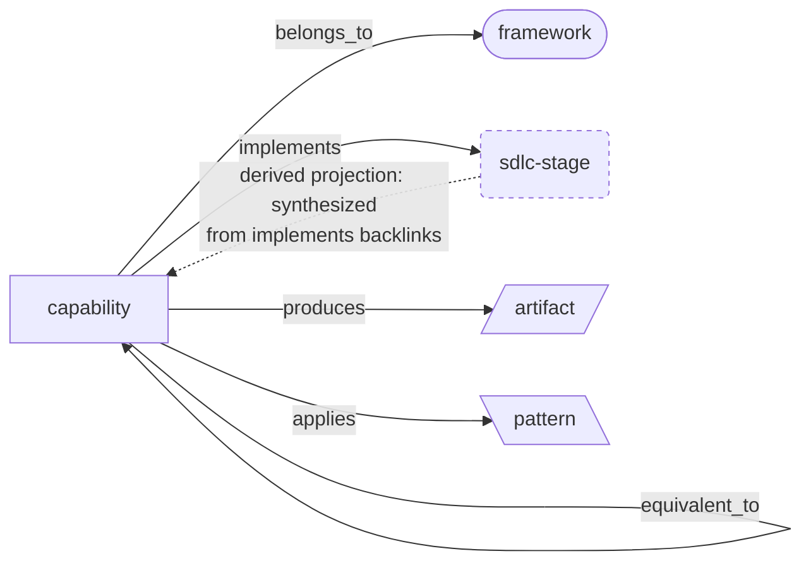

# Wiki Conventions — SDLC Agent-Skill Ontology

This wiki documents software-development-lifecycle (SDLC) agent **frameworks** and the **capabilities** they ship (commands, skills, sub-agents), then synthesizes the common lifecycle that emerges across them. It is built and maintained with the `karpathy-llm-wiki` skill: `raw/` holds immutable sources, `wiki/` holds compiled articles. This file is the **schema layer** for `wiki/` — read it before any ingest.

## The ontology at a glance

Five node types, six relationship edges. **`capability` is the hub**: every stored edge originates from a capability page's frontmatter. The other four types carry no forward edges — their relationships are the inverse (backlink) views. `sdlc-stage` is special: it stores nothing and is a **derived projection**, synthesized from the `implements:` backlinks pointing at it (the dashed edge). `implements:` drives that synthesis; `equivalent_to:` (capability ↔ capability, across frameworks) drives cross-framework clustering.



Solid arrows are stored edges (`[[wikilinks]]` in capability frontmatter); the dashed arrow is the derived synthesis, not a stored field. The [Node types](#node-types--topic-namespaces) and [Relationship vocabulary](#relationship-vocabulary) tables below define each box and label precisely.

## Node types (= topic namespaces)

The wiki's one-level topic directories map 1:1 to the five ontology node types:

| Namespace (`wiki/…/`) | `type:` | What it is |
|-----------------------|---------|------------|
| `framework/`   | `framework`  | A complete SDLC agent toolkit / methodology (e.g. GSD, SpecKit, OpenSpec). |
| `capability/`  | `capability` | A single unit of work a framework exposes. Carries a `subtype:` (see below). |
| `sdlc-stage/`  | `sdlc-stage` | A canonical lifecycle stage. **Derived projection** — its body is synthesized from the capabilities that `implements:` it (its backlinks are the evidence). Its name and definition are **framework-neutral**: the most generic term that covers all frameworks' evidence, never a label lifted from one framework. Reviewed and re-derived on every ingest (see [Stage re-derivation](#stage-re-derivation-keep-stages-framework-neutral)). |
| `artifact/`    | `artifact`   | A concrete output a capability produces (e.g. an atomic commit, a spec file, a plan). |
| `pattern/`     | `pattern`    | A reusable technique a capability applies (e.g. wave parallelism, plan-then-act). |

### `capability` subtypes

```
subtype: command    # an invocable slash-command / entrypoint
subtype: skill      # a loadable skill (SKILL.md unit)
subtype: sub-agent  # a delegated agent a command spawns
```

## Frontmatter schema (Tolaria style)

Every article opens with YAML frontmatter: ontology **type/subtype**, the **relationship edges** below (as `[[wikilinks]]`), and the karpathy bookkeeping fields. Example:

```yaml
---
# wiki/capability/gsd-execute-phase.md
type: capability
subtype: command
belongs_to: "[[gsd]]"
implements: "[[stage-implement]]"
delegates_to: ["[[gsd-wave-executor]]", "[[gsd-debugger]]"]
produces: "[[artifact-atomic-commit]]"
applies: "[[pattern-wave-parallelism]]"
equivalent_to: ["[[speckit-implement]]", "[[openspec-apply]]"]
# --- karpathy bookkeeping ---
sources: "GSD docs (2026)"
raw: ["../../raw/gsd/2026-06-27-gsd-execute.md"]
updated: 2026-06-27
---
```

### Relationship vocabulary

| Edge | Domain → Range | Meaning |
|------|----------------|---------|
| `belongs_to`    | capability → framework        | The framework that ships this capability. |
| `implements`    | capability → sdlc-stage       | The canonical stage this capability performs. **Drives synthesis.** |
| `delegates_to`  | capability → capability[]     | Sub-capabilities this one spawns/calls (e.g. command → sub-agents). |
| `produces`      | capability → artifact[]       | Concrete outputs. |
| `applies`       | capability → pattern[]        | Techniques used. |
| `equivalent_to` | capability → capability[]     | Cross-framework counterparts. **Drives clustering.** |

Single targets may be a bare string; multiple targets use a YAML list. All targets are `[[wikilink]]` strings resolved by file basename (Obsidian/Tolaria style), so basenames are globally unique — see naming below.

### Derived edges (backlinks, not stored)

Stage / framework / artifact / pattern pages do **not** store inverse edges. They are computed from backlinks:

- `sdlc-stage` page ← `implements:` backlinks = the capabilities realizing this stage.
- `framework` page ← `belongs_to:` backlinks = its capability catalogue.
- `artifact` page ← `produces:` backlinks; `pattern` page ← `applies:` backlinks.

## Naming convention (ensures unique basenames)

| Node type | File / wikilink basename | Examples |
|-----------|--------------------------|----------|
| framework   | `<framework>`              | `gsd`, `speckit`, `openspec` |
| capability  | `<framework>-<name>`      | `gsd-execute-phase`, `speckit-implement`, `gsd-wave-executor` |
| sdlc-stage  | `stage-<name>`            | `stage-implement`, `stage-validate` |
| artifact    | `artifact-<name>`         | `artifact-atomic-commit` |
| pattern     | `pattern-<name>`          | `pattern-wave-parallelism` |

Files: `wiki/<namespace>/<basename>.md`, kebab-case, ≤60 chars.

## The synthesis (derived projection)

The point of the wiki is to **extract commonality across frameworks and synthesize the core SDLC stages**. This falls out of two edges:

- `implements:` points each capability at a canonical stage.
- `equivalent_to:` clusters cross-framework capabilities that do the same job.

The synthesized lifecycle therefore lives in `sdlc-stage/` pages, each a **derived projection** of the `framework/` + `capability/` pages whose backlinks are the evidence ("canonical-source-with-derived-projections", applied one level up).

Do not invent stage content; a stage page is only as strong as the capabilities that link into it. Write/expand stage pages as evidence (backlinks) accumulates.

The stage set is a **hypothesis that improves with evidence**, not a fixed schema. It started from one framework and must be re-derived toward the generic as more arrive — see below. Some arcs to sanity-check the derived set against (these are reference points, not the canonical names): the spec-driven loop `classify → prompt → execute → validate → checkpoint`, and the pre-spec arc `explore → shape → execute`.

## Stage re-derivation (keep stages framework-neutral)

Stages are an **abstraction owned by no framework**. Their job is to name the generic activity that multiple frameworks' capabilities have in common. Because the first framework ingested inevitably mints stages in *its own* vocabulary, the stage set must be reviewed and re-derived on every ingest so it converges on the most generic, minimal set that the accumulated evidence supports.

**Run this review on every ingest** (it is step 5 of the ingest workflow below), after wiring the new framework's `implements:` and `equivalent_to:` edges:

1. **Re-read the evidence.** For each `sdlc-stage`, look at *all* its `implements:` backlinks across *all* frameworks (not just the newest). Ask: what is the generic activity these capabilities share?
2. **Generalize names.** If a stage's name is a term lifted from one framework, rename it to the most generic, framework-neutral term that fits every backlink. A name that only one framework would recognise is a smell. Prefer plain SDLC vocabulary (e.g. *align*, *plan*, *implement*, *validate*, *release*) over any single framework's branding (e.g. GSD's *discuss* / *ship*).
3. **Split** a stage when the new framework shows it conflates two genuinely distinct activities — but only split if **≥2 frameworks** evidence the finer distinction (one framework's idiosyncrasy is not enough).
4. **Merge** two stages when frameworks reveal they are the same activity under different names.
5. **Add** a stage only when **≥2 frameworks** have capabilities for an activity no existing stage covers. **Retire** a stage that, after review, has backlinks from only one framework and no generic justification (fold it into a broader stage; note it as a framework-specific specialisation rather than a canonical stage).
6. **Minimize.** Fewer, broader, well-evidenced stages beat many narrow ones. The target is the smallest set of generic stages that still distinguishes the activities the frameworks actually treat as distinct.

**Park pending splits on the stage page.** When a stage bundles an activity that isn't yet past the ≥2-framework bar, record it under a `## Split candidates` heading on that stage's page — naming the proposed `stage-<x>`, the distinction, the evidence tally so far, and the decisive trigger that would clear the bar. This is the review queue: every ingest re-reads these against the new framework and promotes any that now qualify. (Example: `stage-plan` carries `stage-specify` and `stage-design` candidates.)

**Record the generalisation on each stage page.** Stage frontmatter may carry an optional `aka:` field mapping the generic stage to the per-framework terms it subsumes — this is both documentation and the audit trail for the name choice:

```yaml
# wiki/sdlc-stage/stage-align.md
type: sdlc-stage
aka: { gsd: "Discuss", matt-pocock-skills: "grilling" }
updated: 2026-06-30
```

**Renaming is a cascade — do it safely and atomically:**

1. `grep -rl '\[\[stage-OLD\]\]' wiki/` to find every reference.
2. Update every `implements:` edge and every prose/`See Also` mention to `[[stage-NEW]]`.
3. Rename the file `sdlc-stage/stage-OLD.md` → `stage-NEW.md` and update its `# heading`, `aka:`, and `updated:`.
4. Update the `index.md` row and any cross-stage links.
5. Append the rename to `log.md` as an explicit `OLD → NEW` mapping with the reason.
6. Re-run the dangling-wikilink check; there must be zero `[[stage-OLD]]` left.

Renames ripple across many capability pages, so batch them per ingest and keep the old→new mapping in the log. Never leave a `[[stage-OLD]]` dangling.

## Formatting conventions

**Enumerate capabilities as bullet lists, not inline runs.** Whenever a page lists more than one command, sub-agent, or other capability — `Capabilities` sections, `Applied by` / `Produced by` / `Implemented by` backlink sections, command-namespace rundowns — use a markdown bullet list with **one capability per line**, not a comma- or `·`-separated run inside a sentence or a single bullet. Each bullet should be `[[wikilink]] — short role note` so the line earns its place and the list scans vertically.

- For long rosters (e.g. the full sub-agent catalogue on a `framework` page), group the bullets under bold sub-headings by function (Research, UI, Quality, Debug, Docs, …) rather than one flat list.
- Tables remain fine for fixed multi-column data (e.g. the phase ↔ command ↔ stage map); the bullet rule is about prose enumerations of capabilities.
- Genuine prose that *mentions* capabilities in the course of explaining a flow (e.g. "plans via [[gsd-planner]], then gated by [[gsd-plan-checker]]") stays as prose — the rule targets *lists*, not every reference.

## Ingest workflow reminders

1. Source → `raw/<framework>/YYYY-MM-DD-slug.md` (immutable).
2. Compile → create/merge the `framework` page and one `capability` page per command/ skill/sub-agent, with full frontmatter edges.
3. Create stub `artifact`/`pattern`/`sdlc-stage` pages for any new `[[wikilink]]` targets so links resolve; flesh them out from backlink evidence.
4. Set `equivalent_to:` when a capability matches one already documented in another framework (this is what builds the cross-framework clusters).
5. **Re-derive the stage set** (see [Stage re-derivation](#stage-re-derivation-keep-stages-framework-neutral)): review every `sdlc-stage` against the now-richer evidence and rename / split / merge / add / retire toward the most generic, minimal set. Update `aka:` on each touched stage.
6. Cascade: update affected stage projections; refresh `updated:`; update `index.md` and append to `log.md` (including any stage `OLD → NEW` renames).
