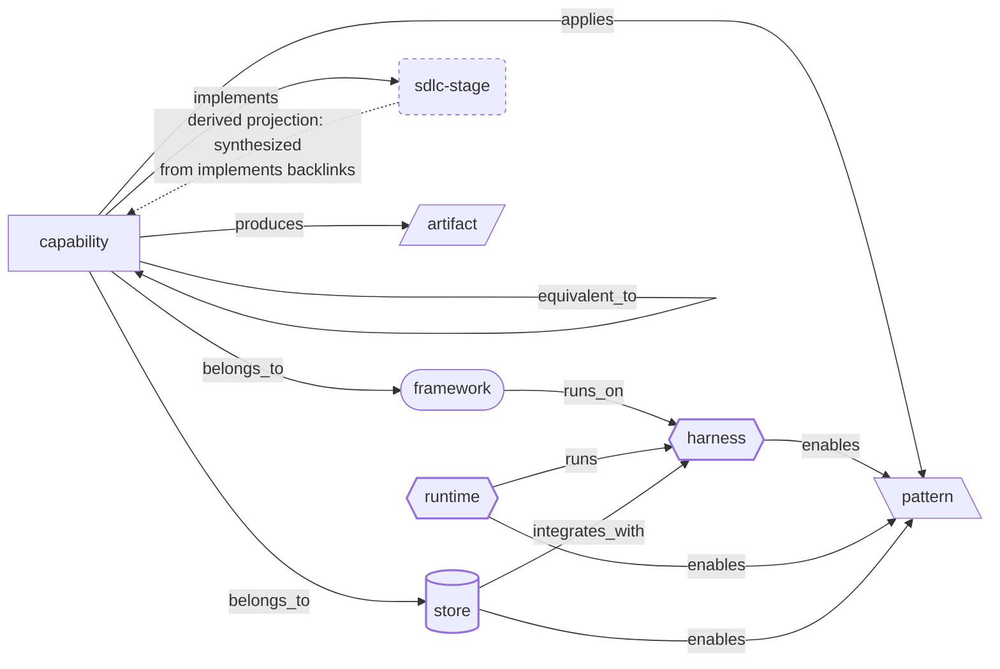

# Wiki Conventions — SDLC Agent-Skill Ontology

This wiki documents software-development-lifecycle (SDLC) agent **frameworks** and the **capabilities** they ship (commands, skills, sub-agents), then synthesizes the common lifecycle that emerges across them. Three further layers document the substrate the process layer runs on. The agent **harness** — the agent program itself (Claude Code, pi, OpenCode, …) that loads a framework's skills and drives the model's tool-call loop. Below it, the agent **runtime** — the execution/orchestration substrate (sandbox isolation, parallelism, branch→PR, AFK autonomy, steering) that spawns and wraps harnesses to decide *where and how* they run. Beside both, the **store** — the durable, agent-facing state (a work graph, a memory corpus) that outlives any single run, so a session that ends or crashes does not take the work with it. Frameworks are portable *across* harnesses; runtimes are agnostic *to* them; the harness is the pivot both are defined relative to; the store is what all three write to and read back. All four layers meet at the `pattern` namespace. It is built and maintained with the `karpathy-llm-wiki` skill: `raw/` holds immutable sources, `wiki/` holds compiled articles. This file is the **schema layer** for `wiki/` — read it before any ingest.

**The layer split in one line:** framework, harness, and runtime are all *compute* — instructions, the loop, and where the loop runs, each transient per run. The store is *state*: the only layer that survives the run.

## The ontology at a glance

Eight node types, eleven relationship edges. **`capability` is the hub** of the process layer: every process-layer edge originates from a capability page's frontmatter. **`runtime`, `harness`, and `store` are three more edge-origins** — the substrate layers around the process layer. A `framework` page carries one forward edge of its own (`runs_on:` → harness); a `runtime` carries two (`runs:` → harness, `enables:` → pattern); a `harness` carries one (`enables:` → pattern); a `store` carries two (`integrates_with:` → harness, `enables:` → pattern). All three substrate layers land at the `pattern` namespace, the seam where the four layers meet. The remaining types carry no forward edges — their relationships are the inverse (backlink) views. `sdlc-stage` is special: it stores nothing and is a **derived projection**, synthesized from the `implements:` backlinks pointing at it (the dashed edge). `implements:` drives that synthesis; `equivalent_to:` (capability ↔ capability, across frameworks) drives cross-framework clustering.



Solid arrows are stored edges (`[[wikilinks]]` in capability, framework, runtime, harness, **or store** frontmatter); the dashed arrow is the derived synthesis, not a stored field. The substrate layers attach at two kinds of seam. **`framework --runs_on--> harness`**, **`runtime --runs--> harness`**, and **`store --integrates_with--> harness`** bind the layers to one another (the harness is the shared pivot), while **`enables:`** — carried by `runtime`, `harness`, *and* `store` — lands in the `pattern` namespace. So `pattern` now collects **four** backlink rosters: `applies:` (process-side, from capabilities), `enables:` from runtimes (infra-side), from harnesses (harness-side), and from stores (state-side). `capability --belongs_to-->` now has two possible ranges, `framework` **or** `store`: a store is a product that ships an invocable command surface, so its commands are `capability` pages like a framework's — but most of them `implements:` no stage, because holding state about work is not performing a lifecycle step. The [Node types](#node-types--topic-namespaces) and [Relationship vocabulary](#relationship-vocabulary) tables below define each box and label precisely.

## Node types (= topic namespaces)

The wiki's one-level topic directories map 1:1 to the eight ontology node types:

| Namespace (`wiki/…/`) | `type:` | What it is |
|-----------------------|---------|------------|
| `framework/`   | `framework`  | A complete SDLC agent toolkit / methodology (e.g. GSD, SpecKit, OpenSpec). Carries one forward edge, `runs_on:` → harness. |
| `capability/`  | `capability` | A single unit of work a framework exposes. Carries a `subtype:` (see below). |
| `sdlc-stage/`  | `sdlc-stage` | A canonical lifecycle stage. **Derived projection** — its body is synthesized from the capabilities that `implements:` it (its backlinks are the evidence). Its name and definition are **framework-neutral**: the most generic term that covers all frameworks' evidence, never a label lifted from one framework. Reviewed and re-derived on every ingest (see [Stage re-derivation](#stage-re-derivation-keep-stages-framework-neutral)). |
| `artifact/`    | `artifact`   | A concrete output a capability produces (e.g. an atomic commit, a spec file, a plan). |
| `pattern/`     | `pattern`    | A reusable technique a capability applies (e.g. wave parallelism, plan-then-act). Also the **seam to the two substrate layers**: `runtime` **and** `harness` pages `enables:` patterns here. |
| `harness/`     | `harness`    | An agent **program / CLI** — the agent loop that loads a framework's skills and runs the model's tool-call cycle (e.g. Claude Code, pi, OpenCode). The **pivot both other layers are defined against**: frameworks `runs_on:` it, runtimes `runs:` it. Carries a `subtype:` (terminal \| ide). Connects to the ontology by `enables:` → `pattern` (the execution primitives — sub-agents, hooks, MCP, skill-loading — that capabilities build on); performs **no** SDLC stage, so it carries no `implements:` / `belongs_to:` / `equivalent_to:`. |
| `runtime/`     | `runtime`    | An agent **execution / orchestration substrate** — the harness-agnostic layer deciding *where and how* agents run (sandbox isolation, parallelism, branch→PR, AFK autonomy, steering, persistence), as opposed to the process layer's *what*. Carries a `subtype:` (library \| platform). **Not a language, container, or model runtime** — the word here means an *agent* execution substrate; read it as “the execution layer” wherever the overloaded sense intrudes. Connects to the ontology through `runs:` → `harness` and `enables:` → `pattern`, **not** `implements:` → `sdlc-stage` — a runtime performs no SDLC stage, it spawns the harness that hosts the agent that does. |
| `store/`       | `store`      | A **durable, agent-facing state store** — the work graph or memory corpus that outlives any single run, so an ended or crashed session does not take the work with it. Carries a `subtype:` (work \| memory). The **state layer**: where the other three layers are compute (instructions, the loop, where the loop runs — each transient per run), this is the layer that *survives* the run. Connects to the ontology through `integrates_with:` → `harness` and `enables:` → `pattern`, and is the second possible range of `belongs_to:` (its command surface gets `capability` pages). Performs **no** SDLC stage itself, so it carries no `implements:` / `equivalent_to:`. |

There is also an **eighth namespace, `topic/`, that is deliberately *not* one of the seven ontology node types** — it is a curated navigation overlay that sits *above* the graph rather than participating in it. See [The topic layer](#the-topic-layer-curated-overlays) below.

### `capability` subtypes

```
subtype: command    # an invocable slash-command / entrypoint
subtype: skill      # a loadable skill (SKILL.md unit)
subtype: sub-agent  # a delegated agent a command spawns
```

### `harness` subtypes

```
subtype: terminal   # a terminal/CLI (or TUI) agent run in a shell (e.g. Claude Code, pi, OpenCode, Codex)
subtype: ide        # an editor-embedded agent (e.g. Cursor, Copilot, Windsurf)
```

Classify by the harness's **native / primary** interaction surface. A `terminal` harness may also ship IDE extensions or a web/desktop app (Claude Code does) without becoming `ide`; the subtype records where it *lives first*, because that is what a framework's skill/command format targets.

### `runtime` subtypes

```
subtype: library    # an embeddable SDK/toolkit you script your own orchestration with (e.g. Sandcastle)
subtype: platform   # a self-hostable control-plane service with UI/API (e.g. Warren)
```

### `store` subtypes

```
subtype: work       # a graph of work items an agent claims from (e.g. Beads, Seeds)
subtype: memory     # a corpus of durable insight an agent reads back (e.g. mulch's .mulch/, canopy's prompt library)
```

Classify by **what the store holds**, not by how it stores it. The storage substrate — a versioned SQL database ([[beads]]) versus plain diffable files ([[seeds]]) — is the sharpest *disagreement* in the layer and is therefore a matrix dimension in `wiki/store/index.md`, not a subtype. Only `work` stores are paged so far; `memory` is declared because the layer's own members already name instances of it (Warren bundles mulch and canopy; Beads ships its own memory surface in `bd remember` / `bd kv`), and because scoping the node to issue-trackers alone would have to be widened on the next ingest.

## Frontmatter schema (Tolaria style)

Every article opens with YAML frontmatter: ontology **type/subtype**, the **relationship edges** below (as `[[wikilinks]]`), and the karpathy bookkeeping fields. Example:

```yaml
---
# wiki/capability/gsd-execute-phase.md
type: capability
subtype: command
belongs_to: "[[gsd]]"
implements: "[[stage-implement]]"
delegates_to: ["[[gsd-wave-executor]]", "[[gsd-debugger]]"]
produces: "[[artifact-atomic-commit]]"
applies: "[[pattern-wave-parallelism]]"
equivalent_to: ["[[speckit-implement]]", "[[openspec-apply]]"]
# --- karpathy bookkeeping ---
sources: "GSD docs (2026)"
raw: ["../../raw/gsd/2026-06-27-gsd-execute.md"]
updated: 2026-06-27
---
```

A `framework` page now also carries a single forward edge, **`runs_on:`** → harness[], recording which harnesses its skills/commands run on (this is the only forward edge a framework stores; its capabilities carry the rest).

A `harness` page's frontmatter is lean — one relationship edge (`enables:`) plus a scalar `subtype:` and the bookkeeping fields. Like a runtime it carries **no** `implements:` / `belongs_to:` / `equivalent_to:`; it performs no stage. It is a target of `runs_on:` (frameworks) and `runs:` (runtimes), and a source of `enables:` (patterns):

```yaml
---
# wiki/harness/claude-code.md
type: harness
subtype: terminal
enables: ["[[pattern-fresh-context-subagents]]", "[[pattern-edit-guardrails]]", "[[pattern-session-handoff]]", "[[pattern-context-engineering]]"]
# --- karpathy bookkeeping ---
sources: "Anthropic — Claude Code docs (2026)"
raw: ["../../raw/harness/2026-07-31-claude-code.md"]
updated: 2026-07-31
---
```

A `runtime` page's frontmatter carries two relationship edges (`runs:` → harness, `enables:` → pattern) plus a scalar `subtype:` and the bookkeeping fields. It carries **no** `implements:` / `belongs_to:` / `equivalent_to:`; it is not a framework and performs no stage:

```yaml
---
# wiki/runtime/sandcastle.md
type: runtime
subtype: library
runs: ["[[claude-code]]"]   # extend with codex / pi / cursor / opencode / copilot as those harness pages are ingested
enables: ["[[pattern-worktree-isolation]]", "[[pattern-autonomous-loop]]", "[[pattern-wave-parallelism]]", "[[pattern-session-handoff]]"]
# --- karpathy bookkeeping ---
sources: "mattpocock/sandcastle (MIT, 2026)"
raw: ["../../raw/runtime/2026-07-26-sandcastle.md"]
updated: 2026-07-26
---
```

A `store` page's frontmatter mirrors a runtime's: two relationship edges (`integrates_with:` → harness, `enables:` → pattern) plus a scalar `subtype:` and the bookkeeping fields. It carries **no** `implements:` / `belongs_to:` / `equivalent_to:` — a store performs no stage; it is the state a stage's work is recorded in. Unlike a runtime it *is* a target: its own command surface points back at it with `belongs_to:`.

```yaml
---
# wiki/store/beads.md
type: store
subtype: work
integrates_with: ["[[claude-code]]", "[[factory-droid]]", "[[opencode]]"]
enables: ["[[pattern-session-handoff]]", "[[pattern-knowledge-compounding]]", "[[pattern-context-engineering]]", "[[pattern-autonomous-loop]]"]
# --- karpathy bookkeeping ---
sources: "gastownhall/beads (MIT, 2026)"
raw: ["../../raw/beads/2026-08-31-beads.md"]
updated: 2026-08-31
---
```

### Relationship vocabulary

| Edge | Domain → Range | Meaning |
|------|----------------|---------|
| `belongs_to`    | capability → framework \| store | The product that ships this capability — a framework, or a store. Two ranges because a store ships an invocable command surface too, so its commands are `capability` pages like a framework's; the difference is that a store's capabilities usually `implements:` nothing. |
| `implements`    | capability → sdlc-stage       | The canonical stage this capability performs. **Drives synthesis.** |
| `delegates_to`  | capability → capability[]     | Sub-capabilities this one spawns/calls (e.g. command → sub-agents). |
| `produces`      | capability → artifact[]       | Concrete outputs. |
| `applies`       | capability → pattern[]        | Techniques used. |
| `equivalent_to` | capability → capability[]     | Cross-framework counterparts. **Drives clustering.** |
| `runs_on`       | framework → harness[]         | The harnesses this framework **officially supports / documents** — *not* every harness it could theoretically run on. Makes cross-harness portability structural (was prose like *"cross-harness"*). See the support-scope rule below. |
| `runs`          | runtime → harness[]           | The harnesses this runtime **officially lists as a provider / target** — the documented provider set, not any harness it might host. Makes harness-agnosticism structural (was prose like *"provider-agnostic"*). |
| `integrates_with` | store → harness[]           | The harnesses this store **ships an integration for** — an installer, a memory-file writer, a hooks/skill/plugin bundle. The store analogue of `runs_on:` / `runs:`, and the same support-scope rule applies: a documented integration, not "it would work there". A store is a CLI, so what it usually supports is a *convention* (`AGENTS.md`) rather than a named harness; an edge needs the harness named or a harness-specific artifact shipped. |
| `enables`       | runtime, harness **or** store → pattern[] | A pattern this substrate provides — the *infra-side* (runtime), *harness-side* (harness), or *state-side* (store) realization of a pattern that capabilities `apply` at the *process* level. **The seam where the substrate layers meet the process layer.** |

Single targets may be a bare string; multiple targets use a YAML list. All targets are `[[wikilink]]` strings resolved by file basename (Obsidian/Tolaria style), so basenames are globally unique — see naming below.

### Derived edges (backlinks, not stored)

Stage / framework / artifact / pattern / harness / store pages do **not** store inverse edges. They are computed from backlinks:

- `sdlc-stage` page ← `implements:` backlinks = the capabilities realizing this stage.
- `framework` page ← `belongs_to:` backlinks = its capability catalogue. (It also *stores* one forward edge, `runs_on:`.)
- `store` page ← `belongs_to:` backlinks = its command catalogue, exactly as for a framework. (It also *stores* two forward edges, `integrates_with:` and `enables:`.)
- `artifact` page ← `produces:` backlinks; `pattern` page ← `applies:` backlinks (process-side) **plus three `enables:` rosters — infra-side from `runtime` pages, harness-side from `harness` pages, and state-side from `store` pages**.
- `harness` page ← `runs_on:` backlinks (frameworks that run on it), `runs:` backlinks (runtimes that spawn it), **and `integrates_with:` backlinks (stores that ship an integration for it)**; it *stores* `enables:` (patterns) forward. So a harness is both a target (of `runs_on:` / `runs:` / `integrates_with:`) and a source (of `enables:`) — like `capability`.
- `runtime` pages store `runs:` and `enables:` and are otherwise pure sources — nothing links *to* them via the stored edges (a runtime is never a target).

## Naming convention (ensures unique basenames)

| Node type | File / wikilink basename | Examples |
|-----------|--------------------------|----------|
| framework   | `<framework>`              | `gsd`, `speckit`, `openspec` |
| capability  | `<framework>-<name>`      | `gsd-execute-phase`, `speckit-implement`, `gsd-wave-executor` |
| sdlc-stage  | `stage-<name>`            | `stage-implement`, `stage-validate` |
| artifact    | `artifact-<name>`         | `artifact-atomic-commit` |
| pattern     | `pattern-<name>`          | `pattern-wave-parallelism` |
| harness     | `<harness>`               | `claude-code`, `pi`, `opencode` |
| runtime     | `<runtime>`               | `sandcastle`, `warren` |
| store       | `<store>`                 | `beads`, `seeds` |
| topic (overlay) | `topic-<name>`        | `topic-harness-engineering` |

Files: `wiki/<namespace>/<basename>.md`, kebab-case, ≤60 chars.

## The synthesis (derived projection)

The point of the wiki is to **extract commonality across frameworks and synthesize the core SDLC stages**. This falls out of two edges:

- `implements:` points each capability at a canonical stage.
- `equivalent_to:` clusters cross-framework capabilities that do the same job.

The synthesized lifecycle therefore lives in `sdlc-stage/` pages, each a **derived projection** of the `framework/` + `capability/` pages whose backlinks are the evidence ("canonical-source-with-derived-projections", applied one level up).

Do not invent stage content; a stage page is only as strong as the capabilities that link into it. Write/expand stage pages as evidence (backlinks) accumulates.

The stage set is a **hypothesis that improves with evidence**, not a fixed schema. It started from one framework and must be re-derived toward the generic as more arrive — see below. Some arcs to sanity-check the derived set against (these are reference points, not the canonical names): the spec-driven loop `classify → prompt → execute → validate → checkpoint`, and the pre-spec arc `explore → shape → execute`.

## The harness layer

Between the process layer and the execution layer sits the **harness** — the agent program itself: the loop that reads a framework's skills/commands, assembles context, calls the model, executes the model's tool calls (subject to a permission/hook policy), spawns sub-agents, and returns a result. Claude Code, pi, OpenCode, Codex, Cursor, and Copilot are harnesses.

A harness is neither a `framework` nor a `runtime`, by this wiki's own definitions:

- **Not a framework.** A framework ships an opinionated SDLC *methodology* (capabilities across the lifecycle). A harness ships *execution primitives* — a tool-call loop, sub-agent spawning, MCP, hooks, a skill loader — that frameworks are built *on top of*. Claude Code performs no lifecycle stage; it *loads* GSD's or Superpowers' skills and runs them. (A harness may bundle a few of its own built-in commands, but those are host affordances, not a methodology.)
- **Not a runtime.** A runtime *spawns and wraps* harnesses to parallelize/sandbox/AFK them; the harness is the thing being orchestrated. Sandcastle and Warren launch Claude Code — they are one layer down.

The harness is the **pivot both other layers are already defined against**: frameworks are described as *"cross-harness"* (Superpowers runs on Claude Code/Codex/Cursor/Kimi/OpenCode/pi) and runtimes as *"harness-agnostic"* (Sandcastle runs Claude Code/Codex/pi/…). Making `harness` a node turns those two hand-wavy prose properties into stored, queryable edges — `framework --runs_on--> harness` and `runtime --runs--> harness` — that both point at the same shared node. That is the sign it is a real, load-bearing node rather than scope creep.

**How it joins the ontology graph.** Like a runtime, a harness attaches only at `pattern`, via `enables:` — but where a runtime provides *orchestration* substrate, a harness provides *execution primitives*. Several patterns are dual- or triple-sided: [[pattern-fresh-context-subagents]] is `applied` by capabilities (process-side) yet `enabled` by the harness's sub-agent tool (harness-side); [[pattern-edit-guardrails]] is gstack's signature skill set yet rests on the harness's hooks + permission modes. A `pattern` page therefore carries up to three backlink rosters — **Applied by** (capabilities), **Enabled by (infrastructure)** (runtimes), **Provided by (harness)** (harnesses). Keep them as separate subsections.

**The synthesis axis** — as with runtimes, *collect instances then synthesize the dimensions they share*, but the dimensions are **harness capabilities**, not SDLC stages: skill/command format (SKILL.md · AGENTS.md · slash-commands) · sub-agents · MCP · hooks/extensibility · permissions & guardrails · model access/routing · memory & context files (CLAUDE.md/AGENTS.md) · plan mode & steering · interaction surface (CLI/TUI/IDE/web) · distribution/license. With only a handful documented these live as a **comparison matrix** in `wiki/harness/index.md` and as prose per page — **not** minted as their own derived-node namespace (premature abstraction for so few instances). Graduate the matrix into derived nodes only if the layer grows enough that it stops scaling — the same discipline parked for runtimes.

**The harness/runtime boundary (decide with this test).** When a tool blurs the line — Cursor has orchestration features; Claude Code ships an Agent SDK — page the single agent loop you talk to as the `harness`, and note its orchestration features as *runtime-adjacent* prose rather than minting a second node. A harness is *the loop*; a runtime *spawns loops*.

**Support scope — wire `runs_on:` / `runs:` to *officially supported* harnesses only.** An edge means the framework's (or runtime's) own docs claim support for that harness — not that it *could* run there. A framework that a user *happens* to run under some other harness does not earn an edge. This keeps the harness backlink rosters a map of documented compatibility, not speculation. Corollary: when an officially-supported harness has **no page yet**, do not point an edge at a non-existent target — record the support in prose (a bold-text mention, per the runtime "broader category" precedent) and add the stored edge when that harness is ingested. So the stored-edge set trails the documented-support set until every referenced harness has a page; the log tracks the gap.

**Ingesting a harness:** source → `raw/harness/YYYY-MM-DD-slug.md`; create `wiki/harness/<name>.md` with `type: harness`, a `subtype:` (terminal \| ide), and `enables:` edges to the primitives-as-patterns it provides; create stub `pattern` pages for any new targets; add a **Provided by (harness)** subsection to each enabled pattern; wire the `runs_on:` edge on every `framework` that runs on it and the `runs:` edge on every `runtime` that spawns it (create the harness page *before* those edges so nothing dangles); refresh the harness matrix in `wiki/harness/index.md` and the `## harness` section in `catalogue.md`; log it. A harness implements no stage, so there is no stage re-derivation.

## The execution layer (runtimes)

The `framework`/`capability`/`sdlc-stage` triad models the **process layer** — *what* an agent does across the lifecycle. `runtime` pages model a third, orthogonal **execution layer** — *where and how* the agent runs. A runtime is [harness](#the-harness-layer)-agnostic (it runs Claude Code, Codex, pi, … interchangeably — a fact now stored as `runs:` → harness edges) and framework-agnostic (you could run any process framework's skills inside it), so it deliberately carries **no** `belongs_to`, `implements`, or `equivalent_to` edge. It is not a smaller framework; it is a different kind of thing.

**A note on the word.** `runtime` is overloaded — a language runtime, a container runtime, a model-serving runtime are all unrelated to this node. The layer is called the *execution layer* and the node `runtime`; where the two names sit side by side, the layer name is the one that carries the meaning. The node was kept as `runtime` rather than renamed to `orchestrator` deliberately: orchestration is only three of the nine dimensions this layer synthesises (isolation and persistence are not orchestration at all), a `library`-subtype runtime is a toolkit you *script* orchestration with rather than an orchestrator itself, and orchestration also happens at the process layer ([[pattern-wave-parallelism]]) and in the harness (sub-agent spawning) — so naming this node for it would imply a monopoly the evidence does not support.

The two layers connect at exactly one point: the `pattern` namespace. Several patterns have both a **process-side** expression (a capability `applies:` it — a skill instructing the agent) and an **infra-side** expression (a runtime `enables:` it — a substrate that provides it). Worktree isolation, the autonomous loop, wave parallelism, session handoff, and knowledge compounding are the current dual-sided patterns. A pattern page therefore now carries two backlink rosters: **Applied by** (capabilities) and **Enabled by (infrastructure)** (runtimes). Keep them as separate subsections.

The wiki's method — *collect instances of a layer, then synthesize the dimensions they share* — applies to runtimes too, but the synthesized dimensions are **orchestration concerns**, not SDLC stages: isolation model · parallelism · autonomy/AFK · steering (HITL) · persistence/memory · provider/harness-agnosticism · branch→PR · self-host topology · distribution (library vs platform). With only a handful of runtimes documented, these concerns live as a **comparison matrix** in `catalogue.md`'s `## runtime` section and as prose on each page — they are **not** minted as their own derived-node namespace (that would be premature abstraction for so few instances). If the runtime layer grows enough that the matrix stops scaling, graduate the concerns into their own derived-projection nodes (the runtime analogue of `sdlc-stage`), mirroring the stage synthesis. Park that decision here until the evidence demands it.

**Ingesting a runtime:** source → `raw/runtime/YYYY-MM-DD-slug.md`; create `wiki/runtime/<name>.md` with `type: runtime`, a `subtype:`, and `enables:` edges to the patterns it provides; create stub `pattern` pages for any new targets; add an **Enabled by (infrastructure)** subsection to each enabled pattern; refresh the `## runtime` matrix in `catalogue.md`; log it. There is no stage re-derivation for runtimes (they implement no stage), but re-check whether a newly evidenced orchestration concern warrants graduating the matrix per the paragraph above.

## The state layer (stores)

The other three layers are **compute**. A `framework` is instructions, a `harness` is the loop that executes them, a `runtime` decides where that loop runs — and all three are transient: when the run ends, they are gone, and so is everything the agent knew. A `store` is **state**: the durable, agent-facing record of work and knowledge that outlives any single run.

Both paged instances make that the explicit pitch. [[beads]]: *"Coding agents lose their memory every time a session ends. Markdown plans rot, TODO comments scatter, and a crashed agent takes its context with it… Work survives the agent; the next session picks up where the last one died."* [[seeds]]: the committed queue is the handoff object, so a fresh agent reads `sd ready` instead of reconstructing where the last one stopped. This is the layer that makes **long-horizon** agent work possible at all, which is why it earned a node rather than staying prose on a runtime page.

A store is neither a framework, a harness, nor a runtime, and for once the sources say so themselves rather than the wiki having to argue it. Beads' own product charter draws the boundary in this wiki's exact vocabulary:

> Beads should not know about orchestration layers built on top of it. Systems such as schedulers, swarms, release coordinators, and future workflow engines may use beads, but beads should not encode their concepts in core. […] **The orchestration layer owns orchestration policy: agent routing, task assignment strategy, model choice, retry plans, scheduling, workflow semantics, and cross-system coordination.**

That paragraph describes the `runtime` layer and places beads below and beside it. The same charter says beads *"owns issue tracking primitives"* and should not encode methodology — so it is not a framework either. Independently, [[warren]] (a runtime) *bundles* `.seeds/` and `.mulch/` as things projects bring, and consumes them; a runtime spawns loops, a store is read by them.

**Why the node is `store` and not `tracker`.** The evidence does not stop at issue tracking. Beads ships its own memory surface (`bd remember` / `bd recall` / `bd kv`, primed into context by `bd prime`) and a semantic compaction pass that decays old closed work to protect the context window; Warren's `.mulch/` is a corpus of expertise records merged across runs, and canopy is a versioned prompt library. Those are the same *kind* of thing — durable state an agent reads back — differing only in what they hold, which is what `subtype: work | memory` records. Naming the node `tracker` would have forced a widening on the next ingest, and would have left `.mulch/` filed as a feature of one runtime rather than an instance of a layer.

**How it joins the ontology graph.** Like a runtime, a store attaches at `pattern` via `enables:`, and at `harness` via a support edge (`integrates_with:`). Unlike a runtime, it is also a **target**: a store ships a command surface, and those commands are `capability` pages that `belongs_to:` it. So `pattern` now carries up to four backlink rosters — **Applied by** (capabilities), **Enabled by (infrastructure)** (runtimes), **Provided by (harness)** (harnesses), **Persisted by (store)** (stores). Keep them as separate subsections. The store roster is the one that answers *"and what makes it survive the session?"*

**A store's capabilities mostly implement no stage, and that is the expected shape, not a gap.** `bd list` performs no lifecycle step; `sd update --status in_progress` records that implementation is happening without doing any of it. A store's command surface is overwhelmingly off-stage by construction. Two consequences: do **not** stretch a stage edge to make a store look better covered, and do not read the framework × stage matrix in `sdlc-stage/index.md` as ranking stores — they are listed there in a separate addendum, not as rows competing with frameworks. Where a store *does* ship genuine lifecycle work — [[seeds]]' `sd plan` surface is the clear case — wire the `implements:` edge on that capability normally.

**The synthesis axis** — as with runtimes and harnesses, *collect instances then synthesize the dimensions they share*, but the dimensions are **state concerns**: storage substrate · source of truth · concurrency model · merge model · sync mechanism · readiness computation · dependency/graph edge types · memory surface · context management (compaction/decay) · workflow templating · external-tracker bridging · federation & multi-repo · harness integrations · ops burden. With two instances these live as a **comparison matrix** in `wiki/store/index.md` and as prose per page — **not** minted as their own derived-node namespace. Graduate them only if the layer grows enough that the matrix stops scaling; the same discipline parked for the runtime and harness dimensions.

**The layer's members disagree, and the disagreement is the point.** [[seeds]] was written specifically to replace [[beads]] and its README argues against beads' storage design by name; beads' charter argues for exactly the thing seeds calls baggage (*"Dolt provides storage, versioning, sync, merge behavior, concurrency, and crash safety"*). Record such a conflict on **both** pages with attribution and capture dates, and cross-link them — do not adjudicate it. This is the first head-to-head disagreement between two paged tools in the wiki, and preserving it is more useful than picking a winner.

**Ingesting a store:** source → `raw/<store>/YYYY-MM-DD-slug.md`; create `wiki/store/<name>.md` with `type: store`, a `subtype:`, `integrates_with:` → harness, and `enables:` → pattern; create one `capability` page per meaningful command family with `belongs_to:` → the store (`implements:` usually `[]`); create stub `pattern` pages for any new targets; add a **Persisted by (store)** subsection to each enabled pattern; add an *Integrated by (stores)* bullet to each harness page's backlink roster and to the `harness/index.md` support matrix; refresh the matrix in `wiki/store/index.md` and the `## store` section in `catalogue.md`; log it. Re-derive stages only if a store capability genuinely implements one.

## The topic layer (curated overlays)

Everything above is the **ontology graph** — nodes joined by stored edges, plus the one derived projection (`sdlc-stage`). The `topic/` namespace is a different kind of object: an **authored, top-down, cross-namespace reference page** — a *Map of Content* — that frames a theme and links *out* to the specific pages that instantiate it. Where a `pattern` is minted **bottom-up from capability backlinks** (evidence rolls up), a `topic` is written **top-down from a thesis** (a lens reaches down). It exists for *navigation and synthesis-in-prose*, not to carry ontology.

**The four aggregations, kept distinct.** The wiki now has four ways a page can gather others; they must not be confused:

| Page | Direction | Membership | Role |
|------|-----------|------------|------|
| `catalogue.md` | — | exhaustive, one namespace | mechanical catalogue (`index.md` is the authored introduction that points into it) |
| `sdlc-stage` | bottom-up | **derived** from `implements:` backlinks; framework-neutral; one canonical set | part of the synthesis machinery |
| `pattern` | bottom-up | the capabilities that `apply:` it (stored edge) | one reusable technique |
| `topic` | **top-down** | hand-picked links across *any* namespaces; open-ended; may be opinionated | curated overlay / reference hub |

**The overlay rule — a topic must not pollute the synthesis graph.** A topic's `[[links]]` are *soft navigation only*. Concretely:

1. A topic carries **no stored ontology edges** — no `implements` / `applies` / `produces` / `enables` / `runs_on`. Its links live in prose, never in frontmatter as a semantic edge.
2. A topic link is **never evidence**. It may not be counted toward any target's `Applied by` / `Produced by` / `Enabled by` / stage-`implements` roster, and stage re-derivation ignores topics entirely.
3. **Do not hand-author "Referenced by topic X" rosters** onto target pages. (Obsidian's automatic backlink panel will surface the topic for navigation — that is fine and is the point; the rule bars *authored* rosters that would blur evidence with curation.)

So a topic is read-only with respect to the graph: it consumes the wiki's structure without changing it. Deleting every topic page would leave the ontology and its synthesis completely intact.

**Frontmatter is lean** — `type: topic`, plus bookkeeping (`sources`, optional `raw`, `updated`). No relationship edges.

```yaml
---
# wiki/topic/topic-harness-engineering.md
type: topic
sources: "Martin Fowler — 'Harness Engineering' (2026); wiki synthesis"
raw: ["../../raw/reference/2026-08-05-fowler-harness-engineering.md"]
updated: 2026-08-05
---
```

**Discipline — few, high-value, and accepted-as-hand-maintained.** A topic earns a page only when its theme genuinely spans **≥3 namespaces** (or many pages) *and* a reader could not assemble it from an existing page. Unlike `sdlc-stage` (auto-derived, self-maintaining) a topic is *authored* and will drift as its targets evolve — that upkeep cost is the price of the overlay, so mint them sparingly for load-bearing themes only (the same "don't abstract prematurely" discipline parked for the runtime/harness synthesis dimensions). When a topic's whole content could live as a section on one existing page, put it there instead.

**Authoring a topic:** create `wiki/topic/<topic-name>.md` with `type: topic`; write the framing thesis and the curated out-links (bullet lists per the formatting rule); optionally capture any external reference into `raw/reference/YYYY-MM-DD-slug.md` and cite it; add a row to the `## topic` section of `catalogue.md`; log it. **No stage re-derivation, no backlink cascade** — a topic touches nothing but itself and `catalogue.md`.

## Stage re-derivation (keep stages framework-neutral)

Stages are an **abstraction owned by no framework**. Their job is to name the generic activity that multiple frameworks' capabilities have in common. Because the first framework ingested inevitably mints stages in *its own* vocabulary, the stage set must be reviewed and re-derived on every ingest so it converges on the most generic, minimal set that the accumulated evidence supports.

**Run this review on every ingest** (it is step 5 of the ingest workflow below), after wiring the new framework's `implements:` and `equivalent_to:` edges:

1. **Re-read the evidence.** For each `sdlc-stage`, look at *all* its `implements:` backlinks across *all* frameworks (not just the newest). Ask: what is the generic activity these capabilities share?
2. **Generalize names.** If a stage's name is a term lifted from one framework, rename it to the most generic, framework-neutral term that fits every backlink. A name that only one framework would recognise is a smell. Prefer plain SDLC vocabulary (e.g. *align*, *plan*, *implement*, *validate*, *release*) over any single framework's branding (e.g. GSD's *discuss* / *ship*).
3. **Split** a stage when the new framework shows it conflates two genuinely distinct activities — but only split if **≥2 frameworks** evidence the finer distinction (one framework's idiosyncrasy is not enough).
4. **Merge** two stages when frameworks reveal they are the same activity under different names.
5. **Add** a stage only when **≥2 frameworks** have capabilities for an activity no existing stage covers. **Retire** a stage that, after review, has backlinks from only one framework and no generic justification (fold it into a broader stage; note it as a framework-specific specialisation rather than a canonical stage).
6. **Minimize.** Fewer, broader, well-evidenced stages beat many narrow ones. The target is the smallest set of generic stages that still distinguishes the activities the frameworks actually treat as distinct.

**Park pending splits on the stage page.** When a stage bundles an activity that isn't yet past the ≥2-framework bar, record it under a `## Split candidates` heading on that stage's page — naming the proposed `stage-<x>`, the distinction, the evidence tally so far, and the decisive trigger that would clear the bar. This is the review queue: every ingest re-reads these against the new framework and promotes any that now qualify. (Example: `stage-plan` carries `stage-specify` and `stage-design` candidates.)

**Record the generalisation on each stage page.** Stage frontmatter may carry an optional `aka:` field mapping the generic stage to the per-framework terms it subsumes — this is both documentation and the audit trail for the name choice:

```yaml
# wiki/sdlc-stage/stage-align.md
type: sdlc-stage
aka: { gsd: "Discuss", matt-pocock-skills: "grilling" }
updated: 2026-06-30
```

**Renaming is a cascade — do it safely and atomically:**

1. `grep -rl '\[\[stage-OLD\]\]' wiki/` to find every reference.
2. Update every `implements:` edge and every prose/`See Also` mention to `[[stage-NEW]]`.
3. Rename the file `sdlc-stage/stage-OLD.md` → `stage-NEW.md` and update its `# heading`, `aka:`, and `updated:`.
4. Update the `catalogue.md` row and any cross-stage links.
5. Append the rename to `log.md` as an explicit `OLD → NEW` mapping with the reason.
6. Re-run the dangling-wikilink check; there must be zero `[[stage-OLD]]` left.

Renames ripple across many capability pages, so batch them per ingest and keep the old→new mapping in the log. Never leave a `[[stage-OLD]]` dangling.

## Formatting conventions

**Enumerate capabilities as bullet lists, not inline runs.** Whenever a page lists more than one command, sub-agent, or other capability — `Capabilities` sections, `Applied by` / `Produced by` / `Implemented by` backlink sections, command-namespace rundowns — use a markdown bullet list with **one capability per line**, not a comma- or `·`-separated run inside a sentence or a single bullet. Each bullet should be `[[wikilink]] — short role note` so the line earns its place and the list scans vertically.

- For long rosters (e.g. the full sub-agent catalogue on a `framework` page), group the bullets under bold sub-headings by function (Research, UI, Quality, Debug, Docs, …) rather than one flat list.
- Tables remain fine for fixed multi-column data (e.g. the phase ↔ command ↔ stage map); the bullet rule is about prose enumerations of capabilities.
- Genuine prose that *mentions* capabilities in the course of explaining a flow (e.g. "plans via [[gsd-planner]], then gated by [[gsd-plan-checker]]") stays as prose — the rule targets *lists*, not every reference.

## Ingest workflow reminders

0. **Decide the layer first.** Is the thing a methodology (`framework`), an agent loop (`harness`), something that spawns loops (`runtime`), or durable state a loop reads and writes (`store`)? The tests are in [The harness layer](#the-harness-layer), [The execution layer](#the-execution-layer-runtimes), and [The state layer](#the-state-layer-stores). Getting this wrong is the most expensive mistake available: a misfiled node drags its whole capability set, its stage rosters, the matrices it appears in, and every backlink with it. When a tool sits close to a boundary, the tell is usually its **stage coverage** — a page whose capabilities almost all map to no stage is rarely a framework.
1. Source → `raw/<framework>/YYYY-MM-DD-slug.md` (immutable).
2. Compile → create/merge the `framework` page and one `capability` page per command/ skill/sub-agent, with full frontmatter edges.
3. Create stub `artifact`/`pattern`/`sdlc-stage` pages for any new `[[wikilink]]` targets so links resolve; flesh them out from backlink evidence.
4. Set `equivalent_to:` when a capability matches one already documented in another framework (this is what builds the cross-framework clusters).
5. **Re-derive the stage set** (see [Stage re-derivation](#stage-re-derivation-keep-stages-framework-neutral)): review every `sdlc-stage` against the now-richer evidence and rename / split / merge / add / retire toward the most generic, minimal set. Update `aka:` on each touched stage.
6. Cascade: update affected stage projections; refresh `updated:`; update `catalogue.md` and append to `log.md` (including any stage `OLD → NEW` renames).
