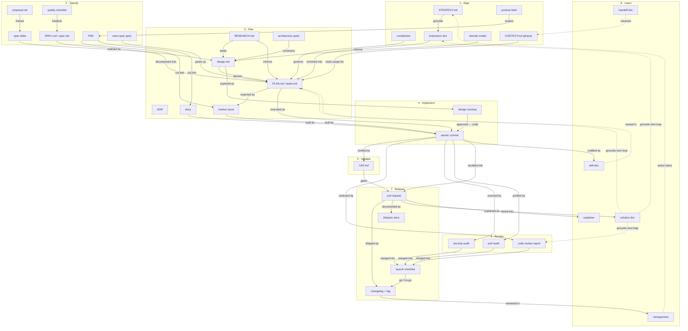
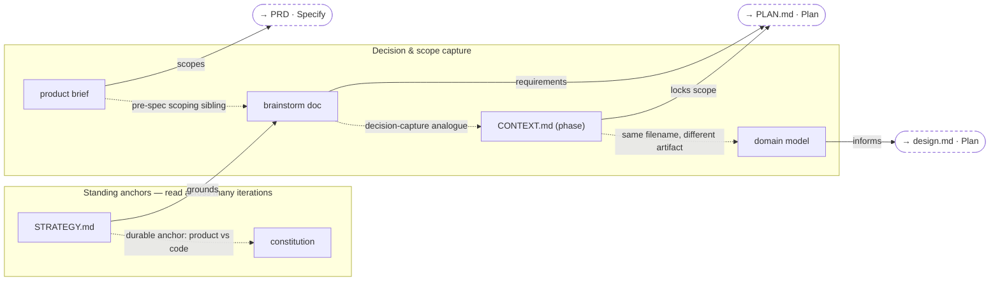
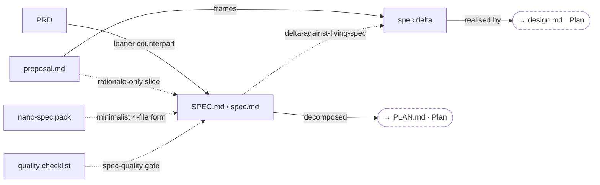
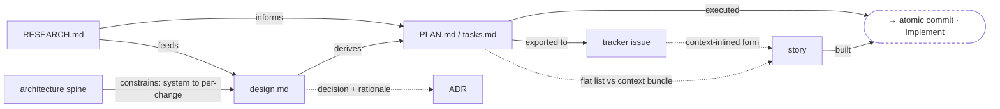
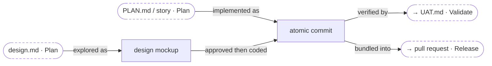
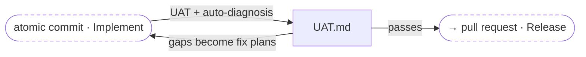
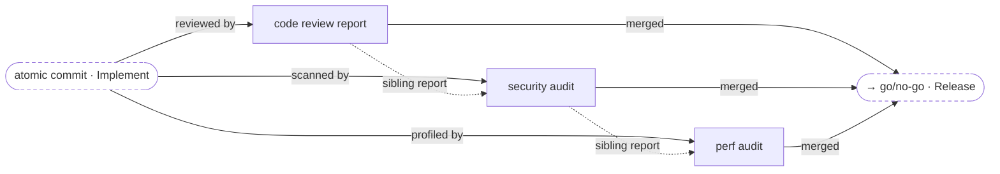
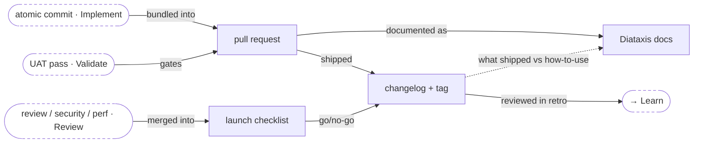
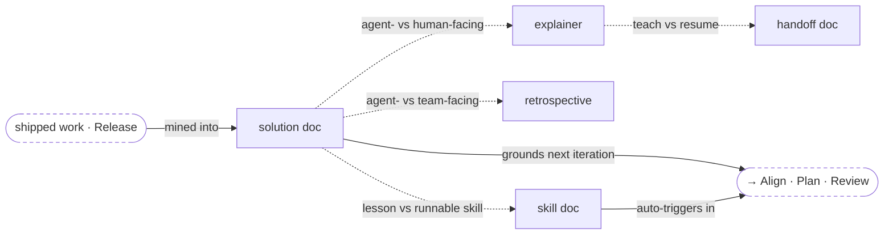

# Artifacts

*Index — lifecycle flow + counterpart map.*

The concrete **outputs** capabilities produce, one page per artifact. Each artifact is `produces:`-linked from the capabilities that write it (see [CONVENTIONS.md](../CONVENTIONS.md)) and carries its own `See Also` cross-links. This index projects those links two ways: a whole-lifecycle **flow overview** showing how one artifact leads to the next across the eight [SDLC stages](../sdlc-stage/index.md), then a **stage-by-stage detail** section that zooms into each stage with the layout that best fits its artifacts. The lifecycle is a loop, not a line — the Learn-stage artifacts feed back into the front of the next iteration.

## Lifecycle flow — how artifacts lead to one another

Solid arrows are the **production chain** (`X leads to / feeds / gates Y`); dotted arrows are the **loop-back** (`Learn output grounds the next iteration`). Nodes are grouped by the stage that produces them; the stage order runs top to bottom.

## Stage-by-stage detail

The overview above compresses everything into one loop. Below, each stage gets its own diagram laid out in the shape that fits its artifacts — a hub where several documents are variants of one canonical spec, a pipeline where research feeds design feeds tasks, a fan-in where three reports converge on a go/no-go. Solid arrows are `produces` / `feeds` / `gates`; dotted arrows are `counterpart` / `variant` resemblances. **Dashed rounded nodes** are boundary artifacts owned by an adjacent stage, shown only to place the stage in context.

### 1 · [Align](../sdlc-stage/stage-align.md) — *what to build and why*

Two standing anchors that persist across iterations, and four decision/scope docs that feed the spec and plan. The GSD and Matt Pocock frameworks both write a `CONTEXT.md`, but they are different artifacts — the dotted edge flags the clash.

### 2 · [Specify](../sdlc-stage/stage-specify.md) — *the written contract*

A hub: five frameworks write the same slot as slightly different documents, all variants of one canonical `spec`. OpenSpec is the outlier — it splits the spec into a `proposal` (why/what) plus a behavioral `spec delta`.

### 3 · [Plan](../sdlc-stage/stage-plan.md) — *research, design, decompose*

A pipeline from investigation to executable units. Research and architecture feed the design; the design derives the task list; the task list becomes issues or context-rich stories that implementation consumes.

### 4 · [Implement](../sdlc-stage/stage-implement.md) — *write the code*

Disposable UI mockups converge with the plan/story into the one durable output of this stage: an atomic commit per completed task, which then flows into validation and release.

### 5 · [Validate](../sdlc-stage/stage-validate.md) — *does it work?*

A single functional gate with a repair loop: UAT diagnoses gaps, the gaps become fix plans that re-enter implementation, and only a pass releases the change.

### 6 · [Review](../sdlc-stage/stage-review.md) — *is it good?*

A fan-in: three sibling assessment reports run in parallel over the change and converge into the release go/no-go decision.

### 7 · [Release](../sdlc-stage/stage-release.md) — *deliver it*

Commits, UAT pass, and the review reports converge on the pull request and launch checklist; shipping produces the changelog and the how-to-use documentation, then hands off to Learn.

### 8 · [Learn](../sdlc-stage/stage-learn.md) — *harvest reusable lessons*

A hub around the agent-facing solution doc, with human-facing siblings, that closes the loop: its outputs ground the next iteration's Align, Plan, and Review.

## All artifacts by stage

| Stage | Artifact | Framework(s) | What it is |
|-------|----------|--------------|------------|
| Align | [[artifact-strategy-md\|STRATEGY.md]] | Compound Engineering | Standing product/engineering strategy that grounds ideation, brainstorm, and plan. |
| Align | [[artifact-constitution\|constitution]] | Spec Kit | Immutable project-wide governing principles that later phases are mechanically gated against. |
| Align | [[artifact-product-brief\|product brief]] | BMAD | Pre-PRD scoping doc (problem/audience/boundaries); variants PRFAQ and forged-idea. |
| Align | [[artifact-brainstorm-md\|brainstorm doc]] | Compound Engineering | Requirements-only unified plan (WHAT, not HOW) from a collaborative Q&A dialogue. |
| Align | [[artifact-phase-context\|CONTEXT.md (phase)]] | GSD | Locked decisions and scope guidance for a phase; feeds planning. |
| Align | [[artifact-domain-model\|domain model]] | Matt Pocock | Shared-language glossary (`CONTEXT.md`) mapping jargon to precise concepts. |
| Specify | [[artifact-spec-md\|SPEC.md / spec.md]] | Addy · Spec Kit · BMAD · MP | The durable written spec the lifecycle plans and builds against. |
| Specify | [[artifact-prd\|PRD]] | BMAD · Builder Methods | Fuller product-requirements document; intent and scope before issues/stories are cut. |
| Specify | [[artifact-proposal-md\|proposal.md]] | OpenSpec | The why/what + scope rationale layer, first in a change's dependency chain. |
| Specify | [[artifact-spec-delta\|spec delta]] | OpenSpec | ADDED/MODIFIED/REMOVED requirements against a living spec (brownfield-first). |
| Specify | [[artifact-checklist\|quality checklist]] | Spec Kit | Generated "unit tests for your English" — a spec-quality gate. |
| Specify | [[artifact-nano-spec-pack\|nano-spec pack]] | nano-spec | Four tiny files (README/todo/doc/log) per task — the minimalist spec form. |
| Plan | [[artifact-research-md\|RESEARCH.md]] | GSD · Spec Kit · BMAD · MP | Domain/technology research that informs the design and plan. |
| Plan | [[artifact-architecture\|architecture spine]] | BMAD | Lean invariants-only system-architecture contract. |
| Plan | [[artifact-design-md\|design.md]] | OpenSpec · Spec Kit · BMAD · BM | The technical/UX *how* — approach, decisions, data flow — kept separate from behavior. |
| Plan | [[artifact-adr\|ADR]] | MP · Addy · nano-spec | Per-decision architecture record: options · chosen · rationale. |
| Plan | [[artifact-plan-md\|PLAN.md / tasks.md]] | GSD · Addy · OpenSpec · Spec Kit · CE · BM · nano-spec | The executable task list / checklist derived from the spec and design. |
| Plan | [[artifact-issue\|tracker issue]] | MP · Spec Kit | A tracker issue materialised from a plan (decomposed or exported). |
| Plan | [[artifact-story\|story]] | BMAD | Context-rich story file: an issue with all implementation context inlined. |
| Implement | [[artifact-design-mockup\|design mockup]] | gstack | Disposable AI-generated UI variants on a comparison board with taste memory. |
| Implement | [[artifact-atomic-commit\|atomic commit]] | GSD · Addy · BMAD · CE | One atomic git commit per completed task. |
| Validate | [[artifact-uat-md\|UAT.md]] | GSD | User-acceptance-testing results + diagnosed gaps and fix plans. |
| Review | [[artifact-review-report\|code review report]] | Addy · BMAD · CE · gstack · MP | Structured five-axis review with severity labels and fix recommendations. |
| Review | [[artifact-security-audit\|security audit]] | Addy · CE · gstack | OWASP Top 10 vulnerability + threat-model assessment. |
| Review | [[artifact-perf-audit\|perf audit]] | Addy · CE · gstack | Core Web Vitals performance scorecard (Quick source scan / Deep measured). |
| Release | [[artifact-pull-request\|pull request]] | GSD · CE · gstack | The PR that aggregates a phase's commits at ship time. |
| Release | [[artifact-changelog\|changelog + tag]] | Addy · gstack | Human-readable release record + semver bump and git tag. |
| Release | [[artifact-launch-checklist\|launch checklist]] | Addy · CE | Pre-launch go/no-go gate: checks, flags, rollout, rollback, monitoring. |
| Release | [[artifact-diataxis-docs\|Diataxis docs]] | gstack | Docs organized by the four Diataxis quadrants, tracked against a coverage map. |
| Learn | [[artifact-solution-doc\|solution doc]] | Compound Engineering | Machine-consumable reusable lesson future agents pull in automatically. |
| Learn | [[artifact-explainer\|explainer]] | Compound Engineering | Dense visual explainer — the human-facing learning counterpart. |
| Learn | [[artifact-retrospective\|retrospective]] | gstack · BMAD | Human/team-facing learning report: what went well/badly, action items. |
| Learn | [[artifact-skill-doc\|skill doc]] | Superpowers · gstack | Executable process knowledge (`SKILL.md`) that grows the capability library. |
| Learn | [[artifact-handoff-doc\|handoff doc]] | Matt Pocock | Compacted conversation summary so a fresh session can resume without re-deriving context. |

## See also

- [SDLC Stages — Index](../sdlc-stage/index.md) — the eight-stage lifecycle these artifacts flow through.
- [CONVENTIONS.md](../CONVENTIONS.md) — the ontology: how `produces:` links capabilities to these artifacts.
- [Knowledge Base Index](../index.md) — all five namespaces.
