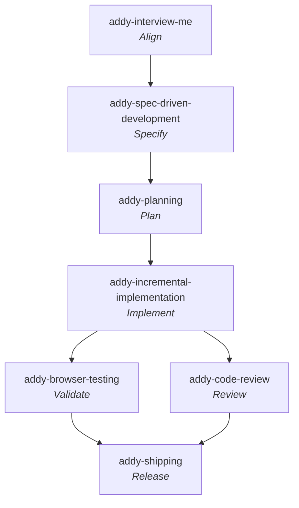

# Addy Osmani — Agent Skills

**Workflow** — the primary skill per [SDLC stage](../sdlc-stage/index.md) this framework runs, top to bottom (folded and off-stage steps omitted). Validate and Review are sibling gates that both run after Implement.

**Production-grade engineering skills for AI coding agents** by **Addy Osmani** — a pack of 24 skills, 4 review personas, and 8 slash commands that encode the workflows and quality gates senior engineers use, organized around the **whole product lifecycle**. MIT-licensed; distributed as a Claude Code plugin and portable across Cursor, Gemini CLI, Antigravity, OpenCode, Windsurf, Copilot, Kiro, and Codex.

- **Install (Claude Code):** `/plugin marketplace add addyosmani/agent-skills` then `/plugin install agent-skills@addy-agent-skills`.
- **Design thesis:** agents default to the shortest path (skipping specs, tests, security) — skills impose senior-engineering discipline. Bakes in *Software Engineering at Google* concepts: Hyrum's Law, the Beyoncé Rule, the test pyramid, change sizing, review-speed norms, Chesterton's Fence, trunk-based development, Shift Left, code-as-liability.

Where [[gsd]] is a single end-to-end workflow engine and [[matt-pocock-skills]] is a loose personal toolkit, Agent Skills is a **lifecycle-complete, phase-structured** pack: slash commands map 1:1 to six phases, a meta-skill ([[addy-using-agent-skills]]) routes work to the right skill, and every skill carries an **anti-rationalization** table and **Red Flags** ([[pattern-anti-rationalization]]). It is the broadest framework in this wiki — the first to give the [[stage-release]] stage substantial multi-capability evidence.

## Distinctive mechanisms

- **Anti-rationalization + Red Flags in every skill** — [[pattern-anti-rationalization]] tables of excuses agents use to skip steps, each rebutted, plus warning signs.
- **Review personas with parallel fan-out** — [[addy-shipping]] (`/ship`) fans out [[addy-code-reviewer]], [[addy-security-auditor]], [[addy-test-engineer]] concurrently, then merges a go/no-go ([[pattern-parallel-persona-review]]). Personas never invoke personas.
- **Verification is non-negotiable** — every skill ends with evidence requirements (tests passing, build output, runtime data); "seems right" is never sufficient.
- **Progressive disclosure** — `SKILL.md` is the entry point; reference checklists load only when needed.
- **Human checkpoint at each phase** — commands stop between phases (except `/build auto`, which runs the whole plan in one approved pass, still test-driving and committing each task individually).

## Lifecycle: phase ↔ command ↔ skill ↔ canonical stage

| Phase | Command | Primary skill(s) | Canonical stage |
|-------|---------|------------------|-----------------|
| **Define** | `/spec` | [[addy-interview-me]], [[addy-idea-refine]], [[addy-spec-driven-development]] | [[stage-align]] → [[stage-specify]] |
| **Plan** | `/plan` | [[addy-planning]] | [[stage-plan]] |
| **Build** | `/build` (`/build auto`) | [[addy-incremental-implementation]] + [[addy-tdd]] | [[stage-implement]] |
| **Verify** | `/test` | [[addy-tdd]], [[addy-browser-testing]], [[addy-debugging]] | [[stage-implement]] / [[stage-validate]] |
| **Review** | `/review`, `/code-simplify`, `/webperf` | [[addy-code-review]], [[addy-code-simplification]], [[addy-security]], [[addy-performance]] | [[stage-review]] |
| **Ship** | `/ship` | [[addy-shipping]] + fan-out personas | [[stage-release]] |

> **Note on Verify vs Review.** Addy was the first framework to cleanly separate *does it work* (Verify — testing, debugging) from *is it good* (Review — code review, security, performance, simplification). This partition — confirmed by gstack as a second framework (2026-07-05) — **promoted [[stage-review]] out of [[stage-validate]]**: Addy's Review phase (plus its `/ship` persona fan-out) implements [[stage-review]]; its Verify capability [[addy-browser-testing]] stays in [[stage-validate]].

## Capabilities

### Skills — Define (align → specify)

- [[addy-interview-me]] — one-question-at-a-time interview to ~95% confidence in intent.
- [[addy-idea-refine]] — divergent/convergent thinking turning vague ideas into proposals.
- [[addy-spec-driven-development]] — write a PRD/SPEC.md before any code.

### Skills — Plan

- [[addy-planning]] — decompose specs into small, verifiable, dependency-ordered tasks.

### Skills — Build

- [[addy-incremental-implementation]] — thin vertical slices: implement, test, verify, commit.
- [[addy-tdd]] — Red-Green-Refactor; test pyramid; Prove-It for bugs.
- [[addy-context-engineering]] — feed agents the right context at the right time.
- [[addy-source-driven-development]] — ground decisions in cited official documentation.
- [[addy-doubt-driven-development]] — adversarial fresh-context review of in-flight decisions.
- [[addy-frontend-ui]] — production-quality UI; design systems; WCAG 2.1 AA accessibility.
- [[addy-api-design]] — contract-first interfaces; Hyrum's Law; One-Version Rule.

### Skills — Verify

- [[addy-browser-testing]] — live runtime data via Chrome DevTools MCP.
- [[addy-debugging]] — five-step triage: reproduce, localize, reduce, fix, guard.

### Skills — Review

- [[addy-code-review]] — five-axis review with severity labels and change sizing.
- [[addy-code-simplification]] — reduce complexity while preserving exact behavior.
- [[addy-security]] — OWASP Top 10 prevention; auth; secrets; dependency auditing.
- [[addy-performance]] — measure-first; Core Web Vitals; profiling; bundle analysis.

### Skills — Ship

- [[addy-git-workflow]] — trunk-based development; atomic commits; semver; changelogs.
- [[addy-ci-cd]] — Shift Left; feature flags; quality-gate pipelines.
- [[addy-deprecation]] — code-as-liability; compulsory vs advisory deprecation; zombie-code removal.
- [[addy-documentation]] — ADRs, API docs, inline docs — document the *why*.
- [[addy-observability]] — structured logging; RED metrics; OpenTelemetry; symptom-based alerting.
- [[addy-shipping]] — pre-launch checklists; staged rollouts; rollback; the `/ship` fan-out.

### Skills — Meta

- [[addy-using-agent-skills]] — routes incoming work to the right skill; shared operating rules.

### Agent personas (sub-agents)

- [[addy-code-reviewer]] — Senior Staff Engineer; five-axis review before merge.
- [[addy-test-engineer]] — QA specialist; test strategy, coverage analysis, Prove-It.
- [[addy-security-auditor]] — Security engineer; vulnerability detection, threat modeling, OWASP.
- [[addy-web-performance-auditor]] — Web performance engineer; Core Web Vitals; Quick/Deep modes; run via `/webperf`.

### Commands (thin phase entrypoints, catalogued here)

Each command invokes the skill(s) above and is documented in the phase table; they carry no independent workflow beyond skill activation, so they are not given separate capability pages.

- `/spec`, `/plan`, `/build` (+ `auto`), `/test`, `/review`, `/code-simplify`, `/webperf`, `/ship`.

### Reference checklists (bundled, pulled in on demand)

- `definition-of-done.md`, `testing-patterns.md`, `security-checklist.md`, `performance-checklist.md`, `accessibility-checklist.md`, `observability-checklist.md`, `orchestration-patterns.md`.

## Artifacts produced

- [[artifact-spec-md]] — `SPEC.md` from [[addy-spec-driven-development]] (Addy's counterpart to MP's [[artifact-prd]]).
- [[artifact-plan-md]] — `tasks/plan.md` + `tasks/todo.md` from [[addy-planning]].
- [[artifact-atomic-commit]] — one commit per slice, from [[addy-incremental-implementation]] / [[addy-git-workflow]].
- [[artifact-review-report]] — five-axis review from [[addy-code-review]] / [[addy-code-reviewer]].
- [[artifact-security-audit]] — from [[addy-security]] / [[addy-security-auditor]].
- [[artifact-perf-audit]] — Core Web Vitals scorecard from [[addy-performance]] / [[addy-web-performance-auditor]].
- [[artifact-changelog]] — from [[addy-git-workflow]].
- [[artifact-adr]] — from [[addy-documentation]] (shared artifact type with MP).
- [[artifact-launch-checklist]] — pre-launch checklist + rollback plan from [[addy-shipping]].

## Patterns applied

- [[pattern-anti-rationalization]] — excuse/rebuttal tables across every skill (Addy's signature mechanism).
- [[pattern-adversarial-review]] — fresh-context doubt loop ([[addy-doubt-driven-development]]).
- [[pattern-source-grounding]] — cite official docs, flag the unverified ([[addy-source-driven-development]]).
- [[pattern-context-engineering]] — right context at the right time ([[addy-context-engineering]]).
- [[pattern-contract-first]] — design the interface before the implementation ([[addy-api-design]]).
- [[pattern-measure-first]] — profile before optimizing ([[addy-performance]]).
- [[pattern-trunk-based-development]] — short-lived branches, atomic commits ([[addy-git-workflow]], [[addy-ci-cd]]).
- [[pattern-shift-left]] — move quality gates earlier ([[addy-ci-cd]]).
- [[pattern-feature-flags]] — decouple deploy from release ([[addy-incremental-implementation]], [[addy-ci-cd]], [[addy-shipping]]).
- [[pattern-parallel-persona-review]] — concurrent specialist review fan-out ([[addy-shipping]]).
- Shared with other frameworks: [[pattern-grilling]], [[pattern-spec-driven-development]], [[pattern-vertical-slice]], [[pattern-test-driven-development]], [[pattern-systematic-debugging]], [[pattern-fresh-context-subagents]], [[pattern-deep-modules]].

## See Also

- [[gsd]] — end-to-end workflow engine; Addy's [[addy-shipping]] ↔ [[gsd-ship]], and both share [[pattern-vertical-slice]], [[pattern-test-driven-development]], [[pattern-grilling]], [[pattern-systematic-debugging]], [[pattern-fresh-context-subagents]].
- [[matt-pocock-skills]] — personal toolkit; Addy's docs explicitly compare the two. Shared clusters: [[addy-interview-me]] ↔ [[mp-grill-me]], [[addy-spec-driven-development]] ↔ [[mp-to-spec]], [[addy-tdd]] ↔ [[mp-tdd]], [[addy-debugging]] ↔ [[mp-diagnosing-bugs]], [[addy-api-design]] ↔ [[mp-codebase-design]].
- Addy's `docs/comparison.md` maps agent-skills vs **Superpowers** (obra) vs Matt Pocock — the three share DNA; agent-skills optimizes for broad disciplined validation across the full lifecycle, Superpowers for heavy upfront reasoning + autonomy, MP for a sharp daily loop. Superpowers is a candidate fourth-framework ingest.
- [[openspec]] — spec-first framework; [[addy-spec-driven-development]] ↔ [[openspec-propose]] in the [[stage-specify]] cluster (both write the spec before code), [[addy-incremental-implementation]] ↔ [[openspec-apply]], [[addy-shipping]] ↔ [[openspec-archive]]. Addy covers the release/ops surface (CI/CD, observability, deprecation) OpenSpec omits; OpenSpec contributes the [[pattern-living-specification]] Addy lacks.
- [[bmad]] — the other breadth leader; both use named review/role personas and fresh-context subagents. Shared clusters: [[addy-spec-driven-development]] ↔ [[bmad-prd]], [[addy-incremental-implementation]] ↔ [[bmad-dev-story]], [[addy-code-review]] ↔ [[bmad-code-review]], and Addy's [[pattern-parallel-persona-review]] `/ship` fan-out ↔ BMAD's Party-Mode / code-review layers. Addy carries release/ops; BMAD carries the deeper analysis/planning front-end and the [[pattern-persona-agents]] cast.
- [[compound-engineering]] — Every's compounding loop; the closest peer on breadth. Direct clusters: [[addy-code-simplification]] ↔ [[ce-simplify-code]], [[addy-code-review]] ↔ [[ce-code-review]], [[addy-performance]] ↔ [[ce-optimize]], [[addy-browser-testing]] ↔ [[ce-test-browser]]/[[ce-dogfood]], [[addy-debugging]] ↔ [[ce-debug]], [[addy-git-workflow]] ↔ [[ce-commit]], [[addy-shipping]] ↔ [[ce-commit-push-pr]]; both apply [[pattern-parallel-persona-review]]. CE contributes the [[stage-learn]] stage Addy folds away.
- [[stage-align]] · [[stage-specify]] · [[stage-plan]] · [[stage-implement]] · [[stage-validate]] · [[stage-review]] · [[stage-release]] — the canonical-stage projections this framework's capabilities feed (its Verify∥Review split promoted [[stage-review]]).
