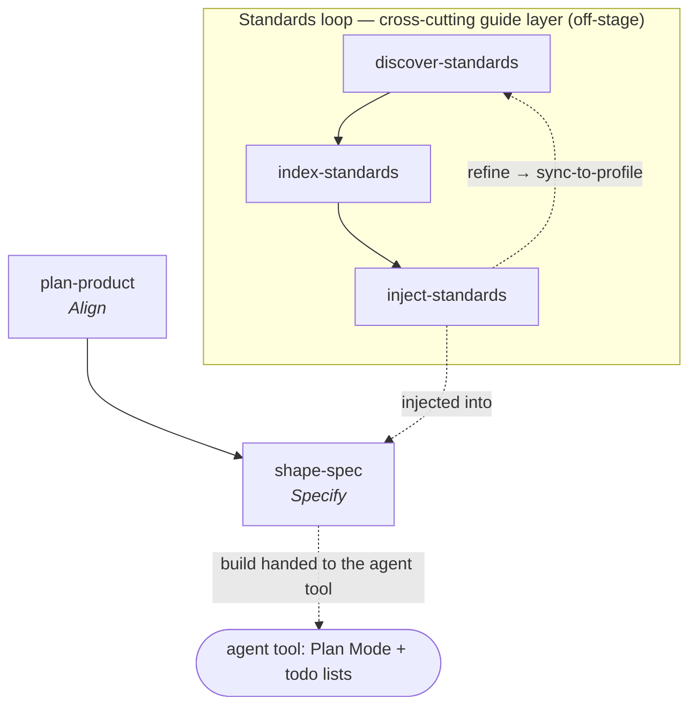

# Agent OS

**Workflow** — the primary command per [SDLC stage](../sdlc-stage/index.md) this framework runs, plus the cross-cutting standards loop that is its real center of gravity. It owns the *front* of the lifecycle and a persistent guide layer; it does **not** implement, review, validate, or ship.

**Agent OS** (Brian Casel / **Builder Methods**, MIT, ~5.2K★) is *"a system for injecting your codebase standards and writing better specs for spec-driven development."* Its tagline is **"Agents that build the way you would."** The problem it names: *"Every time you prompt an AI coding agent, you're re-teaching it context that should already be known."* Like Casel's other project [[bm-skills]] — and like [[nano-spec]] — it is **deliberately not a full-SDLC framework**. It owns a durable *guide layer* (project standards + product docs) and the *front* of the lifecycle (align + specify), and hands **build, review, validate, ship** to the coding agent itself.

This is the wiki's purest instance of the **guide (feedforward) layer** in [[topic-harness-engineering]]: almost the entire framework is machinery for externalizing conventions and feeding the right ones into context at the right moment.

## The v3 refocus (this page documents v3.0.0)

v3.0.0 (2026-01-20) is a **major refocus** — a rare case of a framework deliberately *shrinking*. Earlier versions shipped `create-spec` / `create-tasks` / `execute-tasks` commands and five sub-agents (context-fetcher, file-creator, git-workflow, test-runner, project-manager) that drove implementation. v3 **retired all of that**: *"Claude Code's plan mode, extended thinking, and improved models now handle much of the scaffolding that earlier versions of Agent OS provided."* What remains is the part Casel argues the model still does poorly — capturing an organization's conventions. It is a live illustration of the [[topic-harness-engineering#How they adapt as models improve|"as models improve, the authored layer thins toward the irreducible project-specific kernel"]] thesis: the framework *itself* deleted its derivable scaffolding and kept only the non-derivable guide layer.

## The three-layer context model

All plain Markdown/YAML in a project-local `agent-os/` folder:

- **Standards** (`agent-os/standards/`) — declarative conventions, one file per rule, nested by domain (`api/response-format.md`, `database/migrations.md`), with an [[artifact-standards|index.yml]] matcher. *"They describe patterns and rules … without prescribing procedures."* The defining artifact. → [[artifact-standards]]
- **Product** (`agent-os/product/`) — `mission.md` + `roadmap.md` + `tech-stack.md`; the durable product-direction context. → [[artifact-product-docs]]
- **Specs** (`agent-os/specs/YYYY-MM-DD-HHMM-{slug}/`) — a timestamped pack (`plan.md`, `shape.md`, `standards.md`, `references.md`, `visuals/`) that persists beyond the conversation. → [[artifact-spec-md]]

## Capabilities

Agent OS v3 ships **five slash-commands and no sub-agents** (*"you can create your own"*). One page each for full coverage:

**Standards loop (cross-cutting guide layer — no single canonical stage):**

- [[agent-os-discover-standards]] — extract tribal knowledge from the codebase into concise standards, one "why"-interrogated file at a time.
- [[agent-os-index-standards]] — maintain `index.yml` (standard → one-sentence description), the token-efficient matcher.
- [[agent-os-inject-standards]] — deploy the relevant standards into the current context (auto-suggest or explicit); the purest [[pattern-context-engineering|right-context-right-time]] capability in the wiki.

**Lifecycle front:**

- [[agent-os-plan-product]] — establish `mission`/`roadmap`/`tech-stack` via a one-question-at-a-time interview → [[stage-align]].
- [[agent-os-shape-spec]] — shape a spec in Plan Mode into a persistent timestamped pack; the **ninth** member of the cross-framework specify cluster → [[stage-specify]].

## Distinctive contributions

- **Standards as a first-class, token-budgeted artifact.** The `index.yml` matcher loads only relevant standards by one-line description — *"Every word costs tokens. Keep them concise."* No other framework here treats externalized conventions as a *matched, injected* resource with an explicit reference-vs-embed payload choice.
- **Standards vs Skills, named explicitly.** *"Standards describe what conventions to follow. Skills describe how to do tasks."* — declarative + explicit-invocation vs procedural + auto-detected; Skills may reference standards. This is the cleanest articulation in the wiki of the guide/skill boundary.
- **Bidirectional profile sync as the refinement loop.** Refine standards in a project, then `sync-to-profile.sh` promotes them to a reusable base profile (with inheritance chains). This is [[pattern-knowledge-compounding]] applied to *standards* — the steering loop of [[topic-harness-engineering]], baked in.
- **Deliberate subtraction.** With [[nano-spec]] and [[bm-skills]], one of three wiki frameworks that consciously refuse to own the whole lifecycle — but the only one whose *primary* value is the persistent convention layer rather than a spec.

## Patterns applied
- [[pattern-context-engineering]] — the organizing principle: inject the right standards at the right moment ([[agent-os-inject-standards]], [[agent-os-index-standards]], [[agent-os-discover-standards]]).
- [[pattern-knowledge-compounding]] — the discover → refine → sync-to-profile loop compounds standards across projects ([[agent-os-discover-standards]]).
- [[pattern-spec-driven-development]] — shape a durable spec before code ([[agent-os-shape-spec]]).
- [[pattern-grilling]] — every command is an AskUserQuestion interview, one question at a time ([[agent-os-plan-product]], [[agent-os-shape-spec]], [[agent-os-discover-standards]]).
- [[pattern-scale-adaptive-planning]] — lightweight-by-default docs; sized to the task ([[agent-os-plan-product]], [[agent-os-shape-spec]]).

## See Also
- [[topic-harness-engineering]] — Agent OS is the flagship guide-layer instance; this topic frames why.
- [[bm-skills]] — Casel's other project; the two share the deliberately-minimal, non-full-SDLC stance.
- [[nano-spec]] — the other subtractive front-of-lifecycle framework; both touch only align/specify substantively.
- [[speckit]] — the maximalist spec-driven pole; Spec Kit's [[artifact-constitution|constitution]] is the *gated* counterpart to Agent OS's *injected, advisory* standards.
- [[pattern-context-engineering]] · [[pattern-knowledge-compounding]] — the two patterns Agent OS most fully embodies.
