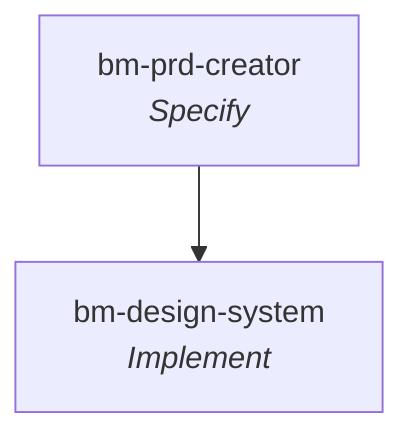

# BM Skills

**Workflow** — the primary skill per [SDLC stage](../sdlc-stage/index.md) this framework runs, top to bottom (folded and off-stage steps omitted). Not a full-SDLC framework — it touches only two stages.

**BM Skills** is Brian Casel's (Builder Methods) open-source **Claude Code plugin marketplace** of small, independent utilities "for builders." Unlike the other entries in this wiki, it is **not a full-SDLC framework** — it makes no attempt to own the process or cover the lifecycle end to end. It is a loose, growing collection of self-contained plugins, each holding one skill for a specific area of work. Install via `/plugin marketplace add buildermethods/bm-skills` then `/plugin install <skill-name>`.

Its defining audience is the **non-technical business builder** driving a coding agent: skills propose sensible defaults and explain technical concepts in plain language, favour tappable `AskUserQuestion` decisions (the user is often on mobile), and lock one decision at a time.

Only one of its three skills maps cleanly onto a canonical SDLC stage — the **PRD Creator**, the reason this repo was ingested. The other two are build-time utilities.

## Capabilities

- [[bm-prd-creator]] — **the focus**: a structured interview that turns a raw idea into a Product Requirements Document (visual HTML / markdown / both) **plus milestone prompt files** to drive a coding agent through implementation. Implements [[stage-specify]]; a member of the cross-framework specify cluster.
- [[bm-design-system]] — scaffold a complete React + Tailwind v4 **design system** into a codebase: a live `/admin/design-system` reference page, shadcn-style components, and `AGENTS.md`/`CLAUDE.md` guardrails so future agents defer to the system instead of drifting ([[stage-implement]]).
- [[bm-favicon-creator]] — generate a full favicon set (`.ico` / `icon.svg` / PNGs / apple-touch) from a Lucide icon or SVG and wire the meta tags into the layout. A pure **asset utility** — no lifecycle stage.

## Distinctive contribution

The **PRD Creator** is a genuinely distinctive member of the [[stage-specify]] cluster: where the other frameworks' spec authors assume a developer audience, this one is built for **non-technical builders** and outputs a **visual, single-file HTML PRD** by default, then decomposes the build into a sequence of **milestone prompt files** (`milestones/N-{slug}/prompt.md`) — a specify-to-plan bridge that hands ready-to-build prompts to a coding agent. It enforces a strict *what-not-how* boundary (the stack and integration providers are named; nothing more specific), scale-adapts interview depth to idea complexity, and runs as a [[pattern-grilling|grilling]] interview.

## Patterns applied
- [[pattern-spec-driven-development]] — the PRD is the written contract built before code ([[bm-prd-creator]]).
- [[pattern-grilling]] — a structured, one-decision-at-a-time interview drives the PRD ([[bm-prd-creator]]).
- [[pattern-scale-adaptive-planning]] — interview depth (and milestone count) adapt to idea complexity ([[bm-prd-creator]]).
- [[pattern-context-engineering]] — `AGENTS.md`/`CLAUDE.md` guardrails make future agents defer to the design system ([[bm-design-system]]).

## See Also
- [[bmad]] — its [[bmad-prd]] is the closest counterpart (a facilitated PRD → [[artifact-prd]]); BM's is aimed at non-technical builders with an HTML output and milestone prompts.
- [[matt-pocock-skills]] — [[mp-to-spec]] is the other conversation-to-spec skill; both are small composable toolkits rather than lifecycle engines.
- [[gstack]] — [[bm-design-system]] parallels [[gstack-design-consultation]] (design-system scaffolding); [[gstack-spec]] is another specify-cluster member.
- [[stage-specify]] — the one canonical stage this collection substantively touches (via [[bm-prd-creator]]).
