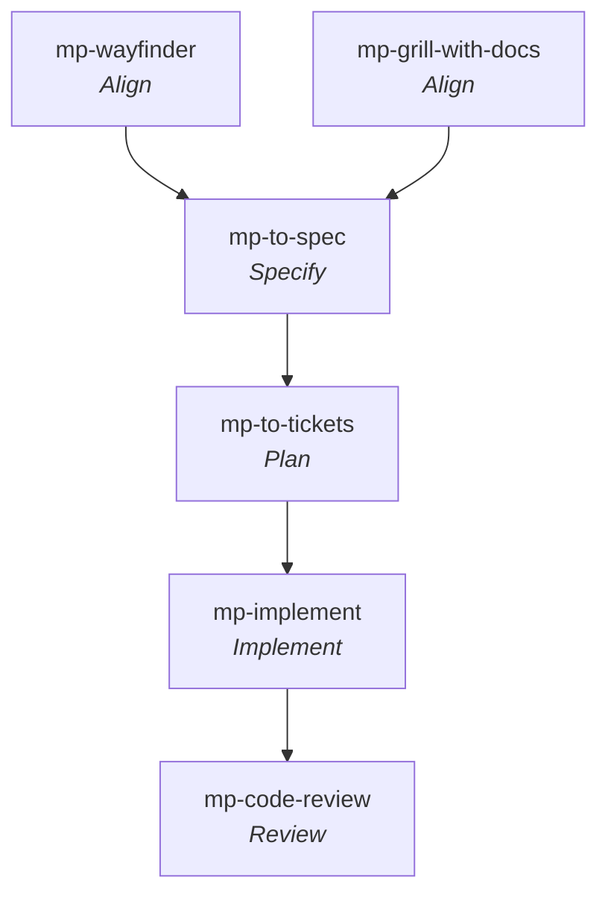

# Matt Pocock — Skills for Real Engineers

**Workflow** — the primary skill per [SDLC stage](../sdlc-stage/index.md) this framework runs, top to bottom (folded and off-stage steps omitted).

A curated set of small, composable agent skills by **Matt Pocock** "for real engineering work — not 'vibe coding'", sourced from his personal `.claude` directory and designed to be adapted ("Hack around with them. Make them your own."). Works with any model and any coding agent. Explicitly positioned *against* owning-the-process frameworks: "Approaches like GSD, BMAD, and Spec-Kit try to help by owning the process. But while doing so, they take away your control and make bugs in the process hard to resolve." These skills stay small and composable instead.

- **Install:** `npx skills@latest add mattpocock/skills`
- **Configure:** `/setup-matt-pocock-skills` (issue tracker — GitHub/Linear/local files, triage labels, doc paths).

Unlike [[gsd]] — a single end-to-end workflow engine — this is a **loose toolkit of independent skills**, each **user-invoked** (typed as a slash command; orchestrates) or **model-invoked** (typed *or* auto-reached-for by the agent; holds reusable discipline). A user-invoked skill may invoke model-invoked ones, never another user-invoked one.

> **Updated to v1.1 (2026-07-09).** The repo grew to ~38 skills across `engineering/`, `productivity/`, `misc/`, and new `deprecated/`, `in-progress/`, and `personal/` folders. Headline changes since the 2026-06-28 ingest: a first-class [[mp-implement]] execute skill; [[mp-code-review]] (two-axis Standards∥Spec, graduated from in-progress); [[mp-research]] (background primary-source research); [[mp-wayfinder]] (plan work too big for one session); [[mp-resolving-merge-conflicts]]; `to-prd`→[[mp-to-spec]] and `to-plan`+`to-issues`→[[mp-to-tickets]]; [[mp-tdd]] reshaped to red→green (refactoring moved to [[mp-code-review]]); [[mp-prototype]] now model-invoked; and four deprecations (see below).

## The main flow (via [[mp-ask-matt]])

The router [[mp-ask-matt]] frames the skills as **flows**. The main flow — *idea → ship*:

> [[mp-grill-with-docs]] → *(prototype detour bridged by [[mp-handoff]] when a question needs a runnable answer: [[mp-prototype]])* → [[mp-to-spec]] → [[mp-to-tickets]] → [[mp-implement]] *(per ticket, clearing context between each)* → [[mp-code-review]]

Two **on-ramps** merge onto it: [[mp-wayfinder]] (an effort too big for one session) and [[mp-diagnosing-bugs]] (the "something's broken" entry). A **vocabulary layer** runs underneath ([[mp-domain-modeling]], [[mp-codebase-design]]), and [[mp-triage]] feeds the front of the flow with agent-ready work.

## Four failure modes addressed

- **Didn't do what I want** — close the user↔agent gap with a grilling session. → [[mp-grill-me]], [[mp-grill-with-docs]].
- **Too verbose** — establish shared domain language (`CONTEXT.md`). → [[mp-grill-with-docs]], [[mp-domain-modeling]].
- **Code doesn't work** — add real feedback loops (types, tests, debugging). → [[mp-tdd]], [[mp-diagnosing-bugs]].
- **Ball of mud** — daily design investment. → [[mp-to-spec]] (quizzes which modules you touch before speccing), [[mp-codebase-design]], [[mp-improve-codebase-architecture]].

## Capabilities

### Skills — align / elicitation & intake
- [[mp-grill-me]] — comprehensive interview on plans/designs until decisions resolve.
- [[mp-grilling]] — the reusable interview loop underneath the grill skills (v1.1: confirmation gate + facts-vs-decisions).
- [[mp-grill-with-docs]] — grilling that also builds a domain model + ADRs.
- [[mp-triage]] — move issues/PRs through a triage state machine → agent-ready briefs (intake).
- [[mp-wayfinder]] — map an oversized effort as a shared **investigation-ticket map** on the tracker, resolving *decisions* until the destination is clear (situational on-ramp; upstream of the spec).

### Skills — specify
- [[mp-to-spec]] — synthesize the conversation into a **spec** (formerly `to-prd`) on the issue tracker; sketches testing seams; no interview.

### Skills — plan (decompose, design, research)
- [[mp-to-tickets]] — break a plan/spec into **tracer-bullet tickets** with blocking edges (formerly `to-issues`+`to-plan`); handles wide refactors via expand–contract.
- [[mp-research]] — background agent investigating **primary sources** → cited Markdown ([[artifact-research-md]]).
- [[mp-domain-modeling]] — build/sharpen the project domain model + ubiquitous language (v1.1: absorbed the deprecated `ubiquitous-language`).
- [[mp-codebase-design]] — shared vocabulary for designing **deep modules** at clean seams.

### Skills — implement (build, fix, integrate)
- [[mp-implement]] — **build the work from a spec/tickets** (v1.1, new); drives [[mp-tdd]] at seams, closes with [[mp-code-review]], commits.
- [[mp-tdd]] — test-first **red → green** loop (v1.1: refactor moved to [[mp-code-review]]; "seam" leading word).
- [[mp-prototype]] — throwaway prototypes for a design question (v1.1: now model-invoked).
- [[mp-diagnosing-bugs]] — reproduce → minimize → hypothesize → instrument → fix → regression-test.
- [[mp-resolving-merge-conflicts]] — resolve an in-progress merge/rebase from each side's primary-source intent (v1.1, new).

### Skills — review (quality gate)
- [[mp-code-review]] — **two-axis** diff review, Standards (+ Fowler smell baseline) ∥ Spec, parallel sub-agents (v1.1, graduated from `in-progress`).
- [[mp-improve-codebase-architecture]] — scan for deepening opportunities; visual HTML report, then grill the one you pick.

### Skills — cross-cutting
- [[mp-handoff]] — compact a conversation into a handoff document for agent transitions.
- [[mp-ask-matt]] — router over the skills; describes the flows above.

### Catalogued (non-lifecycle infra / tooling — not paged)
- **setup-matt-pocock-skills** — configure issue tracker, triage labels, doc paths (run once per repo).
- **git-guardrails-claude-code** — block dangerous git commands via pre-execution hooks (an [[pattern-edit-guardrails]] relative).
- **setup-pre-commit** — Husky hooks: lint-staged, Prettier, type-check, tests.
- **migrate-to-shoehorn** — migrate `as` test assertions to @total-typescript/shoehorn.
- **scaffold-exercises** — generate exercise directory structures.
- **teach** — multi-session teaching workspace (productivity).
- **writing-great-skills** — reference for authoring skills well (productivity).

### Deprecated (v1.1 — retired, folded elsewhere)
- **ubiquitous-language** — DDD glossary; folded into [[mp-domain-modeling]].
- **design-an-interface** — "design it twice" parallel interface variations; folded into design/prototype skills.
- **qa** — conversational bug-filing session.
- **request-refactor-plan** — refactor-RFC interview.

### In-progress / personal (experimental or non-SDLC — not paged)
- `in-progress/`: **claude-handoff**, **loop-me**, **wizard**, **writing-beats**, **writing-fragments**, **writing-shape**.
- `personal/`: **edit-article**, **obsidian-vault**.

## Artifacts produced
- [[artifact-spec-md]] — the spec from [[mp-to-spec]] (v1.1: "spec" is now the through-line term; was a PRD → [[artifact-prd]]).
- [[artifact-issue]] — tracer-bullet tickets from [[mp-to-tickets]]; investigation tickets from [[mp-wayfinder]]; agent-ready briefs from [[mp-triage]].
- [[artifact-research-md]] — cited primary-source research file from [[mp-research]].
- [[artifact-review-report]] — two-axis findings from [[mp-code-review]].
- [[artifact-domain-model]] — the `CONTEXT.md` shared-language glossary ([[mp-domain-modeling]] / [[mp-grill-with-docs]]).
- [[artifact-adr]] — Architecture Decision Records, updated inline during grilling/modeling.
- [[artifact-atomic-commit]] — commits from [[mp-implement]] / [[mp-resolving-merge-conflicts]].
- [[artifact-handoff-doc]] — from [[mp-handoff]].

## Patterns applied
- [[pattern-grilling]] — elicitation interview loop (its signature; [[mp-grilling]]).
- [[pattern-spec-driven-development]] — spec-then-tickets flow ([[mp-to-spec]]).
- [[pattern-vertical-slice]] — tracer-bullet, independently-shippable work units ([[mp-to-tickets]]).
- [[pattern-test-driven-development]] — red → green ([[mp-tdd]], driven by [[mp-implement]]).
- [[pattern-systematic-debugging]] — reproduce → minimize → hypothesize → instrument → fix ([[mp-diagnosing-bugs]]).
- [[pattern-deep-modules]] — Ousterhout: rich functionality behind a simple interface ([[mp-codebase-design]], [[mp-improve-codebase-architecture]]).
- [[pattern-parallel-persona-review]] + [[pattern-adversarial-review]] — two-axis parallel sub-agent review with a Fowler smell baseline ([[mp-code-review]]).
- [[pattern-source-grounding]] — cite primary sources ([[mp-research]]).
- [[pattern-fresh-context-subagents]] — background research / per-ticket fresh context ([[mp-research]], [[mp-implement]], [[mp-wayfinder]]).
- [[pattern-scale-adaptive-planning]] — size ceremony to work bigger than one session ([[mp-wayfinder]]).
- [[pattern-throwaway-prototype]] — build to learn, then discard ([[mp-prototype]]).
- [[pattern-session-handoff]] — compact context across agent transitions ([[mp-handoff]]).
- [[pattern-context-engineering]] — the shared-language glossary as curated context ([[mp-domain-modeling]]).
- [[pattern-trunk-based-development]] — keep a shared trunk mergeable ([[mp-resolving-merge-conflicts]]).

## See Also

- [[gsd]] — sibling framework; shares [[pattern-vertical-slice]], [[pattern-test-driven-development]], [[pattern-grilling]], [[pattern-systematic-debugging]], and [[pattern-session-handoff]]; [[mp-research]] ↔ [[gsd-phase-researcher]], [[mp-implement]] ↔ [[gsd-execute-phase]].
- [[addy-agent-skills]] — lifecycle-complete framework by Addy Osmani, whose docs explicitly compare against this toolkit. Shared clusters: [[addy-interview-me]] ↔ [[mp-grill-me]], [[addy-spec-driven-development]] ↔ [[mp-to-spec]] (the pair that promoted [[stage-specify]]), [[addy-tdd]] ↔ [[mp-tdd]], [[addy-debugging]] ↔ [[mp-diagnosing-bugs]], [[addy-api-design]] ↔ [[mp-codebase-design]], [[addy-code-review]] ↔ [[mp-code-review]], [[addy-using-agent-skills]] ↔ [[mp-ask-matt]].
- [[openspec]] — spec-first framework; [[mp-to-spec]] ↔ [[openspec-propose]] in the [[stage-specify]] cluster; [[mp-implement]] ↔ [[openspec-apply]].
- [[compound-engineering]] — Every's compounding loop; [[mp-diagnosing-bugs]] ↔ [[ce-debug]], [[mp-code-review]] ↔ [[ce-code-review]], [[mp-triage]] ↔ [[ce-sweep]] (intake). CE promotes the [[stage-learn]] stage this toolkit still has no capability for.
- [[bmad]] — full-lifecycle persona framework; [[mp-to-spec]] ↔ [[bmad-prd]] (specify), [[mp-to-tickets]] ↔ [[bmad-create-epics-and-stories]] (decompose), [[mp-implement]] ↔ [[bmad-dev-story]] (execute), [[mp-code-review]] ↔ [[bmad-code-review]]. Matt's skills are loose and composable; BMAD binds the same activities to named role personas.
- [[gstack]] — [[mp-code-review]] ↔ [[gstack-review]], [[mp-ask-matt]] ↔ [[gstack-router]], [[mp-implement]]'s execute role parallels gstack's build phase.
- [[stage-align]] · [[stage-specify]] · [[stage-plan]] · [[stage-implement]] · [[stage-review]] — the canonical stages this toolkit's capabilities feed (no functional [[stage-validate]], [[stage-release]], or [[stage-learn]] capability).
