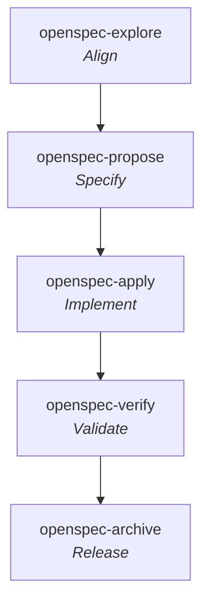

# OpenSpec

**Workflow** — the primary skill per [SDLC stage](../sdlc-stage/index.md) this framework runs, top to bottom (folded and off-stage steps omitted; Plan folds into Specify's `propose`).

**OpenSpec** is "spec-driven development (SDD) for AI coding assistants" by **Fission AI** — a lightweight specification framework that aligns human developers and AI coding assistants on requirements *before* implementation, "without rigid ceremony." Install: `npm install -g @fission-ai/openspec@latest` (Node.js 20.19.0+), then `openspec init`. Works with 30+ AI assistants via slash commands.

Its four principles are the wiki's clearest statement of the spec-driven ethos (see [[pattern-spec-driven-development]]): **fluid not rigid** (no phase gates), **iterative not waterfall**, **easy not complex**, and — distinctively — **brownfield-first** (built for existing codebases, not just greenfield).

## What makes OpenSpec different

Every other framework in this wiki treats the spec/plan as a *per-change* artifact that is written, executed, and then left behind. OpenSpec instead keeps a **living specification** as the durable source of truth and expresses each change as a **delta** against it (see [[pattern-living-specification]]). Two consequences distinguish it:

- **The spec is permanent, the change is temporary.** `openspec/specs/` describes how the system *currently* behaves; a change lives in `openspec/changes/<name>/` only until it is archived, at which point its delta is merged back into the living spec.
- **Its "release" is spec-maintenance, not deployment.** OpenSpec has no deploy / CI / observability capabilities (unlike [[gsd]] or [[addy-agent-skills]]). Its finalization step ([[openspec-sync]] + [[openspec-archive]]) folds the delta into the source-of-truth spec — closing the loop rather than shipping to production.

## The workflow (three phases + finalization)

OpenSpec organizes work around exploration → proposal → implementation, then finalization. Each command `implements:` a canonical SDLC stage:

| Phase | Command | Stage |
|-------|---------|-------|
| Exploration | [[openspec-explore]] | [[stage-align]] |
| Proposal (spec + plan) | [[openspec-propose]] | [[stage-specify]] |
| Implementation | [[openspec-apply]] | [[stage-implement]] |
| Validation | [[openspec-verify]] | [[stage-validate]] |
| Finalization — merge deltas | [[openspec-sync]] | [[stage-release]] |
| Finalization — archive | [[openspec-archive]] | [[stage-release]] |

The proposal step is deliberately *fluid*: `/opsx:propose` generates all four planning artifacts (proposal → specs → design → tasks) in one shot, so a single capability spans both [[stage-specify]] and [[stage-plan]] rather than gating them into separate phases.

## Capabilities

### Commands — core profile (default)

Documented here, one page each:

- [[openspec-explore]] — investigate the codebase and compare approaches before committing.
- [[openspec-propose]] — generate all planning artifacts (proposal, spec deltas, design, tasks) in one step.
- [[openspec-apply]] — implement the tasks checklist, resuming from checkpoints.
- [[openspec-sync]] — merge a change's delta specs into the living main specs.
- [[openspec-archive]] — finalize a completed change; optionally sync, then move it to `archive/`.

### Commands — expanded profile (thin wrappers, catalogued not paged)

Enabled via `openspec config profile` then `openspec update`. These are artifact-generation control variants of `propose`/`archive` plus a tutorial — thin wrappers over the paged capabilities, so they are catalogued here rather than given separate pages:

| Command | Role | Relates to |
|---------|------|-----------|
| `/opsx:new` | Scaffold an empty change folder + metadata, awaiting artifacts | precedes [[openspec-propose]] |
| `/opsx:continue` | Generate the *next* artifact in the dependency chain (incremental) | staged [[openspec-propose]] |
| `/opsx:ff` | Fast-forward: generate *all* planning artifacts in dependency order | batch [[openspec-propose]] |
| `/opsx:verify` | Validate implementation vs artifacts (completeness/correctness/coherence) | paged as [[openspec-verify]] |
| `/opsx:bulk-archive` | Archive several completed changes at once, resolving spec conflicts | batch [[openspec-archive]] |
| `/opsx:onboard` | Interactive 15–30 min guided tutorial on the real codebase | teaches the whole loop |

> `/opsx:verify` ships in the expanded profile but is paged as [[openspec-verify]] because it is the framework's only [[stage-validate]] capability and clusters cross-framework.

The legacy `/openspec:proposal` / `/openspec:apply` / `/openspec:archive` commands are **deprecated** in favour of the `/opsx:` set.

### Terminal CLI (tooling, not lifecycle capabilities)

| Command | Role |
|---------|------|
| `openspec init` | Initialize OpenSpec; create the directory structure |
| `openspec update` | Regenerate skills + command files after config changes |
| `openspec config profile` | Switch command profile (core ↔ expanded) |
| `openspec validate` | Check artifact correctness and consistency |
| `openspec list` | List all changes (active + archived) |
| `openspec show` | Show a change's details and artifacts |
| `openspec diff` | Compare artifact versions / changes |
| `openspec archive` | Terminal-based archival alternative to [[openspec-archive]] |

## Artifacts produced

Organized under `openspec/`, split across the living spec and the per-change folder:

- [[artifact-spec-delta]] — the signature output: ADDED/MODIFIED/REMOVED requirement deltas against the living spec, with Given/When/Then scenarios.
- [[artifact-proposal-md]] — `proposal.md`; the why/what and scope boundaries of a change.
- [[artifact-design-md]] — `design.md`; the technical approach and architecture decisions.
- [[artifact-plan-md]] — `tasks.md`; the hierarchically numbered implementation checklist.

## Patterns applied

- [[pattern-spec-driven-development]] — OpenSpec is the wiki's purest instance of driving agents from explicit specs.
- [[pattern-living-specification]] — its signature: a permanent spec maintained via merged deltas.

## Key features

- **Stores (Beta)** — separate planning repositories shared across teams via Git, for cross-repo feature coordination and centralized requirement ownership.
- **Multi-tool** — 30+ assistants; syntax varies (`/opsx:` for Claude Code / Copilot, `/opsx-` for Cursor / Windsurf, `/skill:openspec-` for Kimi CLI / Trae).

## See Also
- [[compound-engineering]] — Every's compounding loop; [[openspec-apply]] ↔ [[ce-work]], [[openspec-archive]] ↔ [[ce-commit-push-pr]]. OpenSpec's [[pattern-living-specification]] (fold the change into the spec via [[openspec-sync]]) is a *spec-level* cousin of CE's [[pattern-knowledge-compounding]] — noted on the new [[stage-learn]] stage.
- [[stage-align]], [[stage-specify]], [[stage-plan]], [[stage-implement]], [[stage-validate]], [[stage-release]] — the canonical lifecycle this framework implements.
- [[gsd]] — sibling spec-driven framework; [[openspec-apply]] ↔ [[gsd-execute-phase]], [[openspec-verify]] ↔ [[gsd-verify-work]], [[openspec-archive]] ↔ [[gsd-ship]]. GSD carries the deploy/ship side OpenSpec lacks.
- [[addy-agent-skills]] — broadest framework; [[openspec-propose]] ↔ [[addy-spec-driven-development]] (both write the spec before code). Addy covers release/ops that OpenSpec omits.
- [[matt-pocock-skills]] — [[openspec-propose]] ↔ [[mp-to-spec]] in the specify cluster.
- [[bmad]] — full-lifecycle sibling; [[openspec-propose]] ↔ [[bmad-prd]] (specify), [[openspec-apply]] ↔ [[bmad-dev-story]] (execute), [[openspec-explore]] ↔ [[bmad-document-project]] (codebase investigation). OpenSpec maintains a living spec; BMAD front-loads context into per-story files instead.
