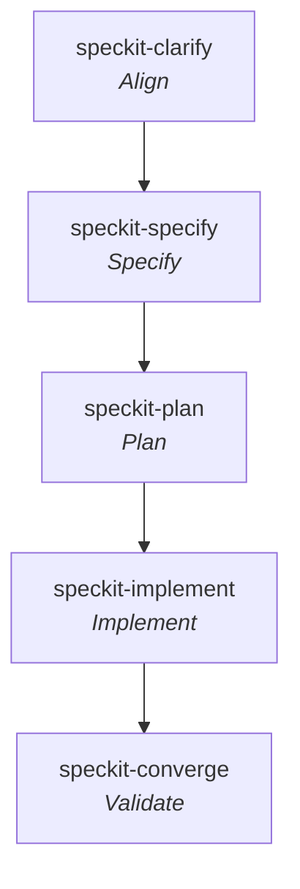

# Spec Kit

**Workflow** — the primary skill per [SDLC stage](../sdlc-stage/index.md) this framework runs, top to bottom (folded and off-stage steps omitted).

**Spec Kit** is **GitHub's** open-source toolkit for **Spec-Driven Development (SDD)** — the methodology that "flips the script on traditional software development" by making specifications *executable* rather than advisory: the spec is the primary artifact, and "code becomes its expression in a particular language and framework." Install via the `specify` CLI (`uv`/`uvx`, Python 3.11+): `specify init my-project --integration copilot`. Works with 30+ AI coding agents ("switch freely between agents… No lock-in"), offline, and cross-platform. It is by far the largest-community framework in this wiki (106K+ stars, 200+ contributors, 105 community extensions).

## What makes Spec Kit different

Spec Kit is the wiki's **most explicit, most tool-heavy instance of spec-driven development** (see [[pattern-spec-driven-development]]) — the reference implementation of the idea the other frameworks share. Two things set it apart:

- **A project constitution as governing law.** Alone among the frameworks here, Spec Kit makes a set of **immutable project-wide principles** (`.specify/memory/constitution.md`) a first-class, up-front artifact that *every* downstream plan and analysis is gated against (see [[pattern-project-constitution]]). Where [[gsd]]/[[matt-pocock-skills]]/[[addy-agent-skills]] embed principles inside individual skills, Spec Kit externalizes them into one versioned document with numbered "articles."
- **A rich packaged ecosystem.** Extensions, presets, and role-based bundles let teams reshape the workflow and enforce org standards — a distribution/customization layer no other framework here ships.

Unlike [[openspec]]'s single **living specification**, Spec Kit keeps a **per-feature spec** under `specs/<feature>/` (regenerated as intent changes) rather than merging change deltas into one durable spec — though its "bidirectional feedback" philosophy (production learnings become new requirements) points at the same evolve-the-spec goal.

## The workflow (Spec → Plan → Tasks → Implement)

Each phase produces a Markdown artifact that feeds the next ("structured context instead of ad-hoc prompts"). Commands are namespaced `/speckit.*`. Each `implements:` a canonical stage:

| Command | Role | Stage |
|---------|------|-------|
| [[speckit-constitution]] | Establish governing principles | [[stage-align]] |
| [[speckit-specify]] | Define WHAT/WHY (spec + user stories) | [[stage-specify]] |
| [[speckit-clarify]] | Interrogate to resolve ambiguity | [[stage-align]] |
| [[speckit-checklist]] | Quality-check requirements | [[stage-specify]] |
| [[speckit-plan]] | Technical plan, design, research | [[stage-plan]] |
| [[speckit-tasks]] | Break plan into an executable task list | [[stage-plan]] |
| [[speckit-analyze]] | Cross-artifact consistency & coverage gate | [[stage-plan]] |
| [[speckit-taskstoissues]] | Export tasks to GitHub issues | [[stage-plan]] |
| [[speckit-implement]] | Execute the tasks (TDD-enforced) | [[stage-implement]] |
| [[speckit-converge]] | Assess codebase vs spec, append remaining work | [[stage-validate]] |

## Capabilities

### Core commands
- [[speckit-constitution]] — create/update the project's immutable governing principles.
- [[speckit-specify]] — define what to build (requirements + user stories) → `spec.md`.
- [[speckit-plan]] — technical implementation plan with a chosen tech stack (+ design, research).
- [[speckit-tasks]] — generate the actionable, parallelizable task list.
- [[speckit-implement]] — execute all tasks to build the feature per the plan.

### Optional commands
- [[speckit-clarify]] — clarify underspecified areas through iterative dialogue.
- [[speckit-analyze]] — cross-artifact consistency & coverage analysis against the constitution.
- [[speckit-checklist]] — generate custom quality checklists ("unit tests for your English").
- [[speckit-converge]] — assess the codebase against spec/plan/tasks and append remaining work.
- [[speckit-taskstoissues]] — convert task lists into GitHub issues for tracking.

## Artifacts produced

- [[artifact-constitution]] — the signature output: `.specify/memory/constitution.md`, immutable governing principles.
- [[artifact-spec-md]] — `specs/<feature>/spec.md`; user stories + acceptance criteria + `[NEEDS CLARIFICATION]` markers.
- [[artifact-design-md]] — `plan.md` + `data-model.md` + `contracts/`; the technical "how".
- [[artifact-research-md]] — `research.md`; technology investigation and options analysis.
- [[artifact-plan-md]] — `tasks.md`; ordered, `[P]`-parallelizable task checklist.
- [[artifact-checklist]] — custom quality checklist validating requirements completeness/clarity/consistency.
- [[artifact-issue]] — GitHub issues exported from `tasks.md` (via [[speckit-taskstoissues]]).

## Patterns applied

- [[pattern-spec-driven-development]] — Spec Kit is the wiki's reference implementation of driving agents from explicit, executable specs.
- [[pattern-project-constitution]] — its signature: immutable project-wide principles that gate every downstream artifact.
- [[pattern-contract-first]] — `contracts/` (API specs) are authored during planning, before implementation.
- [[pattern-plan-verification-loop]] — [[speckit-analyze]] gates the planning artifacts before execution.
- [[pattern-test-driven-development]] — TDD is "NON-NEGOTIABLE" in [[speckit-implement]]: tests fail before code.

## The Specify CLI (tooling, not lifecycle capabilities)

| Command | Role |
|---------|------|
| `specify init` | Bootstrap a project for a chosen agent integration |
| `specify self check / upgrade` | Check and upgrade the toolkit |
| `specify integration list` | List available AI-agent integrations |
| `specify extension search/add` | Install extensions (new commands/capabilities) |
| `specify preset search/add` | Install presets (customize existing workflows) |
| `specify bundle search/install` | Install role-based bundles |

## See Also
- [[compound-engineering]] — Every's compounding loop; [[speckit-plan]]/[[speckit-tasks]] ↔ [[ce-plan]], [[speckit-implement]] ↔ [[ce-work]], [[speckit-analyze]] ↔ [[ce-doc-review]]. SpecKit's [[artifact-constitution]] is the code-governance analogue of CE's product-strategy [[artifact-strategy-md]] (both parked on the `stage-govern` candidate). Like SpecKit, CE's core loop is spec/plan-first; unlike it, CE adds release + the [[stage-learn]] stage.
- [[stage-align]], [[stage-specify]], [[stage-plan]], [[stage-implement]], [[stage-validate]] — the canonical lifecycle this framework implements.
- [[openspec]] — sibling SDD framework; [[speckit-specify]] ↔ [[openspec-propose]], [[speckit-implement]] ↔ [[openspec-apply]]. OpenSpec keeps one *living* spec via deltas; Spec Kit keeps per-feature specs and adds a governing constitution.
- [[gsd]] — [[speckit-plan]] ↔ [[gsd-plan-phase]], [[speckit-analyze]] ↔ [[gsd-plan-checker]], [[speckit-implement]] ↔ [[gsd-execute-phase]].
- [[addy-agent-skills]] — [[speckit-specify]] ↔ [[addy-spec-driven-development]]; both share [[pattern-contract-first]]. Addy carries the release/ops capabilities Spec Kit omits.
- [[matt-pocock-skills]] — [[speckit-specify]] ↔ [[mp-to-spec]] (specify cluster); [[speckit-taskstoissues]] ↔ [[mp-to-tickets]].
- [[bmad]] — full-lifecycle sibling that, like Spec Kit, stops before deploy; [[speckit-analyze]] ↔ [[bmad-check-implementation-readiness]] (plan-verification, now three-framework), [[speckit-specify]] ↔ [[bmad-prd]], [[speckit-implement]] ↔ [[bmad-dev-story]]. Spec Kit governs via a [[artifact-constitution]]; BMAD governs via named personas + `project-context.md`.
