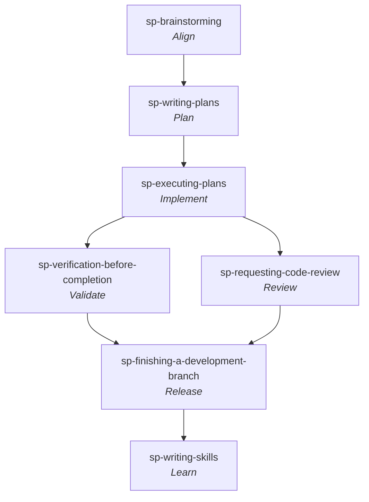

# Superpowers

**Workflow** — the primary skill per [SDLC stage](../sdlc-stage/index.md) this framework runs, top to bottom (folded and off-stage steps omitted). Validate and Review are sibling gates that both run after Implement.

Jesse Vincent's (Prime Radiant) **Superpowers** — *"a complete software development methodology for your coding agents, built on top of a set of composable skills and some initial instructions that make sure your agent uses them."* A deliberately **small** library — **14 skills, no personas, no slash commands** — that nonetheless behaves as an end-to-end methodology because a bootstrap skill ([[sp-using-superpowers]]) makes the rest **trigger automatically**: the agent checks for a relevant skill before *any* action and, if one applies, *must* use it. MIT; v6.1.1.

- **Install (Claude Code):** `/plugin install superpowers@claude-plugins-official` (also on the Superpowers marketplace, `obra/superpowers-marketplace`).
- **Unusually portable.** The same skill set ships to **Claude Code, Antigravity, Codex (App/CLI), Cursor, Factory Droid, GitHub Copilot CLI, Kimi Code, OpenCode, and Pi** — install per harness. Skills carry platform-adaptation refs (`references/codex-tools.md`, `pi-tools.md`, `antigravity-tools.md`) so one library runs across agents.

Unlike role-oriented toolkits ([[bmad]], [[gstack]]) or spec-engine frameworks ([[speckit]], [[openspec]]), Superpowers ships **no personas, no constitution, and no deploy step**. Its identity is **process discipline**: every skill is written as a set of hard rules, Iron Laws, "Red Flags," and excuse→rebuttal tables engineered to stop the agent from rationalizing its way out of the process — [[pattern-anti-rationalization]] taken to its logical extreme (its co-signature alongside [[addy-agent-skills|Addy Osmani's]] skills). Closest sibling here is [[matt-pocock-skills]]: both are small, composable, model-invoked skill libraries by individual authors — but where Matt's toolkit *refuses to own the process*, Superpowers *does* own it, wiring the skills into a mandatory gated pipeline.

## How it works — the mandatory-skill bootstrap

The whole methodology hangs off one rule in [[sp-using-superpowers]], injected at session start (and re-injected after compaction): **if there is even a 1% chance a skill applies, you MUST invoke it — before any response, clarifying question, or file read.** Process skills (brainstorming, systematic-debugging) run first and set the approach; implementation skills follow. This is why a 14-skill library reads as a methodology: the skills are not suggestions the agent might reach for, they are gates it cannot skip.

## The basic workflow (the gated pipeline)

The skills chain into one end-to-end flow, each handing off to the next by name (a `**REQUIRED SUB-SKILL:**` marker, never an `@`-link that would burn context):

> [[sp-brainstorming]] *(refine idea → design doc, HARD-GATE before any code)* → [[sp-using-git-worktrees]] *(isolated workspace + clean baseline)* → [[sp-writing-plans]] *(bite-sized 2-5-min tasks, TDD/YAGNI/DRY, zero placeholders)* → [[sp-subagent-driven-development]] **or** [[sp-executing-plans]] *(implement task-by-task)* → [[sp-test-driven-development]] *(RED-GREEN-REFACTOR per task)* → [[sp-requesting-code-review]] *(dispatch reviewer between tasks)* → [[sp-finishing-a-development-branch]] *(merge / PR / keep / discard)*

Running underneath: [[sp-systematic-debugging]] (the "something's broken" entry), [[sp-verification-before-completion]] (the gate before *any* "done" claim), [[sp-dispatching-parallel-agents]] (fan out on independent problems), [[sp-receiving-code-review]] (how to respond to review), and the meta pair [[sp-using-superpowers]] (the bootstrap) + [[sp-writing-skills]] (grow the library itself).

## Four philosophy pillars

- **Test-Driven Development** — write the test first, always ([[sp-test-driven-development]]).
- **Systematic over ad-hoc** — process over guessing ([[sp-systematic-debugging]]).
- **Complexity reduction** — simplicity as the primary goal (YAGNI throughout planning/TDD).
- **Evidence over claims** — verify before declaring success ([[sp-verification-before-completion]]).

## Capabilities

All 14 are **skills** (`SKILL.md` units, model-invoked once the bootstrap is active); there are no commands or sub-agent personas. Grouped by function:

### Meta / bootstrap
- [[sp-using-superpowers]] — the session-start rule that forces skill invocation before any action; router + anti-rationalization gate. Counterpart to [[addy-using-agent-skills]] / [[gstack-router]] / [[mp-ask-matt]].
- [[sp-writing-skills]] — create/edit skills via **TDD-for-documentation** (baseline a subagent failing, write the skill, watch it comply); grows the library.

### Align
- [[sp-brainstorming]] — Socratic one-question-at-a-time design refinement; proposes 2-3 approaches; presents the design in sections for approval; HARD-GATE before any implementation; writes a design doc.

### Plan
- [[sp-writing-plans]] — turn an approved design into bite-sized (2-5 min) tasks with exact file paths, complete code, interfaces, and verification steps; **no placeholders**; DRY/YAGNI/TDD/frequent commits.

### Implement
- [[sp-subagent-driven-development]] — fresh implementer subagent per task + a two-stage task review (spec compliance ∥ code quality) + a broad final whole-branch review; explicit model selection per role; durable progress ledger.
- [[sp-executing-plans]] — the parallel-session alternative: load plan, execute all tasks with human checkpoints (used when subagents are unavailable).
- [[sp-test-driven-development]] — RED-GREEN-REFACTOR; the Iron Law *"no production code without a failing test first"*; delete code written before its test.
- [[sp-systematic-debugging]] — four-phase root-cause process (investigate → pattern → hypothesis → fix); Iron Law *"no fixes without root-cause investigation"*; question the architecture after 3 failed fixes.
- [[sp-using-git-worktrees]] — ensure an isolated workspace: detect existing isolation, prefer the harness's native worktree tool, fall back to `git worktree`, verify a clean test baseline.
- [[sp-dispatching-parallel-agents]] — one focused subagent per independent problem domain, dispatched concurrently, then integrated.

### Validate
- [[sp-verification-before-completion]] — the Iron Law *"no completion claims without fresh verification evidence"*: run the command, read the output, then claim. Superpowers' signature honesty gate.

### Review
- [[sp-requesting-code-review]] — dispatch a fresh-context code-reviewer subagent, act on findings by severity (Critical/Important/Minor).
- [[sp-receiving-code-review]] — how to *respond* to review: technical evaluation over performative agreement ("You're absolutely right!" is forbidden), verify before implementing, push back with reasoning. **Novel — no other framework here pages the review-reception side.**

### Release
- [[sp-finishing-a-development-branch]] — verify tests, detect the workspace, present exactly four options (merge / PR / keep / discard), execute the choice, clean up the worktree.

## Artifacts produced
- [[artifact-design-md]] — the validated design doc [[sp-brainstorming]] writes to `docs/superpowers/specs/` before planning.
- [[artifact-plan-md]] — the bite-sized implementation plan from [[sp-writing-plans]] (`docs/superpowers/plans/`).
- [[artifact-review-report]] — severity-labelled findings from [[sp-requesting-code-review]]'s reviewer subagent.
- [[artifact-pull-request]] — opened by [[sp-finishing-a-development-branch]] (the PR option).
- [[artifact-atomic-commit]] — one commit per green task in TDD / subagent-driven execution.
- [[artifact-skill-doc]] — a new `SKILL.md` codified by [[sp-writing-skills]].

## Patterns applied
- [[pattern-anti-rationalization]] — its co-signature: Iron Laws + Red Flags + excuse→rebuttal tables in every skill ([[sp-using-superpowers]], [[sp-test-driven-development]], [[sp-verification-before-completion]], [[sp-receiving-code-review]]).
- [[pattern-fresh-context-subagents]] — a fresh subagent per task / problem / review, never inheriting the controller's history ([[sp-subagent-driven-development]], [[sp-dispatching-parallel-agents]], [[sp-requesting-code-review]]).
- [[pattern-test-driven-development]] — the spine: red-green-refactor is mandatory and even applied to *skill authoring* ([[sp-test-driven-development]], [[sp-writing-skills]]).
- [[pattern-systematic-debugging]] — reproduce → root-cause → hypothesize → fix, with an Iron Law ([[sp-systematic-debugging]]).
- [[pattern-worktree-isolation]] — each unit of work in a dedicated worktree ([[sp-using-git-worktrees]]); the filesystem cousin of fresh-context subagents.
- [[pattern-adversarial-review]] — dispatch a reviewer specifically to catch issues; two-stage review in subagent-driven development ([[sp-requesting-code-review]], [[sp-subagent-driven-development]]).
- [[pattern-grilling]] — the Socratic design interview ([[sp-brainstorming]]).
- [[pattern-evidence-before-claims]] — its own signature discipline: prove every status claim with fresh command output ([[sp-verification-before-completion]]).
- [[pattern-knowledge-compounding]] — the library grows itself; a proven technique becomes a permanent skill ([[sp-writing-skills]]); the capability-compounding cousin of [[gstack-skillify]].
- [[pattern-vertical-slice]] — each plan task is the smallest unit that carries its own test cycle ([[sp-writing-plans]]).
- [[pattern-trunk-based-development]] — short-lived branch → merge/PR discipline ([[sp-finishing-a-development-branch]]).

## See Also

- [[matt-pocock-skills]] — closest sibling: a small, composable, individually-authored skill library. Both apply [[pattern-test-driven-development]], [[pattern-systematic-debugging]], [[pattern-grilling]]. The key contrast: Matt's toolkit deliberately *does not own the process*; Superpowers *does*, wiring its skills into a mandatory gated pipeline via [[sp-using-superpowers]]. Clusters: [[sp-test-driven-development]] ↔ [[mp-tdd]], [[sp-systematic-debugging]] ↔ [[mp-diagnosing-bugs]], [[sp-brainstorming]] ↔ [[mp-grill-me]], [[sp-using-superpowers]] ↔ [[mp-ask-matt]], [[sp-requesting-code-review]] ↔ [[mp-code-review]].
- [[addy-agent-skills]] — the other framework whose signature is [[pattern-anti-rationalization]]; lifecycle-complete. Clusters: [[sp-brainstorming]] ↔ [[addy-interview-me]], [[sp-test-driven-development]] ↔ [[addy-tdd]], [[sp-systematic-debugging]] ↔ [[addy-debugging]], [[sp-requesting-code-review]] ↔ [[addy-code-review]], [[sp-using-superpowers]] ↔ [[addy-using-agent-skills]].
- [[gsd]] — a single end-to-end workflow engine (like Superpowers' pipeline) but built from phase commands + sub-agents rather than auto-triggering skills. Clusters: [[sp-subagent-driven-development]] ↔ [[gsd-execute-phase]] (fresh-context executors), [[sp-systematic-debugging]] ↔ [[gsd-debugger]], [[sp-finishing-a-development-branch]] ↔ [[gsd-ship]]. Both fold *specify* into the align→plan transition (no dedicated spec-author capability).
- [[compound-engineering]] — shares [[pattern-worktree-isolation]] ([[sp-using-git-worktrees]] ↔ [[ce-worktree]]) and [[pattern-knowledge-compounding]] ([[sp-writing-skills]] ↔ CE's learning corpus); CE promotes [[stage-learn]], which Superpowers touches only via skill-authoring.
- [[gstack]] — shares [[pattern-anti-rationalization]] and the Iron-Law debugging ([[sp-systematic-debugging]] ↔ [[gstack-investigate]]); [[sp-writing-skills]] ↔ [[gstack-skillify]] (capability compounding); [[sp-using-superpowers]] ↔ [[gstack-router]].
- [[speckit]] · [[openspec]] — spec-engine frameworks; Superpowers has no living spec or constitution, folding design into [[sp-brainstorming]] → [[sp-writing-plans]].
- [[stage-align]] · [[stage-plan]] · [[stage-implement]] · [[stage-validate]] · [[stage-review]] · [[stage-release]] · [[stage-learn]] — the seven canonical stages this framework's capabilities feed (**no [[stage-specify]]** capability — design folds into align→plan, like GSD).
