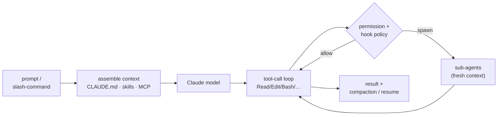

# claude-code

**Harness layer** — the agent *program*, not a process framework and not an execution runtime. A [harness](index.md) loads a framework's skills/commands and drives the model's tool-call loop; it performs no [SDLC stage](../sdlc-stage/index.md) and connects to the ontology only through the execution [[#Patterns provided|primitives]] it provides as `enables:` edges into `pattern`. It sits between the process layer (which `runs_on:` it) and the execution layer (which `runs:` it).

**Claude Code** (Anthropic) is Anthropic's official agentic coding harness. You give it a prompt; it assembles context, calls a Claude model (the Claude 5 family / Opus 4.8 / Haiku 4.5; "Fast mode" gives Opus faster output without downgrading), and runs an agentic loop — reading files, running shell, editing code, executing tests — pausing for approval on sensitive actions. Unlike every `framework` in this wiki, which ships opinions about *what* an agent should do across the lifecycle, Claude Code ships **execution primitives** — a tool-call loop, sub-agent spawning, skills, MCP, hooks, a permission model — that frameworks are built *on top of*. It performs no SDLC stage; it is the substrate GSD, Superpowers, gstack, Compound Engineering, Addy's Agent Skills, BMAD, and SpecKit run inside. It is the wiki's reference **terminal** harness.

## What it provides (primitives, not process)

The harness analogue of a framework's "capabilities" — but these are *execution* affordances, not SDLC work:

- **Tool-call loop** — the core cycle: the model requests tool calls (Read · Edit · Write · Bash · Grep · Glob · web fetch/search), the harness runs them and feeds results back until done.
- **Sub-agents (the Agent / Task tool)** — spawn agents that each run with a *fresh context window* and a scoped toolset, returning only a final result; types defined in `.claude/agents/*.md` or via the SDK. Several launched in one turn run concurrently. The primitive behind every framework's fresh-context / parallel-fan-out skill.
- **Skills** — loadable `SKILL.md` units auto-discovered and description-triggered; how Superpowers et al. are distributed. The loader + auto-trigger is what makes *"1% chance it applies → you must use it"* enforceable.
- **Slash commands** — invocable entrypoints, built-in (`/review`, `/init`, `/compact`, `/memory`, `/config`) and user/project-defined in `.claude/commands/`; how frameworks ship their commands.
- **MCP (Model Context Protocol)** — external tool/resource/prompt servers (local or remote), loadable on demand; the reach into Slack, Linear, Figma, Chrome, databases.
- **Hooks** — shell commands the harness fires at lifecycle events (PreToolUse/PostToolUse/Stop/…) from `settings.json`; can block or modify a tool call. The substrate under guardrail skills.
- **Permissions & plan mode** — permission modes (default / plan / acceptEdits / bypass) + allow/deny/ask rules; plan mode researches and proposes before any edit is allowed.
- **Memory & context files** — `CLAUDE.md` (project + `~/.claude/CLAUDE.md` global) loaded each session; file-based persistent memory + `/memory`; automatic **compaction** carries work across context windows.
- **Extensibility** — plugins & marketplaces package skills/commands/sub-agents/hooks; the **Claude Agent SDK** (TS/Python) builds custom agents on the same primitives (its programmatic orchestration is *runtime-adjacent* — see the boundary test in [CONVENTIONS](../CONVENTIONS.md#the-harness-layer)).

## Interaction surfaces

Terminal CLI / TUI (primary; interactive REPL + headless `-p`), a macOS/Windows **desktop app**, a **web app** (claude.ai/code), and **IDE extensions** (VS Code, JetBrains). Native surface is the terminal — hence `subtype: terminal` — which is what skill/slash-command frameworks target; the IDE and web surfaces are additional, not the primary form.

## Harness profile (the synthesis axis)

The harness layer's analogue of the SDLC-stage synthesis: the dimensions harnesses are compared on are **execution capabilities**, not lifecycle stages. Held as a matrix (see [harness/index.md](index.md)) until the layer grows enough to warrant graduating them into their own nodes.

| Capability | Claude Code |
|---|---|
| Skill / command format | `SKILL.md` skills · `.claude/commands/*` slash-commands · plugins/marketplaces |
| Sub-agents | **first-class** — Agent/Task tool, fresh context per agent, `.claude/agents/*.md`, concurrent |
| MCP | **yes** — local + remote servers, deferred/on-demand tool loading |
| Hooks / extensibility | **yes** — lifecycle hooks in `settings.json`; plugins; Agent SDK |
| Permissions & guardrails | permission modes (default/plan/acceptEdits/bypass) + allow/deny/ask + plan mode |
| Model access | Anthropic Claude models (Opus/Sonnet/Haiku/Fable); Fast mode; per-agent model override |
| Memory & context files | `CLAUDE.md` (project + global) · persistent memory · auto-compaction across windows |
| Interaction surface | terminal (primary) · desktop app · web · VS Code / JetBrains |
| Distribution / license | Anthropic, proprietary (free tier + paid / API billing) |

## Distinctive contribution

Claude Code is the wiki's first **harness-layer** page and its reference **terminal** harness — the node both other layers were already defined against (frameworks called *"cross-harness"*, runtimes *"harness-agnostic"* both meant *"…including Claude Code"*). Its signature primitives are the ones the process layer leans on hardest: **fresh-context sub-agents** (the Agent/Task tool that makes [[pattern-fresh-context-subagents]] a harness capability, not just a framework aspiration), **hooks + permission modes** (the substrate that turns gstack's careful/freeze/guard from prose into enforcement), **skills with description-based auto-trigger** (what lets Superpowers' 14 skills behave as a mandatory gated pipeline), and **compaction + session resume** (context carried across windows without a framework-level handoff doc). It is also the most broadly-targeted harness here — nearly every framework in the wiki runs on it, and both documented runtimes spawn it.

## Patterns provided

The harness supplies these patterns as *primitives* — they exist whether or not a framework's skill asks for them; a capability that `applies:` one is standing on the harness affordance below it:

- [[pattern-fresh-context-subagents]] — the Agent/Task tool spawns a sub-agent with its own clean context window and scoped tools, returning only a result; the harness realization of what GSD/Superpowers/CE instruct at the process level.
- [[pattern-edit-guardrails]] — hooks (PreToolUse can block/modify) + permission modes + deny rules are the mutation-gating substrate under gstack's careful/freeze/guard.
- [[pattern-session-handoff]] — automatic compaction plus `--resume`/session persistence carry working context across a context-window or session boundary at the harness level, below [[mp-handoff]] / [[gstack-context-save]].
- [[pattern-context-engineering]] — `CLAUDE.md` + persistent memory + MCP + description-triggered skill loading are how the right context reaches the model at the right time, the primitive under [[addy-context-engineering]].

## Runs / spawned by (backlinks)

- **Frameworks that `runs_on:` it** — **all twelve** documented frameworks officially support Claude Code: [[gsd]] · [[matt-pocock-skills]] · [[addy-agent-skills]] · [[openspec]] · [[speckit]] · [[bmad]] · [[compound-engineering]] · [[gstack]] · [[bm-skills]] · [[superpowers]] · [[nano-spec]] · [[agent-os]]. It is the universal target of the process layer (see the [framework-support matrix](index.md#framework-support-the-runs_on-inverse)).
- **Runtimes that `runs:` it** — [[sandcastle]] (agent provider) · [[warren]] (harness option) · [[bernstein]] (the `claude` adapter, its top-reasoning default).

## See Also
- [[opencode]] · [[pi]] — the other terminal harnesses: claude-code is the proprietary/Anthropic-models pole, opencode the open/model-agnostic pole, pi the minimal-core pole. Cross-harness comparison: [harness/index.md](index.md).
- [[sandcastle]] · [[warren]] · [[bernstein]] — the execution-layer runtimes that spawn this harness (one layer down).
- [[pattern-fresh-context-subagents]] · [[pattern-edit-guardrails]] · [[pattern-session-handoff]] · [[pattern-context-engineering]] — the patterns this harness provides as primitives.
- [[superpowers]] · [[gstack]] — frameworks whose skills run on this harness.
