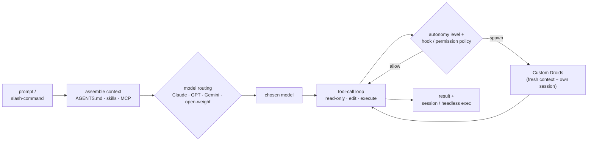

# factory-droid

**Harness layer** — the agent *program*, not a process framework and not an execution runtime. A [harness](index.md) loads a framework's skills/commands and drives the model's tool-call loop; it performs no [SDLC stage](../sdlc-stage/index.md) and connects to the ontology only through the execution [[#Patterns provided|primitives]] it provides as `enables:` edges into `pattern`. It sits between the process layer (which `runs_on:` it) and the execution layer (which `runs:` it).

**Droid** (Factory.ai), a.k.a. the **Droid CLI** or **Factory Droid**, is Factory's terminal-native agentic coding harness. You give it a prompt; it assembles context, routes to a model, and runs an agentic loop — reading files, running shell, editing code, testing, reviewing — under an autonomy/permission policy. Like every harness in this wiki (and unlike a `framework`), it ships **execution primitives** — a tool-call loop, sub-agents, skills, MCP, hooks, plugins, a permission model — that frameworks are built *on top of*; it performs no SDLC stage. Its two distinguishing traits among the terminal harnesses paged here are **multi-model routing** (frontier + open-weight backends, swappable mid-session, plus BYOK) and **Missions** (harness-native multi-agent orchestration).

## What it provides (primitives, not process)

The harness analogue of a framework's "capabilities" — *execution* affordances, not SDLC work:

- **Tool-call loop** — read-only (explore) · edit (generate) · execute (shell) tool categories; `!` toggles a raw bash mode that runs shell without AI interpretation.
- **Sub-agents (Custom Droids)** — reusable subagents defined as **Markdown + YAML frontmatter** in `<repo>/.factory/droids/` (project) or `~/.factory/droids/` (personal); frontmatter carries `name`, `description`, `model` (`inherit` or a specific id), `reasoningEffort`, `tools`, `mcpServers`, body = system prompt. Each **runs in a fresh context window and its own session**, with its own tool policy, model, and autonomy level, so the parent stays lean. Restrict to read-only, edit-only, or a curated tool set; delegated via the **Task** tool (`subagent_type`, `prompt`, `complexity`, `run_in_background` for async/concurrent). The primitive behind every framework's fresh-context / parallel-fan-out skill.
- **Skills** — reusable procedures the agent invokes on demand (`/skills`, `/create-skill`); SKILL.md units, distinct from the AGENTS.md briefing.
- **Slash commands** — `/missions`, `/droids`, `/skills`, `/mcp`, `/hooks`, `/plugins`, … (built-in and packaged).
- **MCP** — mature: **40+ pre-configured servers** with OAuth flows; `droid mcp add` / `/mcp`. Reaches Jira, Notion, Slack, Linear, PagerDuty, and more.
- **Hooks** — shell commands fired around agent lifecycle events for pre/post-edit workflows and policy enforcement (`/hooks`).
- **Plugins** — packageable bundles of **commands, droids, skills, and hooks** for team distribution (`droid plugin install` / `/plugins`).
- **Autonomy & permissions** — **autonomy levels** `off` / `low` / `medium` / `high` gate file and system operations (set via `--auto`, e.g. `--auto high`, or settings); a read-only/normal mode reviews planned changes without executing; tools are transparent and permission-checked; approval workflows for governance.
- **Missions (multi-agent orchestration)** — launch multi-agent Missions via `/missions` or `droid exec --mission`; harness-native parallel droid fan-out (its programmatic multi-agent orchestration is *runtime-adjacent* — see the boundary test in [CONVENTIONS](../CONVENTIONS.md#the-harness-layer)).
- **Memory & context files** — **AGENTS.md** project briefing (install/run/test/edit/verify + repo boundaries) loaded at startup and via dynamic discovery; follows the shared **AGENTS.md standard** (`AGENTS.md` / `agents.md` / `CLAUDE.md` + variants all recognized), so instruction files from other tools work as-is.

## Model routing (the distinctive axis)

Droid's signature. It swaps between **Anthropic** (Claude Opus/Sonnet), **OpenAI** (GPT-5/Codex), **Google** (Gemini), and a growing roster of **open-weight** models **mid-session**, and routes subagent work to a model tier by task **complexity**. **Droid Core** is a free tier of open-weight models (e.g. MiniMax M2.x, Kimi K2.x, DeepSeek V4 Pro, Nemotron 3 Ultra, GLM-5.1) with its own separate rate limits — work continues at no extra cost once standard limits are hit. **BYOK** covers Anthropic, OpenAI, and any generic chat-completion-compatible endpoint (OpenRouter, Fireworks, Together AI, Groq, Ollama, …). Where Claude Code is Anthropic-only and opencode/pi are "model-agnostic," Droid makes *routing between models* a first-class product feature rather than a config choice.

## Interaction surfaces

Interactive full-screen **terminal TUI** (primary; keyboard-first, `!`/`Esc` for bash/normal modes), **headless** `droid exec` for scripts and CI/CD, **IDE integrations**, and a **web app** (app.factory.ai); a **Droid Sessions API** gives programmatic access. Native surface is the terminal — hence `subtype: terminal`.

## Harness profile (the synthesis axis)

The harness layer's analogue of the SDLC-stage synthesis: the dimensions harnesses are compared on are **execution capabilities**, not lifecycle stages. Held as a matrix (see [harness/index.md](index.md)) until the layer grows enough to warrant graduating them into their own nodes.

| Capability | Droid (Factory) |
|---|---|
| Skill / command format | `AGENTS.md` (shared standard, `CLAUDE.md`-compatible) · SKILL.md skills · slash-commands · plugins |
| Sub-agents | **first-class** — Custom Droids (Markdown+YAML in `.factory/droids/`), fresh context + own session, per-droid model/tools/autonomy, Task tool, `run_in_background` |
| MCP | **yes** — 40+ pre-configured servers + OAuth; `droid mcp add` |
| Hooks / extensibility | **yes** — lifecycle hooks · plugins (commands/droids/skills/hooks bundles) · Sessions API |
| Permissions & guardrails | **autonomy levels** off/low/medium/high (`--auto`) + read-only/normal review mode + permission-checked tools + approval workflows |
| Model access | **multi-model routing** — Anthropic · OpenAI · Google · open-weight, mid-session swap, complexity-based tiering, BYOK, free Droid Core |
| Memory & context files | `AGENTS.md` (git-root-upward discovery + `~/.factory/` personal defaults) |
| Interaction surface | terminal TUI (primary) · headless `droid exec` (CI) · IDE · web app · Sessions API |
| Distribution / license | Factory.ai, **proprietary** (Pro $20 / Plus $100 / Max $200 per mo + Business/Enterprise; free Droid Core tier) |

## Distinctive contribution

Droid is the wiki's fourth **terminal** harness and the one that pushes hardest on **model access**: it is not merely "model-agnostic" like opencode and pi but treats *routing between models* — frontier + open-weight, mid-session, per-subagent, complexity-tiered, with a free open-weight fallback — as a first-class feature, the strongest counter-pole to Claude Code's Anthropic-only stance. Its second distinction is **Missions**, a harness-native multi-agent orchestration surface beyond one-off subagents. Structurally its primitive set is **Claude-Code-shaped** — Custom Droids / Skills / Hooks / Plugins map almost 1:1 onto Claude Code's sub-agents / skills / hooks / plugins — but exposed over a portable **AGENTS.md-standard** config surface and multi-vendor model backends, which is exactly why the individual-author cross-harness frameworks ([[compound-engineering]], [[gstack]], [[superpowers]]) name it as an officially-supported target.

## Patterns provided

The harness supplies these patterns as *primitives* — they exist whether or not a framework's skill asks for them; a capability that `applies:` one is standing on the harness affordance below it:

- [[pattern-fresh-context-subagents]] — **Custom Droids** each spawn with a fresh context window and their own session, scoped tools, and their own model; the **Task** tool delegates (with `run_in_background` for concurrency). The harness realization of what GSD/Superpowers/CE instruct at the process level.
- [[pattern-edit-guardrails]] — **autonomy levels** (off/low/medium/high) + read-only review mode + permission-checked tools + **hooks** (policy enforcement around lifecycle events) + approval workflows are the mutation-gating substrate under gstack's careful/freeze/guard.
- [[pattern-session-handoff]] — subagents each carry their own session, the **Droid Sessions API** and persisted sessions reopen prior work, and headless **`droid exec`** runs are scriptable/resumable across a session boundary — the harness primitive below [[mp-handoff]] / [[gstack-context-save]].
- [[pattern-context-engineering]] — **AGENTS.md** (git-root-upward discovery + personal defaults) + skills + **40+ MCP servers** + plugins assemble what loads into the window at each turn, the primitive under [[addy-context-engineering]].

## Runs / spawned by (backlinks)

- **Frameworks that `runs_on:` it** — the individual-author cross-harness frameworks that officially name Factory Droid: [[compound-engineering]] · [[gstack]] · [[superpowers]] (see the [framework-support matrix](index.md#framework-support-the-runs_on-inverse)).
- **Runtimes that `runs:` it** — none documented yet (no paged runtime lists Droid as a provider).

## See Also
- [[claude-code]] · [[opencode]] · [[pi]] — the other terminal harnesses. Droid is the **multi-model-routing / Missions** pole: closest in primitive shape to claude-code but with opencode/pi-style provider-neutrality taken furthest (routing + BYOK + free open-weight tier). Cross-harness comparison: [harness/index.md](index.md).
- [[pattern-fresh-context-subagents]] · [[pattern-edit-guardrails]] · [[pattern-session-handoff]] · [[pattern-context-engineering]] — the patterns this harness provides as primitives.
- [[compound-engineering]] · [[gstack]] · [[superpowers]] — frameworks whose skills officially run on this harness.
