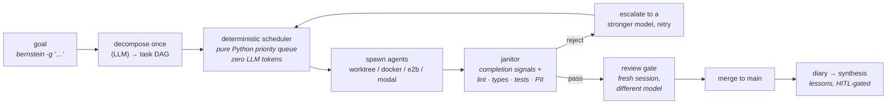

# bernstein

**Execution layer** — a [runtime](index.md), not a process framework. It decides *where and how* an agent runs, not *what* it does; it therefore [implements](../sdlc-stage/index.md) no SDLC stage and connects to the ontology only through the [[#Patterns enabled|patterns]] it provides as substrate.

**Bernstein** (Alex Chernysh, `sipyourdrink-ltd/bernstein`, Apache-2.0) is a **deterministic orchestrator for CLI coding agents** — *"Kubernetes for containers, but for AI coding agents."* You give it a goal; it decomposes the goal into a task DAG, schedules the tasks onto agents running in parallel git worktrees, verifies each result before it lands, and merges. It is aggressively **harness-agnostic** — 40+ CLI adapters, from [[claude-code]] and Codex down to a local `ollama`+Aider pairing — and explicitly positions the agent as a swappable worker: *"Agents are interchangeable workers - swap any agent, any model, any provider."* Like [[warren]] it is a service you run rather than an SDK you script, so it sits at the **platform pole** of the runtime layer — but where Warren is a control plane for *dispatching* agents, Bernstein is a control plane for *coordinating* them.

## The distinguishing claim: no model in the coordination loop

Bernstein's thesis, and the reason it is worth a page next to two runtimes that already exist here, is that **orchestration is not a reasoning task**. Sandcastle asks you to write the coordination in TypeScript; Warren dispatches one run at a time; the multi-agent frameworks in this wiki hand coordination to the model. Bernstein makes it *pure Python over a dependency graph* — a priority queue, a topological iterator, and a tick loop — and argues from three named failure modes of LLM-driven scheduling:

- **Invented dependencies** — the scheduling model blocks execution on task dependencies that do not exist in the graph, *"plausible but incorrect."*
- **Non-reproducibility** — *"The same task, presented in the same context twice, would get assigned to different agents"*, so debugging means reading reasoning traces rather than stack traces.
- **Token cost that scales with coordination** — *"$0.05–0.15 just on coordination - before any agent did any actual work"* per run; the deterministic scheduler's *"scheduling cost stays at $0 regardless of scale."*

LLMs are not eliminated — they do the initial decomposition (once, at startup), the actual agent work, and verification summaries — but they are pushed out of the scheduling decision. The docs are candid that the reproducibility claim is not yet a controlled benchmark: *"We haven't published a controlled benchmark yet."*

## What it orchestrates (not what it builds)

- **The task DAG** — a planner hands the orchestrator an authored task list whose parallel-safety is **declarative, not inferred from file overlap**: `[T001] [P] [US1] Add YAML loader`, with `-> T001, T002` dependency arrows and `[US<n>]` user-story slices used as rollback groupings. `topological_iter_with_parallel` yields one batch per iteration — all ready `[P]` tasks merge into a concurrent batch; a serial task in the ready set runs alone.
- **Sandbox backends** — pluggable isolation behind a `SandboxBackend` protocol, with eight first-party implementations: `worktree` (local git worktree, the default), `docker`, `e2b` (Firecracker microVMs), `modal`, `daytona`, `blaxel`, `runloop`, and `vercel`. Third parties register via the `bernstein.sandbox_backends` entry-point group.
- **Adapters** — 40+ CLI wrappers implementing one `CLIAdapter` interface (spawn → monitor by PID → parse a completion signal → SIGTERM/SIGKILL watchdog). Each declares an event channel (`STREAM_JSON`, `TEXT_SIGNALS`, or `ACP` line-delimited JSON-RPC) and a capability matrix (reasoning strength, tool use, structured output, MCP depth, sandbox execution, cost tier).
- **Routing** — a `TierAwareRouter` picks model and effort per task with provider-tier and cost awareness; a separate `cascade_router` escalates to a more capable model on failure. A `Router`-level split means the *scheduler's* own LLM (`internal_llm_provider`) can be a different vendor from the agents', which is how the docs get to *"zero Claude dependency"* if you want it.

## Runtime mechanisms

- **Orchestrator tick loop** — fetch open tasks, batch by role, spawn, monitor heartbeats. Lifecycle enforcement runs through a **Lifecycle Governance Kernel** holding explicit FSM transition tables and emitting `LifecycleEvent` audit records. Three FSMs are documented: a 12-state **task** FSM (`PLANNED` → `OPEN` → `CLAIMED` → `IN_PROGRESS` → `DONE` → `CLOSED`, with `BLOCKED`, `ORPHANED`, `WAITING_FOR_SUBTASKS`, `FAILED`, `CANCELLED`, `PENDING_APPROVAL`), a 4-state **agent session** FSM, and a 10-state **agent turn** FSM that includes a `COMPACTING` state entered when the context window nears capacity.
- **Adaptive parallelism** — `max_agents` is *"a ceiling, not a target."* A feedback controller reads windowed task-error-rate and CPU load each tick and mutates the working `max_agents` before the spawner picks tasks, so the effective concurrency drifts down when a run is failing or the box is pinned and recovers when both settle. Opt out for deterministic runs.
- **Adaptive timeouts** — *"Task timeouts are not static"*: sized from historical durations (small 15 min · medium 30 · large 60 · XL 120).
- **File-based state** — everything lives in `.sdd/` as YAML and JSONL: backlog, metrics, diaries, runtime signals. The docs justify this as inspectable (`grep` it), recoverable (*"copy `.sdd/` to another machine, restart Bernstein, resume"*), and git-friendly. Runtime state under `.sdd/runtime/` is ephemeral; backlog and metrics are the version-controlled parts.
- **Agent signals** — a file-based orchestrator↔agent protocol (`WAKEUP`, `SHUTDOWN`, `HEARTBEAT`) under `.sdd/runtime/signals/`; a **circuit breaker** sends `SHUTDOWN` to agents violating purpose constraints, and a **token monitor** pauses spawning or kills agents on runaway consumption (with Z-score cost-anomaly detection over historical spend).
- **Holds** — the orchestrator self-stops on quiescence (`open_tasks == 0 && active_agents == 0` for a settle window). A heartbeat-renewed **hold lease** over `/orchestrator/holds` lets a dashboard or a human-in-the-loop workflow prevent that self-stop across a gap in task submission — *"waiting on human approval for phase 2"* — and expires on its own if the caller dies.
- **Surfaces** — a FastAPI task server on `:8052` with an OpenAPI surface, a web dashboard, a `bernstein live` TUI, and a CLI (`init`, `-g <goal>`, `status`, `recap`, `diff`, `trace`, `logs tail`, `stop`, `demo`). **Cluster mode** adds a coordinator-with-workers topology (`bernstein run --remote` + `bernstein worker`) for multi-host fleets, with the explicit caveat *"do not reach for cluster mode for single-host workloads."*

## Verification moved into the runtime

The sharpest contribution for this wiki. Sandcastle gives you `exec()` and expects your script to gate on it; Warren "validates" before pushing. Bernstein makes the quality gate a **first-class, programmable stage of the runtime** with two layers that must *both* agree before a task moves toward merge:

- **The janitor** verifies against **declarative completion signals** attached to the task — `path_exists`, `glob_exists`, `test_passes`, content match — and then runs a configurable gate pipeline (build · lint · type-check · tests · security · PII scan · mutation testing) over the actual diff, in parallel via `asyncio.gather`, with blocking and non-blocking modes. The design statement is unambiguous: it *"does not trust agent claims—verifies them."* On failure it does not merely block — `record_and_escalate()` feeds the failure into the cascade router, which retries the task on a more capable model (retryable up to `max_retries`, default 3).
- **The review gate** runs after the implementer and **hard-asserts its own preconditions in configuration rather than convention**: the reviewer must run in a *fresh session* (`FreshContextViolation` if the implementer's transcript is threaded in), against a *distinct model* (`DifferentModelRequired` raises `EvalGateConfigError` when it cannot be satisfied), seeing only `(spec, diff, test_output)`, and returning a three-valued structured verdict — pass · fail · questions — that drives the auto-merge decision. The rationale is exactly the one the process-layer skills argue: *"Same-model self-critique is empirically weak at catching the implementer's own blind spots, and long-running implementer contexts accumulate drift."*

An optional **cross-model verifier** runs the diff past a second provider's model for A/B review; it ships disabled by default.

## Knowledge that outlives the run

- **Lessons** — `core/knowledge/lessons.py` does *"agent lesson propagation - tag-matched, confidence-decayed over time"*, injected into later spawns under an explicit context-injection token budget with graceful truncation and priority ordering.
- **Knowledge diary** — a per-task structured entry distilled from the closing transcript (`tried` / `worked` / `failed` / `rationale` / `tags` / `redaction_hash`) at `.sdd/runtime/diaries/<task_id>.json`, plus a periodic **synthesis** pass clustering diaries into themes. The synthesis is **HITL-gated**: reports land with `approved: false` until an operator runs `bernstein knowledge synthesize --apply`, and *"no role prompt is mutated by the synthesizer alone."*
- **CrossTaskKB** — a publish/subscribe facade over a tag-indexed SQLite memory store so one task can hand a fact to another *"without writing files into a shared worktree path and hoping the next agent reads them"*, each fact carrying a `(producer_task_id, ts_ns, content_hash)` triple that correlates with the lineage record of the artefact that produced it.
- **Tiered context compaction** — a policy picks exactly one compaction tier per call by budget pressure: `micro` (structural, no LLM, cost weight 0.05) → `time_based` (0.10) → `auto` (LLM-backed summarisation at ≥70% context use, 0.50) → `session_memory` (a durable cross-session summary at session end, 1.00).
- **Progressive skill packs** — role prompts are `SKILL.md` capability packs; the resolver injects only a name+description *index* into the system prompt and the agent pulls the full body on demand via `load_skill`, so a retry or fork does not re-pay for guidance it never used.

## Governance, audit, and the operator surface

Bernstein takes the audit story further than either existing runtime, framed for *"forward-deployed engineering"* — *"parachute onto a client repo and stand up an AI engineering crew in minutes"*, with client compliance review as a first-class output:

- **HMAC-chained append-only audit log**, signed lineage entries, and `bernstein audit taint <artefact>`, which recomputes a trust verdict **offline** — *"two verifiers on different machines produce a byte-identical result with no live process."* Every tool result carries a `trust_class` (operator · workspace · first-party · third-party · public) and an artefact's effective trust is the minimum over its lineage closure, fail-closed when provenance is absent.
- **Permission modes** — one mode fixed for the life of a run, from `bypass` (critical rules only) through `plan` and `auto` to `default`; critical rules are never relaxed.
- **Approval cards** — what an operator sees when a gated tool call needs a decision: a hash-committed record carrying the action digest, the agent's stated reasoning, a blast-radius/`hard_one_way` impact score, a per-tool-class rollback procedure, and an expiry — *"a postmortem can prove not just what was approved but what the approver was told at decision time."*
- **Credential scoping** — each leaf-agent subprocess is spawned with a filtered environment; only policy-permitted vars are forwarded and the orchestrator's own secrets are stripped before the child starts. On by default.
- **Air-gap deployment** — a wheelhouse build with signed verification, `--profile airgap`, and deny-all egress.

There is *"no separate enterprise edition"* — auth, RBAC, audit, compliance tooling, and model policy ship in-tree.

## Branch → PR

Merges are handled in-runtime (`core/git/` covers worktrees, a merge queue, and PR creation). On top of that, an opt-in **issue → PR pipeline** runs four stages against a GitHub App installation: `plan` posts a sticky markdown plan as an issue comment; `approval` polls that comment for a thumbs-up reaction or a configured keyword; `pr_open` applies the diff, pushes a branch, and opens a **draft** PR linked back to the plan comment; `pr_revise` reads inline review comments newer than the last revision marker and dispatches an agent to push a follow-up commit. Each stage writes a state marker so re-running it is a no-op, and *"the pipeline never auto-merges the resulting PR; merge gating stays with the operator."* GitLab and a broad tracker set (Jira, Linear, Asana, ClickUp, Plane, ServiceNow, GitHub Projects) have their own integrations.

## Orchestration profile

| Concern | Bernstein |
|---|---|
| Isolation | git worktree per agent (default) + 7 more pluggable backends — docker · e2b · modal · daytona · blaxel · runloop · vercel — behind one `SandboxBackend` protocol |
| Parallelism | **strongest here** — a declarative task DAG with `[P]` markers and dependency arrows, topological batching, and an adaptive `max_agents` controller reacting to error rate + CPU |
| Autonomy / AFK | **first-class** — goal in, merged code out; tick loop, adaptive timeouts, bounded retries with model escalation, circuit breaker, token/cost kill-switches, quiescence self-stop |
| Steering (HITL) | gate-shaped rather than conversational — permission modes, hash-committed approval cards, plan-comment approval, `PENDING_APPROVAL`, hold leases; **no mid-run message-into-the-agent steer** (cf. [[warren]]) |
| Persistence / memory | **richest here** — confidence-decayed lessons, per-task diaries + HITL-gated synthesis, CrossTaskKB pub/sub over SQLite, tiered compaction, session handoff/resume/fork |
| Provider-agnostic | 40+ adapters — claude · codex · gemini · qwen · ollama · aider · cursor · opencode · pi · droid · copilot · openai_agents · amp · goose · continue · cline · plandex · openhands · … |
| Branch → PR | **built-in** — merge queue + PR creation; opt-in issue→plan-comment→draft-PR→revise pipeline; never auto-merges |
| Topology | local-first single process (`.sdd/` on disk, API local unless exposed); optional coordinator+workers cluster mode with mTLS; Helm chart; air-gap profile |
| Distribution | **platform** — pip/pipx/uv/brew install, task server + REST/OpenAPI + web dashboard + TUI + CLI + MCP server |

## Distinctive contribution

Bernstein contributes two things this wiki did not have.

**First, coordination as auditable code.** Both existing runtimes sidestep the question — Sandcastle makes coordination *your* TypeScript, Warren mostly runs one agent at a time — so Bernstein is the first documented instance of the claim that the *scheduler itself* should contain no model. That reframes [[pattern-wave-parallelism]] at the infrastructure level: the wave structure is a declared property of the task graph (`[P]` markers, dependency arrows, topological batching) rather than something a planning agent reasons its way to. It is the infra-side answer to what [[gsd-execute-phase]] and [[sp-dispatching-parallel-agents]] do in prompts.

**Second, verification and cross-model review as runtime guarantees.** [[pattern-evidence-before-claims]] is, everywhere else in this wiki, a *skill* — [[sp-verification-before-completion]]'s Iron Law, an instruction the agent may ignore. The janitor makes it a property of the substrate: the task does not advance unless a declarative signal and a gate pipeline both pass, and the agent's own report is not consulted. Likewise the review gate turns [[pattern-cross-model-review]] and [[pattern-fresh-context-subagents]] from prompt discipline into *enforced configuration* — a same-session or same-model reviewer raises an exception rather than quietly degrading. This is the clearest case yet of the execution layer absorbing a [[stage-validate]] concern the process frameworks currently script by hand, and it parallels what [[warren]]'s `.mulch/` did for [[pattern-knowledge-compounding]] — which Bernstein also does, more elaborately, through confidence-decayed lessons and HITL-gated diary synthesis.

The trade-off worth recording: this is by far the **heaviest** runtime documented here (349 doc pages, a governance/compliance surface, cluster mode, a lineage graph). Sandcastle is three lines of TypeScript; Bernstein is an orchestration platform with an audit posture. The layer now has a genuine size axis, not just a library/platform one.

## Patterns enabled

- [[pattern-worktree-isolation]] — a git worktree per spawned agent is the default sandbox, *"so multiple agents running against the same repository cannot stomp on each other's files, processes, or secrets"*; seven heavier backends (docker, e2b, modal, daytona, blaxel, runloop, vercel) sit behind the same protocol.
- [[pattern-wave-parallelism]] — the fullest infra realization in the wiki: a declarative task DAG (`[P]` parallel-safe markers, `-> T###` dependency arrows, `[US<n>]` rollback slices) batched by `topological_iter_with_parallel`, scheduled deterministically and throttled by an adaptive-parallelism feedback controller.
- [[pattern-autonomous-loop]] — the product *is* the loop: goal → decompose → schedule → spawn → verify → escalate-or-merge, bounded by adaptive timeouts, retry budgets, a circuit breaker, token/cost kill-switches, and quiescence self-stop.
- [[pattern-evidence-before-claims]] — the janitor evaluates declarative completion signals and a lint/type/test/security gate pipeline over the real diff, and *"does not trust agent claims—verifies them"*; the infra realization of what [[sp-verification-before-completion]] instructs.
- [[pattern-cross-model-review]] — the review gate's `DifferentModelRequired` selection rule makes a distinct-model reviewer a configuration error to violate, plus an optional cross-provider verifier over the diff.
- [[pattern-fresh-context-subagents]] — the same gate hard-asserts a new session id for the reviewer and raises `FreshContextViolation` if the implementer's transcript is threaded in; context isolation enforced by the substrate rather than requested by a skill.
- [[pattern-knowledge-compounding]] — tag-matched, confidence-decayed lesson propagation into later spawns, per-task diaries clustered by an HITL-gated synthesis pass, and CrossTaskKB publish/subscribe over a persistent store.
- [[pattern-session-handoff]] — `bernstein handoff emit` / `claim` moves a live session between terminal, dashboard, and chat bridge on a short-lived single-use token; plus durable suspend/resume, fork-from-step, and a `session_memory` compaction tier that builds a durable cross-session summary.

## See Also
- [[sandcastle]] · [[warren]] — the other two runtimes. Bernstein shares Warren's **platform** pole but inverts its emphasis: Warren is a control plane for *dispatching and steering* one agent at a time (mid-run `steer` is its signature); Bernstein is a control plane for *coordinating many* with no model in the scheduler and no mid-run steer. Against Sandcastle it is the opposite pole entirely — a deployed service with an opinionated DAG scheduler versus primitives you compose yourself.
- [[claude-code]] · [[opencode]] · [[pi]] · [[factory-droid]] — the harnesses this runtime spawns that have pages here; the documented adapter set is far larger (see the profile above).
- [[pattern-evidence-before-claims]] · [[pattern-cross-model-review]] · [[pattern-fresh-context-subagents]] — patterns this runtime is the **first** to supply as infrastructure rather than instruction.
- [[stage-validate]] — the stage whose concerns the janitor and review gate pull down into the execution layer.
- [[topic-harness-engineering]] — the deterministic scheduler and the janitor are both *sensors and governors* in that framing: computational checks placed where an inferential system would otherwise be trusted.
