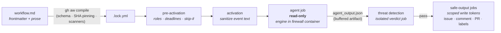

# gh-aw

**Execution layer** — a [runtime](index.md), not a process framework. It decides *where and how* an agent runs, not *what* it does; it therefore [implements](../sdlc-stage/index.md) no SDLC stage and connects to the ontology only through the [[#Patterns enabled|patterns]] it provides as substrate.

**GitHub Agentic Workflows** (`github/gh-aw`, MIT, technical preview) is GitHub's own entry in the layer: *"Intelligent automation for GitHub. Run the coding agents you know and love, with strong guardrails and cost controls, in GitHub Actions."* A workflow is a Markdown file — YAML frontmatter for triggers, permissions, and allowed writes; natural-language prose for the agent — that `gh aw compile` turns into a hardened `.lock.yml` GitHub Actions workflow. The agent job runs **read-only** on an Actions runner and emits structured *safe-output* requests; separate jobs with minimal scoped tokens perform the writes, and only after an isolated threat-detection job approves them. Its slogan-shaped framing is *"Actions + Agent + Safety"*, and its home quadrant is the one no other member here occupies: **event-driven** — the repo's own event stream (issues, PRs, comments, failed CI runs, deploy failures, cron and fuzzy schedules) is the trigger surface.

## One caveat on the subtype, recorded rather than smoothed over

`subtype: platform` — but unlike [[warren]] or [[bernstein]] there is **no server to run**: gh-aw ships as a `gh` CLI extension whose product is a *compiler and toolchain*, and the platform doing the running is GitHub Actions itself. The control plane is not a deployed process; it is **compiled into the CI job topology** — governance enforced at compile time (schema validation, expression allowlisting, action SHA pinning, `actionlint`/`zizmor`/`poutine` scanners) and by job structure at run time. It is filed `platform` because the operator experience is platform-shaped (a managed fleet of workflows with `gh aw deploy` org rollout, `gh aw health` dashboards, and no code to import), while noting that by the letter of the subtype gloss it is a compiler onto someone else's platform.

## What it orchestrates (not what it builds)

- **Engines.** Five official, via `engine:` — `copilot` (Copilot CLI, the default), `claude` ([[claude-code]]), `codex` (OpenAI Codex), `gemini` (Gemini CLI), `pi` ([[pi]]) — each engine's native CLI auto-installed on the runner. Custom engines only via imported definitions; OpenCode, Aider, Cursor and others exist as repo samples that are *"not officially supported"*, so no edges for them.
- **Triggers.** All GitHub Actions events plus agentic additions: `slash_command` (`/investigate`), `label_command`, `workflow_run` chaining on failure, `repository_dispatch` from external systems, cron **and fuzzy schedules** (*"daily around 14:00"* — execution deliberately scattered), and natural-language shorthands (`on: push to main`).
- **Authorization at the trigger.** `roles:` is *"an exact-match allowlist, not a privilege threshold"* (default admin/maintainer/write), plus `bots:` allowlists, `skip-if-match:` search-query gates, `cooldown:`, `stop-after: "+7d"` self-disable deadlines, and `manual-approval:` environment gates.
- **Fleet management.** `gh aw deploy` rolls workflows out to target repos via PRs org-wide; `gh aw update` 3-way-merges upstream changes against local edits via the `source:` field; `gh aw trial` tests a workflow in a temporary private repo first.

## Runtime mechanisms

- **Safe outputs — write authority as job topology.** The agent job holds no write permission, ever: *"The agent never requires write permissions because all write operations are performed by separate, validated jobs with minimal scoped permissions."* It emits typed requests — ~45 kinds, from `create-issue`, `add-comment`, `create-pull-request` and `push-to-pull-request-branch` to `dispatch-workflow` and `create-code-scanning-alert` — each capped (`max:`), targetable cross-repo (`target-repo:`), expirable (`expires: 7`), and dedupable. Everything a workflow creates carries a hidden `gh-aw-workflow-id` marker for later discovery.
- **The threat-detection gate.** Buffered artifacts (`agent_output.json`, `aw.patch`, `prompt.txt`) go to an isolated detection job — a *different* agent with a security-focused prompt, extendable with custom prompts and deterministic steps (e.g. TruffleHog) — whose verdict must pass before any safe-output job executes.
- **Isolation.** The ephemeral Actions runner, optionally hardened by the **Agent Workflow Firewall**: the engine runs in a Docker container behind a Squid proxy enforcing a domain allowlist (*"All traffic routed through proxy enforcing the domain allowlist"*), with gVisor or KVM-microVM runtimes as stronger substrates.
- **Input hygiene.** Activation-stage sanitization of untrusted event text (@mention neutralization, bot-trigger backticking, URI redaction, 0.5MB/65k-line truncation), **integrity filtering** of what content the agent may read by author trust (`merged` / `approved` / `unapproved` / `none`), and unconditional secret redaction on every run.
- **Budgets.** `max-turns` (default 500), `max-ai-credits` per run (default 1000) and `max-daily-ai-credits`, `user-rate-limit`, `timeout-minutes` — autonomy is metered in four currencies before it starts.
- **Memory.** `cache-memory:` (Actions-cache-backed files at `/tmp/gh-aw/cache-memory/`, 10GB/repo, ~7-day eviction, sanitized on restore) for session state; `repo-memory:` (git branches, versioned, unlimited retention) for long-term state. Cache keys are integrity-aware — a run at trust level `merged` never restores data written by an `unapproved` run.
- **Concurrency.** Auto-generated groups per issue/PR/ref, plus a **global one-agent-job-per-engine group** across all workflows (*"preventing AI resource exhaustion"*), queued rather than dropped.
- **Observability.** Per-run artifacts (prompt, output, patch, engine and firewall logs); `gh aw logs`, `gh aw audit` (per-run reports and multi-run diffs), `gh aw health` (success/cost/token trends over 7/30/90 days), `gh aw forecast` (statistical AI-credit forecasting), `gh aw outcomes` (safe-output disposition: accepted/rejected/ignored), OpenTelemetry export.

## Orchestration profile

| Concern | gh-aw |
|---|---|
| Isolation | ephemeral Actions runner; optional AWF firewall container (Squid egress allowlist), gVisor, or KVM microVM |
| Parallelism | per-issue/PR/ref concurrency groups; **globally one agent job per engine**, queued not dropped |
| Coordination logic | **compiled into the Actions job DAG** — pre-activation → activation → read-only agent → threat detection → scoped write jobs |
| Autonomy / AFK | event/cron/fuzzy-schedule triggers; `max-turns` · `max-ai-credits` · `max-daily-ai-credits` · `cooldown` · `stop-after` · `user-rate-limit` |
| Verification | threat-detection verdict gates every write; compile-time `actionlint`/`zizmor`/`poutine`; work-quality gates remain the repo's own CI on the PR it opens |
| Steering (HITL) | trigger-side only — `roles:` allowlists, `manual-approval:` environments, `/slash_command`; no mid-run steer |
| Persistence / memory | `cache-memory` (Actions cache, 10GB, ~7d) · `repo-memory` (git branches, versioned) · per-run artifact trail |
| Provider-agnostic | 5 engines: copilot (default) · claude · codex · gemini · pi; custom via imports only |
| Branch → PR | `create-pull-request` / `push-to-pull-request-branch` safe outputs with `protected-files` and issue fallback; never merges |
| Governance / audit | prompt/output/patch/firewall artifacts per run; `gh aw logs` · `audit` · `health` · `forecast` · `outcomes`; OpenTelemetry |
| Topology | **no server** — a `gh` CLI extension compiling to workflows GitHub Actions runs; GHES supported; org-wide rollout via `gh aw deploy` |
| Distribution | **platform** (with the caveat above: a compiler + CLI onto GitHub Actions, not a deployable service) |

## Distinctive contribution

gh-aw is the layer's **event-driven pole**, and its structural idea is that the control plane can be *compiled rather than run*. [[warren]] enforces policy with a live service, [[bernstein]] with a scheduler process, [[sssf]] with a script you execute — gh-aw enforces it with **artifacts checked in before anything runs**: a lock file whose job topology *is* the policy. Write authority is not a permission check that code performs at the right moment; it is the shape of the DAG — the agent job cannot write because no token with write scope ever reaches it, which turns [[pattern-edit-guardrails]] from a runtime behavior into a property the reviewer can read in the compiled YAML. The same move covers supply-chain trust (action SHA pinning at compile time) and even scheduling (fuzzy schedules resolved at compile time). It is the wiki's clearest instance of governance moving *left of execution entirely* — the run is constrained before the trigger fires.

Its second contribution is occupying the quadrant [[topic-software-factory]]'s grid had to leave empty: the **reactive factory**, where the repo's own event stream is the intake — a failed `workflow_run`, an opened issue, a deploy in `state: [error]` — and the announcement's six *"continuous"* use cases (triage, documentation, simplification, test improvement, quality hygiene, reporting) name the operating domains. The trade it makes for that position is the inverse of Warren's: **no mid-run steering at all** — the human acts before the run (roles, approvals, commands) and after it (the PR), never during. And one honest boundary: its verification gate vets the *safety* of outputs (secret leaks, malicious patches, policy violations), not the *quality* of the work — correctness gating is delegated to whatever CI the resulting PR must pass, one system further out.

## Patterns enabled

- [[pattern-autonomous-loop]] — the "continuous X" shape: event- and schedule-triggered unattended runs to a bounded finish, with the stop conditions declared as data (`stop-after`, `cooldown`, `max-turns`, AI-credit budgets) rather than scripted.
- [[pattern-worktree-isolation]] — an ephemeral CI runner per run, hardened to container/gVisor/microVM grade by the Agent Workflow Firewall with proxy-enforced egress.
- [[pattern-edit-guardrails]] — the third shape in the wiki, after the harness's *preventive hooks* and sssf's *detect-and-revert*: **structural prevention** — the agent job never possesses a write token, so the boundary is the job topology itself.
- [[pattern-deterministic-gates]] — compile-time scanners that refuse to emit an unsafe lock file, and the threat-detection verdict job that hard-blocks every safe-output write behind it.
- [[pattern-knowledge-compounding]] — `cache-memory` and `repo-memory` give recurring workflows substrate-provided cross-run state, integrity-scoped so trusted runs never inherit untrusted memory.

## See Also
- [[warren]] · [[bernstein]] · [[sssf]] · [[sandcastle]] — the other four runtimes; gh-aw inverts Warren most sharply (strongest mid-run steering vs none; deployed service vs compiled artifact).
- [[topic-software-factory]] — the profile this runtime anchors (📡 repo reactor) and the grid cell it fills.
- [[claude-code]] · [[pi]] — the two paged harnesses among its five engines.
- [[pattern-edit-guardrails]] — where its structural write-gating joins the preventive/detective spectrum.
- Companion projects, prose-only: the **Agent Workflow Firewall** and **MCP Gateway** (isolation infrastructure), and the ~73-page agent-prompt corpus behind its `llms.txt` — including a `loop` page on *"loop-engineering workflow patterns"*, the same external frame captured for [[topic-software-factory]].
