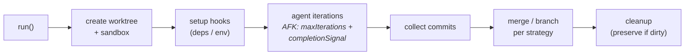

# sandcastle

**Execution layer** — a [runtime](index.md), not a process framework. It decides *where and how* an agent runs, not *what* it does; it therefore [implements](../sdlc-stage/index.md) no SDLC stage and connects to the ontology only through the [[#Patterns enabled|patterns]] it provides as substrate.

**Sandcastle** (Matt Pocock, `@ai-hero/sandcastle`, MIT) is a **TypeScript library for orchestrating AI coding agents in isolated sandboxes**. The whole idea is three lines: you invoke an agent with a single `sandcastle.run()`, Sandcastle sandboxes it with a configurable branch strategy, and the commits made on the branch get merged back. It is **provider-agnostic** and explicitly built for *"parallelizing multiple AFK agents, creating review pipelines, or orchestrating your own agents."* Unlike every `framework` in this wiki — which ships opinions about *what* an agent should do at each lifecycle stage — Sandcastle ships opinions about *isolation, branching, iteration, and lifecycle*. It is the **embeddable / library pole** of the runtime layer; its counterpart [[warren]] is the self-hosted-platform pole.

## What it orchestrates (not what it builds)

- **Sandbox providers** — pluggable isolation. Built-ins: Docker and Podman (bind-mount), Vercel (isolated Firecracker microVMs), and `noSandbox()` (run on the host, no isolation). Custom providers via `createBindMountSandboxProvider` / `createIsolatedSandboxProvider`.
- **Branch strategies** — how agent commits relate to the repo: `head` (direct filesystem writes, fastest, bind-mount only), `merge-to-head` (temporary branch auto-merged back), and `branch` (an explicit named branch that persists and can be reused across runs).
- **Agent providers** — harness-agnostic: Claude Code, Codex, pi, Cursor, OpenCode, GitHub Copilot, each with provider options (e.g. reasoning `effort`).

## API primitives

Documented here as the runtime's "capabilities" — but note these are *orchestration* verbs, not SDLC work:

- **`run()`** — one-shot: create worktree/sandbox → run hooks → execute the agent → collect commits → merge back → clean up. Returns iterations, matched `completionSignal`, `commits`, and target `branch`.
- **`createSandbox()`** — a reusable warm container: call `sandbox.run()` many times on one branch (dependencies/build artifacts persist between runs). `sandbox.exec()` runs shell commands in the same warm sandbox — e.g. gate an implement step on `npm test` before dispatching a review run. This is how the built-in **implement-then-review** pipeline works.
- **`createWorktree()`** — worktree lifecycle separated from sandboxing, enabling the *"interactive exploration → hand the worktree to AFK automation"* workflow.
- **`interactive()`** — a real-time human-in-the-loop TUI session (the only HITL affordance; there is no mid-run steering of an already-launched AFK run).

## AFK (away-from-keyboard) handling

The runtime's reason for existing, and the direct answer to the question that motivated this page. An unattended run is bounded and self-terminating by three knobs: **`maxIterations`** (loop cap), **`completionSignal`** (a string like `<promise>COMPLETE</promise>` the agent emits to end early), and two timeouts — **`idleTimeoutSeconds`** (resets on any output; genuinely-stuck agents fail) and **`completionTimeoutSeconds`** (a grace window for a "hanging process" that signalled done but keeps stdout open, e.g. a spawned `gh`/MCP child). **Session capture & resume** (`resumeSession`) and session **forking** let a multi-step or fanned-out workflow recover and branch. **Structured output** (`Output.object()` + a Zod schema, with optional retry-on-invalid) turns a run into a typed function call.

## Orchestration profile

| Concern | Sandcastle |
|---|---|
| Isolation | container bind-mount (Docker/Podman) · isolated microVM (Vercel) · `noSandbox()` · git worktree per branch strategy |
| Parallelism | you script it — multiple AFK `run()`s in parallel; session forking for fan-out |
| Autonomy / AFK | **first-class** — `maxIterations` + `completionSignal` + idle/completion timeouts |
| Steering (HITL) | `interactive()` TUI *before* handoff; no mid-run steering of an AFK run |
| Persistence / memory | session capture + resume + fork; **no** cross-run memory store |
| Provider-agnostic | Claude Code · Codex · pi · Cursor · OpenCode · Copilot |
| Branch → PR | branch strategies + merge-back; opening the PR is your script's job (e.g. `gh` in the prompt) |
| Topology | a library you embed — runs wherever your Node process + chosen provider run (local or Vercel cloud) |
| Distribution | **library / SDK** |

## Distinctive contribution

Sandcastle is the wiki's first pure **execution-layer** artifact and the **library pole** of that layer: it hands you orchestration *primitives* and expects you to write the TypeScript that composes them, rather than running as a service. Its signature moves are the **warm reusable sandbox** (`createSandbox` + `exec`-gated multi-run pipelines like implement→verify→review on one branch), the **worktree/sandbox split** that supports "explore interactively, then hand off to AFK," and **schema-validated structured output** that makes an agent run behave like a typed function. It ships example templates — `simple-loop`, `sequential-reviewer`, `parallel-planner` — that are recognisably the *infrastructure* under process-layer skills like [[lfg]] (autonomous pipeline) and [[sp-dispatching-parallel-agents]] (concurrent fan-out).

## Patterns enabled

- [[pattern-worktree-isolation]] — `createWorktree()` + the `branch` / `merge-to-head` strategies give every unit of work its own worktree/branch, preserved on dirty exit and removed when clean; the infra realization of what [[ce-worktree]] / [[sp-using-git-worktrees]] instruct at the process level.
- [[pattern-autonomous-loop]] — bounded AFK runs with a machine-checkable stop (`completionSignal`) and `exec`-gated success checks; the substrate under [[lfg]] / [[ce-dogfood]].
- [[pattern-wave-parallelism]] — the `parallel-planner` template + parallel `run()`s + session forking provide the concurrent-dispatch substrate (without dependency-ordered waves), matching [[sp-dispatching-parallel-agents]].
- [[pattern-deterministic-gates]] — `sandbox.exec()` runs a shell command in the warm sandbox, so a pipeline can gate an implement step on `npm test` before dispatching the review run; the script-it-yourself version of a merge gate.
- [[pattern-session-handoff]] — session capture/resume/fork carries working context across a run boundary, the infra counterpart to [[mp-handoff]] / [[gstack-context-save]].

## See Also
- [[warren]] — the other runtime here; the self-hosted **platform** pole to Sandcastle's embeddable **library** pole (service + UI/API vs SDK; built-in auto-PR + persistent memory vs script-it-yourself).
- [[pattern-worktree-isolation]] · [[pattern-autonomous-loop]] · [[pattern-wave-parallelism]] · [[pattern-session-handoff]] — the patterns this runtime supplies as substrate.
- [[lfg]] · [[ce-dogfood]] — process-layer autonomous loops that a runtime like this hosts.
- [[gstack-browse]] · [[gstack-pair-agent]] — the closest thing to execution-layer concerns living *inside* a process framework today (enabling infrastructure, no stage).
