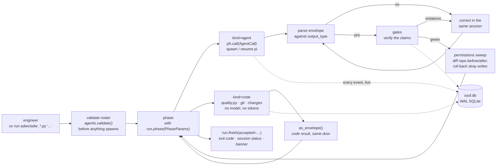

# sssf

**Execution layer** — a [runtime](index.md), not a process framework. It decides *where and how* an agent runs, not *what* it does; it therefore [implements](../sdlc-stage/index.md) no SDLC stage and connects to the ontology only through the [[#Patterns enabled|patterns]] it provides as substrate.



**Super Simple Software Factory** (IndyDevDan, `disler/super-simple-software-factory`, MIT) is a **deterministic Python control plane for coding agents, delivered as a Claude Code skill you stamp into a repo**. Its thesis fits on one line — *"Deterministic Python owns the graph. Coding agents are bounded nodes inside it"* — and its slogan is **"Agent proposes, code disposes."** An **ADW** (AI Developer Workflow) script owns sequencing, retries, and acceptance; agents work inside named *phases*; typed JSON envelopes carry context across the seams; every event streams into SQLite while it is still happening. It sits at the **library pole** of the runtime layer alongside [[sandcastle]] — you write the coordination yourself — but where Sandcastle is an SDK you import, sssf is a **template you stamp and then edit**, which is a different distribution shape for the same pole.

## Why this is a runtime and not a framework

It is the closest call in this namespace so far, and worth recording because the ingest checklist's [step 0](../CONVENTIONS.md#ingest-workflow-reminders) says a misfiled node drags everything with it. Three things point *toward* framework: it ships a five-agent roster (planner · builder · scout · reviewer · documenter), a set of prompts, and twelve starter chains, one of which (`adw_simple_sdlc`) walks plan → build → test → review → document. That is a lifecycle.

The classification still lands on `runtime`, on three tests:

- **It hosts no agent loop and spawns the one that does.** `agent_pi.py` builds the argv, launches [[pi]] as a subprocess, tails its JSONL stdout, and reaps it. That is the runtime-versus-harness test, cleanly.
- **The process content is explicitly disposable and the control plane is not.** The README is unusually direct about this: *"The tests it ships are not your tests. The prompts it ships describe a demo app, not your domain. The roster names the models that were good the week it was written. All of that is supposed to be replaced."* What you keep is `adw_modules/` — phases, envelopes, gates, permissions, tracing, session resumption. A framework's methodology is the product; here the methodology is sample data and the *substrate* is the product.
- **The pitch is a relocation of the control plane, not a method.** *"This fixes that by moving the control plane out of the prompt and into Python."* The thing being moved is sequencing, retries, and acceptance — the execution layer's own concerns, taken back from the model.

The tell the conventions name — *"a page whose capabilities almost all map to no stage is rarely a framework"* — cuts the same way from the other side: the stamped surface is `run.phase()`, `ph.call()`, `gates.*`, `quality.*`, `permissions.*`. None of those perform a lifecycle step. The role prompts do, and they are the part you are told to throw away.

## The distinguishing claim: the control plane leaves the prompt

Every runtime here argues something about where coordination belongs. [[bernstein]] argues it belongs in a scheduler with no model in it; sssf argues something narrower and more portable — that **the seams belong in code**, and that the reason a run is not repeatable is that it has none:

> Hand a capable model your whole SDLC and you get a machine with no seams. There is no phase boundary, so you cannot say which step failed. There is no acceptance criterion you can name, so "done" means "the agent stopped talking." A retry is a cold start that throws away everything the agent just learned. The only trace is a transcript you have to read like a novel. Run it twice, get two different systems.

Four consequences are drawn from that one decision, and each is a mechanism below: phases become the unit of the trace; envelopes become the only way context crosses a seam; gates become the definition of done; and a correction becomes cheaper than a restart because the session is still alive. *"Same models. Same prompts. The difference is who owns the loop."*

The second, sharper claim is about **when not to use an agent at all**, and it is the one the wiki has least of elsewhere:

> Code costs nothing. It runs at the speed of light. You can change it in a second. And you actually own it, which is not true of any model you are renting by the token. So when the invocation is already known, write it down. `bun test` is not a judgement call. Neither is `ruff check`. An agent rediscovering your test runner burns a context window to learn what a subprocess already knows […] Worse, it puts a passing test suite into a context window, which buys you nothing at all.

This is a hard rule of the skill, not an aside (*"A known command is code, not an agent"*), and it is why the shipped roster has **no tester agent**. It is also, in a different vocabulary, [[topic-harness-engineering]]'s rule that a computational control beats an inferential one wherever a computational one exists — arrived at here from cost and repeatability rather than from control theory.

## The phase primitive: three lanes, one context manager

Every run is a sequence of phases and every phase is the same `with run.phase(PhaseParams(...))` block, whoever owns it. Three `kind`s, three swim lanes in the trace:

- **`engineer`** — the human lane; today the phase that records who asked and for what.
- **`agent`** — `ph.call(AgentCall(...))`: prompt in, typed envelope out, gates verified.
- **`code`** — a deterministic step that stands on its own (a commit, the suite, a diff capture), **never buried inside an agent phase**, so the trace shows exactly when code ran and when an agent was working.

Two rules give the primitive its teeth. **Success must be earned**: a phase is constructed `status="fail"` and only a clean exit flips it, with an agent phase additionally needing its envelope to parse and every gate green. And **the run's outcome is a second question, asked separately** — `run.finish(accepted=...)` exists because *"a test phase that ran a red suite did its job perfectly"*; the phase succeeded and the run must not. The docstring records that this replaced a `succeeded` property whose side effects wrote the session green in the database, the terminal, and the UI while the process exited 1: *"Anyone reading the trace saw success; only a CI job checking `$?` saw the truth."* One call now settles the exit code, the session status, and the banner together *"so the three cannot disagree"* — a small thing, and the clearest example in this layer of a trace being treated as a load-bearing artifact rather than a log.

Every phase must also carry a `description` — one sentence of intent, rejected at construction if blank or a restatement of the name (`commit_plan: "Commit the plan"` is refused), because it is the only intent the trace, the console, and the UI ever show.

## Envelopes: the contract at every seam

An agent has **exactly two output channels** and no others: reference files written into the session's shared `context_handoff/`, and a final valid-JSON response parsed against the `output_type` the call declared. Code persists that response as `envelope.json`, records it, and injects it into the next agent's user prompt via `{{previous_envelope}}`. **Context transfers in code, not in conversation.**

```python
class EnvelopeBase(BaseModel):
    status: Literal["success", "fail"]
    summary: str = ""
    artifacts: list[str] = Field(default_factory=list)
    notes_for_next_agent: str = ""
```

Subtypes add what their consumer needs — `BuildOutput.changed_files` and `commit_message` (read by the git phase), `ReviewOutput.approved`/`findings`/`blocking`, `ScoutOutput.findings`, `DocumentOutput.document_path`. Three properties are worth lifting out:

- **The envelope is a manifest of claims**, which is what makes the gates below checkable at all.
- **Deterministic results wear the same shape.** `quality.as_envelope(result)` and `changes.as_envelope(changeset)` adapt a test run and a `git diff` into envelopes, so a code phase hands its result to the next agent *through the same door* an agent's report would have used — *"the consuming agent cannot tell the difference, which is the point."* One repair loop serves both.
- **The contract is a synced triad** — the Pydantic type in `data_types.py`, the JSON example in that agent's `user.md` `## Report` section, and `output_type=` at the call site are *one thing*, and the skill's hard rules require all three to change in the same edit. Drift between them is paid for on every call in correction rounds.

## Gates: verify the claims, never the predictions

A gate is `gate(envelope, run) -> GateReport`, and gates run **after** the agent finishes, against what it declared: *"Nobody knows which files an agent will touch before it finishes."* The shipped set is small and entirely mechanical — `artifacts_exist`, `files_non_empty`, `json_parses`, `diff_matches_claims`, `verdict_consistent`, and a `tests_pass(command)` factory. Each returns one `check(item, ok, note)` per thing it looked at, so a *green* gate can answer **what did you verify** (`{"item": "…/plan.md", "ok": true, "note": "exists, 454B"}`) rather than only *did it pass* — evidence, not a verdict, landing in both `gate_results` and the event stream.

`verdict_consistent` is the sharpest of them and the one worth stealing: it checks a review envelope **against itself** — an approval that ships blocking items, or a rejection that names no problem, *"is a claim the harness can refute without reading a line of the diff."* Judging the code is still the reviewer's job; judging the reviewer's internal consistency is free.

The skill is candid about the ceiling: *"Gates check what a predicate can check, not plan quality or code taste. Run the reviewer, or read it yourself."*

## Correction, not restart

When JSON fails to parse or a gate returns violations, **nothing restarts**. The harness re-prompts the *same* agent session with a correction naming exactly what was wrong; the context window stays intact. Parse failures are bounded by `JSON_FIX_ATTEMPTS` (2), gate violations by the phase's own `retries`. Pi treats `--session-id` as create-or-continue, so *running* an agent and *continuing* it are the same call — the runtime never needs a separate resume path. *"A cold restart throws away everything the agent learned. A correction costs one message."*

The same mechanism scales up to whole workflows. `agent_map.json` records agent → session id → model per `adw_id`, so `adw_build.py --adw-id a1b2c3d4` run after `adw_plan.py` rejoins the builder's **existing context window** rather than starting cold. The map stores the model each session was created with and starts a fresh session if config drift changed it — *"never a bad resume."*

## Permissions: `tools` is a capability list, `writes` is the boundary

The cleanest piece of engineering in the repo, and the reason this runtime supplies [[pattern-edit-guardrails]]. The argument first: a tool allowlist cannot express a safety boundary, because two of the tools are general-purpose — `bash` runs anything including `git checkout`, and `write` reaches any path. *"So 'this agent changes nothing' is a claim a tool list can state but never keep."*

`permissions.py` keeps it the same way every other claim in the system is kept — **after the fact, against the repo**. The working tree's change-set is fingerprinted before the agent's first prompt and again after its last send (retries and gate corrections included); any path that appeared, vanished, or changed is attributed to that agent. Comparing change-sets rather than watching writes is deliberate: *"a path that was modified before the agent ran and is clean afterwards has been **reverted**, and a reversion is a modification. That is what catches `git checkout`."*

A breach is explicitly **not** a gate violation — *"Gates are for work an agent can be asked to redo; a write has already happened, so re-prompting fixes nothing."* Instead every unauthorized change the agent *introduced* is rolled back (tracked files with `git checkout --`, untracked by deletion), a path that was **already dirty** beforehand is left alone (*"the operator had uncommitted work there, and discarding it to tidy up would be the same harm this module exists to prevent"*), and the phase fails naming every path and what happened to it.

Two config keys drive it. Per-agent `writes:` declares what that agent may change in the repo (`[]` = nothing; omitted = unrestricted); roster-wide `protected_files:` fences `adws/adw_modules/`, `adws/adw_sssf_config/`, and `adws/adw_*.py` from everyone — **an agent must not be able to edit the machinery that grades it**. The session runtime under `data_dir` is always writable for everyone, and the reasoning is exact: a read-only agent must be *"read-only with respect to the REPO, never mute"*, and that grant comes from `data_dir` rather than from `.gitignore` because an agent's ability to record its own work *"must not depend on a gitignore line someone can delete."*

## The roster: one model per phase

`sssf.config.yaml` answers one question per entry — *who is this agent* — and the ADW call site answers the other — *how is it used*. **ADW scripts name agents, never models**, which is what lets one agent serve many calls. Each entry sets the core four (context, model, prompt, tools) plus `thinking` (pi's `off … max` ladder), a `color` for its lane in the trace, `harness_engineering` pi extensions, and its `writes` boundary.

The starter roster **deliberately mixes vendors** to make the point that model choice is per-phase: `kimi-k3` on Fireworks for the planner at `thinking: high`, Gemini Flash for the builder and scout, two different OpenAI models for the reviewer and documenter. *"It is not about which model is best anymore, it is about which model is right for that one phase."* The side effect is that the shipped reviewer runs a **different vendor's model than the builder** — but that is a property of one roster, not an enforced precondition, so this page does not claim [[pattern-cross-model-review]]; [[bernstein]]'s review gate, which raises `DifferentModelRequired` when it cannot get one, is what enforcement of that pattern looks like.

Validation is front-loaded: every ADW declares `REQUIRED_AGENTS` and calls `agents.validate()` before anything spawns, checking that each named agent exists, resolves to a usable coding agent and model, and has both prompt files on disk. **No agent is ever spawned against a half-valid config.** The one honest gap is named in the README: `validate()` checks that a model is *written* as `provider/model-id`, not that its key is set, so a missing credential *"fails when that agent runs, partway into a chain."*

## Observability: one data path

*"Agents write to SQLite, readers poll SQLite."* `agent_pi.py` tails pi's JSONL stdout line by line and the tracer inserts each event **while the agent is still working**, so tool calls are visible mid-run instead of batched at the end. Ten event types (`phase_start`, `agent_start`, `tool_call`, `handoff`, `gate_pass`/`gate_fail`, `log`, `agent_end`, `phase_end`, `error`) land across seven tables — `sessions`, `phases`, `events`, `envelopes`, `gate_results`, `agent_sessions`, `processes` — each logged against both its `adw_id` and its `phase_id`, with `parent_id` nesting spans so an agent phase expands into its own tool calls.

```sql
select * from events where adw_id = ? and rowid > ? order by rowid limit 500;
```

That single rowid-cursor query **is the entire transport**: live view and full history are the same query at different cadence, *"which is why there is no ingest endpoint, no WebSocket, no backfill, and no separate replay path."* Every connection opens WAL, so reads never block a running writer. Files stay the raw record (`raw_output.jsonl`, `envelope.json`, `agent_map.json`) and the database is the queryable mirror — *"losing it loses nothing you cannot rebuild."* A read-only Vue/Vite visualizer (Bun, port 4600) polls it, resolving its target through `--db` → `SSSF_DB` → `<cwd>/adws/adw_data/sssf.db` so one instance can point at any stamped repo.

Three details show the layer taking its own telemetry seriously. **Spend is itemised per phase** across `input`/`output`/`cache_read`/`cache_write` and summed over *every* send a phase made, so a phase that burned two correction rounds shows what all of them cost. **Context is occupancy, not spend** — `context_tokens` measures how full the window was when the agent stopped, computed exactly the way pi computes it for its own footer and auto-compaction trigger, so the number matches the harness's. And the `processes` table exists for the one failure the trace cannot otherwise show: *"A hung agent emits nothing, which is exactly when you need its pid."* `just procs` lists what is live, `just kill` stops children before the parent and verifies the recorded command still matches the pid, and a killed run finalizes its own trace — SIGTERM and SIGINT become `SystemExit` so the session lands on `fail` instead of reading `running` forever.

## The twelve starter workflows

Every ADW takes the same shape — `uv run adws/adw_*.py "<prompt or path>" [--config …] [--adw-id …]` — and is 40 to 180 lines on purpose, so copying the closest one and editing the phase list is the intended way to get a new chain.

| ADW | Chain | Reach for it when |
|---|---|---|
| `adw_prompt` | engineer → \<agent\> | one agent, one prompt; `--agent NAME` picks who |
| `adw_scout` | engineer → scout | read-only recon, nothing changes |
| `adw_plan` | engineer → planner | you want the spec before any code |
| `adw_build` | engineer → builder | the plan already exists |
| `adw_quality` | engineer → code(quality) | lint, typecheck, build — no agents at all |
| `adw_plan_build` | planner → builder → git(commit) | small, well-understood work |
| `adw_build_test` | builder → code(test) → bounded fix loop | there is a suite to satisfy |
| `adw_build_review` | builder → reviewer → bounded revise loop | *"is this what was asked for"* matters more than *"does it run"* |
| `adw_plan_build_test` | plan → build → code(test) → git(commit) | the standard chain |
| `adw_plan_build_test_quality` | same, plus lint/typecheck/build gates | the repo has quality commands worth enforcing |
| `adw_document` | code(git diff) → documenter | write up what just shipped |
| `adw_simple_sdlc` | plan → build → test → review → document, three commits | the work is real and its shape is not obvious |

`adw_simple_sdlc` is the one to read: it asks the two questions separately and in order (*"The suite asks 'does it run'; the reviewer asks 'is this what was asked for' […] neither can answer the other's"*), re-runs the suite when a review revision changed code after the last green result, commits the code **only** once both came back clean, and lands three commits from three authors — the plan, the code, and the write-up each in the words of the agent that produced it, because *"reusing one agent's sentence for another's diff is how a commit log starts lying."* A failed run therefore leaves the plan committed and the working tree dirty, deliberately.

## Delivered as a skill, operated by a second harness

The runtime layer's first instance whose install *and* operating surface is a harness skill. `.claude/skills/sssf/` is the whole product: `SKILL.md` holds the hard rules and a request-routing table, nine cookbooks are lazy-loaded one per request, `references/` holds the deep specs, `scripts/install.py` stamps `templates/` into the target repo (idempotent — a re-run skips what exists and doubles as a drift check; `--force` overwrites everything including your config and prompts).

That produces a **two-harness topology unique in this layer**: [[claude-code]] loads the skill and plays *orchestrator* — launching ADWs, reading the trace database, editing the roster — while [[pi]] is the harness the runtime actually spawns to do the work. Only the second is a `runs:` edge; Claude Code is upstream of the runtime, not spawned by it. The skill polices the split with unusually explicit rules: *"You run the system, observe the system, and help the user interact with it. You do no ADW work yourself"* — never implement, plan, or test in an agent's place; never edit files under `sessions/`; query the trace database *"when observing is the task"*, never to volunteer a status report nobody asked for.

The startup discipline is itself a [[pattern-context-engineering]] argument worth recording, because it is stated as a debugged failure rather than a preference: read the overview, list the ADWs, **stop**. No trace queries, no repo inventory, no "current state" dashboard — *"Volunteered state is guessed state. An orchestrator that improvised a status board queried a `runs` table and a `payload` column — neither exists"*, and the spec that would have said so was one lazy read away. Plus: *"It is stale on arrival. State printed before the request describes a system that the very next run changes."*

## What it deliberately does not do

Unusually for this layer, the omissions are enumerated by the author rather than discovered by the reader, and they define the page's honest edges:

- **No isolation of any kind.** *"It runs on your current branch. There is no sandbox, no branch per run, no merge step, no cloud, and no human-in-the-loop approval phase."* This is the only runtime here that supplies **none** of [[pattern-worktree-isolation]] — the guarantee it offers instead is the post-hoc permissions rollback above, which is a boundary on *what* was changed, not on *where*.
- **No parallelism.** A chain is a sequence of phases in one process. No fan-out, no DAG, no [[pattern-wave-parallelism]].
- **No branch → PR.** Commits land on the current branch; there is no PR path.
- **No memory across runs.** Nothing accumulates between `adw_id`s — no lessons, no diaries, no store. Contrast [[warren]]'s `.mulch/` and [[bernstein]]'s confidence-decayed lessons.
- **Pi only, in v1.** `coding_agent: claude_code` is schema-valid and `agent_cc.py` raises `NotImplementedError`; the interface is specced (`claude -p --output-format stream-json --resume`) and deferred to v2.
- **The shipped quality blocks are placeholders that exit 0**, announced loudly in a box comment and in the README's failure table, on the reasoning that *"a wrong-but-plausible command that silently passes is worse than one that says so out loud."* Until they are replaced, three of the twelve ADWs have a test phase that is theater. It is named as the first thing to customize.

The scope answer is equally direct: *"Is this overkill for a one-off feature? Yes. Prompt an agent and move on. This earns its keep when the same workflow runs a hundred times, when validation is the only thing standing between you and a bad merge, and when you need the thousandth run to look like the first."*

## Orchestration profile

| Concern | sssf |
|---|---|
| Isolation | **none** — runs on the current branch in the current tree; the substitute is a post-hoc permissions sweep that rolls back unauthorized writes |
| Parallelism | **none** — one process, one sequence of phases |
| Coordination logic | your Python — a 40–180-line ADW script composing `run.phase()` blocks; no DSL, no model in the loop |
| Autonomy / AFK | a chain runs unattended to a two-part terminal gate (all phases green **and** `accepted=`), with bounded fix/revise loops; no cron, no long-lived daemon |
| Verification | **gates over the envelope's claims** (`artifacts_exist`, `diff_matches_claims`, `verdict_consistent`, `tests_pass(cmd)`) + `kind="code"` quality blocks; violations return to the same session as corrections |
| Steering (HITL) | none mid-run — the human lane is the `engineer` phase at the top and the exit code at the bottom |
| Persistence / memory | per-session only — `agent_map.json` resumes an agent's own context window across ADWs; nothing compounds between sessions |
| Provider-agnostic | **harness**: pi only in v1 (claude_code stubbed). **Model**: fully agnostic and per-phase — any `provider/model-id` in pi's catalog, a different one per agent in the same run |
| Branch → PR | — |
| Governance / audit | the trace *is* the audit: 7 tables, 10 event types, per-phase itemised spend, gate evidence, pid table; plus `writes`/`protected_files` enforcement |
| Topology | a stamped `adws/` directory in the target repo; `uv run` per workflow; optional Bun visualizer reading the SQLite file |
| Distribution | **library** — but stamped from a Claude Code **skill** rather than imported as a package; the code lands in your repo and is meant to be edited |

## Distinctive contribution

**First, the trace as the runtime's primary product.** Every runtime here logs; sssf is built backwards from the log. The phase exists to be the unit of the trace, the `description` field is mandatory because it is the only intent the trace shows, a code step is never nested inside an agent step so the trace can show which was running, `run.finish()` was rewritten specifically so the database, the banner, and the exit code cannot disagree, and the whole transport is one cursor query so live and historical views cannot diverge. [[warren]] gives you a live view and [[bernstein]] gives you a signed audit chain; this is the first runtime whose *design* is derived from what the trace has to be able to say.

**Second, the smallest complete statement of the layer's thesis.** Strip the isolation, the parallelism, the merge queue, the cluster mode and the compliance surface, and what is left of an execution runtime is: bounded phases, a typed contract at each seam, mechanical gates, correction-not-restart, and a trace. sssf is that residue, in a few hundred lines of readable Python, which makes it the layer's natural pedagogical instance — and it is deliberately positioned that way (*"the core stays small enough to read in one sitting, which is the only reason you would trust it enough to change it"*). Against [[sandcastle]], the other library-pole runtime, the split is clean: Sandcastle's primitives are about **the sandbox** (`run()`, branch strategies, `exec()` gating, session fork) and it leaves the workflow to you; sssf's primitives are about **the workflow** (phases, envelopes, gates, corrections) and it leaves the sandbox out entirely. The two are close to complementary, and neither ships the other's half.

**Third, an explicit budget line between agent work and code work.** The rule *"a known command is code, not an agent"* — with a shipped roster that pointedly has no tester agent, and `as_envelope()` adapters so a deterministic result reaches the next agent through the agent-shaped door — is the wiki's most concrete statement of [[pattern-deterministic-gates]]' underlying economics. [[topic-harness-engineering]] reaches the same rule from control theory (*prefer a computational control where one exists*); this reaches it from the bill, and then enforces it in the skill's hard rules rather than leaving it as advice.

## Patterns enabled

- [[pattern-deterministic-gates]] — the layer's core move made cheap: `gate(envelope, run) -> GateReport` callables run after every agent phase, `kind="code"` phases run lint/typecheck/build/test as argv lists with no model involved, and the hard rule *"a known command is code, not an agent"* pushes work out of the model wherever an invocation can be written down.
- [[pattern-evidence-before-claims]] — gates check the envelope's **declarations** against the filesystem, the diff, and the exit code after the fact (*"Gates verify claims, never predictions"*), and record one `{item, ok, note}` check per thing examined so a green gate says *what* it verified; `verdict_consistent` refutes a self-contradicting review without reading the diff.
- [[pattern-contract-first]] — a typed Pydantic envelope is the interface at every seam, declared per call site as `output_type=` and enforced by re-prompting until it parses; the contract is a **synced triad** (type ↔ `## Report` example ↔ call site) that must change as one unit. The pattern applied to agent-to-agent handoff rather than to an API.
- [[pattern-context-engineering]] — context crosses seams **in code, not in conversation**: two output channels only (files in `context_handoff/`, one final JSON response), the previous envelope injected as a rendered variable, deterministic results adapted into the same shape, and a bounded output tail so a runaway stack trace cannot swamp the next agent's window. The operator skill applies the same discipline to itself — nine lazily loaded cookbooks, one per request, and an explicit ban on surveying state before the request arrives.
- [[pattern-session-handoff]] — `agent_map.json` maps agent → coding-agent session id → model per `adw_id`, so a later ADW joining that id **resumes each agent's existing context window** instead of starting cold; a model change invalidates the session rather than resuming badly. The same mechanism serves within-phase corrections, since pi's `--session-id` is create-or-continue.
- [[pattern-edit-guardrails]] — `writes:` per agent and roster-wide `protected_files:` (which fence the machinery that grades the agents), enforced by fingerprinting the working tree before and after every call: unauthorized changes the agent introduced are rolled back, pre-existing dirty paths are left alone, and the phase fails naming each path. Enforcement by **detect-and-revert** rather than by permission prompt — the pattern's first infra-side realization.
- [[pattern-autonomous-loop]] — an ADW chain runs end to end with no human checkpoint to a machine-checkable terminal gate: `adw_simple_sdlc` self-repairs against the suite (`MAX_FIX_LOOPS`) and against the reviewer's blocking findings (`MAX_REVISION_LOOPS`), re-tests when a revision invalidated a green result, and only then commits — with `run.finish(accepted=…)` as the stopping condition. Bounded and single-shot rather than daemon-shaped, which distinguishes it from [[lfg]]'s CI-watch and [[bernstein]]'s tick loop.

## See Also
- [[sandcastle]] · [[warren]] · [[bernstein]] — the other three runtimes. Sandcastle is the nearest neighbour by distribution (both are *"you write the coordination"*) and the furthest by subject: it supplies the sandbox and leaves the workflow to you, sssf supplies the workflow and leaves the sandbox out. Against Bernstein it is the same thesis at opposite weight — both take coordination back from the model, one as a 349-page orchestration platform with a governance surface, one as a few hundred lines you are expected to edit.
- [[pi]] — the harness this runtime spawns, tails, and resumes; the only one implemented in v1. [[claude-code]] sits *above* the runtime instead, hosting the operator skill.
- [[pattern-edit-guardrails]] — supplied here as infrastructure for the first time; elsewhere in the wiki it is a harness permission surface ([[claude-code]], [[opencode]]) or a framework's freeze/guard commands ([[gstack-freeze]]).
- [[topic-harness-engineering]] — the same computational-over-inferential rule this runtime states as a cost argument; `quality.py`, `gates.py`, and `permissions.py` are sensors, and the ADW script is the steering loop.
- [[stage-validate]] — the stage whose concerns the gates and the `kind="code"` test phases pull down into the execution layer, the recurring move of this layer.
- [The store layer](../store/index.md) — the counter-example by omission: sssf keeps *no* state across runs, which is precisely the gap [[beads]] and [[seeds]] exist to fill. Its `sssf.db` is a trace of what happened, not a work graph an agent reads back.
