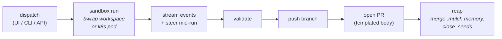

# warren

**Execution layer** — a [runtime](index.md), not a process framework. It decides *where and how* an agent runs, not *what* it does; it therefore [implements](../sdlc-stage/index.md) no SDLC stage and connects to the ontology only through the [[#Patterns enabled|patterns]] it provides as substrate.

**Warren** (Jaymin West, `jayminwest/warren`, MIT; part of the [os-eco](https://github.com/jayminwest/os-eco) ecosystem) is *"the Coolify of coding agents"* — a **self-hostable [[topic-software-factory|control plane]] for ephemeral coding agents**. Point it at a GitHub repo, bring your own key, and agents run in sandboxes on your own infrastructure; runs are short-lived and sandboxed — they complete a task, validate the changes, push a branch, and spin down — and a PR comes out. It is **harness-agnostic** (run Claude Code, Sapling, pi, and others behind one interface) and ships as *"one container, one volume, one HTTP API, one UI."* Where [[sandcastle]] is a library you script, Warren is a **running service** you deploy: it is the **platform / control-plane pole** of the runtime layer.

## What it orchestrates (not what it builds)

- **Two topologies, one domain.** `local` (default, self-host): the whole system is one container — warren plus a co-tenanted **burrow** sandbox daemon that isolates each run with `bwrap`. `k8s` (scale-out, the hosted target on GKE Autopilot): each run is its own pod (the pod boundary *is* the sandbox; no burrow), with kubelet-enforced CPU/memory and admission caps.
- **Dispatch surfaces.** Three thin clients of one composition pipeline — a React **web UI**, the `warren` admin **CLI**, and an **HTTP API** (plus a typed TypeScript client SDK).
- **Built-in agents.** `claude-code`, `sapling`, and `pi` ship inline; a fresh install needs nothing but a GitHub URL and a prompt.

## Runtime mechanisms

The control-plane "capabilities" — orchestration verbs, not SDLC work:

- **Live event stream** — NDJSON events persisted to SQLite and tailed over `GET /runs/:id/events?follow=1`; UI, CLI, and API all consume the same stream.
- **Mid-run steering** — `POST /runs/:id/steer` lands a message in the agent's inbox for its next turn; `POST /runs/:id/cancel` aborts cleanly. This real-time HITL steering (≈5s poll under k8s) is Warren's signature affordance and the sharpest contrast with Sandcastle.
- **Scheduled runs** — `.warren/triggers.yaml` defines per-project cron triggers dispatched on the same path as manual runs.
- **Serial plan-run dispatch** — `POST /plan-runs` walks a `.seeds/` [[artifact-plan-record|plan record]]'s children one at a time, one run per child, gating each on the previous PR merging; re-dispatch resumes from the next open child. It consumes `plan.children` **verbatim** (`seq = index + 1`), which is why seeds ships [[seeds-plan-reorder]] as a first-class command: the array order *is* the execution schedule.
- **Per-run preview environments** — a `.warren/preview.yaml` launches the app as a sidecar in the run's workspace behind `run-<id>.<host>`, so reviewers click a URL instead of checking out the branch.
- **Auto-PR** — after a successful run warren opens a PR with a generated, per-project-overridable body (`.warren/pr-template.md`).

## os-eco power features (opt-in)

Warren bundles a small set of [os-eco](https://github.com/jayminwest/os-eco) tools that light up when a project ships the matching directory — this is where the runtime layer starts to *own* concerns the process frameworks only gesture at:

- **canopy** (`CANOPY_REPO_URL`) — versioned prompt library; define custom agents as prompts with inheritance/mixins/per-agent sandbox config.
- **mulch** (`.mulch/`) — **persistent agent memory across runs**: expertise is primed into context on spawn, recorded with `ml record`, and merged back at reap (last-write-wins, just files in the repo, no database). A `memory`-subtype [store](../store/index.md) in all but a page — bundled by Warren rather than owned by it, and the same capability [[beads-remember]] ships inside a tracker.
- **[[seeds]]** (`.seeds/`) — an **issue queue** agents work from and write to ([[seeds-ready]] / [[seeds-update]] / [[seeds-create]] / [[seeds-close]]); also the substrate for plan-runs. Now paged in its own right as a `framework` — the one os-eco tool that reaches up into the process layer rather than staying in the substrate.
- **plot** (`.plot/`) — a peer-network coordination substrate; agents read shared context and append decision/question/artifact events.
- **sapling** — a headless coding harness with proactive context management, usable as a steerable alternative to `claude-code`.
- **burrow** — the `local` topology's `bwrap` sandbox runtime.

## Orchestration profile

| Concern | Warren |
|---|---|
| Isolation | **OS-level** — `bwrap` workspace per run (local) or pod-per-run (k8s); stronger than a git worktree |
| Parallelism | many concurrent runs (one-box ceiling in `local`; cluster-scheduled in `k8s`) — but a *plan-run* is serial by design |
| Autonomy / AFK | **first-class** — ephemeral dispatch→validate→push→spin-down; cron triggers; `.seeds/` self-claim |
| Steering (HITL) | **strongest here** — real-time mid-run `steer` + `cancel` + live event stream |
| Persistence / memory | **`.mulch/` machine-consumable memory merged across runs**; canopy prompt library; SQLite/Postgres run history + cost/token tracking |
| Provider-agnostic | `claude-code` · `sapling` · `pi` (+ canopy custom agents) |
| Branch → PR | **built-in** — opens a templated PR after a successful run |
| Topology | single container (home server) **or** Kubernetes (GKE Autopilot); bring-your-own-key, self-hosted |
| Distribution | **platform** — service + UI + HTTP API + CLI + typed SDK |

## Distinctive contribution

Warren is the **platform pole** of the runtime layer and the wiki's first look at agent orchestration as *operable infrastructure* — health/readiness probes, structured pino logs, correlation IDs, per-run cost analytics, `warren doctor`, a documented security posture, and a Kubernetes runbook. Two contributions are genuinely novel for this wiki. First, **mid-run steering**: an unattended run remains *interruptible and re-directable* without restarting it — a middle path between Sandcastle's "interactive OR AFK" split. Second, and more interesting for the ontology, Warren's **`.mulch/` persistent memory** is the **infrastructure-side realization of [[pattern-knowledge-compounding]]** — the very thing [[ce-compound]] / [[gstack-learn]] do as *process-layer skills*, but here baked into the runtime so every run auto-reads accumulated expertise and merges its own back at reap. Together with the `.seeds/` issue queue and `plot` coordination substrate, Warren shows the execution layer absorbing align/learn concerns that the process frameworks currently script by hand. What it is absorbing is a whole layer rather than a concern: `.seeds/`, `.mulch/`, and canopy are all [stores](../store/index.md), and Warren's contribution is consuming them well rather than owning them.

## Patterns enabled

- [[pattern-autonomous-loop]] — the whole product is the loop: dispatch → sandbox → validate → push → PR → spin down, plus cron triggers and serial plan-runs gated on PR merge; the infra realization of [[lfg]].
- [[pattern-worktree-isolation]] — a fresh isolated workspace per run (`bwrap` under `local`, a pod under `k8s`); the same "never corrupt the trunk" intent as [[ce-worktree]] / [[sp-using-git-worktrees]] realized at the OS/container level rather than via `git worktree`.
- [[pattern-knowledge-compounding]] — `.mulch/` primes prior expertise on spawn and merges new records back at reap; the machine-consumable-memory substrate under [[ce-compound]] / [[gstack-learn]].
- [[pattern-session-handoff]] — `.mulch/` priming + mid-run steering + the persisted event log carry state across the run boundary; the infra counterpart to [[gstack-context-save]] / [[mp-handoff]].

## See Also
- [[sandcastle]] — the other runtime here; the embeddable **library** pole to Warren's **platform** pole (script-it-yourself SDK vs deployed service; DIY PR vs built-in auto-PR; session resume vs persistent `.mulch/` memory; interactive-then-AFK vs steerable AFK).
- [[pattern-autonomous-loop]] · [[pattern-worktree-isolation]] · [[pattern-knowledge-compounding]] · [[pattern-session-handoff]] — the patterns this runtime supplies as substrate.
- [[ce-compound]] · [[gstack-learn]] — the process-layer knowledge-compounding skills whose job `.mulch/` moves into the runtime.
- [[seeds]] — the os-eco sibling, now paged as a framework. The clearest process-layer/execution-layer pairing in the wiki, both halves by the same author: seeds decides *what* work exists and in what order, warren decides *where and how* each piece runs.
- [[gstack-context-restore]] — already references running across **Conductor** workspaces, another instance of this execution layer leaking into the process wiki as prose.
