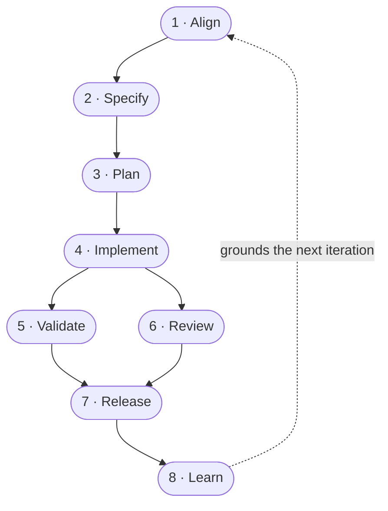

# SDLC Stages — Index (execution order)

The eight **canonical, framework-neutral lifecycle stages** synthesized across the frameworks in this wiki. Each is a **derived projection** — its content comes from the capabilities that `implements:` it (see [CONVENTIONS.md](../CONVENTIONS.md) for the ontology). Listed below in the order they typically execute.

The lifecycle is a **loop, not a line**: the last stage ([Learn](stage-learn.md)) feeds its output back into the front ([Align](stage-align.md)) so each iteration starts ahead of the last.

| # | Stage | The question it answers | Framework terms it subsumes (`aka`) |
|---|-------|-------------------------|--------------------------------------|
| 1 | [Align](stage-align.md) | *What should we build, and why?* — close the human↔agent gap before any code | Discuss · grilling · interview-me · explore · clarify · Analysis · brainstorm · Think |
| 2 | [Specify](stage-specify.md) | *What exactly, written down?* — capture it in a durable spec/PRD/spec-delta | to-prd · spec-driven · propose · specify · Planning (PRD) · spec |
| 3 | [Plan](stage-plan.md) | *How, decomposed?* — research, design, break into verified units | Plan · issues/design · task breakdown · plan+tasks+analyze · Solutioning · plan reviews |
| 4 | [Implement](stage-implement.md) | *Write the code* that satisfies the plan | Execute · build/TDD · Build · apply · implement · dev-story · work |
| 5 | [Validate](stage-validate.md) | *Does it work?* — functional gate: UAT, runtime/browser tests, spec-conformance | Verify (UAT) · verify · converge · test/dogfood · Test (QA) |
| 6 | [Review](stage-review.md) | *Is it good?* — quality gate: code review, security, performance, simplicity, design | architecture audit · Review · code-review · Simplify+Review · Review (code/design/DX/security) |
| 7 | [Release](stage-release.md) | *Deliver it* — finalize, ship, deploy, and keep it healthy in production | Ship · sync+archive · commit-push-pr · ship+land-and-deploy+canary |
| 8 | [Learn](stage-learn.md) | *What did we learn?* — harvest reusable lessons that seed the next iteration | retrospective · compound · Reflect (retro + learn) |

## Framework × stage support matrix

How completely each framework covers the eight stages, derived from the `implements:` edges of its capabilities (rows ordered by lifecycle coverage, most complete first).

**Legend:** 🟢 native — a dedicated step (named phase or several capabilities) · 🟡 partial — one or two capabilities, not a distinct phase · 🔗 folded in — the activity happens inside an adjacent stage, no standalone step · ➖ none — no capability for this stage.

| Framework | Align | Specify | Plan | Implement | Validate | Review | Release | Learn |
|-----------|:-----:|:-------:|:----:|:---------:|:--------:|:------:|:-------:|:-----:|
| [gstack](../framework/gstack.md) | 🟢 | 🟡 | 🟢 | 🟢 | 🟢 | 🟢 | 🟢 | 🟢 |
| [compound-engineering](../framework/compound-engineering.md) | 🟢 | 🔗 | 🟢 | 🟢 | 🟢 | 🟢 | 🟢 | 🟢 |
| [superpowers](../framework/superpowers.md) | 🟢 | 🔗 | 🟢 | 🟢 | 🟢 | 🟢 | 🟢 | 🟡 |
| [addy-agent-skills](../framework/addy-agent-skills.md) | 🟢 | 🟡 | 🟢 | 🟢 | 🟡 | 🟢 | 🟢 | ➖ |
| [gsd](../framework/gsd.md) | 🟢 | 🔗 | 🟢 | 🟢 | 🟢 | ➖ | 🟢 | ➖ |
| [openspec](../framework/openspec.md) | 🟢 | 🟢 | 🔗 | 🟢 | 🟢 | ➖ | 🟢† | ➖ |
| [bmad](../framework/bmad.md) | 🟢 | 🟢 | 🟢 | 🟢 | ➖ | 🟡 | ➖ | 🟡 |
| [matt-pocock-skills](../framework/matt-pocock-skills.md) | 🟢 | 🟢 | 🟢 | 🟢 | ➖ | 🟢 | ➖ | ➖ |
| [speckit](../framework/speckit.md) | 🟢 | 🟢 | 🟢 | 🟢 | 🟡 | ➖ | ➖ | ➖ |
| [bm-skills](../framework/bm-skills.md) | ➖ | 🟡 | ➖ | 🟡 | ➖ | ➖ | ➖ | ➖ |
| [nano-spec](../framework/nano-spec.md) | ➖ | 🟡 | ➖ | ➖ | ➖ | ➖ | ➖ | ➖ |

† OpenSpec's Release is a **spec-merge** (`archive`), not a code deploy — gstack is the only framework here with a genuine deploy step. Folded (🔗) cases: GSD, Superpowers, and Compound Engineering capture the *what* inside Align/Plan rather than a separate spec; OpenSpec bundles design + task-decomposition into its `propose` (specify) step. BM Skills and nano-spec are deliberately point tools, not full-SDLC frameworks.

## Notes on ordering

- **Stages 5–6 (Validate ∥ Review) are sibling gates**, not a strict sequence. Both run after [Implement](stage-implement.md) and both must pass before [Release](stage-release.md), but their order varies by framework — Addy runs *Verify → Review*, gstack runs *Review → Test*. They are listed 5 then 6 for a linear read; treat them as parallel quality gates.
- **Stages 2–3 (Specify → Plan)** were once one stage; `stage-specify` was split out once ≥2 frameworks treated authoring the spec as its own step. Some frameworks (e.g. OpenSpec) still fold planning into the specify step.
- **Stage 8 (Learn) closes the loop.** Its output — a solution corpus, a retrospective, an updated living spec — is read as grounding by [Align](stage-align.md), [Plan](stage-plan.md), and [Review](stage-review.md) at the start of the next iteration.
- Not every framework implements every stage (e.g. GSD/OpenSpec/Spec Kit ship no [Review](stage-review.md) capability; Spec Kit ships no [Release](stage-release.md) step). A stage page is only as strong as the capabilities that link into it.

See the global [Knowledge Base Index](../index.md) for the full cross-namespace catalogue.
