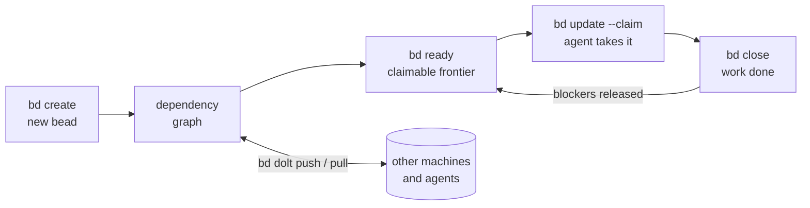

# Beads

**State layer** — a [store](index.md), not a process framework. It holds the durable work graph; it decides neither *what* to do (framework) nor *where and how* an agent runs (runtime). Its own charter draws both of those boundaries explicitly — see [The charter](#the-charter-a-source-that-draws-the-layer-itself).

**Beads** (`bd`) is a *"distributed graph issue tracker for AI agents, powered by [Dolt](https://github.com/dolthub/dolt)"* — originally Steve Yegge's `steveyegge/beads`, still the Go module path, now published under the `gastownhall` org. MIT, Go 1.26+, Cobra CLI, ~109 top-level commands. Distributed through Homebrew, npm (`@beads/bd`), PyPI (`beads-mcp`, an MCP server), an install script, Arch AUR, and winget. Docs at [beads.gascity.com](https://beads.gascity.com/).

Its thesis is the clearest statement in this wiki of what the state layer is for:

> Coding agents lose their memory every time a session ends. Markdown plans rot, TODO comments scatter, and a crashed agent takes its context with it. Beads replaces that with a **persistent, structured work graph**: every unit of work is a **bead** (an issue) in a version-controlled database, connected by dependencies, and `bd ready` computes exactly what can be worked on right now. **Work survives the agent; the next session picks up where the last one died.**

And the mechanism, in one line from the same page: *"the graph — not a human dispatcher — decides what is workable next."*

## The charter: a source that draws the layer itself

The wiki normally has to argue a tool's classification. Beads publishes it. `engdocs/PROJECT_CHARTER.md` names the layer above it and refuses to encode it:

> Beads should not know about orchestration layers built on top of it. Systems such as schedulers, swarms, release coordinators, and future workflow engines may use beads, but beads should not encode their concepts in core. […] **The orchestration layer owns orchestration policy: agent routing, task assignment strategy, model choice, retry plans, scheduling, workflow semantics, and cross-system coordination.**

That paragraph is a description of this wiki's [runtime](../runtime/index.md) layer, written by someone who had never seen this wiki — [[warren]], [[bernstein]], and [[sandcastle]] are exactly the "schedulers, swarms, release coordinators" it declines to be. The same charter scopes beads to *"issue tracking primitives"* (issues and lifecycle, dependencies and readiness, labels/comments/status/priority/assignment, metadata, import/export/sync/backup) and rules methodology out. It hosts no agent loop. So: not a framework, not a harness, not a runtime — and the fourth thing it *is* now has a name.

Two more boundaries are worth recording because they show a project that has thought about layering harder than most:

- **Storage boundary.** *"Beads should not become a storage engine. Dolt provides storage, versioning, sync, merge behavior, concurrency, and crash safety."* Mechanically enforced by a `depguard` rule denying `github.com/dolthub/` imports outside `internal/storage/`.
- **Schema boundary.** New per-issue data goes in `metadata` first; promotion to a first-class column requires *"broad, durable meaning for beads itself"*. This is how an orchestrator layers its own state on top without a schema change — the same trick [[seeds]] plays with its opaque `extensions` bag.

## The work graph

A **bead** is one tracked unit of work: a hash ID, a title, a type (`bug`, `task`, `feature`, `epic`, `chore`, …), a priority (0 critical → 4 backlog), a status walking `open` → `in_progress` → `closed`, plus `deferred` and `blocked`. *"'Bead' and 'issue' name the same thing; the CLI says issue, the product says bead."*

**Dependencies are typed, and only some of them gate work** — a distinction [[seeds]]' two-edge model does not draw:

| Edge | Meaning | Affects ready work |
|---|---|---|
| `blocks` | hard ordering — the blocker must close first | **yes** |
| `parent-child` | epic / subtask structure | indirectly — a blocked parent blocks its children |
| `discovered-from` | provenance: found while working on the parent | no |
| `related` | soft association | no |
| `conditional-blocks` · `waits-for` | workflow-step gating (see [[beads-gate]]) | yes |

On top of those sit **knowledge-graph links** — `relates-to`, `duplicates`, `supersedes`, `replies-to` — which carry meaning without touching schedulability. The consequence is that a beads database is simultaneously a work queue and a knowledge graph of how the work relates, and neither view corrupts the other.

**Ready work** is the load-bearing computation: *"the claimable frontier of the graph — open beads with no open blockers, excluding anything in progress, blocked, deferred, or held by a gate. Agents never scan the whole tracker; they ask for the frontier and claim atomically."* See [[beads-ready]].

**Hash IDs** (`bd-a1b2`) are content-derived — hashed from title, description, creator, creation time, plus a collision nonce — not sequence numbers, and the hash length extends automatically as the database grows. Two agents on two branches cannot mint the same ID, so *"merges never renumber work"*. Hierarchical IDs express epics: `bd-a3f8` → `bd-a3f8.1` → `bd-a3f8.1.1`.

## Memory, not just tracking

This is the half that makes `store` the right node name rather than `tracker`. Beads ships a first-class memory surface alongside the work graph:

- **[[beads-remember]]** — `bd remember "insight"` stores a memory that *"persists across sessions and account rotations"*, keyed automatically or explicitly, with `bd recall` / `bd memories` / `bd forget` around it. The README is blunt about the intent: *"Use `bd remember` for persistent project memory; **do not create MEMORY.md files**."*
- **[[beads-prime]]** — injects the workflow rules *and those memories* into the agent's context, and adapts to its budget: ~50 tokens when an MCP server is detected, ~1–2k in CLI mode. Built for `SessionStart` hooks in Claude Code, Gemini CLI, and Codex (`--hook-json` emits the hook envelope), explicitly *"to prevent agents from forgetting bd workflow after context compaction"*. Overridable per project with `.beads/PRIME.md`.
- **[[beads-kv]]** — a plain key-value store for anything else an agent needs to durably stash.
- **[[beads-compact]]** — *semantic* compaction: `bd admin compact` summarizes old closed issues ("memory decay") to save context window, distinct from `bd compact`'s squashing of Dolt commit history.

Read together, that is a store whose contract with the agent is: *you will forget; I will not, and I will hand it back to you at the top of the next session, sized to your context window.*

## Storage: Dolt, and the disagreement with seeds

Beads stores everything in **Dolt**, a version-controlled SQL database: cell-level three-way merge, native branching, and sync via Dolt remotes. Every write auto-commits to Dolt history. Two modes — **embedded** (default, in-process, single file-locked writer, `.beads/embeddeddolt/`) and **server** (an external `dolt sql-server` for concurrent writers, `.beads/dolt/`). Cross-machine sync is `bd dolt push` / `bd dolt pull` against `refs/dolt/data` **on your existing git remote**, so there is no server to run and the data rides alongside the code without touching normal git refs. `.beads/issues.jsonl` is *"a passive export for viewers and interchange — not the database, not the sync protocol, and not a backup."*

**This is a documented head-to-head disagreement with [[seeds]], and the wiki records both sides rather than adjudicating.**

| | Beads (this page, captured 2026-08-31) | Seeds (captured 2026-08-31) |
|---|---|---|
| Store | Dolt — versioned SQL, cell-level merge | JSONL — *"the JSONL file IS the database"* |
| Merge | Dolt 3-way merge; hash IDs make collisions *"rare"* | `merge=union` gitattribute + dedup-on-read |
| Concurrency | file lock (embedded) or SQL server (multi-writer) | advisory locks + atomic temp-file rename |
| Sync | native `bd dolt push/pull` on `refs/dolt/data` | `sd sync` commits the files; `git push` is yours |
| History | Dolt commit per write; `bd compact` / `bd flatten` to prune | git log of the JSONL files |

Seeds' README argues against beads by name: *"Beads works but carries baggage this ecosystem doesn't need"* — the binary `beads.db` that *"can't diff/merge"*, *"286 export-state tracking files"*, lock contention, and a *"dual source of truth"* between the binary DB and its JSONL export. Beads' current docs answer parts of that on their own terms rather than in reply: the JSONL export is explicitly demoted to a passive artifact (no export-state tracking, no dual source of truth by design), and the charter argues the Dolt dependency is the point — *"Dolt provides storage, versioning, sync, merge behavior, concurrency, and crash safety"*, so beads deliberately does not reimplement any of it.

Two honest notes on the conflict. First, **the critique may predate what it criticizes**: seeds' design record describes a beads that round-tripped through JSONL exports, which the captured beads docs no longer do — the two captures are same-dated but the arguments are not necessarily contemporaneous. Second, the disagreement is **real and unresolved on its merits**, not a versioning artifact: a versioned SQL engine buys typed queries (`bd sql`, `bd query`), cell-level merge, and branching that plain JSONL cannot, at the cost of a binary dependency, a schema-migration story (`bd migrate`, the schema-version guard), and ops surface (`bd dolt start/stop/killall`) that JSONL simply does not have. Neither wins in the abstract.

## What it does that no other page here does

**Coordination as gated beads.** [[beads-gate]] turns an async wait into an issue: a `human` sign-off, a `timer`, a `gh:run` or `gh:pr`. A gate blocks its waiters through an ordinary dependency edge, *"so agents never need to poll or spin"* — the step simply leaves the ready frontier until `bd gate check` closes the gate. [[beads-merge-slot]] applies the same trick to serialize conflict resolution: the merge slot is a bead you acquire. This is the wiki's first instance of **synchronization primitives expressed as work items**, which is what lets a passive store coordinate active agents without becoming an orchestrator — precisely the charter's line.

**A declarative workflow engine over the graph.** `formula` (TOML source, a DAG of steps) → `bd cook` → `proto` (template epic with `{{variables}}`) → `bd mol pour` → **molecule** (real, dependency-ordered beads that flow through `bd ready` like anything else). The chemistry metaphor extends to lifecycle: a **wisp** is the vapor phase — the same instantiation flagged ephemeral, excluded from federation, deleted wholesale by `bd purge` — for *"operational workflows that create beads that are worthless the moment they close"*. `bd mol squash` promotes a wisp that turned out to matter; `bd mol burn` deletes one that did not. See [[beads-formula]], [[beads-cook]], [[beads-mol]].

That triple is the closest thing in this wiki to [[artifact-plan-record]] generalized: [[seeds]] validates one plan at submit time, beads *compiles a reusable plan template* and stamps out instances. And note where it sits relative to the charter — a formula declares shape, never policy; who runs a step, on which model, with what retry, stays with the runtime.

**Ephemerality as a first-class property.** Beads is the only tool here that distinguishes work worth keeping from work worth forgetting, at the data level, with `--ephemeral`, wisps, `bd purge`, and semantic compaction. Every other tool's store grows forever.

**Federation and multi-repo.** Peer-to-peer sharing of beads across repos and organizations ([[beads-federation]]), including a bucket-based mode that federates two machines through GCS or S3 *"with no server to run"*; cross-repo dependencies (`bd dep add bd-42 external:other-repo:api-ready`) and role-based routing that sends a contributor's planning issues to a separate repo so experiments stay out of PRs ([[beads-repo]]).

**A channel back to the human.** [[beads-human]] (`bd human list/respond/dismiss/stats`) makes "this needs a person" a queryable bead state rather than a message that scrolls past — the store-side realization of a human-in-the-loop gate. [[beads-audit]] records agent interactions to an append-only JSONL, and commits carry an `Agent-Signature:` trailer.

**Two-way bridges to real trackers.** [[beads-github]], [[beads-gitlab]], [[beads-jira]], [[beads-linear]], [[beads-ado]], [[beads-notion]] each `pull` / `push` / `sync`. The charter keeps them honest: *"tracker integrations are adoption bridges, not a second product surface"* — map external data into beads concepts, do not replicate tracker UIs.

## Capabilities

Fifty-one capability pages covering all ~109 top-level commands, grouped by family (`bd mol`'s thirteen subcommands are one page, `bd dolt`'s twelve another). Every command takes `--json`. Almost all of them `implements:` no stage — the expected shape for a store, and in beads' case the charter's deliberate intent.

**The work loop** — the four commands the README calls essential:

- [[beads-ready]] — the claimable frontier; `--claim` takes the first match atomically.
- [[beads-create]] — file a bead (`create`, `create-form`, `q` for quick capture, `batch` for one transaction).
- [[beads-update]] — claim, reassign, re-prioritize, defer, promote, set operational state.
- [[beads-close]] — close and reopen; closing releases blockers.

**Reading the graph:**

- [[beads-show]] — details plus audit trail, children, and history.
- [[beads-list]] — filtered listing, counts, blocked, stale, and orphans (open issues referenced by a commit — a nice tracker/VCS cross-check).
- [[beads-query]] — a small query language, text search, and duplicate detection.
- [[beads-dep]] — the typed dependency edges.
- [[beads-graph]] — render and integrity-check the graph.
- [[beads-epic]] — hierarchy: completion status and close-eligibility.
- [[beads-swarm]] — validate an epic's structure and turn it into a swarm molecule for parallel dispatch.
- [[beads-supersede]] — the knowledge-graph links (`supersedes`, `duplicates`, `relates-to`).

**Annotating work:**

- [[beads-comment]] — threaded comments, with authorship recorded in the events journal.
- [[beads-label]] — labels, including propagation from a parent to its children.
- [[beads-todo]] — a lightweight TODO interface over task beads.
- [[beads-delete]] — delete, prune, purge.

**The workflow engine** ([[stage-plan]] for the instantiating half):

- [[beads-formula]] — the TOML/JSON DAG source.
- [[beads-cook]] — compile a formula into a proto.
- [[beads-mol]] — pour, inspect, bond, squash, burn; wisps and their GC.
- [[beads-gate]] — async waits as blocking beads (human · timer · `gh:run` · `gh:pr`).
- [[beads-merge-slot]] — a serialized merge lock, expressed as a bead.

**Memory and context:**

- [[beads-prime]] — inject rules + memories, sized to the detected context budget.
- [[beads-remember]] — durable insight (`remember` · `recall` · `memories` · `forget`).
- [[beads-kv]] — a general key-value store.
- [[beads-compact]] — semantic issue compaction and Dolt history squashing.

**Sync and data:**

- [[beads-dolt]] — the storage engine surface (remotes, push/pull, server lifecycle, raw SQL).
- [[beads-vc]] — version-control operations over the data: branch, commit, merge, diff.
- [[beads-export]] — JSONL export and import.
- [[beads-backup]] — backup destinations, sync, and restore.
- [[beads-federation]] — peer-to-peer sharing across repos and organizations.
- [[beads-repo]] — multi-repo configuration, routing, cross-repo dependencies, and `bd ship`.

**Setup, health, and integration:**

- [[beads-init]] — initialize (and `--stealth` / `--contributor` modes, `bootstrap`, `init-safety`).
- [[beads-setup]] — write workflow instructions into a harness's own files; thirteen built-in recipes.
- [[beads-hooks]] — git hooks, embedded in the binary.
- [[beads-config]] — configuration with provenance, drift detection, and reconciliation.
- [[beads-doctor]] — the health command, including orphan detection and `--fix`.
- [[beads-preflight]] — a PR-readiness checklist.
- [[beads-lint]] — check issues for missing template sections.
- [[beads-worktree]] — create and manage git worktrees for parallel work.
- [[beads-migrate]] — schema, hooks, and sync migrations; ID and prefix renames.
- [[beads-upgrade]] — version status, review-since-last-version, acknowledgement.

**Agent-facing extras:**

- [[beads-human]] — the human-needed queue.
- [[beads-audit]] — append-only records of agent interactions.
- [[beads-mail]] — delegate to a mail provider; the message/threading surface.
- [[beads-rules]] — audit Claude rules for contradictions and compact them into composites.

**Tracker bridges:** [[beads-github]] · [[beads-gitlab]] · [[beads-jira]] · [[beads-linear]] · [[beads-ado]] · [[beads-notion]].

## Patterns enabled

- [[pattern-session-handoff]] — the whole product: *"work survives the agent; the next session picks up where the last one died"*, with [[beads-prime]] restoring rules and memories at `SessionStart` and the graph carrying the rest.
- [[pattern-knowledge-compounding]] — [[beads-remember]] and [[beads-kv]] make durable insight a store primitive rather than a corpus a skill maintains; the direct counterpart of [[warren]]'s `.mulch/`, and a replacement for the `MEMORY.md` files the README tells agents not to write.
- [[pattern-context-engineering]] — [[beads-prime]] adapts its own token cost to whether an MCP server is present (~50 vs ~1–2k tokens), and [[beads-compact]]'s semantic decay summarizes closed work specifically *"to save context window"*. Context budget as a store concern.
- [[pattern-autonomous-loop]] — [[beads-ready]] plus atomic `--claim` is the dispatch primitive an unattended loop turns on, and [[beads-gate]] lets a parked step wait without polling.
- [[pattern-worktree-isolation]] — hash IDs and Dolt cell-level merge exist so parallel branches and worktrees never renumber or collide; [[beads-worktree]] manages the worktrees themselves.
- [[pattern-deterministic-gates]] — [[beads-doctor]], [[beads-graph]]'s integrity check, [[beads-lint]], and [[beads-preflight]] are program-decided verdicts over the store and the work.
- [[pattern-wave-parallelism]] — [[beads-swarm]] validates an epic and turns it into a swarm molecule for parallel dispatch, and the ready frontier is by construction the set of steps that may run at once.

## See Also

- [[seeds]] — the other store in this layer, written explicitly to replace beads. Read the two together: they agree on the model (a dependency graph whose unblocked frontier is the dispatch primitive) and disagree on nearly everything else — storage substrate, whether the tracker should carry a planning methodology, and how much surface a tracker should have (109 commands vs 37).
- [[warren]] · [[bernstein]] · [[sandcastle]] — the orchestration layer beads' charter names and declines to be. Warren is the one that actually consumes a store this way, dispatching from `.seeds/`.
- [[claude-code]] · [[factory-droid]] · [[opencode]] — the paged harnesses [[beads-setup]] ships recipes for. Its full recipe list (cursor, copilot, gemini, aider, mux, junie, windsurf, cody, kilocode) is prose until those harnesses are ingested.
- [[artifact-issue]] — what a bead is, in the wiki's artifact vocabulary.
- [[artifact-plan-record]] — [[seeds]]' validated plan row; beads' `formula` → `proto` → `molecule` pipeline is the reusable-template generalization of the same idea.
- [[topic-harness-engineering]] — [[beads-rules]] and [[beads-setup]] both operate on the guide layer that topic describes.
