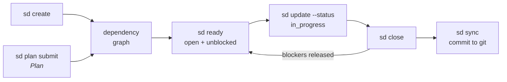

# Seeds

**State layer** — a [store](index.md), not a process framework. It holds the durable work graph an agent claims from and writes back to; it decides neither *what* to do (framework) nor *where and how* to run (runtime). Unusually for the layer, it also carries a planning methodology — see [Not a framework, though it reaches into one](#not-a-framework-though-it-reaches-into-one).

Unusually for this layer, seeds also ships genuine lifecycle work: its `sd plan` surface implements [[stage-plan]] (13 capabilities) and [[seeds-plan-outcome]] implements [[stage-learn]]. The other 23 capabilities are off-stage store surface — the expected shape for the layer.

**Seeds** (Jaymin West, `jayminwest/seeds`, MIT, npm `@os-eco/seeds-cli`, CLI binary `sd`) is a **git-native issue tracker for AI agent workflows** — and, since `sd plan`, a structured planning layer built on top of it. It replaces [beads](https://github.com/steveyegge/beads) inside the [os-eco](https://github.com/jayminwest/os-eco) ecosystem, whose other members this wiki already documents or names: [[warren]] (control plane), mulch (expertise), burrow (sandbox), plot (coordination), canopy (prompts).

Its one-line thesis is a storage decision: *"No Dolt, no daemon, no binary DB files. **The JSONL file IS the database.**"* Issues live one JSON object per line in `.seeds/issues.jsonl`, plans in `.seeds/plans.jsonl`, convoy templates in `.seeds/templates.jsonl`, project config in `.seeds/config.yaml`. Every file is diffable and mergeable in git; the `merge=union` gitattribute plus dedup-on-read (last occurrence wins) resolves parallel branch merges without a custom merge driver, and advisory file locks (`O_CREAT | O_EXCL`, 30s stale window) plus atomic temp-file-and-rename writes make the store safe for several agents working concurrently in separate worktrees.

## Not a framework, though it reaches into one

Seeds is a `store` on the same test as [[beads]]: it spawns no agent (so not a [[warren|runtime]] — warren consumes seeds, not the reverse), hosts no agent loop (so not a [harness](../harness/index.md)), and ships no lifecycle methodology across the eight stages. What it holds is state: the work graph, committed to git, that lets work outlive the session that filed it.

The complication, and the thing that distinguishes it from the other store here, is that **seeds reaches up into the process layer anyway.** Beads' charter forbids exactly that — the orchestration layer, not the tracker, *"owns workflow semantics"* — while seeds' `sd plan` surface is a deliberate, opinionated planning methodology bolted onto the queue, which is why 14 of its 37 capabilities are on-stage where beads has one.

It is also, unlike every process framework in this wiki, **a program rather than a bundle of prompts.** [[gsd]]'s plan checker is a sub-agent asked to be rigorous; seeds' plan gate is an AJV schema that exits non-zero. Where a prompt-based framework *instructs* an agent to decompose work before implementing, seeds *withholds the work* — a child seed marked `requires_plan: true` is excluded from `sd ready` until its sub-plan reaches `approved`, so "no implementation begins on un-planned epic branches" is enforced by the query, not by the agent's compliance. That is the process-layer twin of what [[bernstein]] does one layer down: deterministic code absorbing a concern the frameworks write as instruction ([[pattern-deterministic-gates]]).

## Data model

An `Issue` is deliberately small: `id` (`{project}-{4hex}`), `title`, `status` (`open` → `in_progress` → `closed`, reopenable), `type` (`task | bug | feature | epic`), `priority` (0 critical … 4 backlog, default 2), plus optional `assignee`, `description`, `closeReason`, the `blocks` / `blockedBy` dependency edges, and timestamps. Two optional fields link it to a plan (`plan_id`, `plan_step_index`), and an opaque `extensions?: Record<string, unknown>` bag carries downstream consumers' runtime metadata — warren's scheduling state lands here under a `warren_*` key prefix, round-tripping byte-for-byte because seeds validates nothing inside it.

**A seed is *ready* when it is open and every id in its `blockedBy` list is closed.** That single derived predicate is the framework's load-bearing idea: [[seeds-ready]] is the dispatch primitive an agent (or warren's plan-run) polls, and every other command exists to make its answer correct.

The `.gitignore`d out-of-scope list is as informative as the feature list — no daemon, no binary database, no audit trail (*"Git IS the audit trail"*), no custom merge driver, no user management, no remote sync (`sd sync` commits locally; `git push` is the user's).

## The planning thesis

`sd plan` is the part that makes seeds more than a tracker, and [`PLAN_SPEC.md`](https://github.com/pmackay/sdlc-wiki/blob/main/raw/seeds/2026-08-31-seeds.md) opens with the strongest claim in the repo:

> Most human and agent attention should be spent in the planning step, not the review step. Plans should be the artifact reviewed; by the time an agent is tasked with implementation, the work should be so straightforward that even a small model can execute it. When an implementation fails, the fix belongs in the planning *process* — adding a new section, validation rule, or risk check that prevents the failure mode next time — not in post-hoc code review.

Two design principles follow from it and are unlike anything else in this wiki. **"Structured data, not prose"** — *"No markdown plan documents anywhere in the artifact path"*; the plan is a validated JSONL row ([[artifact-plan-record]]), queryable and mechanically traversable, against every framework's `plan.md` ([[artifact-plan-md]]). And **the failure mode is fixed in the template, not the code review** — because templates are declared in `.seeds/config.yaml` and an AJV schema is generated from them, "add a risk check that prevents this next time" is a config edit that immediately gates every future plan.

The loop is **prompt → fill → submit**. [[seeds-plan-prompt]] emits a structured request naming each section, its `kind`, its validation rule, its natural-language prompt, and (when mulch is on `PATH`) `prior_art` records mined from prior conventions, decisions and failures. The agent fills it. [[seeds-plan-submit]] validates it, spawns one child seed per step, translates each step's 1-based `blocks: [i]` indices into real `blockedBy` edges, and writes the plan row. Validation failure is *"one-shot with resume"*: stderr carries a patchable partial-state diff (`errors[].path/code/fix` plus the plan as submitted), so the agent patches and resubmits without re-running `prompt`.

Three built-in templates ship — `feature` (context · approach · alternatives · steps · risks · acceptance), `bug` (adds reproduction · root_cause), `refactor` (adds behavior_invariant, opt-in only) — and a step may itself declare `plan_template:` to recurse, decomposing an epic into nested plans in place.

## Capabilities

Thirty-seven capabilities: the `sd` command surface (issue · plan · template · config · agent-integration · utility) plus one repo-local skill. Every command supports `--json`; the read commands also take `--format markdown|compact|plain|ids|json`, and `ids` mode exists specifically to be piped (`sd list --label bug --format ids | xargs sd close`).

**Planning** ([[stage-plan]]) — the framework's substantive lifecycle contribution:

- [[seeds-plan-prompt]] — emit the structured planning request for a seed, enriched with mulch prior art.
- [[seeds-plan-submit]] — validate the filled plan, spawn one child seed per step, wire the dependency edges.
- [[seeds-plan-validate]] — re-run validation against the current template definition.
- [[seeds-plan-edit]] — targeted field-level plan edits that propagate to the child seeds.
- [[seeds-plan-create]] — an adopt-only plan with zero spawned children, to be assembled from existing work.
- [[seeds-plan-adopt]] — link already-open seeds into a plan, link-only, never mutating them.
- [[seeds-plan-release]] — the inverse: detach a seed from a plan without closing it.
- [[seeds-plan-reorder]] — pin the exact execution order of a plan's children.

**Work intake and the dependency graph** ([[stage-plan]]):

- [[seeds-create]] — file a typed, prioritized unit of work → [[artifact-issue]].
- [[seeds-dep]] — add, remove, and list dependency edges.
- [[seeds-block]] — mark, clear, and query blockers.
- [[seeds-tpl-pour]] — instantiate a convoy template into a serially-wired chain of issues.
- [[seeds-issue-workflow]] — the repo-local skill that walks an agent from a vague ask to a ready seed (subtype `skill`).

**Learning** ([[stage-learn]]):

- [[seeds-plan-outcome]] — record a plan's success / partial / failure result; storage-only by design.

**Reading the queue** (off-stage):

- [[seeds-ready]] — open issues with no unresolved blockers; the dispatch primitive.
- [[seeds-list]] — filtered listing across status, type, assignee, label, and priority.
- [[seeds-search]] — case-insensitive substring search over title and description.
- [[seeds-show]] — full detail for one or more issues.
- [[seeds-stats]] — project-level counts by status, type, and priority.
- [[seeds-plan-show]] — a plan's sections, children, and nested sub-plans.
- [[seeds-plan-list]] — query plans by seed, status, outcome, or template.
- [[seeds-plan-templates]] — list the templates available to plan against.
- [[seeds-plan-review]] — record a reviewer's name; informational, never gating.
- [[seeds-tpl-status]] — convoy completion status.

**Mutating work state** (off-stage):

- [[seeds-update]] — change status, title, priority, assignee, description, or `extensions`; the claim step.
- [[seeds-close]] — close one or more issues with a `--reason`.
- [[seeds-label]] — add, remove, and list labels.
- [[seeds-sync]] — stage and commit the `.seeds/` changes → [[artifact-atomic-commit]].

**Setup, health, and agent integration** (off-stage):

- [[seeds-init]] — create `.seeds/` and install the `merge=union` gitattributes.
- [[seeds-doctor]] — data-integrity checks with `--fix` ([[pattern-deterministic-gates]]).
- [[seeds-config]] — publish, read, and write the config schema (`schema` · `show` · `set` · `unset`).
- [[seeds-prime]] — emit the tracker's rules and command reference into the agent's context.
- [[seeds-onboard]] — write a seeds section into `CLAUDE.md` / `AGENTS.md`.
- [[seeds-tpl]] — author convoy templates.
- [[seeds-upgrade]] · [[seeds-completions]] · [[seeds-migrate-from-beads]] — self-updater, shell completions, and the beads importer.

## Stage coverage

23 of 37 capabilities map to no lifecycle stage, the expected shape for a [store](index.md): a work graph runs *around* the lifecycle rather than advancing it. `sd list` performs no stage; `sd update --status in_progress` records that implementation is happening without doing any of it.

What is notable is the 14 that *do*. Seeds ships no Align, Specify, Implement, Validate, Review, or Release capability — but its planning surface is a real [[stage-plan]] implementation (13 capabilities, including the deterministic gate described below), and [[seeds-plan-outcome]] is a [[stage-learn]] stub, explicitly storage-only: *"aggregation and retros are out of scope and left to teams."*

That makes seeds the layer's boundary-crosser. [[beads]] holds the same kind of state and deliberately refuses the methodology — its charter holds that the orchestration layer, not the tracker, *"owns workflow semantics"*. Seeds instead bakes a planning methodology into the store, so the plan and the queue are one object. Which posture is right is an open disagreement between the two rather than a settled question; see [[beads]] for its side.

## Distinctive contribution

Four things seeds contributes that no other page here has.

**A plan that is data.** Eleven frameworks write a markdown plan; seeds refuses to (*"No markdown plan documents anywhere in the artifact path"*) and emits [[artifact-plan-record]] — a validated JSONL row with an ID space of its own, bidirectionally linked to the seed that owns it and the children it spawned. The consequence is that downstream tools can *consume* the plan rather than re-parse it: warren's plan-run walks `plan.children` verbatim (`seq = index + 1`), which is why [[seeds-plan-reorder]] exists as a first-class command.

**A deterministic plan gate.** [[pattern-plan-verification-loop]] previously had five implementations, every one of them an LLM asked to check a plan ([[gsd-plan-checker]], [[speckit-analyze]], [[bmad-check-implementation-readiness]], [[ce-doc-review]], [[gstack-plan-eng-review]]). Seeds' gate is an AJV schema generated from the template config: required sections present, `min_length` on text, `min` on lists and steps, step indices in range, no self-referencing `blocks`. It is the cluster's first gate that cannot be talked out of its verdict — and, unlike the others, it is *customizable per project without writing a prompt*.

**Concurrency as a first-class design constraint.** Everything else here assumes one agent editing one repo. Seeds' whole storage design — JSONL over binary, `merge=union` over a merge driver, advisory locks over a daemon, dedup-on-read over conflict resolution — exists so several agents in several worktrees can file, claim, and close work at once and have git reconcile it ([[pattern-worktree-isolation]]).

**Soft coupling to a memory substrate.** [[seeds-plan-prompt]] shells out to mulch (`ml query --domain … --type failure`) to pre-fill a plan's `risks` section with prior failures, and `sd plan submit --record-decision` writes the chosen approach back as a mulch decision. Mulch absent, planning still works. This is [[pattern-knowledge-compounding]] wired into the *planning prompt itself* rather than into a retro — the compounding loop closing at the point where the lesson is actually needed, which [[ce-compound]] and [[gstack-learn]] leave to the agent to remember.

## Patterns applied

- [[pattern-deterministic-gates]] — the plan schema, `sd doctor`, and the nine-gate `check:all` runner; program-decided verdicts throughout ([[seeds-plan-submit]], [[seeds-plan-validate]], [[seeds-doctor]]).
- [[pattern-plan-verification-loop]] — validate before children spawn, and return a patchable partial-state diff so the agent revises rather than restarts ([[seeds-plan-submit]], [[seeds-plan-validate]]).
- [[pattern-scale-adaptive-planning]] — *"use it when work is large or ambiguous enough that an LLM benefits from decomposing it — for small, well-scoped tasks just `sd create` directly"*; an explicit two-tier ceremony dial ([[seeds-create]], [[seeds-plan-prompt]]).
- [[pattern-knowledge-compounding]] — mulch prior art injected into the planning prompt and decisions recorded back out ([[seeds-plan-prompt]], [[seeds-plan-submit]]).
- [[pattern-context-engineering]] — `sd prime`, `sd onboard`, and the `--compact` / `--format` output modes exist to spend the agent's context deliberately ([[seeds-prime]], [[seeds-onboard]]).
- [[pattern-session-handoff]] — the tracker *is* the handoff: state lives in git, so a fresh agent reads `sd ready` instead of reconstructing where the last one stopped ([[seeds-prime]], [[seeds-sync]]).
- [[pattern-worktree-isolation]] — locks, atomic writes, and `merge=union` are there so parallel worktree agents share one store safely ([[seeds-init]], [[seeds-sync]]).
- [[pattern-vertical-slice]] — a plan step is required to be an *ordered, independent* unit that becomes one child seed ([[seeds-plan-submit]]).

## See Also

- [[warren]] — the os-eco runtime that consumes this store: agents self-claim from `.seeds/`, and `POST /plan-runs` walks a plan's children one run at a time, gated on the previous PR merging. The clearest process-layer/execution-layer pairing in the wiki, since both halves are by the same author.
- [[bernstein]] — the other place deterministic code takes over a job the frameworks write as prompts; bernstein does it for [[stage-validate]], seeds for [[stage-plan]].
- [[beads]] — the other store in this layer, and the tool seeds was written to replace; the two disagree on storage by design (JSONL vs Dolt), and on whether a tracker should carry a planning methodology at all.
- [[mp-to-tickets]] — the closest process-layer counterpart: decompose work into independently-grabbable tickets that declare their blocking edges. Matt Pocock's version is a skill that writes to GitHub/Linear; seeds' is a program that writes to a file in your repo.
- [[artifact-plan-record]] · [[artifact-issue]] · [[artifact-atomic-commit]] — what it produces.
- [[stage-plan]] · [[stage-learn]] — the two canonical stages it touches.
- [[claude-code]] · [[factory-droid]] · [[pi]] — the harnesses it ships integrations for (`.claude/commands/`, `.factory/skills/`, `.pi/`). The `AGENTS.md` half of `sd onboard` makes it portable to any harness reading that convention, [[opencode]] included.
