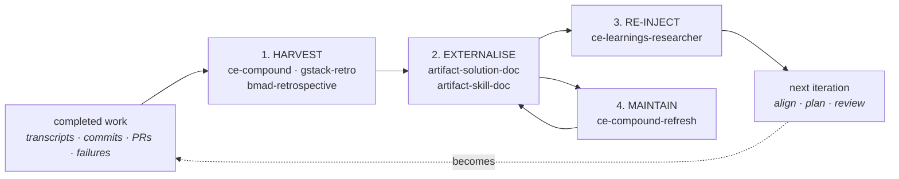

# The compounding loop

*Assessing what past agent sessions learned, so the next one starts ahead.*

> **This page is a curated overlay, not an ontology node.** It gathers pages from across the wiki around one theme and links *out* to them; it stores no edges and changes no synthesis. See [CONVENTIONS §The topic layer](../CONVENTIONS.md#the-topic-layer-curated-overlays).

**The question this topic answers:** what does an agent toolchain actually *read* about work that already happened, and what does it write so the next run is better? Every framework here has opinions about doing the work; a smaller number have opinions about **mining the record of the work** — transcripts, commits, PRs, prior decisions, failed attempts — and turning that into a form the next agent consumes without a human re-teaching it. That circuit is the compounding loop. It is what makes the lifecycle a loop rather than a line, and it is the thinnest-but-highest-leverage part of the wiki's evidence.

This page threads together the pages that read the past ([[ce-session-historian]], [[ce-git-history-analyzer]], [[ce-precedent-activity-scout]], …), the pages that write the durable form ([[ce-compound]], [[gstack-learn]], [[sp-writing-skills]], …), the one page that closes the circuit ([[ce-learnings-researcher]]), and the substrate that carries it ([[warren]], [[claude-code]]). It is the sibling of [[topic-harness-engineering]] — that page is the *controls* you build; this one is the *loop that improves the controls*.

## The four moves

The technique page [[pattern-knowledge-compounding]] names three moves; the evidence supports a fourth, and the fourth is the one most homegrown setups skip.

1. **Harvest at close.** Mine what happened, not whether it shipped. [[ce-compound]] runs a seven-agent research council over the just-completed work; Every calls it *"the money step… the whole point."*
2. **Externalise into a consumable form.** Write it where future work will find it — a schema-validated [[artifact-solution-doc]] in `docs/solutions/`, an [[artifact-skill-doc]], an [[artifact-retrospective]], or a human-facing [[artifact-explainer]].
3. **Re-inject downstream.** [[ce-learnings-researcher]] reads the corpus back into [[ce-brainstorm]] / [[ce-plan]] / [[ce-code-review]], so *"the next agent does not have to learn the same lesson from scratch."* This is the arrow that closes the loop, and **exactly one page in the wiki implements it**.
4. **Maintain the corpus.** [[ce-compound-refresh]] applies Keep / Update / Consolidate / Replace / Delete verdicts; [[gstack-learn]] supports review, search, prune, export. Without this move a growing corpus rots and silently stops compounding.

The canonical stage is [[stage-learn]] — promoted out of [[stage-release]] once a second framework treated learning capture as a first-class step, and argued there as *plausibly the first genuinely new SDLC stage the agent era adds*.

## Reading the record: three tiers of evidence

"Assess the state of previous AI sessions" turns out to mean three quite different things in the evidence, with very uneven coverage.

| Tier | What it reads | Pages | Coverage |
|---|---|---|---|
| **Agent transcripts** | the coding-agent session history itself | [[ce-session-historian]] (Claude Code, Codex, Cursor, Pi) · [[gstack-retro]] (`/retro global` across Claude Code, Codex, Gemini) | **two frameworks, three pages** |
| **Repo artefacts left behind** | commits, PRs, issues, prior decisions | [[ce-work-recap-scout]] · [[ce-git-history-analyzer]] · [[ce-precedent-activity-scout]] · [[ce-issue-intelligence-analyst]] | well covered |
| **Persisted working context** | checkpoints and state files a session wrote for itself | [[gstack-context-save]] / [[gstack-context-restore]] (`WIP:` commits with structured `[gstack-context]` bodies) · [[nano-spec-status]] · [[mp-handoff]] · [[gsd]]'s `STATE.md` / `CONTEXT.md` | well covered, but see the [gaps](#gaps-this-frame-exposes) |

The distinction that matters:

- **Tier 1 is session archaeology** — it reads what the *agent* did and concluded, including things that never reached a commit: approaches tried and abandoned, dead ends, and the reasoning behind a choice. [[ce-session-historian]] is scoped to *synthesis only* — "the caller handles discovery, filtering, and per-session extraction" — and that caller-side extraction flow is documented nowhere in the wiki.
- **Tier 2 is repository archaeology** — cheaper, more reliable, and blind to everything that did not land. Its highest-value move is [[ce-precedent-activity-scout]]'s: a PR closed without merging means *"we tried X and backed it out"*, which stops the caller re-litigating a settled question.
- **Tier 3 is [[pattern-session-handoff]], not compounding** — it carries *working context* across a boundary within one effort. The wiki keeps this firmly distinct from carrying *lessons* across iterations, and that distinction is worth preserving.

## Where the durable form lives

**Process-layer artifacts:**

- [[artifact-solution-doc]] — the signature form: symptom, root cause, fix, generalizable lesson, validated against a YAML schema. Distinctive not for its content but for *who reads it and when* — machine-consumable grounding future agents pull in automatically.
- [[artifact-skill-doc]] — the compounded form when the output is a *capability* rather than a note.
- [[artifact-retrospective]] — the human-facing form: lessons plus action items later sprints surface.
- [[artifact-explainer]] — the teaching form ([[ce-explain]], fed by [[ce-work-recap-scout]]).

**Substrate that carries it without a process-layer skill asking:**

- [[warren]] — `.mulch/` is persistent agent memory across runs: primed into context on spawn, recorded with `ml record`, merged back at reap. The infrastructure realization of what [[ce-compound]] scripts by hand — the single most striking cross-layer finding in the wiki.
- [[gstack-setup-gbrain]] · [[gstack-sync-gbrain]] — a persistent cross-machine knowledge base registered as an MCP server, with a per-repo read-write/read-only/deny trust triad.
- [[claude-code]] — the harness primitives underneath all of it: `CLAUDE.md` + file-based memory, automatic compaction, session resume, and hooks.

## Four things that compound, not one

The evidence shows the loop applied to four different objects, and conflating them hides the interesting moves.

- **Lessons** — the reference case: a solved problem becomes reusable grounding ([[ce-compound]], [[gstack-learn]], [[bmad-retrospective]]).
- **Capabilities** — the agent *gains a skill* rather than a note. [[sp-writing-skills]] authors it test-first under an Iron Law (*"NO SKILL WITHOUT A FAILING TEST FIRST"* — the test is a pressure scenario a subagent fails without the skill); [[gstack-skillify]] promotes a successful run into a permanent skill via a **quarantine → active after 3 successful uses → cross-project** ladder. The strongest move in the whole loop, per [[topic-harness-engineering]].
- **Standards** — [[agent-os-discover-standards]] syncs a project's improved [[artifact-standards]] back into a reusable base profile, so the *next project* starts from the compounded conventions.
- **Preferences** — the small, quiet instances: [[gstack-design-shotgun]]'s taste memory (biases toward what you actually pick, decays 5%/week) and [[gstack-plan-tune]]'s learned question-sensitivity per developer. Both are compounding applied to the human's taste rather than the codebase's facts.

## Relation to the sibling topics

[[topic-harness-engineering]] frames the apparatus as a cybernetic governor: **guides** (feedforward) + **sensors** (feedback), closed by a **steering loop** — "whenever an issue happens multiple times, the controls should be improved." This page *is* that steering loop, read from the evidence side rather than the frame side. Read the three topics as a set:

- [[topic-agent-readiness]] — can the agent work here at all? (the substrate)
- [[topic-harness-engineering]] — how do you steer it? (the controls)
- **this page** — how do the controls get better? (the loop)

The harness-engineering frame also supplies the sharpest test to apply here: *prefer a computational control when one exists*, and *verify, don't instruct*. Section [Gaps](#gaps-this-frame-exposes) applies that test to the loop itself, and the loop fails it.

## Gaps this frame exposes

Threading the pages together surfaces six absences. Each is recorded here as a candidate, not a claim that a page is owed — the ≥2-framework bar and the topic layer's own discipline apply.

1. **Session mining has no pattern and no artifact.** [[ce-session-historian]] is the only page in the wiki that reads agent transcripts, and it explicitly excludes the discovery/filtering/extraction half of the job. A candidate `pattern-session-mining` has one clear framework ([[compound-engineering]]) plus a partial second ([[gstack-retro]]'s cross-tool `--global` mode) — worth a decision at the next ingest rather than a mint now. The intermediate form the caller extracts ("skeleton and error files") has no `artifact` page.
2. **Nothing measures whether compounding works.** Re-injection is rich; instrumentation is absent. No capability anywhere answers *"did this solution doc prevent a recurrence?"* [[gstack-benchmark-models]] is explicitly meta-tooling with no `implements:` edge, and [[gstack-plan-tune]] is v1 observational. A loop with no sensor on itself is exactly what [[topic-harness-engineering]] warns against.
3. **Learn outputs are all guides, never sensors.** Every learn capability emits prose an agent reads — a solution doc, a retrospective, a skill. None emits a *computational* control (a test, a lint rule, a `PreToolUse` hook) from a harvested lesson. Given the frame's own "prefer a computational control when one exists," this is the sharpest structural gap in the cluster: the steering loop should be able to promote a recurring lesson into [[pattern-edit-guardrails]] or a fitness function, and no documented capability does.
4. **Failed approaches are recorded but never harvested.** [[gstack-context-save]] writes failed approaches into structured `[gstack-context]` commit bodies; [[ce-compound]] mines bugs and failed tests. Nothing connects the two — the negative-result seam sits in tier-3 storage with no tier-1 harvester reading it.
5. **The two flavours never feed each other.** The human retrospective ([[bmad-retrospective]], [[gstack-retro]]) and the agent corpus ([[ce-compound]], [[gstack-learn]]) are cleanly separated by consumer, which [[stage-learn]] argues for deliberately. But no capability promotes a retro action item *into* machine-consumable grounding, so the human half does not compound.
6. **The one quantitative trust ladder is buried.** [[gstack-skillify]]'s *quarantined → active after 3 successful uses → promoted cross-project* is the only confidence threshold anywhere in this cluster. It reads as a per-site browser-automation detail; it is really a generalisable promotion gate for any compounded learning, and the natural answer to gap 2.

## Using this in practice

For a team assembling its own loop rather than adopting a framework, the evidence suggests a specific order of operations.

- **Start with move 3, not move 1.** A harvest step with no consumer is a write-only log. [[ce-learnings-researcher]] is the cheapest high-value page to copy: a grounding read at the front of planning and review.
- **Pick the storage before the ritual.** `docs/solutions/` in-repo ([[artifact-solution-doc]]), a cross-machine store ([[gstack-setup-gbrain]]), or the runtime substrate ([[warren]]'s `.mulch/`) are genuinely different bets on who reads it and when.
- **Budget for move 4 from day one.** [[ce-compound-refresh]]'s existence is the tell that a corpus is a maintained artifact, not an append-only journal.
- **Harvest the transcript, not just the diff.** Tier 2 is easy and blind to abandoned approaches — which are the lessons least recoverable from the repo and most expensive to relearn.
- **Aim the output at a sensor where you can.** A recurring lesson that becomes a lint rule or a hook needs no attention budget ever again; a lesson that becomes a paragraph competes for context on every future run.

## See Also
- [[stage-learn]] — the canonical stage this whole loop instantiates.
- [[pattern-knowledge-compounding]] — the technique; [[pattern-session-handoff]] — the neighbour it is often confused with.
- [[artifact-solution-doc]] — the signature durable form.
- [[topic-harness-engineering]] — the controls this loop refines; [[topic-agent-readiness]] — the substrate both require.
- [[compound-engineering]] — the framework built around this loop; [[gstack]] — the only one shipping every flavour of it.
- [[warren]] — the loop moved into the runtime substrate.
