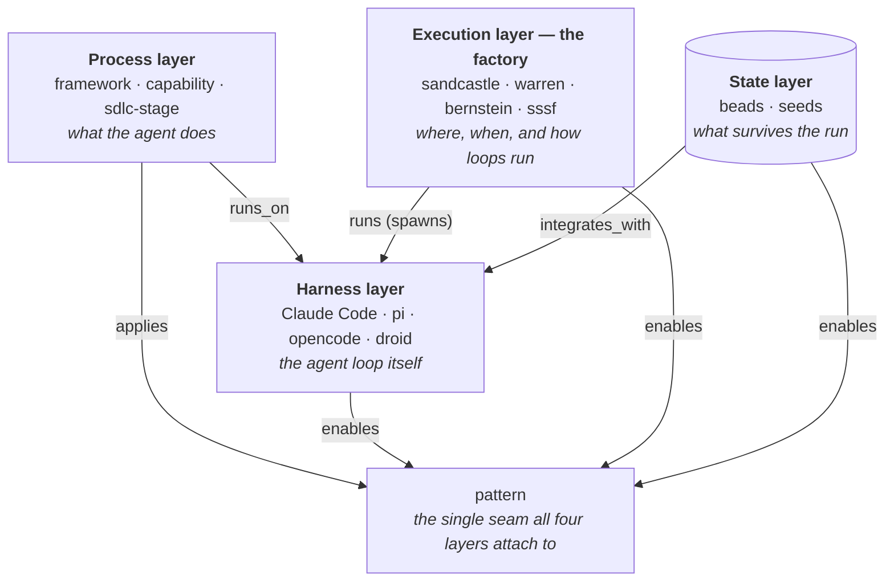
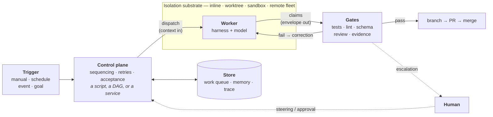

# Topic: The software factory — a general architecture for the execution layer

> **This page is a curated overlay, not an ontology node.** It gathers pages from across the wiki around one theme and links *out* to them; it stores no edges and changes no synthesis. See [CONVENTIONS §The topic layer](../CONVENTIONS.md#the-topic-layer-curated-overlays).

**The question this topic answers:** the wiki has now absorbed four [execution runtimes](../runtime/index.md) — [[sandcastle]], [[warren]], [[bernstein]], [[sssf]] — and their comparison matrix answers *"how do these four differ?"* This page answers the prior question: **what is the general shape of the system they are all instances of, which decisions define one, and in what order do people typically take those decisions on?** It also carries the layer's [glossary](#glossary), including the canonical definition of *control plane*, a term four pages use and none defines.

## The term, generalized

"Software factory" arrives in the wiki as one tool's proper name — [[sssf]] is the *Super Simple Software Factory* — but its author defines it generically, and the definition describes the whole layer rather than his instance of it:

> "A software factory does one thing: it gives you more leverage on your prompt. How much leverage depends entirely on what you invest in it. At the low end you chain two agents together and hope. At the high end you build a system of agents plus code that runs without you."

This page adopts that generic sense: a **software factory** is a system — code, service, or both — that turns units of intent (a ticket, a goal, a queue) into verified, merged changes by spawning coding-agent loops it does not itself contain, bounding what they may do, and checking what they claim. Every member of the [[sandcastle|runtime]] layer is a software factory or a kit for building one; the term names the *assembled system*, where `runtime` names the wiki's node type for the substrate. The independent "loop engineering" frame (captured [here](../../raw/reference/2026-09-01-awesome-loop-engineering.md)) draws the same boundary from the other side: *"Prompt, context, and harness engineering make one agent run better. Loop Engineering makes agent work repeatable, observable, and governable over time."*

## Where the factory sits — the four layers

The wiki's ontology places the factory precisely: it is the **execution layer**, one of three compute layers above the state layer, and it touches the rest of the graph at exactly one seam — the `pattern` namespace.

Two boundary tests from [CONVENTIONS](../CONVENTIONS.md#the-execution-layer-runtimes) keep the layers apart. Against the harness: *a harness is the loop; a runtime spawns loops*. Against the store: *a runtime spawns loops; a store is read by them* — [[beads]] and [[seeds]] coordinate agents but launch none, so they sit below and beside the factory, which consumes them.

## Anatomy of a factory

Strip the four documented runtimes to what they share and one machine remains. Every part below is optional in some member — [[sssf]] ships no isolation, [[sandcastle]] no memory, [[warren]] no real parallelism — but the *sockets* are always these:

Reading the diagram against the wiki: the **trigger** and the control plane's next-action policy are [[pattern-autonomous-loop]] territory; the isolation box is [[pattern-worktree-isolation]]; running several workers at once inside it is [[pattern-wave-parallelism]]; the envelope crossing the seam is [[pattern-contract-first]] and its injection [[pattern-context-engineering]]; the gates are [[pattern-deterministic-gates]] refusing to accept [[pattern-evidence-before-claims|the agent's own report as evidence]], sometimes strengthened by [[pattern-cross-model-review]] and [[pattern-fresh-context-subagents]]; the store's memory half is [[pattern-knowledge-compounding]]; and a worker resuming across runs is [[pattern-session-handoff]]. The one empirical claim the four members unanimously support is about the **gate**: verification is the only concern every documented runtime implements — something between the agent's report and the merge is always checked by code. That, more than any component, is what makes a factory a factory rather than a loop of hope.

## The four axes

The layer's [11-concern comparison matrix](../runtime/index.md#reference-the-orchestration-profile-matrix) answers fine-grained questions; for *designing* a factory, four coarser, independently-movable decisions do most of the work. The option values for the trigger and intake axes are adopted from the loop-engineering taxonomy.

1. **Control-plane location** — who owns sequencing, retries, and acceptance: the *prompt* (the agent decides what happens next) or *code* (a script, DAG, or service decides, and the agent is a bounded step inside it). This is the layer's sharpest idea — [[sssf]] states it as *"moving the control plane out of the prompt and into Python"*, [[bernstein]] as zero LLM tokens in the coordination loop.
2. **Trigger model** — what authorizes a run: *manual bootstrap* (a human command starting a repeatable contract), *scheduled* (a cadence), *event-triggered* (a webhook, failed check, label), or *goal-driven* (run until a verifiable goal is met).
3. **Isolation substrate** — where the worker acts: *inline* in the working checkout, a *worktree/branch*, a *local sandbox* (container, `bwrap`, microVM), or a *remote fleet* (pods, e2b/modal/daytona-style backends).
4. **Autonomy scope** — how work arrives: *one bounded task* handed in, a *queue* consumed (issues, PRs, tickets), or *discovery* (scanning for work, or reacting to failure signals).

These are axes, not a ladder — each moves independently. You can run a single bounded ticket on a remote fleet, or a fully code-owned control plane inline in your checkout with no isolation at all (that is exactly [[sssf]]). The levels intuition ("first one ticket to done, then loops and triggers, then sandboxes local and remote") is real, but it describes a *common path* through the grid below, not an ordering the axes impose.

## The morphological grid

Rows are the axes; cells are the option values, roughly lighter to heavier left to right. The markers place the three **profiles** — the recommended progressive configurations, each anchored to a documented runtime as evidence: 🎫 **ticket runner** ([[sssf]]), 🖥️ **monitored service** ([[warren]]), 🏭 **fleet factory** ([[bernstein]]).

| Axis | | | | |
|---|---|---|---|---|
| **Control-plane location** | in the prompt — the agent sequences itself | in a script you own 🎫 | in a deployed service 🖥️ | in a deterministic DAG scheduler 🏭 |
| **Trigger model** | manual bootstrap 🎫 🖥️ | scheduled 🖥️ | event-triggered 🖥️ | goal-driven (run to quiescence) 🏭 |
| **Isolation substrate** | inline checkout 🎫 | worktree / branch 🏭 | local sandbox 🖥️ | remote fleet 🏭 |
| **Autonomy scope** | one bounded task 🎫 | queue intake 🖥️ | scan discovery 🏭 | reactive (failure-signal) — *no documented anchor yet* |

- 🎫 **Ticket runner** — one unit of intent runs unattended to a gated finish. Control plane in a script, human-triggered, everything else optional. [[sssf]] is the documented anchor: a stamped ADW chain, gates over a typed envelope, and — by admission — no sandbox, no parallelism, no PR flow. The cheapest configuration that is still a factory rather than a supervised session.
- 🖥️ **Monitored service** — continuous intake with a human watching. A deployed control plane dispatches sandboxed runs from a queue or cron, the human steers mid-run and merges the PRs. [[warren]] is the anchor: dispatch → `bwrap`/pod sandbox → steer → validate → auto-PR → reap, with `.mulch/` memory compounding across runs.
- 🏭 **Fleet factory** — a goal becomes a task DAG scheduled by code across parallel isolated workers, with gates deciding what lands. [[bernstein]] is the anchor: pure-Python scheduling to quiescence, worktrees plus seven remote backends, janitor and review gates, never auto-merging past them.

Two honest caveats on the grid. First, [[sandcastle]] deliberately appears in no profile: it is the *embeddable* option — the SDK you would build any of these three configurations from — so its position is a distribution fact, not a shape. Second, the rightmost autonomy cell is empty of wiki evidence: a purely reactive factory (CI fails → agent dispatched) is well-attested externally — GitHub's **Agentic Workflows (gh-aw)** compiles markdown loop definitions into Actions runs, the strongest undocumented instance of that quadrant — but nothing ingested here anchors it yet. The grid should gain a marker, not a new axis, when one is ingested.

The progression 🎫 → 🖥️ → 🏭 is the adoption path the anchors themselves suggest — add triggers and sandboxes to a working ticket runner, add code-owned coordination and parallelism to a working service — and it agrees with the loop-engineering maturity rule of *earning autonomy in order*: "Persist state before increasing unattended runtime, establish external verification before adding more agents, and add production controls before actions can affect users or infrastructure." But because the axes are independent, skipping or reordering is legitimate whenever one axis's need arrives early; the profiles are waypoints, not gates.

## Relation to the other maturity frames

The wiki now holds three level-shaped frames, and they measure different things — this page's profiles should not be read as a fourth rung set. [[topic-agent-readiness]] scores **the repository and organization** the agent works in (two external rubrics, five levels, payoff at L3–L4); its subject is the substrate's fitness, and a fleet factory pointed at a Level-2 repo just produces broken PRs faster. The loop-engineering **maturity model** (levels 0–6, manual prompting → production-supervised) scores **one recurring workflow's operating controls** — durable state, verification, budgets, supervision — and explicitly warns that "levels describe capability, not ambition." This page's **profiles** describe the *execution shape* of the whole factory — where the control plane, triggers, isolation, and intake sit. The three compose rather than compete: readiness says whether the repo can support a factory, the profile says what shape of factory, and the loop maturity model says how governed each of its recurring workflows is. [[topic-harness-engineering]] sits underneath all three, governing the single run the factory repeats.

## Glossary

The execution layer's working vocabulary. Definitions link to the pages that ground them; this list defines, it does not re-argue.

- **software factory** — a system of agents plus code that turns units of intent into verified, merged changes by spawning bounded agent loops and gating their claims; the generic sense of [[sssf]]'s proper name, adopted by this page for the assembled systems the [[sandcastle|runtime]] layer's members build or are.
- **control plane** — the component that owns *sequencing, retries, and acceptance*: which work runs next, what happens on failure, and what counts as done. Its defining question is *location* — in the prompt (the agent decides) or in code (a script, DAG, or service decides). [[warren]] is a self-hostable control-plane service; [[bernstein]]'s is a deterministic DAG scheduler; [[sssf]]'s is a stamped Python script, and its pitch — *"moving the control plane out of the prompt and into Python"* — is the term's sharpest use in the wiki.
- **execution layer** — the wiki's name for the layer these systems form; the node type is `runtime`, kept despite the word's overloading (language/container/model runtimes are unrelated). See [CONVENTIONS §The execution layer](../CONVENTIONS.md#the-execution-layer-runtimes) for why it was not named `orchestrator`.
- **framework / harness / runtime** — the three compute layers, disambiguated: a *framework* ships methodology (skills and commands that perform lifecycle stages); a *harness* is the agent loop that executes them (Claude Code, [[pi]]); a *runtime* spawns and wraps harnesses. The boundary tests: a harness is the loop, a runtime spawns loops; a framework performs stages, the other two perform none.
- **gate** — a code-enforced check between an agent's claim and its acceptance: tests, lint, schema validation, or a review pass that can hard-block a merge. See [[pattern-deterministic-gates]]. A *receipt-based* gate additionally demands recorded evidence — commands, logs, trace IDs, PR links — rather than assertions; [[pattern-evidence-before-claims]] is the wiki's form of that rule.
- **envelope** — a typed, schema-validated document that crosses the seam between control plane and agent (and between agents), replacing conversation as the interface; re-prompted until it validates. [[sssf]]'s Pydantic envelopes are the documented instance; the general move is [[pattern-contract-first]].
- **ADW (AI Developer Workflow)** — [[sssf]]'s term for the generic concept of a *workflow script*: the code file that is the control plane for one factory run, owning phase order, retries, and the acceptance decision.
- **loop contract** — the loop-engineering frame's reviewable specification for one recurring agent job: eleven decisions (objective, trigger, intake, workspace, context, delegation, verification, state, budget, escalation, exit) that would otherwise be hidden defaults. An externalized control-plane policy in document form.
- **trigger** — what authorizes a run: manual bootstrap, schedule, event, or a verifiable goal. The factory's front door; axis 2 above.
- **intake** — where work comes from once running is authorized: consumed from a *queue*, found by a *scan*, or provoked by a *reactive* failure signal. Distinct from the trigger: a nightly schedule (trigger) may scan for drift (intake).
- **isolation / sandbox / worktree** — the boundary around a worker's writes: a git worktree or branch, an OS/container sandbox, or a remote machine; substituting for or supplementing trust in the agent. See [[pattern-worktree-isolation]]; [[sssf]]'s post-hoc rollback ([[pattern-edit-guardrails]]) is the detect-and-revert alternative when no boundary exists.
- **steering (HITL)** — human-in-the-loop influence on a running factory: [[warren]]'s real-time mid-run `steer`, [[bernstein]]'s gate-shaped approvals, or nothing mid-run at all ([[sssf]], where the human is the first phase and the exit code).
- **AFK autonomy** — unattended operation to a completion signal: the run continues without a human present, bounded by budgets and ended by gates. See [[pattern-autonomous-loop]].
- **exit condition** — what proves a loop succeeded, and what stops it without success; the loop-engineering contract's final part, and the two-question form in [[sssf]] — all phases green *and* `accepted=` — shows completion and acceptance are separable.
- **budget** — the cap on one run's autonomy: iterations, retries, tokens, cost, wall-clock, concurrency. Every documented runtime bounds at least one of these; [[bernstein]] adds a cost kill-switch and circuit breaker.
- **escalation** — the designed path from the factory to a named human when gates fail repeatedly, judgment is required, or budgets exhaust: a PR, an issue, an approval card, a queue of human-needed items ([[beads]]' `bd human`).
- **maker/checker** — the separation rule that the acting agent never decides its own work is done: a different gate, model, or session verifies. The wiki's enforced instances are [[pattern-cross-model-review]] and [[pattern-fresh-context-subagents]].

## See Also

- [runtime/index.md](../runtime/index.md) — the layer's navigational index: members, the pattern roster, and the 11-concern orchestration matrix this page's axes distill.
- [[topic-agent-readiness]] — the substrate's maturity; what has to be true of the repo before any profile here pays off.
- [[topic-harness-engineering]] — the controls around the single run the factory repeats; the factory is that steering loop moved out of the room.
- [[sssf]] · [[warren]] · [[bernstein]] — the three profile anchors; [[sandcastle]] — the embeddable substrate beneath them.
- Undocumented instances worth ingesting, by the quadrant they would evidence: **GitHub Agentic Workflows (gh-aw)** (event-driven, control plane compiled into CI — the empty reactive cell above) and **OpenHands SDK** (open-source remote-fleet runtime); see the [broader category](../runtime/index.md#the-broader-category).
- IndyDevDan, *Super Simple Software Factory* ([capture](../../raw/runtime/2026-08-31-super-simple-software-factory.md)) · ChaoYue, *Awesome Loop Engineering* ([capture](../../raw/reference/2026-09-01-awesome-loop-engineering.md)).
